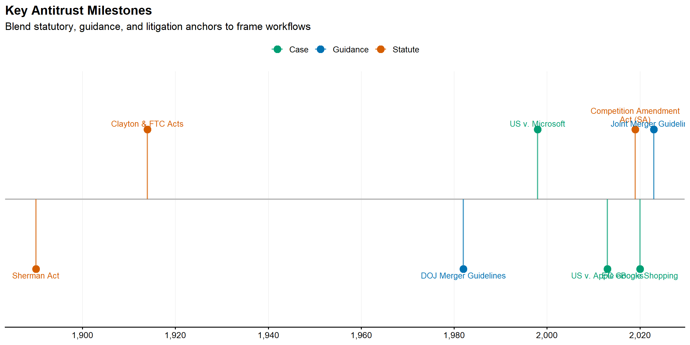
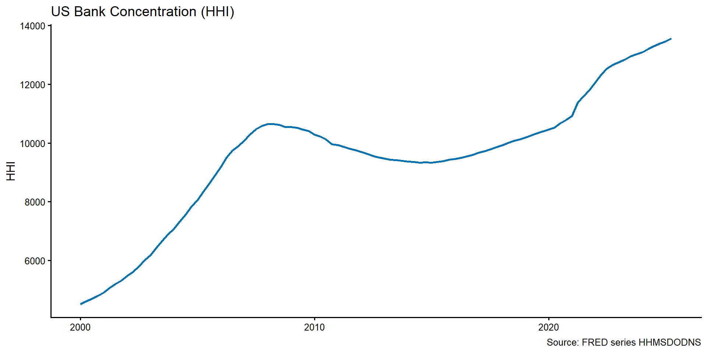

# Orientation: Antitrust and Regulation

## Learning goals
This opening chapter orients you to the institutional settings where economists, researchers, and lawyers work side by side. By the end you should be able to articulate how competition authorities define their objectives, how they translate statutes or guidelines into investigative hypotheses, and how evidentiary burdens shift between agencies and courts. You will also learn how to map economic questions—market definition, market power, theory of harm, efficiencies, and remedy selection—onto the specific legal elements regulators must prove or rebut.

An equally important goal is judgment: when should you push for additional data work, and when is documentary, testimonial, or industry expertise the better marginal investment? Because this course serves practitioners in South Africa who often face multi-jurisdictional matters, we will continually compare US-led doctrines with approaches in the EU, UK, Asia, and regional African regulators. Expect a mix of narrative history, process walkthroughs, and applied examples from roughly 2005–2024.

## Core narrative
### Institutions and mandates
Modern antitrust work is anchored by a handful of institutions with overlapping mandates. In the United States the Department of Justice (DOJ) Antitrust Division and the Federal Trade Commission (FTC) share merger and conduct jurisdiction, aided by state attorneys general and sector regulators such as the Federal Communications Commission or Surface Transportation Board. Post-2000 history matters: the Clinton-era Microsoft litigation cemented exclusionary conduct frameworks, the 2010 Horizontal Merger Guidelines elevated unilateral effects, and the 2023 Merger Guidelines re-centered structural presumptions and platform dynamics. Across the Atlantic, the European Commission's Directorate-General for Competition (DG COMP) pairs investigations with inquisitorial decision making, while national authorities like the UK Competition and Markets Authority (CMA) play an increasingly global role (e.g., blocking Microsoft/Activision until remedies evolved). Asian agencies—including Japan's JFTC, Korea's KFTC, and China's SAMR—and South Africa's Competition Commission and Tribunal have expanded resources to scrutinize digital markets, food supply chains, and cartels affecting the Southern African Development Community (SADC). Understanding each body's statutory tests, procedural timelines, and evidentiary cultures is essential to crafting persuasive analyses.

### Comparative statute mapping

For multi-jurisdictional practitioners, the table below maps common conduct types to their statutory homes across the US, EU, and South Africa. Use this as a quick reference when translating theories of harm across legal frameworks.

| Conduct Type | United States | European Union | South Africa |
|:-------------|:--------------|:---------------|:-------------|
| **Cartels / Horizontal agreements** | Sherman Act §1 (15 U.S.C. §1) | TFEU Article 101 | Competition Act 89/1998, §4 |
| **Monopolization / Abuse of dominance** | Sherman Act §2 (15 U.S.C. §2) | TFEU Article 102 | Competition Act 89/1998, §8 |
| **Vertical restraints** | Sherman Act §1; Rule of reason | TFEU Art. 101 + VBER | Competition Act §4(1)(b), §5 |
| **Mergers (horizontal)** | Clayton Act §7 (15 U.S.C. §18) | EUMR (Reg. 139/2004) | Competition Act §12, §12A |
| **Mergers (vertical/conglomerate)** | Clayton Act §7 | EUMR Art. 2 | Competition Act §12A |
| **Price discrimination** | Robinson-Patman Act | Art. 102(c) (dominant firms) | §9 (price discrimination by dominant firm) |
| **Unfair trade practices** | FTC Act §5 (15 U.S.C. §45) | Unfair Commercial Practices Dir. | Consumer Protection Act 68/2008 |

**Key differences to note:**

- **Standards**: US uses "monopoly power" (typically >70% share); EU/SA use "dominance" (typically >40-50% share with barriers).
- **Effects vs. object**: EU Art. 101 distinguishes "object" restrictions (per se illegal) from "effects" analysis; US separates per se from rule of reason.
- **Public interest**: South Africa uniquely incorporates public interest factors (employment, SME participation, ownership) in merger review under §12A(3).
- **Private enforcement**: US allows treble damages; EU/SA have more limited private action frameworks.


**Practitioner tip**

When advising on multi-jurisdictional matters, map the same conduct to each regime's statutory test early. A practice that survives US rule-of-reason analysis may still violate EU "object" restrictions or trigger South African public-interest review. Build separate legal-economic narratives for each forum.


### Workflow from intake to remedies
Regardless of jurisdiction, investigations follow a recognizable arc. Matters typically begin with a complaint, leniency application, or merger notification. Case teams triage with “hot docs” and quick descriptive analytics, draft a plan that allocates legal and economic workstreams, and establish preservation plus data-request protocols. The second phase is scoping: enumerating data systems, prioritizing custodians, negotiating production formats, and deciding whether to run early econometric screens—such as price-cost margins or diversion ratios—before collecting more costly qualitative evidence. In phase three the team synthesizes theory and evidence into statements of issues, white papers, or ultimately pleadings and testimony. Finally, remedies discussions integrate forward-looking modeling with institutional constraints: can the Competition Tribunal in Pretoria supervise behavioral commitments as effectively as US courts, or is divestiture the only reliable fix? Always document these choices so that tribunals (and future teams) can reconstruct the evidentiary chain.

### Scoping data needs early
Practitioners treat data, documents, and interviews as complements rather than substitutes. Intake meetings should generate inventories of transactional databases, billing systems, CRM extracts, internal forecasts, board presentations, and benchmark studies. The task is to identify what can be measured quickly (e.g., monthly price series, bidding outcomes, churn metrics) and what requires longitudinal assembly (e.g., claims-level healthcare data or network telemetry). Teams should simultaneously plan qualitative work: establish search terms for electronically stored information (ESI), design interview protocols, and identify third parties—customers, suppliers, former employees—whose perspectives sharpen or rebut economic priors. Missing this early sequencing is costly; see the Competition Commission South Africa’s review of Netcare/Community Hospital Group, where late-stage data disputes shortened the time available for substantive modeling.

### Illustrative vignette: Search dominance diagnostics
The 2020–2023 DOJ challenge to Google Search illustrates how process and substance intertwine. Economists combined browser default share calculations, auction revenue data, and margin analyses with interview testimony from handset makers and browser developers. Those fact narratives clarified why certain regression designs mattered (e.g., estimating counterfactual query volume absent default contracts). Compare that to the Competition Commission South Africa’s investigation into digital platforms and app stores, where documentary evidence about self-preferencing and ad-tech fee structures filled gaps in transaction data. The lesson: quantitative rigor carries the day only when tied to institutional detail about distribution agreements, switching costs, and remedy administrability.


**Method box: Integrating empirics here**

Early-stage screening rarely needs sophisticated econometrics. Build dashboards that pull together market shares, HHI trends, entry/exit indicators, and switching matrices from customer-level data. Combine transactional datasets with public sources (e.g., SEC filings, the FTC’s merger statistics, Stats SA tariff books) to benchmark plausible margins. When data are thin, like in new fintech or biotech markets pivot, quickly to qualitative or expert evidence rather than forcing underpowered regressions. Document these decisions in a running technical memo so litigators can later explain why the team prioritized one technique over another.



**Qualitative evidence**

Treat qualitative work as disciplined research, not anecdote hunting. Begin with an interview guide that connects each theory of harm to specific questions, and pair every interview with contemporaneous notes plus sourcing metadata (custodian, date, privilege status). For document review, align search strings with economic hypotheses—for example, pairing “capacity discipline” with “shutdown” when probing fertilizer cartel allegations in the US Midwest and South Africa’s Sasol case. Create chronologies that marry documentary excerpts with data milestones; these become invaluable when explaining to a tribunal why a particular conduct pattern aligns with measured price changes or customer churn.



**Case box: Quick tour**

Recent matters illustrate the diversity of evidentiary mixes. The US v. Microsoft legacy is still instructive for tying and exclusion, but newer platform cases—US v. Google Search and the FTC’s Meta/Within suit—highlight how product design data and third-party developer testimony reinforce each other. Airline collaborations such as DOJ v. American Airlines/JetBlue (NEA) show how scheduling data, revenue management simulations, and traveler surveys combine to test unilateral and coordinated effects. Global cartel work remains vibrant: the EU Trucks cartel decisions, the KFTC’s memory chip probes, and South Africa’s construction and bread cartels each turned on leniency statements corroborated by bidding records and cost analyses. Labor markets are now front-page antitrust: US wage-fixing cases in healthcare and the 2023 consent orders in the poultry industry relied on HR databases and interview evidence from recruiters.



**Comparative note**

While the US emphasizes adversarial hearings and judicial precedent, DG COMP and the CMA operate administrative processes where agencies both investigate and decide. This affects research timing: EU cases often allow broader use of compelled internal data but require detailed written submissions early, whereas South African proceedings feature public-interest considerations that demand additional qualitative evidence (jobs, ownership, regional development). Asian agencies have diverse discovery rules—SAMR can request granular consumer data with little advance notice—so plan modular analyses that adapt as production obligations change. Throughout the book, sidebar notes will flag where legal standards (dominance vs. monopoly), burdens of proof, or remedy preferences diverge.


## Looking ahead
Orientation work is only useful if it flows directly into research design. Your next task is to convert the institutional map above into concrete analytical workplans: build a case chronology template, sketch a data inventory that spans US, EU, and SADC sources, and identify at least one flagship dataset (e.g., claims-level healthcare data or national tender records) that will power the quantitative chapters. Keep a running list of figures—HHI trends, entry timelines, or platform governance maps—that we will revisit later so the narrative remains visually anchored and cumulative.

## Visualizations

### Agency and case timeline
This timeline pairs statutory milestones with landmark enforcement actions so readers can anchor later quantitative work in institutional change. We include US, EU, and South African milestones to reflect the multi-jurisdictional focus of this book.


**Timeline interpretation**

The timeline shows convergence in competition enforcement approaches: South Africa's 1998 Competition Act drew heavily on EU precedent, while the 2023 US Merger Guidelines moved closer to EU-style structural presumptions. Note how major cases (Microsoft, Google) often span jurisdictions with related but distinct theories of harm.


### HHI trend example
Track concentration trends using FRED data as a baseline for cross-jurisdictional comparisons.

*Source: FRED Series HHMSDODNS. Bank deposits (Commercial & Savings).*
