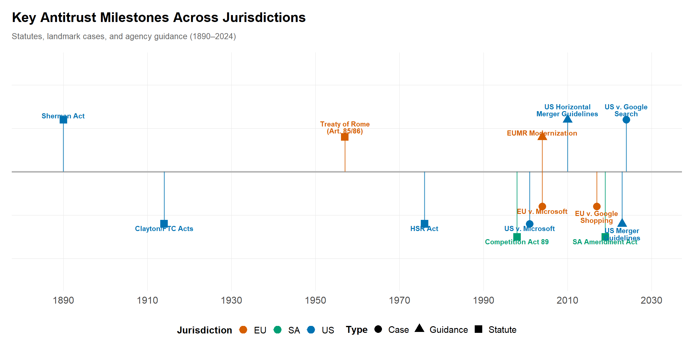

# Orientation: Antitrust and Regulation {#sec-orientation}

Economic analysis answers to legal standards, agency priorities, and procedural rules, and all three vary by jurisdiction. So the methods come second. First the institutions: who enforces competition law, what they have to prove, and where the economics enters. Get that frame right and your analysis speaks to the questions that decide a matter rather than the ones that are merely interesting.

## Learning goals
This chapter maps the settings where economists, researchers, and lawyers work side by side. By the end you should be able to say how competition authorities set their objectives, how they turn a statute or guideline into an investigative hypothesis, and how the burden of proof shifts as a matter moves from agency to court. You should also be able to map the economic questions---market definition, market power, theory of harm, efficiencies, remedy---onto the legal elements a regulator has to prove or rebut.

The harder skill is judgment: when to push for more data work, and when documentary, testimonial, or industry evidence is the better use of the next dollar. Because many readers face multi-jurisdictional matters, we set US doctrine against the EU, the UK, Asia, and regional African regulators throughout. Expect a mix of narrative history, process walkthroughs, and worked examples from roughly 2005--2024.

## Core narrative
### Institutions and mandates

Modern antitrust work is anchored by a handful of institutions with overlapping mandates. In the United States, the Department of Justice (DOJ) Antitrust Division and the Federal Trade Commission (FTC) share merger and conduct jurisdiction, aided by state attorneys general and sector regulators such as the Federal Communications Commission or Surface Transportation Board.

Post-2000 history matters for understanding current doctrine. The Clinton-era Microsoft litigation cemented exclusionary conduct frameworks (*United States v. Microsoft*, 2001). The 2010 Horizontal Merger Guidelines (DOJ/FTC Horizontal Merger Guidelines, 2010) elevated unilateral effects analysis, a framework we explore in detail in [Chapter 6](chapters/06-mergers.md). Most recently, the 2023 Merger Guidelines (DOJ/FTC Merger Guidelines, 2023) re-centered structural presumptions and addressed platform dynamics head-on.

Across the Atlantic, the European Commission's Directorate-General for Competition (DG COMP) pairs investigations with inquisitorial decision making, while national authorities like the UK Competition and Markets Authority (CMA) play an increasingly global role, for example blocking Microsoft/Activision until remedies evolved. Asian agencies—including Japan's JFTC, Korea's KFTC, and China's SAMR—have expanded resources to scrutinize digital markets and cross-border conduct.

For practitioners working in Southern Africa, the Competition Commission and Competition Tribunal are the reference points. These bodies have expanded their focus to digital markets, food supply chains, and cartels affecting the Southern African Development Community (SADC). A persuasive analysis rests on each body's statutory tests and evidentiary culture.


**Definition: Key Antitrust Concepts**

| Term | Definition |
|:-----|:-----------|
| **Market Power** | The ability to profitably raise prices above competitive levels or exclude competitors |
| **Relevant Market** | The product and geographic scope where competitive effects are assessed |
| **Theory of Harm** | The causal mechanism by which conduct is alleged to harm competition |
| **Efficiencies** | Cost savings or quality improvements that may offset anticompetitive effects |
| **Consumer Welfare** | The standard measuring harm to buyers (price, quality, choice, innovation) |
| **Public Interest** | Non-efficiency factors (employment, SMEs, ownership) considered in some jurisdictions |


### Comparative statute mapping

For multi-jurisdictional practitioners, the table below maps common conduct types to their statutory homes across the US, EU, and South Africa. Use this as a quick reference when translating theories of harm across legal frameworks.

| Conduct Type | United States | European Union | South Africa |
|:-------------|:--------------|:---------------|:-------------|
| **Cartels / Horizontal agreements** | Sherman Act §1 (15 U.S.C. §1) | TFEU Article 101 | Competition Act 89/1998, §4 |
| **Monopolization / Abuse of dominance** | Sherman Act §2 (15 U.S.C. §2) | TFEU Article 102 | Competition Act 89/1998, §8 |
| **Vertical restraints** | Sherman Act §1; Rule of reason | TFEU Art. 101 + VBER | Competition Act §5; §8(1)(d) for dominant firms |
| **Mergers (horizontal)** | Clayton Act §7 (15 U.S.C. §18) | EUMR (Reg. 139/2004) | Competition Act §12, §12A |
| **Mergers (vertical/conglomerate)** | Clayton Act §7 | EUMR Art. 2 | Competition Act §12A |
| **Price discrimination** | Robinson-Patman Act | Art. 102(c) (dominant firms) | §9 (price discrimination by dominant firm) |
| **Unfair trade practices** | FTC Act §5 (15 U.S.C. §45) | Unfair Commercial Practices Dir. | Consumer Protection Act 68/2008 |

**Key differences to note:**

- **Standards**: US courts ask for "monopoly power," typically inferred above a 70% share. The EU uses "dominance," in practice from around 40% with entry barriers, with a rebuttable presumption at 50% under *AKZO*. South Africa's thresholds are statutory (§7): a firm at 45% or more is presumed dominant; between 35% and 45% it is dominant unless it shows it lacks market power; below 35% only if market power is proven.
- **Effects vs. object**: EU Art. 101 treats "object" restrictions as presumptively restrictive---no proof of effects is required---though the Art. 101(3) exemption remains formally available; US law separates per se rules from the rule of reason.
- **Public interest**: South Africa uniquely incorporates public interest factors (employment, SME participation, ownership) in merger review under §12A(3) (SA Competition Act, 1998).
- **Private enforcement**: US allows treble damages; EU/SA have more limited private action frameworks.


**Practitioner tip**

When advising on multi-jurisdictional matters, map the same conduct to each regime's statutory test early. A practice that survives US rule-of-reason analysis may still violate EU "object" restrictions or trigger South African public-interest review. Build separate legal-economic narratives for each forum.


### Workflow from intake to remedies

Regulatory mandates become operational workflows. The section below traces the arc from case intake through remedy selection, marking the decision points where economic analysis informs legal strategy.


**Investigation Workflow Overview**

```
INTAKE                 SCOPING                ANALYSIS               DECISION
   |                      |                      |                      |
   v                      v                      v                      v
+--------------+    +--------------+    +--------------+    +--------------+
| Complaint /  |    | Data         |    | Market       |    | Statement    |
| Leniency /   |--->| inventory &  |--->| definition & |--->| of Issues /  |
| Notification |    | custodians   |    | effects      |    | White Paper  |
+--------------+    +--------------+    +--------------+    +--------------+
       |                  |                   |                    |
       v                  v                   v                    v
  "Hot docs"         Preservation        Econometric          Remedies
  triage             protocols           + qualitative        discussion
                          |                   |
                          v                   v
                    +--------------+    +--------------+
                    | Quick        |    | Test         |
                    | screens:     |    | theories:    |
                    | - Shares/HHI |    | - DiD / IV   |
                    | - Entry data |    | - Simulation |
                    | - Margins    |    | - Documents  |
                    +--------------+    +--------------+
```
**Key decision points:** At each transition, evaluate whether additional data work or qualitative evidence offers the better marginal return given deadlines and burden of proof.


Regardless of jurisdiction, investigations follow a recognizable arc. Matters typically begin with a complaint, leniency application, or merger notification. Case teams triage with “hot docs” and quick descriptive analytics, draft a plan that allocates legal and economic workstreams, and establish preservation plus data-request protocols. The second phase is scoping: enumerating data systems, prioritizing custodians, negotiating production formats, and deciding whether to run early econometric screens, such as price-cost margins or diversion ratios, before collecting more costly qualitative evidence. In phase three the team synthesizes theory and evidence into statements of issues, white papers, or ultimately pleadings and testimony. Finally, remedies discussions integrate forward-looking modeling with institutional constraints. Can the Competition Tribunal in Pretoria supervise behavioral commitments as effectively as US courts, or is divestiture the only reliable fix? We examine remedy design frameworks in [Chapter 8](chapters/08-regulation-remedies.md). Always document these choices so that tribunals and future teams can reconstruct the evidentiary chain.

### Scoping data needs early
Practitioners treat data, documents, and interviews as complements rather than substitutes. Intake meetings should generate inventories of transactional databases, billing systems, CRM extracts, internal forecasts, board presentations, and benchmark studies. The task is to identify what can be measured quickly (e.g., monthly price series, bidding outcomes, churn metrics) and what requires longitudinal assembly (e.g., claims-level healthcare data or network telemetry). Teams should simultaneously plan qualitative work: establish search terms for electronically stored information (ESI), design interview protocols, and identify third parties—customers, suppliers, former employees—whose perspectives sharpen or rebut economic priors. Missing this early sequencing is costly; see the Competition Commission South Africa’s review of Netcare/Community Hospital Group, where late-stage data disputes shortened the time available for substantive modeling.

### Illustrative vignette: Search dominance diagnostics
The 2020–2023 DOJ challenge to Google Search (*United States v. Google (Search)*, 2023) illustrates how process and substance intertwine. Economists combined browser default share calculations, auction revenue data, and margin analyses with interview testimony from handset makers and browser developers. Those fact narratives clarified why certain regression designs mattered (e.g., estimating counterfactual query volume absent default contracts). Compare that to the Competition Commission South Africa's investigation into digital platforms and app stores (SA OIPMI Final Report, 2023), where documentary evidence about self-preferencing and ad-tech fee structures filled gaps in transaction data. The lesson: quantitative rigor carries the day only when tied to institutional detail about distribution agreements and switching costs.


**Method box: Integrating empirics here**

Early-stage screening rarely needs sophisticated econometrics. Build dashboards that pull together market shares, HHI trends, entry/exit indicators, and switching matrices from customer-level data; the market definition tools in [Chapter 3](chapters/03-market-definition.md) show how to construct these systematically. Combine transactional datasets with public sources (e.g., SEC filings, the FTC’s merger statistics, Stats SA tariff books) to benchmark plausible margins. When data are thin, as in new fintech or biotech markets, pivot quickly to qualitative or expert evidence rather than forcing underpowered regressions. Document these decisions in a running technical memo so litigators can later explain why the team prioritized one technique over another.



**Qualitative evidence**

Treat qualitative work as disciplined research, not anecdote hunting. Begin with an interview guide that connects each theory of harm to specific questions, and pair every interview with contemporaneous notes plus sourcing metadata (custodian, date, privilege status). For document review, align search strings with economic hypotheses—for example, pairing “capacity discipline” with “shutdown” when probing fertilizer cartel allegations in the US Midwest and South Africa's Sasol case (*Competition Commission v. Sasol*, 2014). Create chronologies that marry documentary excerpts with data milestones; these become invaluable when explaining to a tribunal why a particular conduct pattern aligns with measured price changes or customer churn.



**Case box: Quick tour**

Recent matters illustrate the diversity of evidentiary mixes. The *US v. Microsoft* (*United States v. Microsoft*, 2001) legacy is still instructive for tying and exclusion, but newer platform cases, *US v. Google Search* (*United States v. Google (Search)*, 2023) and the FTC's Meta/Within suit, highlight how product design data and third-party developer testimony reinforce each other. Airline collaborations such as DOJ v. American Airlines/JetBlue (NEA) show how scheduling data, revenue management simulations, and traveler surveys combine to test unilateral and coordinated effects. Global cartel work continues: the EU Trucks cartel decisions, the KFTC’s memory chip probes, and South Africa’s construction and bread cartels each turned on leniency statements corroborated by bidding records and cost analyses; we develop those screening methods in [Chapter 5](chapters/05-cartels.md). Labor markets are now front-page antitrust. US wage-fixing cases in healthcare and the 2023 consent orders in the poultry industry relied on HR databases and interview evidence from recruiters, analyzed in depth in [Chapter 10](chapters/10-labor-markets.md).



**Comparative note**

While the US emphasizes adversarial hearings and judicial precedent, DG COMP and the CMA operate administrative processes where agencies both investigate and decide. This affects research timing: EU cases often allow broader use of compelled internal data but require detailed written submissions early, whereas South African proceedings feature public-interest considerations that demand additional qualitative evidence (jobs, ownership, regional development). Asian agencies have diverse discovery rules—SAMR can request granular consumer data with little advance notice—so plan modular analyses that adapt as production obligations change. Throughout the book, sidebar notes will flag where legal standards (dominance vs. monopoly), burdens of proof, or remedy preferences diverge.


## Exercises

1. **Conceptual.** Compare how the same conduct (e.g., exclusive dealing) would be analyzed under US Sherman Act §1, EU Article 101, and SA Competition Act §4. What differences in burden of proof and legal standard would affect your research design?

2. **Conceptual.** A client brings you a potential merger notification. Draft a one-page scoping memo identifying: (a) the likely relevant markets, (b) data sources you would request, (c) which jurisdiction's timeline is most binding, and (d) whether the evidence triad suggests prioritizing quantitative, qualitative, or documentary evidence first.

3. **Case discussion.** Read the comparative statute table. Identify one conduct type where the US and EU approaches diverge most sharply. How would this divergence affect an economist advising a multi-jurisdictional client?

4. **Conceptual.** What is the significance of South Africa's public-interest test for antitrust analysis? Give an example of how it might change the outcome of a merger review compared to a pure consumer-welfare standard.

5. **Data/research.** Using publicly available data from agency websites (DOJ, FTC, EC, SA Competition Commission), compile a table of the 5 most recent merger challenges in each jurisdiction. What patterns do you observe in terms of industries targeted, theories of harm, and remedies imposed?

### Data exercise (checkable)

A market has four firms with shares of 40, 30, 20, and 10 percent.

a. Compute the HHI.
b. The two smallest firms (20% and 10%) propose to merge. Compute the post-merger HHI and the change (delta-HHI).
c. Under the 2023 US Merger Guidelines (structural presumption at HHI > 1,800 and delta-HHI > 100), does the merger trigger the presumption?


**Worked answer**

a. HHI = 40^2 + 30^2 + 20^2 + 10^2 = 1,600 + 900 + 400 + 100 = **3,000**.
b. The merged firm has a 30% share: HHI = 40^2 + 30^2 + 30^2 = 1,600 + 900 + 900 = **3,400**; delta-HHI = 3,400 - 3,000 = **400**. (Shortcut: delta-HHI = 2 x s_1 x s_2 = 2 x 20 x 10 = 400.)
c. **Yes.** Post-merger HHI 3,400 > 1,800 and delta-HHI 400 > 100, so the merger triggers the structural presumption.


## Looking ahead

The institutional map turns into analytical workplans in [Chapter 2](chapters/02-research-design.md): case chronology templates, data inventories, and the evidence-integration frameworks that structure the chapters that follow.

To prepare:

1. **Case chronology template**: Build a timeline that can accommodate both US and SADC procedural milestones.
2. **Data inventory**: Sketch which datasets span US, EU, and SADC sources (e.g., FRED for concentration ratios, Stats SA for market shares).
3. **Flagship dataset**: Identify at least one dataset (claims-level healthcare data, national tender records) that will power the quantitative chapters.

Keep a running list of figures, such as concentration trends and entry timelines, that later chapters will revisit.

## Visualizations

### Agency and case timeline
This timeline pairs statutory milestones with landmark enforcement actions so readers can anchor later quantitative work in institutional change. We include US, EU, and South African milestones to reflect the multi-jurisdictional focus of this book.




**Timeline interpretation**

The timeline shows convergence in competition enforcement approaches: South Africa's 1998 Competition Act (SA Competition Act, 1998) drew heavily on EU precedent, while the 2023 US Merger Guidelines (DOJ/FTC Merger Guidelines, 2023) moved closer to EU-style structural presumptions. Note how major cases (Microsoft (*United States v. Microsoft*, 2001), Google (*United States v. Google (Search)*, 2023); (*Google Shopping*, 2017)) often span jurisdictions with related but distinct theories of harm.


### Concentration trend example
Track concentration trends using FRED data as a baseline for cross-jurisdictional comparisons. Concentration ratios---the combined share of the largest *k* firms---are coarser than the HHI but are published for most countries, which makes them the natural starting series.

### Commodity price trends
Concentration in input markets can have downstream effects on consumer prices. Real commodity price data from FRED provides a baseline for understanding how cost shocks propagate through supply chains—a key input for cartel screens and merger analysis.

