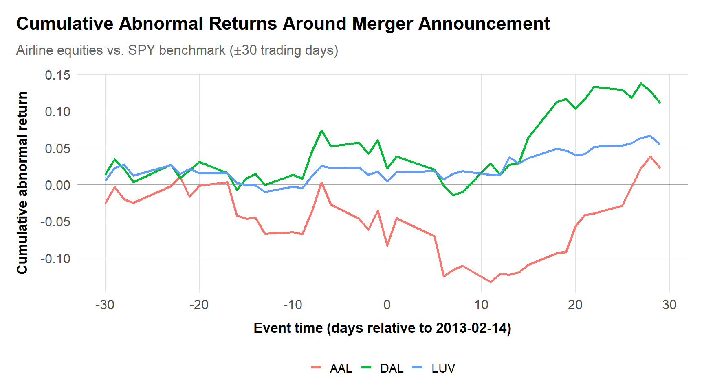

# Research Design: Quantitative and Qualitative {#sec-research-design}

With the institutions and legal standards in hand, we turn to method. The question that organizes this chapter is how to design research that will persuade a regulator, a court, and an opposing expert who is paid to find the holes in it. The principles below---quantitative and qualitative---carry through every application that follows.

The aim is judgment: which method to choose, and why. Different questions call for different methods, and the choice turns as much on the data you can get and the constraints you face as on the statistical properties of the estimator. We lean on the "credibility revolution" in applied economics without losing sight of how much of an antitrust matter rides on qualitative evidence.

## Learning goals
The goal of this chapter is to help you translate messy case facts into evidence that withstands scrutiny from opposing experts, agency staff, and judges. You will learn how to articulate research questions that map directly to legal theories of harm and to choose empirical strategies—diff-in-diff, event study, instrumental variables (IV), regression discontinuity (RDD), matching, or structural models—that are feasible with available data. Equally important, you will practice designing qualitative instruments (surveys, interviews, document coding schemes) that align with those empirical tests so each stream of evidence reinforces the others.

Because antitrust matters often unfold across jurisdictions, we emphasize how to document design choices so they travel: a memorandum prepared for the US DOJ should be intelligible to DG COMP economists or the South African Competition Tribunal. That means explicit statements about identifying assumptions, robustness diagnostics, and data provenance. Throughout the chapter we draw on recent matters such as US hospital merger retrospectives, EU telecom remedies, and South African ride-hailing and grocery market inquiries.

## Workflow
### Scoping memo
Every matter should begin with a scoping memo linking the narrative theory of harm to measurable outcomes. Specify the primary question (“Did the 2018 hospital merger in Texas raise commercial insurance prices?”), outline plausible channels (unilateral effects vs. coordination), and list essential datasets with owners, legal process required, and likely cleaning steps. Capture timing constraints—the DOJ’s Second Request clock, the CMA’s Phase I deadlines, or the Competition Commission South Africa’s 60-business-day merger review period—and highlight non-negotiable assumptions (e.g., availability of claims-level data or ability to survey procurement managers). Include citations to precedent such as merger retrospectives (Ashenfelter & Hosken, 2010), the methodology we apply in [Chapter 6](chapters/06-mergers.md), or class-certification common-impact decisions (Dickey & Rubinfeld, 2014) so legal teams can anticipate how courts reacted to similar designs.

### Data pipeline architecture
Treat the data pipeline as infrastructure. Raw productions, public datasets, and hand-entered chronologies should land in `data/raw`, with documented schemas and hashing to ensure integrity. Cleaning scripts housed in `scripts/` or `R/` should emit analytic files to `data/derived`, complete with README files explaining variable creation, filtering rules, and version numbers. Cloud-based teams should use reproducible environments (Renv, Conda, Docker) so every regression or visualization is rerunnable months later when litigation heats up. For South African matters, plan for hybrid data sources—local procurement records may arrive as PDFs, while US financials might come via SEC APIs—so build ingestion scripts that normalize currencies, indexation, and time zones.

### Pre-analysis and litigation deliverables
Before estimating anything, write a pre-analysis plan that documents main outcomes, treatment definitions, control groups, identifying assumptions, and robustness checks. Agencies expect this too: DOJ and FTC staff frequently ask for pre-specified models, DG COMP expects methodological appendices, and South African tribunals often require plain-language summaries usable in simultaneous interpretation. Include sensitivity tests (e.g., alternative market definitions, exclusion of outlier distributors, placebo periods) and specify the qualitative evidence that will contextualize results. As you progress, convert technical memos into courtroom-ready outputs—slide decks, white papers, expert declarations—without sacrificing reproducibility.

## The Modern Causal Toolkit: The Credibility Revolution

Modern antitrust economics increasingly relies on the "credibility revolution" in applied microeconomics—a shift from complex structural adjustments to transparent research designs that mimic randomized experiments. As championed by (Angrist & Pischke, 2009) and popularized in *Causal Inference: The Mixtape* (Cunningham, 2021), the goal is to identify a "natural experiment" where treatment (e.g., a merger, a cartel breakdown, or a regulation) is as good as randomly assigned.

### The "Design-Based" Philosophy
Instead of asking "what controls do I need to fix my model?", design-based thinking asks "where does the variation come from?" If you cannot draw a Directed Acyclic Graph (DAG) showing how the treatment was assigned independent of the outcome, no amount of regression control will save the analysis (Pearl, 2009). This "reduced form" approach contrasts with the "structural" methods used in merger simulation (see [Chapter 4](chapters/04-io-toolkit.md)), which rely on theoretical models to estimate "deep parameters".

This approach prioritizes:
1.  **Clean Identification:** Finding shocks (institutional details, policy boundaries, timing quirks) that separate treated and control groups.
2.  **Transparency:** Presenting raw data visuals (like the event study plots below) before showing regression tables.
3.  **Falsification:** Rigorously testing "placebos" (e.g., testing for effects before the merger happened, showing no effects in a time period where the treatment is not expected to have an effect) to prove the design is valid.

### Core Causal Toolkit
While the toolkit is vast, antitrust practitioners lean heavily on a few workhorses:
-   **Difference-in-Differences (DiD):** The gold standard for retrospective merger analysis.
-   **Synthetic Control:** For "N=1" cases (e.g., a single national merger) where no single control unit exists.
-   **Instrumental Variables (IV):** Used when prices are endogenous; we look for "shifters" (like tax changes or weather) that move supply but not demand.
-   **Regression Discontinuity (RDD):** Exploits arbitrary cutoffs (e.g., population thresholds for regulation) to compare similar firms on either side of the line.


**Method Selection Guide**

```
                            WHAT IS YOUR QUESTION?
                                     |
          +--------------------------+---------------------------+
          |                          |                           |
          v                          v                           v
   RETROSPECTIVE              PROSPECTIVE                 DAMAGES
   "Did X cause Y?"           "Will X cause Y?"           "How much harm?"
          |                          |                           |
          v                          v                           v
   Do you have a             Use STRUCTURAL               Calculate
   control group?            SIMULATION                   overcharge or
          |                  (Chapter 4, 6)               lost profits
    +-----+-----+                                         (Chapter 12)
    |           |
    v           v
   YES          NO
    |           |
    v           v
   DiD or    Synthetic
   Event     Control or
   Study     Before/After
    |
    v
   Is treatment
   timing staggered?
    |
    +-----+-----+
    |           |
    v           v
   YES          NO
    |           |
    v           v
   Callaway-  Standard
   Sant'Anna  TWFE
   or Sun-    (with
   Abraham    pre-trends)
```
**Key diagnostic:** Always plot raw data before and after treatment. If parallel trends fail visually, no estimator will save you.


| Method | When to Use | Key Assumption | Antitrust Application |
|:-------|:------------|:---------------|:---------------------|
| **DiD** | Policy/merger with clear timing, parallel control group | Parallel trends | Merger retrospectives ([Chapter 6](chapters/06-mergers.md)), cartel breakdowns ([Chapter 5](chapters/05-cartels.md)) |
| **Synthetic Control** | Single treated unit, multiple potential controls | Weights construct valid counterfactual | National mergers, single-market interventions |
| **IV** | Endogenous treatment/price, valid instrument available | Relevance + exclusion | Demand estimation, price-fixing damages |
| **RDD** | Sharp cutoff determines treatment | Continuity at threshold | Regulatory thresholds, antitrust exemptions |
| **Structural** | Forward-looking prediction needed | Model correctly specified | Merger simulation, counterfactual pricing |

### The Evolution of DiD
A key development in recent years is the realization that the standard Two-Way Fixed Effects (TWFE) estimator can be biased when treatment timing varies (staggered adoption). If you are analyzing a rollup strategy where a firm buys competitors in 2018, 2019, and 2020, standard regressions might compare early-treated units to late-treated units in ways that invert the sign of the effect.

Modern estimators like (Callaway & Sant'Anna, 2021) or (Sun & Abraham, 2021) (implemented in R packages `did` and `fixest`) explicitly handle this heterogeneity. In litigation, relying on "old" TWFE without robustness checks is now a vulnerability.


**Getting Up to Speed**

For a practical guide to these methods, we recommend three complementary resources:
1.  **"Causal Inference: The Mixtape"** (Cunningham, 2021): Excellent for intuition and history. [mixtape.scunning.com](https://mixtape.scunning.com/)
2.  **"The Effect"** (Huntington-Klein, 2021): A highly accessible introduction to design-based thinking. [theeffectbook.net](https://theeffectbook.net/)
3.  **"Causal Inference for the Brave and True"** (Alves, 2022): Covers intermediate topics including machine-learning approaches to interference. [matheusfacure.github.io/python-causality-handbook](https://matheusfacure.github.io/python-causality-handbook/)

For the academic foundations, see (Angrist & Pischke, 2009) and their companion *Mastering 'Metrics* (Angrist & Pischke, 2015).



**Method box: Causal tools**

**Diff-in-diff and event studies**: Always test for pre-trend equivalence using graphical diagnostics and formal tests. Dynamic specifications (leads/lags) are persuasive in telecom or energy cases where policy shocks phase in, and in remedy evaluations as we show in [Chapter 8](chapters/08-regulation-remedies.md). The DOJ used this approach in Spirit/JetBlue analyses (Us Spirit Jetblue, 2023), while South African regulators applied similar diagnostics to evaluate grocery supplier rebates.  
**Instrumental variables**: When supply or demand shocks are endogenous—think of hospital mergers with network design responses—search for plausibly exogenous instruments, such as regulatory bed caps or travel-time thresholds. Document relevance and exclusion explicitly; DG COMP is unforgiving when those steps are skipped.  
**Panel estimators**: Fixed-effects (FE) or two-way FE models remain workhorses but require caution under staggered adoption. Use estimators like `did::att_gt` or `fixest`’s Sun-Abraham implementation, and explain weighting schemes in your declarations.  
**Synthetic control / matrix completion**: For markets with single treated units (e.g., the CMA’s analysis of a UK airport slot divestiture), synthetic control and ridge-regularized matrix completion provide transparent counterfactuals. Include donor-pool rationale and placebo reassignments.  
**Inference**: With few clusters (common in mining or port cases), complement cluster-robust standard errors with wild bootstrap or randomization inference to avoid overconfident p-values.



**Qualitative methods box**

**Surveys and diversion studies**: Define the decision-maker (consumer vs. procurement lead), sampling frame, and recall period before crafting questions. The FTC’s Staples/Essendant review (Ftc Staples Essendant, 2019) and the Competition Commission South Africa’s ride-hailing inquiry both relied on carefully screened respondents to estimate diversion ratios---a key input for market definition as discussed in [Chapter 3](chapters/03-market-definition.md). Pre-test instruments to detect anchoring or order effects, and document weighting schemes.  
**Structured case studies**: Build matrices that compare conduct across firms, time, and geographies—e.g., analyzing fertilizer cartels in the US, EU, and South Africa to see whether “industry meetings” align with price spikes. Use the same template so qualitative coders can draw parallels to econometric findings.  
**Document coding**: Create controlled vocabularies for internal emails, board decks, and pricing memos. Tag each excerpt with custodian, date, and issue code; this facilitates linking to regression covariates (e.g., a “capacity discipline” tag aligned with utilization metrics).  
**Expert elicitation**: When engaging industry experts (engineers, procurement veterans), capture their priors, data references, and compensation structures. Tribunals increasingly ask for transparency, especially in South African public-interest hearings.



**Debate**

Three debates recur in nearly every case. First, **stated vs. revealed preferences**: surveys can illuminate multi-sided platforms where transaction data are limited (app stores, adtech), but agencies often prefer revealed behavior. One compromise is to calibrate survey responses against observable churn or clickstream metrics, as seen in the DOJ’s ad-tech inquiries (*United States v. Google (Search)*, 2023). Second, **parallel trends under innovation**: in markets with rapid product cycles (semiconductors, fintech), clean control groups may not exist. Explain how you use feature-adjusted indices, synthetic controls, or machine-learning prognostics to approximate counterfactuals, and disclose residual risk. Third, **placebo tests**: courts increasingly expect falsification exercises. In wage-fixing litigation (e.g., poultry processors (*United States v. Jindal*, 2021), US tech no-poach cases (Us High Tech Nopoach, 2015)), teams ran placebo periods and alternative employee groups to show effects were specific to collusive periods rather than macro shocks---labor market concentration analysis is developed in [Chapter 10](chapters/10-labor-markets.md).


## Visualizations

### Event study around a merger announcement
This figure uses publicly available equity data to demonstrate how to structure an event-study diagnostic for merger retrospectives or policy shocks. Replace tickers and the `event_date` to align with a specific matter; the scaffold keeps everything tidy for quick reporting.



## Exercises

1. **Conceptual.** Draw a DAG for a hospital merger analysis where the treatment is the merger, the outcome is price, and potential confounders include local demand shocks and insurer network changes. Identify at least one valid instrument and explain why it satisfies the exclusion restriction.

2. **Data/code.** Using the event study code scaffold in this chapter, modify the tickers to analyze the cumulative abnormal returns around a different merger announcement of your choosing. Compare the pattern for the merging parties vs. rivals vs. the market index.

3. **Conceptual.** Explain why standard two-way fixed effects (TWFE) can produce biased estimates under staggered treatment timing. Sketch a scenario in antitrust (e.g., a serial acquirer buying firms in 2018, 2019, 2020) where this bias would be particularly severe.

4. **Case discussion.** The DOJ's Google Search case relied on both quantitative evidence (auction data, default share calculations) and qualitative evidence (executive testimony, internal documents). How would you structure a pre-analysis plan that integrates both streams? What would you specify ex ante?

5. **Conceptual.** A South African Competition Commission investigation has access to 18 months of transaction data from two grocery chains but no natural experiment or policy shock. What research design options are available? Discuss the tradeoffs between before/after, cross-sectional, and structural approaches.

### Data exercise (checkable)

A merger affects one regional market (treated) but not another (control). Mean prices are: treated 100 (pre) and 118 (post); control 100 (pre) and 110 (post).

a. Compute the difference-in-differences estimate of the merger's price effect.
b. What identifying assumption must hold for this to be causal, and what plot would you show to support it?


**Worked answer**

a. DiD = (118 - 100) - (110 - 100) = 18 - 10 = **8**, an 8-unit (8%) price increase attributable to the merger.
b. **Parallel trends**: absent the merger, treated and control prices would have moved together. Support it with an event-study / pre-trend plot showing the two series tracking each other before the merger date.


## Looking ahead
Document every decision from scoping memo to estimation so later chapters can layer on industry-specific models. Begin compiling a reusable appendix with sample interview protocols, diversion survey templates, and code snippets for data validation. Market definition and merger simulation lean on these assets, so note any gaps (e.g., a telecom-grade cost index or South African procurement benchmark) while the evidence record is still flexible.

## Code box: diff-in-diff scaffold
```r
# In a typical DD setup:
# library(fixest)
library(did)

# expected columns:
# - id: firm, product, or region
# - time: monthly/quarterly period (Date or numeric)
# - treat: 0/1 indicator
# - outcome: price, margin, volume, quality score, etc.
# - controls: cost indices, demand shifters, policy dummies

# panel_data <- panel_data %>%
#   filter(between(time, as.Date("2016-01-01"), as.Date("2023-12-31"))) %>%
#   mutate(post = if_else(time >= treat_date[id], 1, 0))

# att_gt <- att_gt(yname = "outcome", tname = "time", idname = "id",
#                  gname = "treat_time", data = panel_data, panel = TRUE,
#                  xformla = ~ controls, clustervars = "id")
# summary(att_gt)

# Sun & Abraham style with fixest, clustered at market level:
# feols(outcome ~ i(time, treat, ref = REF_PERIOD) + controls | id + time,
#       data = panel_data, cluster = ~market_id)
```
