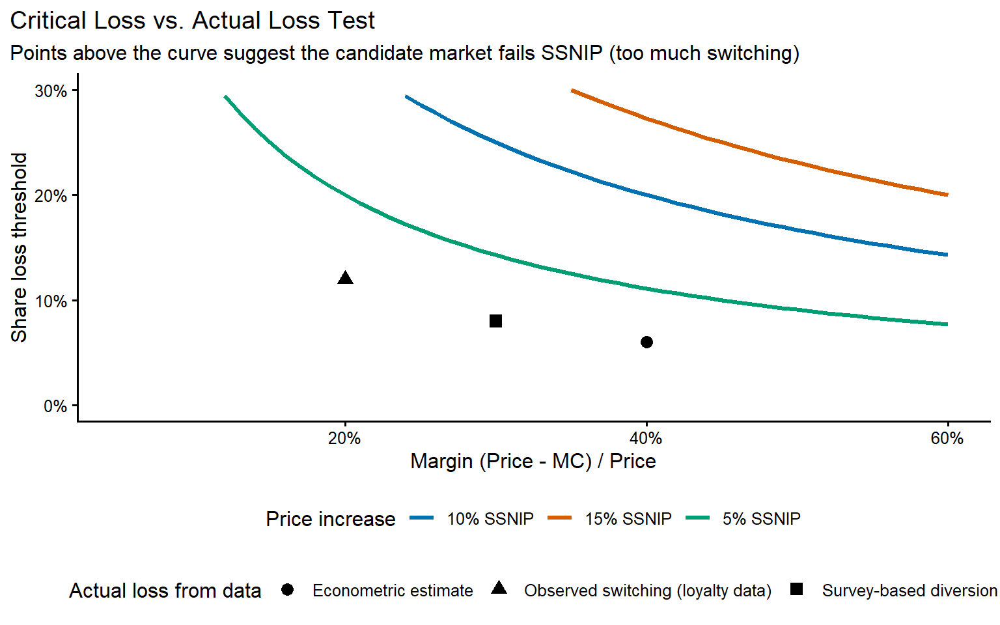
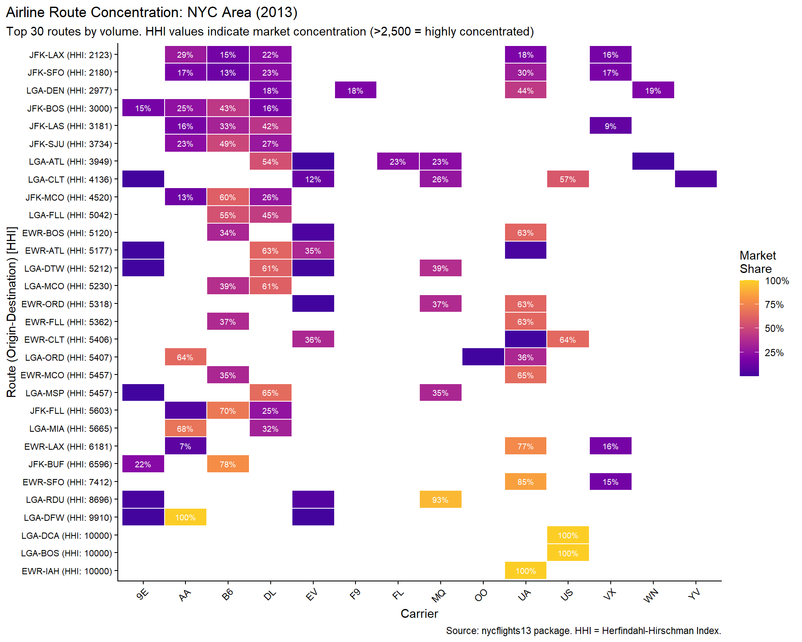
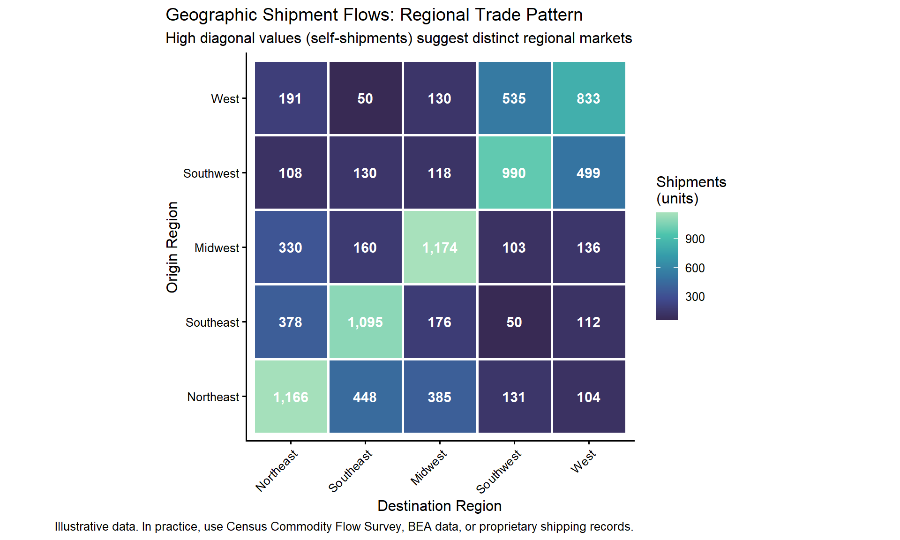
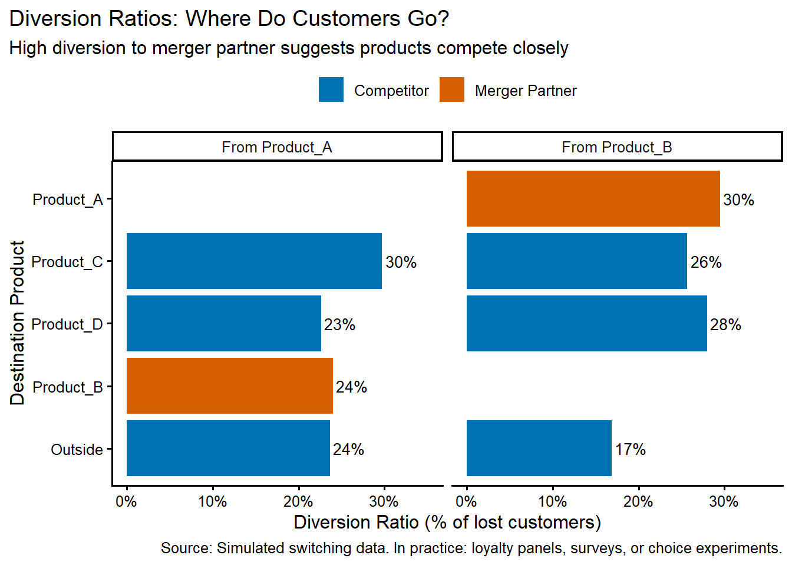

# Market Definition and Competitive Landscape {#sec-market-definition}

Almost every antitrust matter opens with the same fight: what is the relevant market? The answer fixes the market shares, frames the theory of harm, and bounds the remedy, so the parties contest it hard and early. Draw the boundary wide and a dominant firm looks ordinary; draw it narrow and an ordinary firm looks dominant.

This chapter uses the causal toolkit from [Chapter 2](chapters/02-research-design.md) to draw those boundaries from data and qualitative evidence---boundaries that hold up when a regulator or a court pushes on them.

## Learning goals

Market definition is no longer a rote SSNIP ritual. But agencies and courts still expect a disciplined statement of product and geographic boundaries before any debate about competitive effects, and they expect it to translate across DOJ/FTC, DG COMP, CMA, SAMR, and the Competition Tribunal of South Africa.

By the end of the chapter you should be able to:

- Frame relevant product and geographic markets using demand evidence, diversion ratios, and qualitative industry facts.
- Apply and critique SSNIP/SSNDQ reasoning, critical-loss vs. actual-loss tests, and switching-matrix screens.
- Integrate survey evidence, internal documents, and econometrics into narratives tuned to the burden of proof in each jurisdiction.
- Reference key precedents (e.g., (DOJ/FTC Merger Guidelines, 2023), (EC Market Definition Notice, 2024), (CMA Merger Assessment Guidelines, 2021)) and literature when defending methodological choices.

## Why market definition still matters
Even in unilateral-effects cases, where agencies work directly with margins, diversion, and price effects, courts still ask "what is the market?" Treat the answer as an evidence-integration exercise: describe the customer substitution paths, quantify them where you can, and tie the findings to the legal standard at issue---"reasonable interchangeability" in US case law, "sufficiently interchangeable" in EC practice. Keep a record of how you screened candidate markets so a later team can widen or narrow scope without re-doing the data prep.


**SSNIP Test Decision Flowchart**

```
START: Define candidate market (products + geography)
                        |
                        v
+-----------------------------------------------+
| STEP 1: Identify the focal product(s)         |
| - Merging parties' products                   |
| - Alleged dominant firm's products            |
+-----------------------------------------------+
                        |
                        v
+-----------------------------------------------+
| STEP 2: Calculate margin (P - MC) / P         |
| - Use accounting data, benchmarks, or proxies |
+-----------------------------------------------+
                        |
                        v
+-----------------------------------------------+
| STEP 3: Apply 5-10% hypothetical price        |
| increase (SSNIP) or quality decrease (SSNDQ)  |
+-----------------------------------------------+
                        |
                        v
+-----------------------------------------------+
| STEP 4: Estimate actual loss (switching)      |
| - Diversion ratios from data/surveys          |
| - Cross-price elasticities                    |
| - Natural experiments                         |
+-----------------------------------------------+
                        |
                        v
          Compare actual loss to critical loss
          Critical Loss = SSNIP / (SSNIP + Margin)
                        |
          +-------------+-------------+
          |                           |
          v                           v
   Actual > Critical           Actual < Critical
          |                           |
          v                           v
   MARKET TOO NARROW           MARKET DEFENSIBLE
   Expand candidate            Proceed with
   market and repeat           current definition
```
**Key insight:** High-margin firms face lower critical loss thresholds, making it easier to sustain a narrow market definition. Low-margin firms face higher thresholds, often requiring broader markets.


> "The 'relevant market' is not an intrinsic feature of the economy, but a tool for analyzing competitive effects... It is defined by the constraints that prevent a hypothetical monopolist from raising prices." — *United States v. Google LLC*, Memorandum Opinion (D.D.C. 2024)

## Core tools and workflow

Modern market-definition work cycles through four approaches, each suited to different data environments and legal standards.

1. **Descriptive analytics.** Price/volume trends, seasonality, and policy shocks that reveal when products or regions move together. Use `ggplot2` quick looks before heavy modeling.
2. **Demand elasticities & diversion.** Log-log regressions, AIDS-lite models, discrete choice, or churn-based diversion ratios that quantify substitutability. Always document instruments, fixed effects, or controls used.
3. **Critical-loss vs. actual-loss.** Compare hypothetical post-SSNIP losses to observed switching, stating margin assumptions and capacity constraints. Highlight when brand repositioning or supply limits break the classic calculations.
4. **Geographic screens.** Shipment flows, travel-time analyses, or catchment-area heatmaps built from loyalty data, mobile location pings, or Stats SA transport datasets. Pair with qualitative evidence on delivery commitments or regulatory boundaries.

The workflow mirrors [Chapter 2](chapters/02-research-design.md)'s research design steps: scoping memo → data inventory → qualitative plan → estimation → memo/slide deck. Revisit `chapters/13-empirical-appendix.qmd` for templates.

## Core diagnostic tools

The workflow says *what* to do; the diagnostics below show *how*. Each produces artifacts that feed directly into merger simulations ([Chapter 6](chapters/06-mergers.md)) and cartel analysis ([Chapter 5](chapters/05-cartels.md)):

- **Price/quantity dashboards.** Track cointegration, variance ratios, and shock responses to see which products move together.
- **Elasticities/diversion.** Estimate log-log or `fixest` panel regressions; or use choice data (`mlogit`, `apollo`) when products are differentiated.
- **Critical vs. actual loss.** Compare theoretical thresholds to observed share loss; revisit margin assumptions for multi-product firms.
- **Switching matrices, flows, and gravity models.** Summarize customer-level churn or shipment adjacency to motivate geographic splits.

### Critical-loss worksheet

**What this shows:** Critical loss analysis tests whether a hypothetical monopolist could profitably raise prices. The "critical loss" is the maximum share loss that would still leave a price increase profitable, given the firm's margins.

**Why it matters:** If observed customer switching exceeds the critical loss threshold, the proposed market is too narrow—customers are switching to substitutes outside the candidate market, meaning the market should be expanded.

We can calculate critical loss thresholds for various hypothetical segments (e.g., Commercial, Government, SMB) to test if a price increase would be profitable.

### Critical-loss vs. actual-loss curve
This visualization compares the theoretical critical loss threshold to observed share losses across different margin assumptions. It helps communicate whether a candidate market "passes" the SSNIP test.

```r
library(dplyr)
library(ggplot2)
library(patchwork)
source("program/R/helpers.R")

# Generate critical loss curves for different price increases
margins <- seq(0.05, 0.60, by = 0.01)
price_increases <- c(0.05, 0.10, 0.15)

cl_curves <- expand.grid(
  margin = margins,
  price_increase = price_increases
) |>
  mutate(
    critical_loss = price_increase / (price_increase + margin),
    price_increase_label = paste0(price_increase * 100, "% SSNIP")
  )

# Observed actual loss from customer switching data (illustrative)
# In practice, these come from loyalty data, surveys, or econometric diversion estimates
actual_loss_examples <- tibble::tribble(
  ~margin, ~actual_loss, ~scenario,
  0.20, 0.12, "Observed switching",
  0.30, 0.08, "Survey diversion",
  0.40, 0.06, "Econometric estimate"
)

# Main plot: critical loss curves
p1 <- ggplot(cl_curves, aes(x = margin, y = critical_loss, color = price_increase_label)) +
  geom_line(linewidth = 1.2) +
  geom_point(data = actual_loss_examples,
             aes(x = margin, y = actual_loss, shape = scenario),
             color = "black", size = 3, inherit.aes = FALSE) +
  scale_x_continuous(labels = scales::percent_format()) +
  scale_y_continuous(labels = scales::percent_format(), limits = c(0, 0.30)) +
  scale_color_manual(values = c("#0072B2", "#D55E00", "#009E73")) +
  labs(
    title = "Critical Loss vs. Actual Loss Test",
    subtitle = "Points above the curve suggest the candidate market fails SSNIP (too much switching)",
    x = "Margin (Price - MC) / Price",
    y = "Share loss threshold",
    color = "Price increase",
    shape = "Actual loss from data"
  ) +
  theme_antitrust() +
  theme(
    legend.position = "bottom",
    legend.box = "vertical",
    plot.title.position = "plot"
  ) +
  guides(color = guide_legend(order = 1), shape = guide_legend(order = 2))

# Companion table showing specific calculations
cl_table <- tibble::tribble(
  ~margin, ~price_increase, ~critical_loss, ~actual_loss, ~interpretation,
  0.25, 0.05, 0.167, 0.08, "Market likely too narrow (actual < critical)",
  0.25, 0.10, 0.286, 0.12, "Market likely too narrow (actual < critical)",
  0.40, 0.05, 0.111, 0.15, "Market likely too broad (actual > critical)"
) |>
  mutate(
    across(c(margin, price_increase, critical_loss, actual_loss),
           ~scales::percent(., accuracy = 0.1))
  )

p1

cat("\nCritical loss decision table:\n")
knitr::kable(cl_table, digits=3, caption="Critical Loss Decision Table")
```



**How to use this chart:** For a given margin estimate (horizontal axis), find the critical loss threshold (the curve). If your observed or estimated actual loss (from switching data, surveys, or diversion ratios) falls *above* the curve, customers switch too readily for a hypothetical monopolist to profitably raise prices by 5-10%, suggesting the candidate market is too narrow and should be expanded. Conversely, if actual loss is *below* the curve, the market definition may be defensible.

Swap `margin` and `price_increase` with matter-specific values. For theoretical derivations, see (Katz & Shapiro, 2003). For alternatives to traditional market definition, see (Farrell & Shapiro, 2010) and (Schmalensee, 2009). For quantitative techniques, consult (Davis & Garcés, 2010).

### Route-share heatmap: NYC airline concentration
This heatmap visualizes carrier concentration on specific routes, helping identify whether route-by-route markets are appropriate or whether broader origin-destination-pairs should be considered. High concentration (dark colors) on specific routes may signal competitive concerns.

```r
library(nycflights13)
library(dplyr)
library(tidyr)
library(ggplot2)

# Calculate route-level shares and HHI
route_shares <- flights |>
  filter(origin %in% c("JFK", "LGA", "EWR")) |>
  mutate(route = paste(origin, dest, sep = "-")) |>
  count(route, carrier, name = "flights") |>
  group_by(route) |>
  mutate(
    share = flights / sum(flights),
    total_flights = sum(flights)
  ) |>
  ungroup()

# Calculate HHI for each route
route_hhi <- route_shares |>
  group_by(route) |>
  summarize(
    hhi = sum((share * 100)^2),
    total_flights = first(total_flights),
    n_carriers = n()
  ) |>
  arrange(desc(hhi))

# Select top 20 routes by volume for visualization clarity
top_routes <- route_shares |>
  group_by(route) |>
  summarize(total = sum(flights)) |>
  slice_max(total, n = 20) |>
  pull(route)

# Filter to top routes and add HHI
route_shares_top <- route_shares |>
  filter(route %in% top_routes) |>
  left_join(route_hhi |> select(route, hhi), by = "route") |>
  mutate(
    route_labeled = paste0(route, " (HHI: ", round(hhi), ")")
  ) |>
  arrange(desc(hhi))

# Create ordered factor for proper sorting
route_shares_top <- route_shares_top |>
  mutate(route_labeled = factor(route_labeled,
                                 levels = unique(route_labeled[order(hhi, decreasing = TRUE)])))

# Heatmap
p_heatmap <- ggplot(route_shares_top, aes(x = carrier, y = route_labeled, fill = share)) +
  geom_tile(color = "white", linewidth = 0.5) +
  geom_text(aes(label = ifelse(share >= 0.05, scales::percent(share, accuracy = 1), "")),
            size = 2.5, color = "white") +
  scale_fill_viridis_c(
    labels = scales::percent_format(),
    option = "plasma",
    begin = 0.1,
    end = 0.9
  ) +
  labs(
    title = "Airline Route Concentration: NYC Area (2013)",
    subtitle = "Top 20 routes by volume. HHI > 1,800 triggers structural presumption (2023 Guidelines)",
    x = "Carrier",
    y = "Route (Origin-Destination) [HHI]",
    fill = "Market\nShare",
    caption = "Source: nycflights13 package. HHI = Herfindahl-Hirschman Index."
  ) +
  theme_antitrust() +
  theme(
    axis.text.y = element_text(size = 8),
    axis.text.x = element_text(angle = 45, hjust = 1),
    plot.title.position = "plot",
    legend.position = "right",
    panel.grid = element_blank()
  )

p_heatmap

# Summary table of most concentrated routes
cat("\nMost concentrated routes (Top 10 by HHI):\n")
route_hhi |>
  slice_max(hhi, n = 10) |>
  mutate(
    hhi = round(hhi),
    concentration = case_when(
      hhi >= 1800 ~ "Highly concentrated (structural presumption)",
      hhi >= 1000 ~ "Moderately concentrated",
      TRUE ~ "Unconcentrated"
    )
  ) |>
  select(route, hhi, n_carriers, total_flights, concentration) |>
  head(10) |>
  knitr::kable(caption = "Top Route Concentration Stats")
```



**Interpretation:** Routes with HHI > 1,800 (2023 US Merger Guidelines structural presumption threshold) may warrant closer scrutiny. The visualization shows that many NYC routes are served by only 1-2 carriers with dominant shares, which could support narrow route-level market definitions in merger analysis. In practice, you would supplement this with pricing data, switching patterns, and qualitative evidence about entry barriers.

Replace `nycflights13` with live data (slot allocation, loyalty records, booking data, or Stats SA shipment records) when presenting evidence in actual matters.


**Running example: Airline market definition**

Airline mergers illustrate how market definition choices can determine a case's outcome. The central question is geographic scope: should the relevant market be defined as an airport-pair (e.g., DCA--LGA), a city-pair (e.g., Washington--New York), or a broader corridor? Product scope matters too: are nonstop flights a separate market from connecting service?

The heatmap above shows that many NYC-origin routes are served by only one or two carriers with dominant shares---exactly the pattern that motivates route-level market definition. In the DOJ's 2013 challenge to the American Airlines/US Airways merger, the government defined relevant markets at the **airport-pair level with nonstop service** as the relevant product. The narrow definition decided the matter: on many routes the merging carriers' combined shares exceeded the structural presumption thresholds, whereas a broader city-pair definition that pooled all three NYC-area airports would have diluted concentration.

We can compute route-level HHI directly from the flight data to identify which routes would trigger scrutiny under the 2023 Merger Guidelines:

```r
library(dplyr)

route_shares <- read.csv("data/derived/airline_route_shares.csv")

# Identify routes where AA and US both operate, compute HHI and delta-HHI
aa_us_routes <- route_shares |>
  group_by(route) |>
  filter(any(carrier == "AA") & any(carrier == "US")) |>
  summarise(
    hhi = first(hhi),
    aa_share = sum(share[carrier == "AA"]) * 100,
    us_share = sum(share[carrier == "US"]) * 100,
    combined = aa_share + us_share,
    delta_hhi = 2 * aa_share * us_share,
    .groups = "drop"
  ) |>
  filter(delta_hhi > 100) |>
  arrange(desc(delta_hhi))

# Top overlap routes — those exceeding structural presumption
cat("Routes where AA/US Airways overlap triggers scrutiny (HHI > 1800, delta > 100):\n")
aa_us_routes |>
  head(10) |>
  mutate(across(c(aa_share, us_share, combined), ~round(., 1)),
         hhi = round(hhi), delta_hhi = round(delta_hhi)) |>
  knitr::kable(caption = "AA/US Airways Overlap Routes (Top 10 by Delta-HHI)")
```

The DOJ's case focused on precisely these high-overlap routes, particularly at hub airports like DCA, LGA, ORD, and PHL where both carriers held significant slot portfolios. This market-definition exercise feeds directly into the merger simulation in [Chapter 6](chapters/06-mergers.md), where we calibrate demand models to predict post-merger price effects on the most concentrated routes.


### Geographic market definition: Shipment flows
Understanding where products physically flow helps define geographic markets. This visualization shows the intensity of shipments between regions, which can reveal natural market boundaries, trade patterns, and whether distant regions constrain local pricing.

```r
library(dplyr)
library(ggplot2)
library(tidyr)
source("program/R/helpers.R")

# Illustrative shipment flow data
# In practice, pull from Census Commodity Flow Survey, BEA trade data,
# company shipping records, or Stats SA provincial trade data
set.seed(42)
regions <- c("Northeast", "Southeast", "Midwest", "Southwest", "West")

# Create flow matrix (origin x destination)
# Self-shipments (diagonal) are typically highest
flow_data <- expand.grid(
  origin = regions,
  destination = regions
) |>
  mutate(
    # Self-shipments are high, nearby regions moderate, distant regions low
    base_flow = case_when(
      origin == destination ~ runif(n(), 800, 1200),
      (origin == "Northeast" & destination == "Southeast") |
        (origin == "Southeast" & destination == "Northeast") ~ runif(n(), 300, 500),
      (origin == "Midwest" & destination == "Northeast") |
        (origin == "Northeast" & destination == "Midwest") ~ runif(n(), 250, 450),
      (origin == "West" & destination == "Southwest") |
        (origin == "Southwest" & destination == "West") ~ runif(n(), 350, 550),
      TRUE ~ runif(n(), 50, 200)
    ),
    shipments = round(base_flow)
  ) |>
  select(-base_flow)

# Calculate self-sufficiency ratio (intra-regional shipments / total from that origin)
self_sufficiency <- flow_data |>
  group_by(origin) |>
  mutate(
    total_out = sum(shipments),
    self_share = shipments / total_out
  ) |>
  filter(origin == destination) |>
  select(region = origin, self_sufficiency = self_share)

# Heatmap of flows
p_flows <- ggplot(flow_data, aes(x = destination, y = origin, fill = shipments)) +
  geom_tile(color = "white", linewidth = 1) +
  geom_text(aes(label = scales::comma(shipments, accuracy = 1)),
            color = "white", size = 4, fontface = "bold") +
  scale_fill_viridis_c(
    option = "mako",
    labels = scales::comma,
    begin = 0.2,
    end = 0.9
  ) +
  labs(
    title = "Geographic Shipment Flows: Regional Trade Pattern",
    subtitle = "High diagonal values (self-shipments) suggest distinct regional markets",
    x = "Destination Region",
    y = "Origin Region",
    fill = "Shipments\n(units)",
    caption = "Illustrative data. In practice, use Census Commodity Flow Survey, BEA data, or proprietary shipping records."
  ) +
  theme_antitrust() +
  theme(
    plot.title.position = "plot",
    panel.grid = element_blank(),
    axis.text.x = element_text(angle = 45, hjust = 1)
  ) +
  coord_fixed()

p_flows

# Self-sufficiency table
cat("\nRegional self-sufficiency (intra-regional shipments as % of total):\n")
self_sufficiency |>
  mutate(self_sufficiency = scales::percent(self_sufficiency, accuracy = 1)) |>
  arrange(desc(self_sufficiency)) |>
  knitr::kable(digits=2, caption="Regional Self-Sufficiency Scores")
```



**How to use this analysis:**
- **High self-sufficiency** (diagonal dominance): If 70-80%+ of shipments from a region stay within that region, it suggests the region may be a distinct geographic market.
- **Low cross-flows**: Minimal shipments between distant regions (e.g., Northeast <-> West) suggest they don't constrain each other's pricing.
- **Clustering**: Regions with high mutual flows (e.g., Northeast <-> Southeast) might constitute a single broader market.

In practice, combine this with:
- **Pricing correlation analysis**: Do prices move together across regions?
- **Delivered pricing**: What are freight costs relative to product value?
- **Qualitative evidence**: Customer testimony about willingness to source from distant suppliers, delivery time requirements, etc.

**Data sources:**
- US: Census Commodity Flow Survey (5-year intervals), BEA trade flows by state
- South Africa: Stats SA provincial trade data, National Treasury procurement records
- Company-specific: Shipping manifests, customer address clustering, delivery zone definitions

### Diversion ratios from customer switching data

**What diversion measures:** Diversion ratios quantify where customers go when their first choice becomes unavailable or more expensive. If Product A loses 100 customers and 35 of them switch to Product B, the diversion ratio from A to B is 35%.

**Why it matters:** High diversion between products suggests they compete closely. In merger analysis, high diversion between merging parties signals unilateral effects concerns (more in [Chapter 6](chapters/06-mergers.md)). For market definition, diversion patterns reveal which products belong in the same market.

This example shows how to compute diversion from customer-level switching or choice data.

```r
library(dplyr)
library(ggplot2)
library(tidyr)
source("program/R/helpers.R")

# Simulated customer switching data
# In practice: loyalty card data, survey "next-best" responses,
# clickstream/shopping cart abandonment, health plan switching
set.seed(123)
n_customers <- 1000

# Customer choices: first choice and second choice (if first unavailable)
switching_data <- tibble(
  customer_id = 1:n_customers,
  first_choice = sample(c("Product_A", "Product_B", "Product_C", "Product_D", "Outside"),
                        n_customers, replace = TRUE,
                        prob = c(0.30, 0.25, 0.20, 0.15, 0.10)),
  second_choice = sample(c("Product_A", "Product_B", "Product_C", "Product_D", "Outside"),
                         n_customers, replace = TRUE,
                         prob = c(0.22, 0.23, 0.22, 0.18, 0.15))
) |>
  # Ensure second choice differs from first choice
  rowwise() |>
  mutate(
    second_choice = if_else(
      second_choice == first_choice,
      sample(setdiff(c("Product_A", "Product_B", "Product_C", "Product_D", "Outside"), first_choice), 1),
      second_choice
    )
  ) |>
  ungroup()

# Calculate diversion ratios
# Diversion from Product i to Product j =
# (# customers switching from i to j) / (total customers choosing i first)
diversion_matrix <- switching_data |>
  count(first_choice, second_choice, name = "switchers") |>
  group_by(first_choice) |>
  mutate(
    total_first = sum(switchers),
    diversion_ratio = switchers / total_first
  ) |>
  ungroup() |>
  select(from = first_choice, to = second_choice, diversion_ratio, switchers, total_first)

# Visualize diversion from Product A and Product B (merger parties)
products_of_interest <- c("Product_A", "Product_B")

p_diversion <- diversion_matrix |>
  filter(from %in% products_of_interest, to != from) |>
  mutate(
    merger_party = to %in% products_of_interest,
    from_label = paste("From", from)
  ) |>
  ggplot(aes(x = reorder(to, diversion_ratio), y = diversion_ratio, fill = merger_party)) +
  geom_col() +
  geom_text(aes(label = scales::percent(diversion_ratio, accuracy = 1)),
            hjust = -0.1, size = 3.5) +
  scale_y_continuous(labels = scales::percent_format(), limits = c(0, 0.35)) +
  scale_fill_manual(
    values = c("FALSE" = "#0072B2", "TRUE" = "#D55E00"),
    labels = c("FALSE" = "Competitor", "TRUE" = "Merger Partner")
  ) +
  coord_flip() +
  facet_wrap(~from_label, ncol = 2) +
  labs(
    title = "Diversion Ratios: Where Do Customers Go?",
    subtitle = "High diversion to merger partner suggests products compete closely",
    x = "Destination Product",
    y = "Diversion Ratio (% of lost customers)",
    fill = NULL,
    caption = "Source: Simulated switching data. In practice: loyalty panels, surveys, or choice experiments."
  ) +
  theme_antitrust() +
  theme(
    plot.title.position = "plot",
    legend.position = "top"
  )

p_diversion

# Summary table
cat("\nDiversion from Product A:\n")
diversion_matrix |>
  filter(from == "Product_A", to != "Product_A") |>
  arrange(desc(diversion_ratio)) |>
  mutate(
    diversion_ratio = scales::percent(diversion_ratio, accuracy = 0.1),
    interpretation = case_when(
      to == "Product_B" ~ "HIGH - Merger partner (UPP concern)",
      to == "Outside" ~ "Customers leave market",
      TRUE ~ "Substitute competitor"
    )
  ) |>
  select(to, diversion_ratio, switchers, interpretation) |>
  print(n = Inf)
```



**Interpretation for merger analysis:**
- **High diversion between merger parties** (e.g., 25-35% from A→B): Strong evidence products compete closely; supports narrow market definition and raises UPP concerns.
- **Low diversion to outside option**: Customers are "captive" to the industry, strengthening market power concerns.
- **Symmetric vs. asymmetric diversion**: If A→B is 30% but B→A is only 15%, Product A is a closer substitute for B than vice versa (important for UPP calculations).

**Data sources:**
- **Loyalty/transaction data**: Track customer purchases before/after product unavailability or price changes
- **Surveys**: "If Product A were unavailable, what would you buy instead?" (watch for hypothetical bias)
- **Natural experiments**: Stockouts, temporary exits, localized price shocks
- **Discrete choice experiments**: Show customers product bundles and estimate substitution patterns


**Method box**

- **Computing diversion from panel data.** Use customer-level purchase histories to track switches after price changes, stockouts, or exits: `dplyr::group_by(customer) |> arrange(date) |> lag(product)` to identify transitions.

- **Survey-based diversion.** Ask "next best" questions but weight by purchase likelihood; validate against revealed switching where possible. Document screening (exclude inattentive respondents) and show robustness to alternative weighting schemes.

- **Entry/exit event studies.** When competitors enter or exit (Lyft entering a city, clinic closure), run high-frequency event studies on prices/volumes to see whether products constrain each other.

- **Cross-price elasticities with uncertainty.** Pair point estimates with bootstrapped intervals (or Bayesian draws) and present them in `gt` (the R “grammar of tables” package, which produces formatted tables) so tribunals can see both the estimates and their precision.

- **Discrete choice models.** For differentiated products, estimate multinomial logit or nested logit models (`mlogit`, `apollo` packages) to recover full substitution matrices and test market definitions.



**Qualitative evidence**

**Product positioning.** Sales playbooks, win/loss reports, and marketing decks often list "closest competitor" products—quote them and tie to diversion ratios.  
**Customer evidence.** Structured interviews and surveys reveal practical switching hurdles, procurement timelines, and multi-homing behavior. Document sampling rigor following established survey research standards.  
**RFP and contract language.** Bid specs, exclusivity clauses, and default settings (especially on platforms) show whether customers view products as substitutes.



**Case box: Market definition in practice**

**Hospitals & insurers (US).** In FTC v. Advocate Health Care (7th Cir. 2017), the court examined whether a hospital merger would harm commercially insured patients in the Chicago North Shore area. The FTC presented patient origin data showing that 80% of patients traveled less than 15 miles, commercial insurer testimony about limited bargaining leverage with "must-have" hospitals, and survey evidence on patient switching. Defendants countered with broader geographic market definitions based on physician referral patterns and specialty care availability. The court sided with the FTC's narrower market, emphasizing that commercial insurers—not patients—were the direct customers, and their testimony about competitive dynamics was dispositive. **Lesson:** In two-sided markets, identify the relevant customer for market definition purposes and weight their testimony heavily.

**Grocery retail (South Africa).** The 2015-2019 Grocery Retail Market Inquiry combined loyalty-card transaction data from Pick n Pay and Shoprite covering millions of baskets, mall lease registers showing exclusive clauses, and micro-level CPI data by product and township. Investigators used the loyalty data to map customer catchment areas, finding that 70-80% of shoppers traveled less than 5 kilometers. They simulated a 5% SSNIP on a basket of staples and estimated that only 15-20% of customers would switch to more distant stores, well below the critical loss threshold for margins of 25-30%. The inquiry documented how long-term exclusive leases between national chains and mall developers foreclosed entry by discounters in townships, effectively segmenting markets by neighborhood. **Lesson:** Granular transaction data can overcome theoretical debates about SSNIP tests; pair with qualitative evidence (lease contracts) to show barriers to expansion.

**Tech platforms: Google Search (US/EU).** In US v. Google (2020) and European Commission decisions, market definition turned on whether general search, specialized search (maps, shopping, travel), and social media search were in the same market. Google argued for a broad "online advertising" or "digital information" market. Agencies presented telemetry showing users rarely substitute between general search and social platforms for commercial queries, default contract terms showing Google paid billions to remain the default on Safari/Chrome (revealing high diversion), and advertiser testimony that search ads have unique intent-based targeting. The narrow "general search" market was upheld. **Lesson:** In zero-price markets, use revealed preference (default payments, multi-homing rates) rather than stated willingness to pay; SSNDQ (Small but Significant Non-transitory Decrease in Quality) can substitute for SSNIP.

**Ride-hailing (Asia/Africa).** Japan's JFTC and South Africa's Competition Commission both investigated ride-hailing platforms. JFTC examined whether taxi services and ride-hailing were in the same market, analyzing driver multi-homing (many drivers used both Uber and local apps), rider app-switching behavior via surveys, and pricing correlation. High multi-homing suggested low switching costs, supporting a broader market. In South Africa, the Commission's digital platform inquiry examined Uber, Bolt, and local competitors, finding that commission caps and driver exclusivity clauses fragmented the market geographically (Gauteng vs. Western Cape) and by vehicle class (metered taxis vs. e-hailing). **Lesson:** Multi-sided platform markets require separate analysis of each side (riders, drivers) and attention to contractual terms that may segment otherwise integrated markets.


### Southern African market evidence
- **Private Healthcare Market Inquiry (Competition Commission, 2014–2019).** Tribunal-appointed panel reviewed six years of patient-level claims covering roughly 70% of the 8.8 million beneficiaries in South Africa’s private schemes, combining them with supplier cost data to test alternative geographic definitions for specialist care. The inquiry found Herfindahl indices above 4,000 in several provinces and documented limited patient switching despite tariff differentials, motivating recommendations on supply-side licensing reform and transparency.
- **Grocery Retail Market Inquiry (2015–2019).** Investigators merged retailer loyalty data, mall lease registers, and micro-CPI data to map catchment areas for supermarkets versus spaza shops. By simulating 5% SSNIP-style shocks with actual basket-level switching elasticities, the Commission showed how long-term exclusive leases between national chains and landlords constrained entry by discounters in townships and secondary towns.
- **Data Services Market Inquiry (2017–2019).** The Competition Commission benchmarked prepaid mobile data prices (30-day 1GB basket) against a peer group of African and BRICS comparators, documenting South African prices that were roughly 20–40% above the median even after controlling for spectrum cost proxies and GDP per capita. Subscriber-level usage data from MTN and Vodacom revealed steep price discrimination by income segment, which fed into the Tribunal-endorsed commitments to cut headline prepaid rates by 30–50% and expand zero-rated educational content.


**Debate: Is market definition still necessary?**

A long-running debate centers on whether formal market definition remains necessary in unilateral effects analysis. **The traditional view** (agencies, most courts) holds that market definition disciplines the analysis: it forces practitioners to articulate which products/regions constrain pricing, establishes evidentiary presumptions (HHI thresholds), and provides a common language across jurisdictions. Without it, arguments risk becoming untethered from competitive reality.

**The reform view** (some economists, recent US guidelines commentary) argues that diversion ratios, margins, and UPP/GUPPI directly answer the relevant question—"will this merger raise prices?"—without the need for binary in/out market distinctions. Forcing a SSNIP test can be arbitrary (the 5-10% threshold is a convention, not economics), and critical-loss analysis is sensitive to margin measurement. Modern tools (merger simulation, natural experiments) can estimate price effects directly. See Katz & Shapiro (2003), Farrell & Shapiro (2010), and Werden (2012) for the evolution of this debate.

**Practical middle ground:** Most practitioners define a candidate market to anchor share calculations and HHI, but also present direct evidence (diversion, UPP, simulation) to avoid getting bogged down in SSNIP debates. Courts still expect market definition, especially in monopolization and vertical cases where structural presumptions remain central. Document the market definition exercise even if your ultimate analysis relies on direct effects modeling.

**Jurisdictional variation:** DG COMP and the CMA increasingly accept "direct effects" arguments in merger reviews but still require formal market definition in abuse-of-dominance cases. The US has moved toward pragmatism: the 2023 Merger Guidelines retain market definition but emphasize it's not always necessary when direct evidence of competitive effects is available. South African practice follows this middle path: the Competition Act requires market definition for some statutory tests (dominance, public interest), but practitioners routinely supplement with direct diversion and simulation evidence.



**Citations and comparative note**

- Cite market definition sources such as US Merger Guidelines SSNIP discussion (DOJ/FTC Merger Guidelines, 2023) and EC Notice on market definition (EC Market Definition Notice, 2024); add CMA cases for UK context.
- When using surveys or switching analyses, reference standards on survey reliability (e.g., reference guides, cases admitting/excluding surveys).
- Flag jurisdictional differences explicitly when SSNDQ or platform-centric approaches apply more than SSNIP (e.g., EU digital contexts).



**Key Takeaways**

1. **Market definition is a tool, not an end.** The goal is to identify competitive constraints that discipline pricing. Draw boundaries where those constraints meaningfully weaken.

2. **SSNIP provides structure, not answers.** The hypothetical monopolist test is a thought experiment that organizes evidence. It requires data on margins and switching behavior to operationalize.

3. **Critical loss is sensitive to margins.** High-margin products face low critical-loss thresholds, making narrow markets easier to sustain. Always report margin assumptions clearly.

4. **Multiple evidence types reinforce each other.** Combine price correlations, switching matrices, customer testimony, and internal documents. No single method is dispositive.

5. **Geographic markets require travel time and cost analysis.** "Willingness to travel" depends on the product; a 30-minute drive acceptable for groceries may be infeasible for emergency care.

6. **Document your process.** Future teams---and opposing experts---will scrutinize your choices. Keep a record of candidate markets screened, data sources consulted, and assumptions made.


## Exercises

1. **Data/code.** Using the `nycflights13` package (already used in the chapter), redefine the geographic market as all NYC-area airports combined vs. individual airports (JFK, LGA, EWR). Compute HHI under both definitions for the top 10 routes by volume. How does the choice of geographic market affect the concentration picture?

2. **Conceptual.** A 5% SSNIP test with a margin of 30% yields a critical loss of 14.3%. If loyalty-card data shows 12% actual switching, what do you conclude about the candidate market? Now suppose the margin is actually 40%---how does the conclusion change?

3. **Case discussion.** Compare the market definition approaches used in the South African Grocery Retail Market Inquiry and the US Google Search case. How did the availability of data (loyalty cards vs. telemetry) shape the methodological choices?

4. **Conceptual.** Explain the SSNDQ (quality degradation) framework and when it is preferable to SSNIP. Give an example of a zero-price market where SSNDQ would be the appropriate test.

5. **Data/code.** Using the diversion ratio code scaffold in this chapter, modify the simulation to create asymmetric diversion (A to B = 35%, B to A = 15%). Compute UPP for both directions and explain why asymmetric diversion matters for merger analysis.

### Data exercise (checkable)

A candidate market has a gross margin of 40%. You run a SSNIP of 5%.

a. Compute the critical loss.
b. Survey evidence suggests the actual loss from a 5% price rise would be about 8%. Is the candidate market a relevant antitrust market, or is it drawn too narrowly?


**Worked answer**

a. Critical loss = t / (t + m) = 0.05 / (0.05 + 0.40) = 0.05 / 0.45 = **11.1%**.
b. Actual loss (8%) < critical loss (11.1%), so the hypothetical monopolist would find the 5% increase profitable. The candidate market **is a relevant market** -- it is not too narrow.


## Looking ahead

Market definition answers "which products compete?" The **Industrial Organization Toolkit** in **[Chapter 4](chapters/04-io-toolkit.md)** answers the next question: how much pricing power does each firm have *within* those boundaries? It measures that power with concentration indices (HHI), pricing relationships, and entry barriers.

To prepare:

1. **Product labels**: Ensure switching matrices and elasticity estimates use the same product names you'll use in IO models (don't rename later—it creates errors).
2. **Geographic definitions**: Confirm that shipment-flow maps and customer testimony align with the geographic markets you'll assume in [Chapter 4](chapters/04-io-toolkit.md).
3. **Data artifacts**: Export cleaned switching matrices, elasticity estimates, and qualitative chronologies to the shared appendix so the IO, merger, and cartels chapters can reuse them.

[Chapter 4](chapters/04-io-toolkit.md) takes market definitions as fixed and looks inside those markets: how firms set prices, whether entry threatens incumbents, and what evidence points to market power. The switching matrices from this chapter become diversion ratios for the merger simulations in [Chapter 6](chapters/06-mergers.md).
