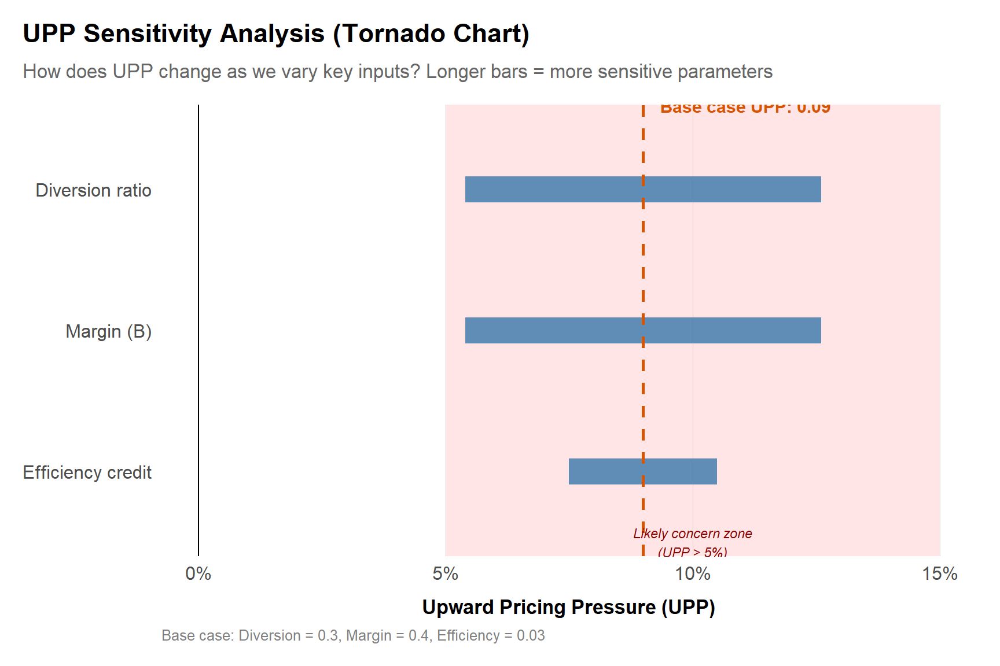
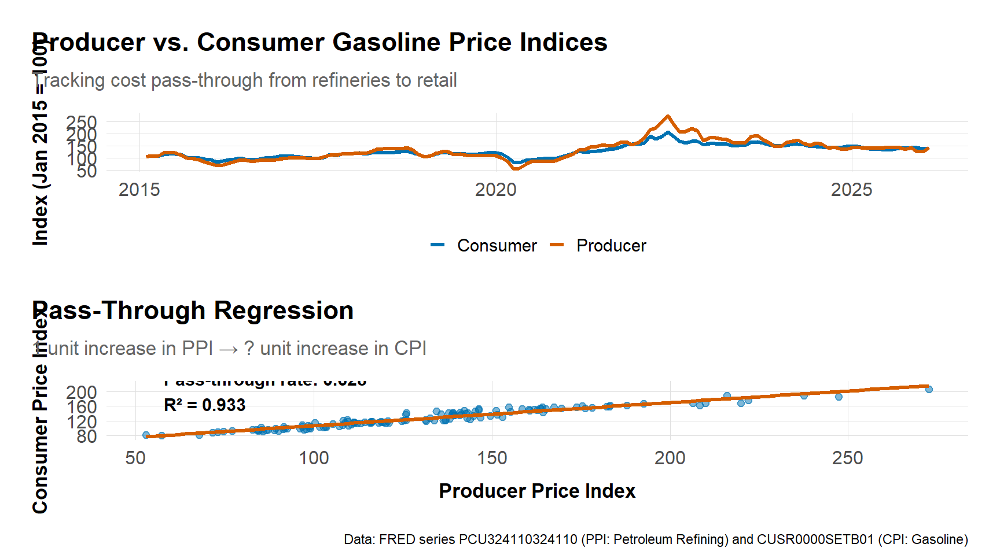

# Industrial Organization Toolkit {#sec-io-toolkit}

Having defined markets and laid out the causal toolkit, we turn to the machinery behind most quantitative antitrust work: the industrial organization (IO) toolkit. These methods model how firms compete, recover parameters like marginal cost and demand elasticity, and simulate the effect of a merger or a course of conduct before it happens.

Much of the rest of the book runs through this chapter. The demand models, cost estimates, and bargaining frameworks here feed the merger simulations in [Chapter 6](chapters/06-mergers.md), the foreclosure analysis in [Chapter 7](chapters/07-monopolization.md), and the platform work in [Chapter 9](chapters/09-digital-markets.md).

## Learning goals
This chapter bridges descriptive evidence and full-blown merger simulations. You will learn when to deploy lightweight demand or supply models, how to explain their assumptions to agencies and courts, and how to integrate qualitative evidence (contracts, governance documents, interviews) so the results feel grounded.

By the end you should be able to:

- Use IO models to link conduct to outcomes: demand estimation, cost modeling, bargaining, and equilibrium effects.
- Choose between structural and reduced-form evidence depending on data, timing, and tribunal expectations.
- Capture platform-specific dynamics (multi-homing, indirect network effects, parity clauses).
- Explain each model’s intuition, diagnostics, and jurisdictional track record.

## Core components

The components build on each other. Demand estimation feeds supply modeling, which informs bargaining analysis, which connects to the multi-sided dynamics of platform markets. Diagnostics cross-check each component against observable data. The list below outlines each one; the sections that follow develop them in detail.

1. **Demand estimation.** Start with logit/BLP-lite intuition (shares vs. prices and characteristics) (Nevo, 2000); (Berry, Levinsohn & Pakes, 1995). Add nested logit or random coefficients when differentiation is material, and report diversion matrices.  
2. **Supply modeling & pass-through.** Recover marginal costs via first-order conditions (FOCs) or reduced-form models, and estimate pass-through elasticities (see code below).  
3. **Bargaining frameworks.** Nash-in-Nash approximations for platform or healthcare negotiations. For theoretical foundations, see (Tirole, 1988) and (Motta, 2004).  
4. **Multi-sided interactions.** Incorporate indirect network effects, multi-homing rates, and platform policies (MFNs, parity clauses) as either covariates or structural parameters (Rochet & Tirole, 2003).  
5. **Diagnostics & validation.** Cross-check simulated price effects against historical shocks, third-party benchmarks (Ashenfelter & Hosken, 2010), or rival stock reactions.

## Structural vs. Reduced Form Approaches

Antitrust economics relies on two distinct methodological traditions. Knowing the difference, and when to use each, shapes the design of an expert report.

### The Contrast

*   **Structural Modeling (Simulation):**
    *   **Definition:** Estimates "deep parameters" (primitives like utility weights and marginal costs) that are assumed to remain stable even when the market changes. It imposes a specific theoretical framework (e.g., Bertrand-Nash competition with Logit demand) to link these parameters to outcomes.
    *   **Primary Use:** **Merger Simulation**. Because the post-merger world does not yet exist, we cannot measure it directly. We must *simulate* the new equilibrium by feeding the estimated parameters into a model of the merged firm.
    *   **Pros/Cons:** It is the only way to predict the future (prospective analysis), but the results are only as good as the model's assumptions (functional form, conduct).

*   **Reduced Form (Causal Inference):**
    *   **Definition:** Estimates the relationship between observable variables (e.g., price and a policy dummy) without recovering the underlying primitives or imposing a full model of competition. It focuses on identifying a causal effect from historical variation.
    *   **Primary Use:** **Retrospectives and Damages**. Used to answer "what happened?" (e.g., "Did the cartel raise prices?" or "Did the 2018 merger harm consumers?"). Common tools include Difference-in-Differences (DiD) and instrumental variables (IV) regressions.
    *   **Pros/Cons:** Relies on fewer assumptions about market conduct, but cannot typically predict the effect of a *new* policy or merger (the Lucas Critique).

### Complementarity in Practice
In modern practice, these approaches reinforce each other. You might use a **reduced-form** event study to show that a past merger in the same industry raised prices by 5%. You then calibrate a **structural** simulation model to reproduce that 5% increase. Once the model is "validated" by the historical data, you can confidently use it to predict the effects of the *current* merger.

| Criterion | Structural (Simulation) | Reduced-Form (Causal) |
|:----------|:------------------------|:---------------------|
| **Question** | "What will happen?" | "What did happen?" |
| **Data needs** | Prices, shares, characteristics | Treatment/control, panel |
| **Assumptions** | Equilibrium model, functional form | Parallel trends, exogeneity |
| **Output** | Predicted price changes | Estimated effects |
| **Robustness** | Sensitivity to model choice | Placebo tests, pre-trends |
| **Agency preference** | Mergers (prospective) | Retrospectives, damages |
| **Key packages** | `BLPestimatoR`, custom code | `fixest`, `did`, `synthdid` |


**Key IO Formulas**

| Formula | Definition | Use Case |
|:--------|:-----------|:---------|
| **UPP** = Diversion x Margin - Efficiency | Upward Pricing Pressure | Merger screening |
| **GUPPI** = Diversion x Margin | Gross UPP (no efficiencies) | Agency benchmarks |
| **Lerner Index** = (P - MC) / P | Price-cost margin | Market power proxy |
| **Pass-through** = dP/dC | Price response to cost | Damages, EDM |
| **Critical Loss** = SSNIP / (SSNIP + Margin) | Break-even loss for SSNIP | Market definition |
| **HHI** = Sum of squared shares | Concentration index | Structural presumption |
| **Delta HHI** = 2 x Share1 x Share2 | Merger-induced HHI change | Screening threshold |



**Method box**

**UPP/GUPPI.** Use diversion ratios and margins to compute Upward Pricing Pressure (UPP) or Gross Upward Pricing Pressure Index (GUPPI). See Farrell & Shapiro (2010) "Antitrust Evaluation of Horizontal Mergers: An Economic Alternative to Market Definition" for the theoretical foundation.  
**Pass-through regressions.** Run `feols(price ~ cost_shifter | product + time)` with clustered standard errors to get empirical pass-through before turning to structural models.  
**Simulation scaffolds.** When time is short, build a logit demand system with constant marginal costs to approximate unilateral effects, then refine later.


Structural models are only as credible as the institutional knowledge embedded in their assumptions. Contracts, governance documents, and field interviews inform the modeling choices that drive simulation results. A pass-through estimate that ignores contractual price adjustment clauses, or a demand model that overlooks loyalty programs, will produce numbers that feel precise but rest on sand. The qualitative evidence below is a prerequisite for using the quantitative toolkit well, not a supplement to it.


**Qualitative evidence**

**Contracts & governance.** MFNs, parity clauses, data-sharing obligations, and service-level agreements indicate how flexible margins are; tie them to modeling assumptions.
**Design choices.** Product defaults, API throttling, or app-store ranking algorithms signal platform steering and inform multi-sided parameters.
**Field interviews.** Operations or procurement leads can explain capacity constraints, switching costs, or negotiation cycles—use these insights to set priors for bargaining power or cost recovery.



**Jurisdictional comparison: IO tools in practice**

The US and EU differ in how they deploy IO tools. US agencies have embraced UPP/GUPPI as merger screens since the 2010 Horizontal Merger Guidelines (DOJ/FTC Horizontal Merger Guidelines, 2010), sometimes bypassing formal market definition entirely. The European Commission's guidelines (EC Horizontal Merger Guidelines, 2004) place greater emphasis on market shares and HHI thresholds but increasingly use simulation models in Phase II investigations. On platform regulation, the EU has moved further with the Digital Markets Act, which imposes per se obligations on "gatekeepers" regarding MFNs and parity clauses---a structural intervention that contrasts with the US preference for case-by-case analysis under the rule of reason. The multi-sided market framework of (Rochet & Tirole, 2003) informs both jurisdictions, but its practical weight varies: EU decisions in cases like Google Shopping relied heavily on platform theory, while US courts have been slower to adopt it outside of payment-card litigation (*Ohio v. American Express*, 2018).


## Demand skeleton: simple logit example

The workhorse of structural demand estimation in antitrust is the logit model. The idea is straightforward: consumers choose among differentiated products (and an outside option of not buying), and their choices depend on price, product characteristics, and an unobserved quality term. The logit assumption yields a convenient linear estimating equation:

$$\ln(s_j) - \ln(s_0) = \alpha \, p_j + \mathbf{x}_j' \boldsymbol{\beta} + \xi_j$$

where $s_j$ is the market share of product $j$, $s_0$ is the outside-good share, $p_j$ is price, $\mathbf{x}_j$ is a vector of observed characteristics, and $\xi_j$ captures unobserved product quality. The coefficient $\alpha$ (expected to be negative) governs price sensitivity, while $\boldsymbol{\beta}$ captures how characteristics shift utility.

The example below uses a cross-section of breakfast cereal brands, the setting of (Nevo, 2001), to illustrate the mechanics. With 10 inside goods and two predictors, we have adequate degrees of freedom.

```r
library(tidyverse)
source("program/R/helpers.R")

# Breakfast cereal market: 10 brands with varying prices, shares, and nutrition
products <- tribble(
  ~product,               ~price, ~share, ~feature_score,
  "Cheerios",              3.49,  0.090,  0.80,
  "Frosted Flakes",        3.29,  0.075,  0.45,
  "Honey Nut Cheerios",    3.59,  0.085,  0.70,
  "Raisin Bran",           3.79,  0.050,  0.75,
  "Froot Loops",           3.19,  0.060,  0.30,
  "Special K",             4.09,  0.040,  0.85,
  "Cinnamon Toast Crunch", 3.39,  0.070,  0.50,
  "Grape-Nuts",            4.29,  0.025,  0.90,
  "Lucky Charms",          3.49,  0.055,  0.35,
  "Life",                  3.69,  0.035,  0.65,
  "Outside",               0.00,  0.415,  0.00
)

logit_data <- products |>
  mutate(
    share_ratio = share / share[product == "Outside"],
    logit_dep = log(share_ratio)
  ) |>
  filter(product != "Outside")

logit_model <- lm(logit_dep ~ price + feature_score, data = logit_data)
summary(logit_model)
```

A few things to note about the output. First, the price coefficient should be negative: higher prices reduce the log share ratio, which translates into lower predicted market shares. Second, the feature score (here a nutrition index) should carry a positive coefficient if consumers value healthier cereals. Third, even with a well-specified model, this single-market cross-section cannot address the endogeneity of price---brands with higher unobserved quality ($\xi_j$) command both higher shares *and* higher prices, biasing $\hat{\alpha}$ toward zero.

In practice, analysts address endogeneity by instrumenting for price with cost shifters (input prices, distance to manufacturing plants) or BLP-style instruments based on the characteristics of rival products. With panel data across markets and time, one can also include product and market fixed effects. The basic logit is a starting point; nested logit or random-coefficients (BLP) models relax the restrictive substitution patterns implied by the Independence of Irrelevant Alternatives (IIA) property.

## UPP/GUPPI calculation and sensitivity analysis

Upward Pricing Pressure (UPP) is a quick screen to assess whether a merger creates incentives to raise prices. It combines diversion ratios (where do customers go?) and margins (how profitable are those diverted sales?). High UPP suggests competitive concerns; low or negative UPP (when efficiencies exceed pricing pressure) suggests the merger may be benign.

### Basic UPP calculation

### UPP/GUPPI sensitivity tornado chart
A tornado chart shows how UPP changes as we vary key inputs (diversion, margin, efficiencies) one at a time. This helps communicate uncertainty and identify which parameters matter most for the competitive assessment.

```r
library(dplyr)
library(ggplot2)
library(tidyr)

# Base case parameters (Product A -> Product B merger)
base_diversion <- 0.30
base_margin <- 0.40
base_efficiency <- 0.03

base_upp <- (base_diversion * base_margin) - base_efficiency

# Sensitivity ranges: vary each parameter ±30% while holding others constant
sensitivity <- tibble::tribble(
  ~parameter,            ~low_value, ~high_value,
  "Diversion ratio",     base_diversion * 0.7,  base_diversion * 1.3,
  "Margin (B)",          base_margin * 0.7,     base_margin * 1.3,
  "Efficiency credit",   base_efficiency * 0.5, base_efficiency * 1.5
) |>
  rowwise() |>
  mutate(
    upp_low = case_when(
      parameter == "Diversion ratio" ~ (low_value * base_margin) - base_efficiency,
      parameter == "Margin (B)" ~ (base_diversion * low_value) - base_efficiency,
      parameter == "Efficiency credit" ~ (base_diversion * base_margin) - low_value,
      TRUE ~ NA_real_
    ),
    upp_high = case_when(
      parameter == "Diversion ratio" ~ (high_value * base_margin) - base_efficiency,
      parameter == "Margin (B)" ~ (base_diversion * high_value) - base_efficiency,
      parameter == "Efficiency credit" ~ (base_diversion * base_margin) - high_value,
      TRUE ~ NA_real_
    ),
    range = abs(upp_high - upp_low)
  ) |>
  ungroup() |>
  arrange(desc(range))

# Create ordered factor for tornado plot
sensitivity <- sensitivity |>
  mutate(parameter = factor(parameter, levels = rev(parameter)))

# Tornado chart
ggplot(sensitivity) +
  geom_segment(aes(x = upp_low, xend = upp_high,
                   y = parameter, yend = parameter),
               linewidth = 8, color = "#0072B2", alpha = 0.7) +
  geom_vline(xintercept = base_upp, linetype = "dashed",
             color = "#D55E00", linewidth = 1) +
  geom_vline(xintercept = 0, linetype = "solid",
             color = "black", linewidth = 0.5) +
  annotate("text", x = base_upp, y = 3.5,
           label = paste0("Base case UPP: ", round(base_upp, 3)),
           hjust = -0.1, vjust = -0.5, size = 4, fontface = "bold", color = "#D55E00") +
  annotate("rect", xmin = 0.05, xmax = 0.15, ymin = -Inf, ymax = Inf,
           fill = "red", alpha = 0.1) +
  annotate("text", x = 0.10, y = 0.5,
           label = "Likely concern zone\n(UPP > 5%)",
           size = 3, color = "darkred", fontface = "italic") +
  scale_x_continuous(labels = scales::percent_format(),
                     breaks = seq(-0.05, 0.20, by = 0.05)) +
  labs(
    title = "UPP Sensitivity Analysis (Tornado Chart)",
    subtitle = "How does UPP change as we vary key inputs? Longer bars = more sensitive parameters",
    x = "Upward Pricing Pressure (UPP)",
    y = NULL,
    caption = paste0("Base case: Diversion = ", round(base_diversion, 2),
                    ", Margin = ", round(base_margin, 2),
                    ", Efficiency = ", round(base_efficiency, 2))
  ) +
  theme_antitrust() +
  theme(
    plot.title.position = "plot",
    panel.grid.major.y = element_blank()
  )

# Summary table
cat("\nSensitivity analysis summary:\n")
sensitivity |>
  mutate(
    across(c(low_value, high_value, upp_low, upp_high),
           ~round(., 4)),
    range = round(range, 4),
    impact = case_when(
      range > 0.04 ~ "HIGH impact on UPP",
      range > 0.02 ~ "MODERATE impact",
      TRUE ~ "LOW impact"
    )
  ) |>
  select(parameter, low_value, high_value, upp_low, upp_high, range, impact) |>
  print(n = Inf)
```



**How to use this chart:**
- **Longest bars** = most sensitive parameters. Focus data collection and robustness checks on these.
- **Base case** (dashed orange line): Your central UPP estimate.
- **Zero line**: UPP < 0 suggests efficiencies outweigh pricing pressure.
- **Concern threshold** (shaded region): Many agencies use 5% as a rule of thumb; higher UPP warrants closer scrutiny.

**Practical insights:**
- If **diversion** creates the widest swing, invest in better switching data (surveys, natural experiments, loyalty panels).
- If **margin** is most sensitive, request detailed cost accounting or validate with third-party benchmarks.
- If **efficiencies** have large impact, document synergy claims rigorously (pre/post integration plans, expert affidavits).

**GUPPI variant:** To calculate GUPPI instead of UPP, simply omit the efficiency credit: `GUPPI = diversion × margin`. Some agencies prefer GUPPI because it isolates the gross pricing pressure before offsetting efficiencies.

Tie the efficiency term to documented synergies or cost savings (procurement economies, network effects, R&D cost sharing). For cross-border mergers, adjust for currency and local cost differences.


**Case box: UPP analysis in AT&T/T-Mobile (2011)**

The DOJ's 2011 challenge to AT&T's proposed $39 billion acquisition of T-Mobile provides a landmark application of UPP/GUPPI analysis in merger review. The complaint alleged that T-Mobile was a particularly disruptive competitor---its aggressive pricing and unlimited data plans constrained the pricing of AT&T and Verizon. Internal documents showed high diversion between AT&T and T-Mobile: when customers left one carrier, a substantial fraction switched to the other. Combined with wireless margins of 40--55%, GUPPI estimates implied significant upward pricing pressure. The DOJ's economic analysis also estimated diversion ratios at the local market level, since wireless competition varies by geography. AT&T argued that network efficiencies and spectrum synergies would offset pricing pressure, but the claimed efficiencies were not merger-specific (AT&T could expand capacity independently). The merger was abandoned after the DOJ filed suit. The case cemented UPP as a practical screening tool and demonstrated how diversion-based analysis could substitute for formal market definition in differentiated-product mergers (Farrell & Shapiro, 2010).



**Running example: Airline demand and UPP**

Airline demand is typically estimated using a **nested logit** model, with nests defined by airport (e.g., all flights from DCA in one nest, all flights from IAD in another) or by service type (nonstop vs. connecting). The nesting structure relaxes the IIA assumption of the plain logit: passengers choosing among nonstop options at the same airport substitute more readily with each other than with connecting flights from a different airport. This matters because the diversion ratios that drive UPP depend on the substitution pattern.

For the American Airlines/US Airways merger (2013), consider a route like DCA--LGA where both carriers offered nonstop service. Using plausible parameters from the airline literature---diversion ratios of 0.25--0.35 between the merging carriers (reflecting their large combined slot holdings at DCA) and operating margins of 10--15% (typical for legacy carriers on competitive routes)---we can compute a rough GUPPI:

$$
\text{GUPPI}_{AA \to US} = D_{AA \to US} \times M_{US} \approx 0.30 \times 0.12 = 3.6\%
$$

A 3.6% GUPPI is below the 5% rule-of-thumb threshold, but this is sensitive to input assumptions. If diversion is at the high end (0.35, reflecting limited alternatives at slot-constrained DCA) and margins are 15%, GUPPI rises to 5.3%---crossing into the concern zone. The tornado chart above shows exactly this kind of sensitivity. In practice, different data sources yield different diversion estimates: DOT booking data captures actual itineraries, frequent-flyer program data reveals loyalty-driven switching, and customer surveys measure stated preferences. The DOJ's economic experts would have triangulated across these sources, weighting each by reliability. The market definitions from [Chapter 3](chapters/03-market-definition.md) determine which routes to screen, and the simulation framework in [Chapter 6](chapters/06-mergers.md) translates these UPP estimates into predicted price effects.


## Visualizations

### Pass-through diagnostic using public price indices
Pass-through analysis estimates how much of a cost change flows through to consumer prices. It matters for cartel damages (upstream overcharge → downstream harm), merger analysis (will cost savings benefit consumers?), and vertical restraints. This example uses real FRED data for gasoline prices.



**Interpretation:**
- **Pass-through coefficient**: Measures how much a 1% increase in producer prices flows through to consumer prices. Values < 1 indicate incomplete pass-through (firms absorb some cost increases); values > 1 indicate over-shifting (firms amplify cost increases, possibly due to market power).
- **R-squared**: Indicates how well producer prices explain consumer price variation. High R² suggests tight cost-price linkage.
- **Incomplete pass-through**: Common in competitive markets where firms absorb cost shocks to retain customers. Can also occur with sticky prices or menu costs.
- **Over-shifting**: May signal market power (firms use cost increases as "focal points" to raise prices beyond the cost change) or complementarities/network effects.

**Applications in antitrust:**
- **Cartel damages**: If pass-through is 80%, a $10 upstream overcharge causes an $8 downstream price increase.
- **Merger efficiencies**: If parties claim $5M in cost savings but pass-through is only 30%, consumers benefit by only $1.5M.
- **Vertical mergers**: Estimate pass-through separately for upstream and downstream stages to predict EDM (Elimination of Double Marginalization) benefits.

Swap series IDs for your industry (e.g., `WPUSI012011` for steel PPI, `CPIAUCSL` for overall CPI) or use firm-specific cost and price data when available.

## Bargaining frameworks {#sec-bargaining}

Pass-through analysis assumes price-taking behavior downstream: firms receive a cost shock and adjust prices mechanically. But many antitrust-relevant markets---hospital-insurer negotiations, platform-merchant relationships, content licensing, pharmaceutical PBM negotiations---do not feature posted prices at all. Instead, prices emerge from bilateral bargaining where both sides have leverage. The pass-through coefficient tells you how costs flow through a supply chain; it says nothing about how those costs were determined in the first place, or how a merger might shift the balance of power at the negotiating table. Standard Bertrand or Cournot models, which assume firms unilaterally set prices or quantities, miss the underlying economics. Bargaining models fill that gap.

### The Nash-in-Nash framework

The dominant framework in merger analysis involving negotiated prices is the **Nash-in-Nash** model (Horn Wolinsky, 1988). The setup is as follows. Each upstream firm (e.g., a hospital) and each downstream firm (e.g., an insurer) simultaneously engage in bilateral Nash bargaining over their contract terms. The negotiated price between any pair reflects their relative **bargaining leverage**, which in turn depends on each side's **disagreement payoff**---the profit each party would earn if negotiations break down and the pair fails to reach a deal.

The Nash bargaining solution for a pair $(i, j)$ maximizes the Nash product:

$$p_{ij}^* = \arg\max_{p} \left( \pi_i^{\text{agree}} - \pi_i^{\text{disagree}} \right)^{b} \left( \pi_j^{\text{agree}} - \pi_j^{\text{disagree}} \right)^{1-b}$$

where $b \in [0,1]$ is the bargaining parameter capturing upstream firm $i$'s relative leverage, and the $\pi$ terms are the profits from agreement versus disagreement. The solution yields a negotiated price that splits the **gains from trade** (the surplus created by reaching a deal) according to each side's bargaining weight.

### Why disagreement payoffs matter for mergers

The competitive significance of a merger in a bargaining context comes through its effect on disagreement payoffs. Consider a hospital merger. Before the merger, if Hospital A fails to reach a deal with Insurer X, the insurer can still offer its enrollees access to Hospital B. After the merger, a breakdown in negotiations means the insurer loses access to *both* hospitals, making disagreement far more costly for the insurer. This shift in the disagreement payoff tilts bargaining leverage toward the merged hospital system, resulting in higher negotiated prices---even if no beds close and no services change.

The key insight is that **outside options drive bargaining power**. A party's leverage depends on how attractive its next-best alternative is:

- A hospital system with unique specialists or high patient loyalty has strong outside options (patients will switch insurers to keep access).
- An insurer with a large enrollee base has leverage because hospitals cannot afford to lose the volume.
- A content provider with "must-have" programming (e.g., live sports) has bargaining power that a niche channel does not.

### Empirical approaches

In practice, analysts implement bargaining models at two levels of complexity:

- **Full structural estimation.** Estimate demand (e.g., a model of insurer/plan choice and hospital choice), recover disagreement payoffs by simulating what happens when each pair is removed from the network, and solve for Nash bargaining prices. This is the approach used in hospital merger cases and formalized by (Gowrisankaran Nevo Town, 2015).
- **Reduced-form proxies.** When data or time constraints preclude full structural estimation, analysts use regression-based approaches. For instance, one can estimate how much of a wholesale cost shock flows into downstream prices for different bargaining parties, or use the *willingness-to-pay* (WTP) framework that measures how much an insurer's enrollees value having a particular hospital in-network.

Qualitative evidence strengthens either approach. Negotiation timelines, renewal clauses, concession histories, and internal strategy documents ("we need Hospital X or we lose the state employee contract") all inform the modeling assumptions and help validate quantitative results.

### A worked Nash-in-Nash example

To see how Nash-in-Nash works in practice, consider a simplified hospital-insurer negotiation. Two hospital systems---Hospital A (larger, with 60% of local admissions) and Hospital B (smaller, 40%)---negotiate reimbursement rates with a single insurer that covers 100,000 local enrollees. The insurer's plan is worth $5,000 per enrollee per year if both hospitals are in-network. If Hospital A is excluded, the plan loses $800 per enrollee (patients must travel farther or switch to lower-quality providers). If Hospital B is excluded, the loss is only $200 per enrollee.

The gains from trade for each pair are:

| Pair | Insurer's gain from agreement | Hospital's gain from agreement | Nash product |
|------|------|------|------|
| A--Insurer | $800 × 100,000 = $80M | Reimbursement rate × volume | High (A is "must-have") |
| B--Insurer | $200 × 100,000 = $20M | Reimbursement rate × volume | Lower (B is substitutable) |

Now suppose Hospitals A and B merge. The insurer's disagreement payoff if it fails to reach a deal with the *merged* system is the loss of *both* hospitals---say, $1,200 per enrollee, or $120M total. This is more than the sum of the individual disagreement payoffs ($80M + $20M = $100M) because the hospitals together form a "must-have" network that neither is alone. The merged system's bargaining leverage increases, and the Nash bargaining solution yields higher negotiated prices for both hospitals---even though no beds closed and no services changed.

This is the mechanism that drives price increases in hospital mergers. The effect is largest when the merging parties are each other's closest substitutes from the insurer's perspective---precisely the condition that also drives unilateral effects in standard merger analysis. The bargaining framework makes this intuition precise by quantifying how the merger changes disagreement payoffs.

```r
library(dplyr)
library(ggplot2)
source("program/R/helpers.R")

# Simplified Nash-in-Nash: hospital-insurer bargaining
# Pre-merger: each hospital bargains separately
# Post-merger: combined entity bargains as one

bargaining <- tibble::tribble(
  ~scenario, ~hospital, ~wtp_loss_per_enrollee, ~enrollees, ~bargaining_weight,
  "Pre-merger", "Hospital A", 800, 100000, 0.6,
  "Pre-merger", "Hospital B", 200, 100000, 0.3,
  "Post-merger", "Merged A+B", 1200, 100000, 0.8
) |>
  mutate(
    total_wtp_loss = wtp_loss_per_enrollee * enrollees,
    # Nash bargaining price: split gains from trade by bargaining weight
    # Price = (bargaining_weight * total_WTP_loss) / volume
    # Assuming 10,000 admissions per hospital
    admissions = if_else(hospital == "Merged A+B", 20000, 10000),
    negotiated_rate = (bargaining_weight * total_wtp_loss) / admissions
  )

# Bar chart of negotiated rates
ggplot(bargaining, aes(x = hospital, y = negotiated_rate, fill = scenario)) +
  geom_col(width = 0.6, alpha = 0.85) +
  scale_fill_manual(values = c("Pre-merger" = "#0072B2", "Post-merger" = "#D55E00")) +
  scale_y_continuous(labels = scales::dollar) +
  labs(
    title = "Nash-in-Nash: Hospital Merger Increases Negotiated Rates",
    subtitle = "Merged entity's improved outside option raises prices for both hospitals",
    x = NULL, y = "Negotiated Reimbursement Rate per Admission", fill = NULL,
    caption = "Illustrative calculation. WTP loss = value to insurer of having hospital in-network.\nBargaining weight reflects relative leverage in Nash bargaining solution."
  ) +
  theme_antitrust() +
  theme(legend.position = "bottom")

cat("\nPrice increase from merger:\n")
pre_avg <- bargaining |> filter(scenario == "Pre-merger") |> summarise(avg = mean(negotiated_rate)) |> pull(avg)
post <- bargaining |> filter(scenario == "Post-merger") |> pull(negotiated_rate)
cat(paste0("Pre-merger average: ", scales::dollar(pre_avg, accuracy = 1), "\n"))
cat(paste0("Post-merger: ", scales::dollar(post, accuracy = 1), "\n"))
cat(paste0("Increase: ", scales::percent((post - pre_avg) / pre_avg, accuracy = 0.1), "\n"))
```

### Antitrust applications

Bargaining models have become standard tools in several contexts:

- **Hospital mergers.** Since the FTC's successful challenge of *Advocate Health Care / NorthShore University HealthSystem* (2017) and its use of WTP-based analysis, bargaining models have been central to hospital merger review. The 2023 Merger Guidelines explicitly recognize bargaining leverage as a theory of harm.
- **Media and content licensing.** Disputes between cable distributors and content providers (e.g., blackout threats during carriage negotiations) are naturally modeled as bilateral bargaining problems.
- **Pharmaceutical negotiations.** PBM-manufacturer negotiations over formulary placement and rebates involve bargaining dynamics that standard posted-price models cannot capture.
- **Digital platforms.** App store commission disputes (e.g., Epic v. Apple) and news publisher negotiations with platforms involve bargaining over revenue shares where outside options are asymmetric.

## Exercises

1. **Data/code.** Using the logit demand skeleton in this chapter, add a fourth product ("D") with price=$8, share=0.10, and feature_score=0.3. Re-estimate the model and compute the full 4x4 diversion matrix. How does adding a budget product change the diversion ratios for the existing products?

2. **Conceptual.** Explain the difference between UPP and GUPPI. When would you present one vs. the other to an agency? What are the advantages of each for communicating merger effects to non-economists?

3. **Data/code.** The pass-through regression uses gasoline PPI and CPI data. Replace the series IDs with steel PPI (`WPUSI012011`) and overall CPI (`CPIAUCSL`). Run the pass-through regression and compare the coefficient to the gasoline result. What might explain any differences?

4. **Conceptual.** A structural merger simulation predicts a 3% price increase, but a retrospective DiD study of a similar past merger found a 7% increase. How would you reconcile these findings? What does each method's assumptions imply about the source of the discrepancy?

5. **Case discussion.** Describe how you would adapt the UPP/GUPPI tornado chart for a presentation to a non-technical audience (e.g., a judge or commission panel). Which parameters would you emphasize and why?

### Data exercise (checkable)

In a logit demand model, products A and B have market shares s_A = 0.20 and s_B = 0.30 (the remainder is the outside good and other products).

a. Compute the diversion ratio from A to B.
b. Interpret it.


**Worked answer**

a. Logit diversion D(A->B) = s_B / (1 - s_A) = 0.30 / (1 - 0.20) = 0.30 / 0.80 = **0.375**.
b. If A raises price and loses sales, **37.5% of the lost volume goes to B**. High diversion to a merging partner is what drives unilateral-effects (UPP/GUPPI) concerns.


## Looking ahead
The demand estimates, diversion matrices, and pass-through diagnostics introduced here form the quantitative backbone of the chapters ahead. In **[Chapter 5](chapters/05-cartels.md)**, we apply variance screens and structural break tests to detect collusion, while in **[Chapter 6](chapters/06-mergers.md)** we feed these IO primitives directly into merger simulations. The same bargaining and pass-through tools reappear in **[Chapter 7](chapters/07-monopolization.md)** and **[Chapter 9](chapters/09-digital-markets.md)**, where multi-sided platform dynamics add further complexity.
