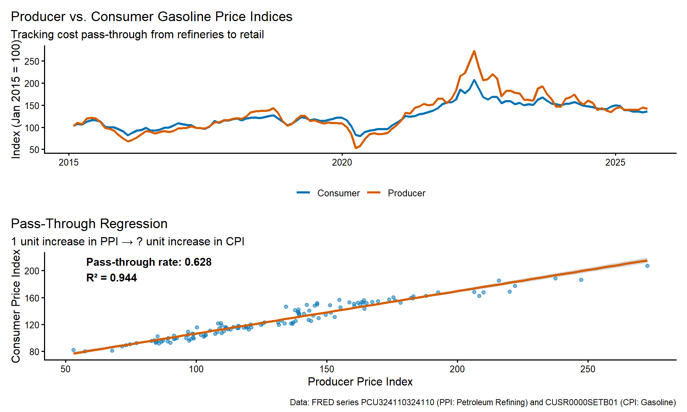

# Industrial Organization Toolkit

## Learning goals
This chapter bridges descriptive evidence and full-blown merger simulations. You will learn when to deploy lightweight demand or supply models, how to explain their assumptions to agencies and courts, and how to integrate qualitative evidence (contracts, governance documents, interviews) so the results feel grounded.

By the end you should be able to:

- Use IO models to link conduct to outcomes: demand estimation, cost modeling, bargaining, and equilibrium effects.
- Choose between structural and reduced-form evidence depending on data, timing, and tribunal expectations.
- Capture platform-specific dynamics (multi-homing, indirect network effects, parity clauses).
- Explain each model’s intuition, diagnostics, and jurisdictional track record.

## Core components
1. **Demand estimation.** Start with logit/BLP-lite intuition (shares vs. prices and characteristics) (Nevo, 2000; Berry, Levinsohn, and Pakes, 1995). Add nested logit or random coefficients when differentiation is material, and report diversion matrices.
2. **Supply modeling & pass-through.** Recover marginal costs via first-order conditions (FOCs) or reduced-form models, and estimate pass-through elasticities (see code below).
3. **Bargaining frameworks.** Nash-in-Nash approximations for platform or healthcare negotiations. For theoretical foundations, see Tirole (1988) and Motta (2004).
4. **Multi-sided interactions.** Incorporate indirect network effects, multi-homing rates, and platform policies (MFNs, parity clauses) as either covariates or structural parameters (Rochet and Tirole, 2003).
5. **Diagnostics & validation.** Cross-check simulated price effects against historical shocks, third-party benchmarks (Ashenfelter and Hosken, 2010), or rival stock reactions.

## Structural vs. Reduced Form Approaches

Antitrust economics relies on two distinct methodological traditions. Understanding the difference—and knowing when to use each—is critical for designing an effective expert report.

### The Contrast

*   **Structural Modeling (Simulation):**
    *   **Definition:** Estimates "deep parameters" (primitives like utility weights and marginal costs) that are assumed to remain stable even when the market changes. It imposes a specific theoretical framework (e.g., Bertrand-Nash competition with Logit demand) to link these parameters to outcomes.
    *   **Primary Use:** **Merger Simulation**. Because the post-merger world does not yet exist, we cannot measure it directly. We must *simulate* the new equilibrium by feeding the estimated parameters into a model of the merged firm.
    *   **Pros/Cons:** It is the only way to predict the future (prospective analysis), but the results are only as good as the model's assumptions (functional form, conduct).

*   **Reduced Form (Causal Inference):**
    *   **Definition:** Estimates the relationship between observable variables (e.g., price and a policy dummy) without recovering the underlying primitives or imposing a full model of competition. It focuses on identifying a causal effect from historical variation.
    *   **Primary Use:** **Retrospectives and Damages**. Used to answer "what happened?" (e.g., "Did the cartel raise prices?" or "Did the 2018 merger harm consumers?"). Common tools include Difference-in-Differences (DiD) and instrumental variables (IV) regressions.
    *   **Pros/Cons:** Relies on fewer assumptions about market conduct, but cannot typically predict the effect of a *new* policy or merger (the Lucas Critique).

### Complementarity in Practice
In modern practice, these approaches reinforce each other. You might use a **reduced-form** event study to show that a past merger in the same industry raised prices by 5%. You then calibrate a **structural** simulation model to reproduce that 5% increase. Once the model is "validated" by the historical data, you can confidently use it to predict the effects of the *current* merger.


**Method box**

**UPP/GUPPI.** Use diversion ratios and margins to compute Upward Pricing Pressure (UPP) or Gross Upward Pricing Pressure Index (GUPPI). See Farrell & Shapiro (2010) "Antitrust Evaluation of Horizontal Mergers: An Economic Alternative to Market Definition" for the theoretical foundation.  
**Pass-through regressions.** Run `feols(price ~ cost_shifter | product + time)` with clustered standard errors to get empirical pass-through before turning to structural models.  
**Simulation scaffolds.** When time is short, build a logit demand system with constant marginal costs to approximate unilateral effects, then refine later.



**Qualitative evidence**

**Contracts & governance.** MFNs, parity clauses, data-sharing obligations, and service-level agreements indicate how flexible margins are; tie them to modeling assumptions.  
**Design choices.** Product defaults, API throttling, or app-store ranking algorithms signal platform steering and inform multi-sided parameters.  
**Field interviews.** Operations or procurement leads can explain capacity constraints, switching costs, or negotiation cycles—use these insights to set priors for bargaining power or cost recovery.



**Citations and comparative note**

- Cite foundational IO models and their antitrust applications (e.g., diversion/UPP notes in merger guidelines: DOJ/FTC (2010), EC (2004)).
- Note jurisdictional differences in treatment of MFNs/parity clauses (e.g., EU/UK platform cases vs. US approach).
- Attribute platform multi-sided modeling references (e.g., Rochet-Tirole style papers) and cite any A/B evidence or agency decisions when used.


## Demand skeleton: simple logit example
```r
library(tidyverse)
source("../program/R/helpers.R")

products <- tribble(
  ~product, ~price, ~share, ~feature_score,
  "A", 12, 0.25, 0.6,
  "B", 10, 0.20, 0.5,
  "C", 9,  0.15, 0.4,
  "Outside", 0, 0.40, 0
)

logit_data <- products |>
  mutate(
    share_ratio = share / share[product == "Outside"],
    logit_dep = log(share_ratio)
  ) |>
  filter(product != "Outside")

logit_model <- lm(logit_dep ~ price + feature_score, data = logit_data)
coef(logit_model)
```
Document instruments (cost shifters) if price endogeneity is a concern. Expand to nested logit or BLP as needed.

## UPP/GUPPI calculation and sensitivity analysis

Upward Pricing Pressure (UPP) is a quick screen to assess whether a merger creates incentives to raise prices. It combines diversion ratios (where do customers go?) and margins (how profitable are those diverted sales?). High UPP suggests competitive concerns; low or negative UPP (when efficiencies exceed pricing pressure) suggests the merger may be benign.

### Basic UPP calculation
```r
library(dplyr)
library(ggplot2)

upp <- function(diversion, margin, efficiency = 0) {
  (diversion * margin) - efficiency
}

upp_results <- tibble::tribble(
  ~pair, ~diversion, ~margin, ~efficiency,
  "Product A -> B", 0.35, 0.45, 0.05,
  "Product B -> A", 0.28, 0.40, 0.02
) |>
  mutate(
    upp = upp(diversion, margin, efficiency),
    guppi = diversion * margin,  # Gross UPP (before efficiencies)
    interpretation = case_when(
      upp > 0.10 ~ "High pricing pressure",
      upp > 0.05 ~ "Moderate pricing pressure",
      upp > 0 ~ "Low pricing pressure",
      TRUE ~ "No pricing pressure (efficiencies dominate)"
    )
  )

upp_results
```

### UPP/GUPPI sensitivity tornado chart
A tornado chart shows how UPP changes as we vary key inputs (diversion, margin, efficiencies) one at a time. This helps communicate uncertainty and identify which parameters matter most for the competitive assessment.


*Longer bars = more sensitive parameters. Focus data collection and robustness checks on these.*

**How to use this chart:**
- **Longest bars** = most sensitive parameters. Focus data collection and robustness checks on these.
- **Base case** (dashed orange line): Your central UPP estimate.
- **Zero line**: UPP < 0 suggests efficiencies outweigh pricing pressure.
- **Concern threshold** (shaded region): Many agencies use 5% as a rule of thumb; higher UPP warrants closer scrutiny.

**Practical insights:**
- If **diversion** creates the widest swing, invest in better switching data (surveys, natural experiments, loyalty panels).
- If **margin** is most sensitive, request detailed cost accounting or validate with third-party benchmarks.
- If **efficiencies** have large impact, document synergy claims rigorously (pre/post integration plans, expert affidavits).

**GUPPI variant:** To calculate GUPPI instead of UPP, simply omit the efficiency credit: `GUPPI = diversion × margin`. Some agencies prefer GUPPI because it isolates the gross pricing pressure before offsetting efficiencies.

Tie the efficiency term to documented synergies or cost savings (procurement economies, network effects, R&D cost sharing). For cross-border mergers, adjust for currency and local cost differences.

## Visualizations

### Pass-through diagnostic using public price indices
Pass-through analysis estimates how much of a cost change flows through to consumer prices. This is critical for cartel damages (upstream overcharge → downstream harm), merger analysis (will cost savings benefit consumers?), and vertical restraints. This example uses real FRED data for gasoline prices.



*Data: FRED series PCU324110324110 (PPI: Petroleum Refining) and CUSR0000SETB01 (CPI: Gasoline).*

**Interpretation:**
- **Pass-through coefficient**: Measures how much a 1% increase in producer prices flows through to consumer prices. Values < 1 indicate incomplete pass-through (firms absorb some cost increases); values > 1 indicate over-shifting (firms amplify cost increases, possibly due to market power).
- **R-squared**: Indicates how well producer prices explain consumer price variation. High R² suggests tight cost-price linkage.
- **Incomplete pass-through**: Common in competitive markets where firms absorb cost shocks to retain customers. Can also occur with sticky prices or menu costs.
- **Over-shifting**: May signal market power (firms use cost increases as "focal points" to raise prices beyond the cost change) or complementarities/network effects.

**Applications in antitrust:**
- **Cartel damages**: If pass-through is 80%, a $10 upstream overcharge causes an $8 downstream price increase.
- **Merger efficiencies**: If parties claim $5M in cost savings but pass-through is only 30%, consumers benefit by only $1.5M.
- **Vertical mergers**: Estimate pass-through separately for upstream and downstream stages to predict EDM (Elimination of Double Marginalization) benefits.

Swap series IDs for your industry (e.g., `WPUSI012011` for steel PPI, `CPIAUCSL` for overall CPI) or use firm-specific cost and price data when available.

## Bargaining sketches
When platforms or healthcare networks negotiate contracts, full structural models may be infeasible. Use Nash-in-Nash approximations or reduced-form proxies:

- **Regression-based bargaining shares.** Estimate how much of a wholesale cost shock flows into downstream prices for different bargaining parties (e.g., pharmacy benefit managers vs. hospitals).  
- **Qualitative overlays.** Pair negotiation timelines, renewal clauses, and concession histories with the empirical results.

## Looking ahead
Store demand estimates, diversion matrices, and pass-through/bargaining diagnostics in `data/derived` with READMEs so the mergers and monopolization chapters can drop them into simulations. Before moving to Chapter 05 (Cartels), note which datasets or code paths (e.g., `io-logit`, `upp-gup` templates) should be generalized in `chapters/13-empirical-appendix.qmd`. Update the visualization tracker if you add new figures so the team can coordinate future enhancements.
