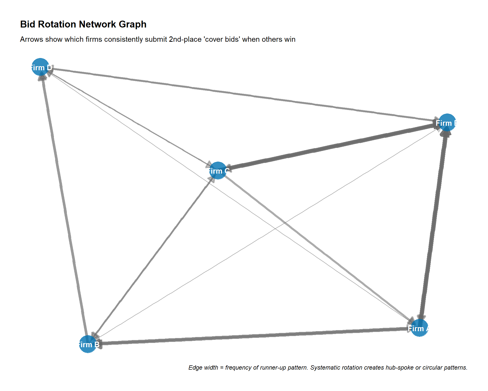
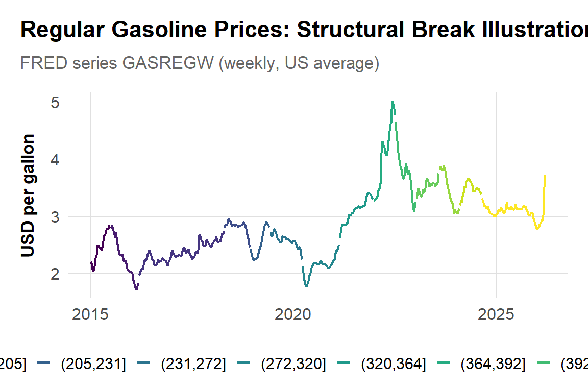

# Cartels and Collusion

## Learning goals
Cartel enforcement hinges on weaving together quantitative screens, econometric estimates, and documentary evidence. This chapter walks through that workflow using established methodologies from the OECD and academic literature on cartel detection.

By the end you should be able to:

- Spot suspicious conduct using dashboards, variance/rotation screens, and early break tests.
- Tie raid/leniency events to structural changes in prices, margins, and quantities.
- Estimate overcharge and pass-through with transparent assumptions and uncertainty analysis.
- Triangulate econometrics with leniency statements, chats, and procurement narratives to build court-ready stories.

## Workflow roadmap
1. **Timeline & conduct map.** Build a dated chronology from complaints, internal messages, procurement milestones, and raids. Align suspected mechanisms (bid rotation, geographic allocation, price floors) with specific products and periods.  
2. **Descriptive diagnostics.** Plot prices, costs, and quantities; look for unnatural stability or compression.  
3. **Screens.** Run variance, digit, and rotation screens to triage markets. Treat them as prioritization tools, not dispositive proof.  
4. **Event/break tests.** Evaluate how prices or spreads change around raids, leniency announcements, or policy shifts.  
5. **Overcharge & pass-through.** Estimate counterfactual prices using panel regressions, yardsticks, or synthetic controls; propagate uncertainty.  
6. **Triangulation.** Reconcile quantitative results with leniency statements, buyer interviews, and messaging logs.  
7. **Damages & remedies.** Translate overcharge estimates into monetary relief or structural commitments, respecting jurisdictional rules (e.g., Competition Tribunal SA public-interest remedies).

## Timeline and conduct map
Document every known communication, meeting, or enforcement action in a single table (date, event, evidence source, hypothesis). Update it as new statements arrive. Every regression or screen should cite the row(s) it tests—this discipline prevents “data dredging” and makes testimony easier.

## Descriptives and screens
Start with `ggplot2` dashboards that overlay prices with cost indices, demand proxies, and competitor prices. Flag regimes where prices remain static despite volatile costs or where margins converge across firms.

- **Variance/dispersion screens:** Check price spreads, standard deviations, and coefficents of variation across firms or regions [@abrantes_mello_2010].  
- **Procurement rotation:** Rank bids chronologically to flag turn-taking, convenient price endings, or geographic allocations [@porter_zona_1993; @conley_decarolis_2016].  
- **Digit/Benford checks:** Use sparingly and only when invoice conventions support the assumptions.  
- **Correlation screens:** High correlations in supposedly independent bids can justify deeper probes [@harrington_2008].

Document screen logic following OECD guidance on cartel screens [@oecd_cartel_screens_2013] and note data limitations (missing bidders, net vs. list prices).

### Bid-rotation analysis
Using cement procurement data to identify potential bid rotation patterns.

```r
library(dplyr)
library(ggplot2)

# Load real cartel bid data
bids_df <- read.csv("data/derived/cartel_cement_bids.csv")

# Analyze win patterns by firm
rotation <- bids_df |>
  group_by(winner) |>
  summarise(
    wins = n(),
    avg_bid = mean(winning_bid, na.rm = TRUE),
    cartel_wins = sum(cartel_period),
    non_cartel_wins = sum(!cartel_period)
  ) |>
  arrange(desc(wins))

ggplot(rotation, aes(x = reorder(winner, wins), y = wins)) +
  geom_col(fill = antitrust_colors["blue"]) +
  coord_flip() +
  labs(title = "Bid wins by vendor (cement procurement)",
       subtitle = "Data: Simulated cement cartel case",
       x = NULL, y = "Contract wins") +
  theme_antitrust()
```
Pair charts with tables showing consecutive wins, geographic patterns, or unexplained bid withdrawals.

### Transition matrix for rotation detection
While bar charts show win counts, a **transition matrix** reveals systematic rotation by showing which firm wins after another firm won the previous contract. Systematic rotation produces off-diagonal clustering; competitive bidding produces diagonal concentration (repeat wins).

```r
library(dplyr)
library(tidyr)
library(ggplot2)
source("../program/R/helpers.R")

# Load real cartel bid data
bids_df <- read.csv("data/derived/cartel_cement_bids.csv")

# Create lagged winner variable for transition analysis
transitions <- bids_df |>
  arrange(tender_id) |>
  mutate(
    prev_winner = lag(winner),
    period = if_else(cartel_period, "Cartel period", "Competitive period")
  ) |>
  filter(!is.na(prev_winner))

# Compute transition matrix for cartel period
cartel_transitions <- transitions |>
  filter(period == "Cartel period") |>
  count(prev_winner, winner, name = "count") |>
  group_by(prev_winner) |>
  mutate(prob = count / sum(count)) |>
  ungroup()

# Heatmap visualization
ggplot(cartel_transitions, aes(x = winner, y = prev_winner, fill = prob)) +
  geom_tile(color = "white", linewidth = 0.5) +
  geom_text(aes(label = scales::percent(prob, accuracy = 1)),
            color = "white", fontface = "bold", size = 3.5) +
  scale_fill_gradient(low = "#56B4E9", high = "#D55E00",
                      labels = scales::percent_format()) +
  labs(
    title = "Bid Rotation Transition Matrix (Cartel Period)",
    subtitle = "Probability of Firm Y winning given Firm X won previous tender",
    x = "Winner at time t",
    y = "Winner at time t-1",
    fill = "Transition\nprobability",
    caption = "Off-diagonal clustering indicates systematic rotation; diagonal dominance suggests repeat wins."
  ) +
  theme_antitrust() +
  theme(
    axis.text.x = element_text(angle = 45, hjust = 1),
    legend.position = "right",
    panel.grid = element_blank()
  )

# Rotation index: ratio of off-diagonal to diagonal transitions
diag_prob <- cartel_transitions |>
  filter(prev_winner == winner) |>
  summarise(diag = sum(prob * count) / sum(count)) |>
  pull(diag)

cat("\nRotation diagnostics:\n")
cat(paste0("Diagonal (repeat win) share: ", scales::percent(diag_prob, accuracy = 0.1), "\n"))
cat(paste0("Off-diagonal (rotation) share: ", scales::percent(1 - diag_prob, accuracy = 0.1), "\n"))
cat("Note: Competitive markets typically show >50% diagonal; rotation schemes show <30%.\n")
```

**How to interpret the transition matrix:**

- **Diagonal cells** show the probability of a firm winning consecutive contracts. In competitive markets, efficient firms often win repeatedly (high diagonal values).
- **Off-diagonal patterns** reveal rotation. If Firm A→B→C→D→A appears consistently, you'll see elevated probabilities in a cyclical off-diagonal pattern.
- **Uniform off-diagonal** suggests random or structured rotation with no repeat wins allowed.
- **Asymmetric off-diagonal** may indicate a hub-and-spoke arrangement where one firm coordinates others.

### Bid-rotation network graph
Network graphs help visualize suspected coordination patterns by showing which bidders consistently "yield" to others. This is particularly useful for identifying systematic rotation schemes or hub-and-spoke arrangements.



*Arrows show which firms consistently submit 2nd-place "cover bids" when others win. Edge width = frequency of runner-up pattern.*

**How to interpret this graph:**
- **Hub-spoke patterns**: If one firm is at the center with many arrows pointing to it, that firm may be the "ringleader" coordinating bids.
- **Circular patterns**: Arrows forming a circle (A→B→C→D→A) suggest systematic rotation where firms take turns winning.
- **Asymmetric flows**: If Firm A frequently comes second when Firm B wins, but not vice versa, this may indicate a hierarchical arrangement.
- **Edge weights**: Thicker arrows indicate more frequent patterns, which are more suspicious than occasional occurrences.

**Practical applications:**
- Combine with document evidence (emails, meeting logs) to validate rotation schemes.
- Compare network patterns across product lines or regions to identify geographic allocation.
- Use as demonstrative exhibit in tribunal presentations or expert reports.

Replace simulated data with actual procurement records (World Bank, TED, US DOT, Stats SA infrastructure tenders). Document bid amounts, dates, and project characteristics in `data/raw/procurement/` with provenance notes.

## Event and break tests
When raids or leniency filings occur, run event studies on prices, spreads, or quantities. Check both cartel participants and outsiders; in public procurement you can also evaluate engineers’ estimates or cost indices.

Structural break tests (Bai–Perron, CUSUM) highlight regime shifts. Always incorporate costs so you do not misattribute cost-driven changes to conduct. Present break plots next to relevant timeline entries (e.g., WhatsApp thread confirming a January 2019 meeting).


**Code box: raid event study scaffold**

```r
# df must include date, price, cost, treated (0/1), firm, product
# library(fixest)
# df <- df |> mutate(post = date >= as.Date("YYYY-MM-DD"))
# feols(log(price) ~ post * treated + cost + month(date) | firm + product + year(date),
#       cluster = ~firm, data = df)
```


## Overcharge and pass-through
Pick a counterfactual that matches data availability:

- **Before/after:** Include product, customer, and time fixed effects plus cost controls.  
- **Difference-in-differences:** Compare cartel markets to unaffected regions or product classes; test pre-trends.  
- **Yardsticks:** Use similar markets (neighboring countries, regulated benchmarks) when local data are thin.  
- **Synthetic controls:** Helpful for single-market cartels; combine unaffected markets into a donor pool.

Robustness: alternative functional forms (log vs. level), trimming outliers, placebo periods, heteroskedasticity checks, and randomization inference when N is small. For pass-through, regress downstream prices on upstream costs with lags to quantify harm on intermediaries vs. end-users.

### Placebo tests for causal validation

Placebo tests strengthen causal claims by showing that the estimated effect disappears when applied to situations where no effect should exist. Two common approaches:

1. **Product placebo**: Run the same regression on a product NOT involved in the cartel. If you find a similar "effect," your identification is suspect.
2. **Timing placebo**: Use a fake raid/leniency date. If structural breaks appear at arbitrary dates, the true break may be spurious.

```r
library(dplyr)
library(fixest)
library(ggplot2)
source("../program/R/helpers.R")

# Simulate panel data for cartel and control products
set.seed(456)
n_periods <- 60
raid_date <- 36  # Raid occurs at period 36

panel <- expand.grid(
 period = 1:n_periods,
 product = c("Cement (cartel)", "Gravel (control)")
) |>
 mutate(
   post_raid = period >= raid_date,
   cartel_product = product == "Cement (cartel)",
   cost = 50 + cumsum(rnorm(n(), 0, 1)),  # Common cost shock
   # Cartel product has elevated prices pre-raid, drops after
   price = case_when(
     cartel_product & !post_raid ~ 100 + 0.8 * cost + 15 + rnorm(n(), 0, 3),
     cartel_product & post_raid ~ 100 + 0.8 * cost + rnorm(n(), 0, 3),
     TRUE ~ 95 + 0.85 * cost + rnorm(n(), 0, 3)  # Control product
   )
 )

# Main regression: cartel product
main_model <- feols(
 log(price) ~ post_raid + cost | product,
 data = filter(panel, cartel_product),
 cluster = ~product
)

# Placebo 1: Control product (should show NO effect)
placebo_product <- feols(
 log(price) ~ post_raid + cost | product,
 data = filter(panel, !cartel_product),
 cluster = ~product
)

# Placebo 2: Fake raid date (period 20 instead of 36)
panel_fake <- panel |>
 mutate(post_fake_raid = period >= 20)

placebo_timing <- feols(
 log(price) ~ post_fake_raid + cost | product,
 data = filter(panel_fake, cartel_product),
 cluster = ~product
)

# Display results
cat("=== MAIN RESULT: Cartel Product ===\n")
cat(paste0("Post-raid effect: ", round(coef(main_model)["post_raidTRUE"], 4),
          " (expect negative = price drop)\n\n"))

cat("=== PLACEBO 1: Control Product ===\n")
cat(paste0("Post-raid effect: ", round(coef(placebo_product)["post_raidTRUE"], 4),
          " (should be ~0 if identification valid)\n\n"))

cat("=== PLACEBO 2: Fake Raid Date ===\n")
cat(paste0("Post-fake-raid effect: ", round(coef(placebo_timing)["post_fake_raidTRUE"], 4),
          " (should be ~0 if true break is at raid date)\n"))

# Visualization
ggplot(panel, aes(x = period, y = price, color = product)) +
 geom_vline(xintercept = raid_date, linetype = "dashed", color = "darkred", linewidth = 1) +
 geom_line(linewidth = 0.8, alpha = 0.8) +
 annotate("text", x = raid_date + 1, y = max(panel$price) - 5,
          label = "Raid date", color = "darkred", hjust = 0, fontface = "italic") +
 scale_color_manual(values = c("Cement (cartel)" = "#D55E00", "Gravel (control)" = "#0072B2")) +
 labs(
   title = "Placebo Test: Cartel vs. Control Product",
   subtitle = "Control product shows no structural break at raid date",
   x = "Period", y = "Price", color = NULL
 ) +
 theme_antitrust() +
 theme(legend.position = "bottom")
```

**Interpreting placebo results:**

- **Product placebo fails** (control shows effect): Consider whether the "control" product is actually affected, or whether your specification captures market-wide shocks rather than cartel conduct.
- **Timing placebo fails** (fake date shows effect): Your data may have multiple structural breaks, or the cartel period definition is imprecise. Cross-check with documentary evidence.
- **Both placebos pass**: Strengthens the causal interpretation that the raid/leniency event caused the observed price change.

## Leniency, documents, and triangulation
Leniency statements, chats, and board minutes pin down conduct mechanisms (rotation order, price floors, trigger strategies). Use them to:

- Set regression windows and sample selections.  
- Validate that estimated start/stop dates match qualitative evidence.  
- Explain residuals—if econometrics show little effect where documents admit coordination, revisit product mapping or data coverage.  
- Clarify what is fact (documented) vs. inference (econometric patterns), citing [@oecd_leniency_2015] or agency policies.


**Method box: econometric toolkit**

**Event studies:** Evaluate raid/leniency impact on prices or spreads.  
**Overcharge regressions:** `feols(log(price) ~ cartel_period + cost + demand | product + customer + time)` with clustered SEs and placebo checks.  
**Pass-through:** Dynamic regressions or VECMs linking upstream and downstream prices to trace harm along the chain.



**Method box: screens & variance**

**Distribution screens:** Variance compression, digit spikes, Benford where appropriate.  
**Rotation checks:** Consecutive wins, geographic allocation, or sequential ordering.  
**Cost-pass-through diagnostics:** Compare pass-through before/during suspected collusion; suppressed pass-through can corroborate coordination.



**Qualitative evidence**

Treat qualitative materials as structured data:

- **Bid sheets & messaging apps:** Extract explicit allocation rules or fallback prices.  
- **Buyer interviews:** Document procurement timelines, awareness of cover bids, or complaints.  
- **Expert narratives:** Craft timelines tying every empirical result to specific documents.



**Case box: Illustrative matters**

**Apple eBooks (US).** Hub-and-spoke coordination with agency-model contracts and SSNDQ logic.  
**Lysine & DRAM (US/EU).** Classic dawn-raid analyses (see Connor, 2007, "Price-Fixing Overcharges," American Antitrust Institute Working Paper; Levenstein & Suslow, 2006, "What Determines Cartel Success?," *Journal of Economic Literature* 44(1): 43-95).  
**Construction bid-rigging (EU, SA, JFTC).** Rotation matrices and dawn raids aligned with procurement archives.  
**Digital advertising (SAMR).** Algorithms and platform policies as qualitative evidence.



**Case box: South African enforcement highlights**

- **Bread cartel (Tribunal case 15/CR/Feb07).** Stats SA CPI data plus mill-level costs revealed synchronized 30–40 cent jumps; overcharge estimated at 7–10% with R250 million penalties and consumer relief funds.  
- **Construction fast-track settlement (2013).** Self-reported matrices across 300 tenders showed rotation; event windows around raids captured 8–12% price drops relative to engineers’ estimates.  
- **Fertilizer/ammonia (Sasol/Yara/Omnia).** Export-parity benchmarks and plant-level variable-cost data showed 25–30% overcharges despite spare capacity, leading to penalties and divestitures.


## Structural break illustration



*FRED series GASREGW (weekly, US average). Colors indicate detected structural breaks using Bai-Perron methodology.*

**How to interpret structural breaks:**
- **Regime changes** (color shifts) indicate statistically significant shifts in price levels or trends.
- In cartel detection, compare break dates to known events: raids, leniency announcements, or market entry.
- If a break aligns with a dawn raid, this supports the hypothesis that enforcement disrupted coordination.
- Multiple breaks may indicate cartel formation, adjustment, and breakdown phases.

Replace the public FRED data with product-level transactions to present in litigation.


**Citations and comparative note**

- Cite OECD screen guidance, FTC/DOJ econometrics speeches, and EC/JFTC leniency notices when defending methodology.  
- Reference cases (lysine, DRAM, auto parts, LIBOR) with docket numbers.  
- Flag jurisdictional differences: e.g., SAMR often requires data-driven screens, while US courts scrutinize documentary corroboration.


## Looking ahead
Archive every screen, regression, and figure in `data/derived` with READMEs so the damages and litigation chapters can reuse them. Push generic templates (rotation indices, break plots, overcharge tables) into `chapters/13-empirical-appendix.qmd`. When you shift to the mergers chapter, carry over demand estimates, diversion ratios, or pass-through results—post-cartel mergers frequently face heightened scrutiny, and reusing these diagnostics speeds up the next phase.
