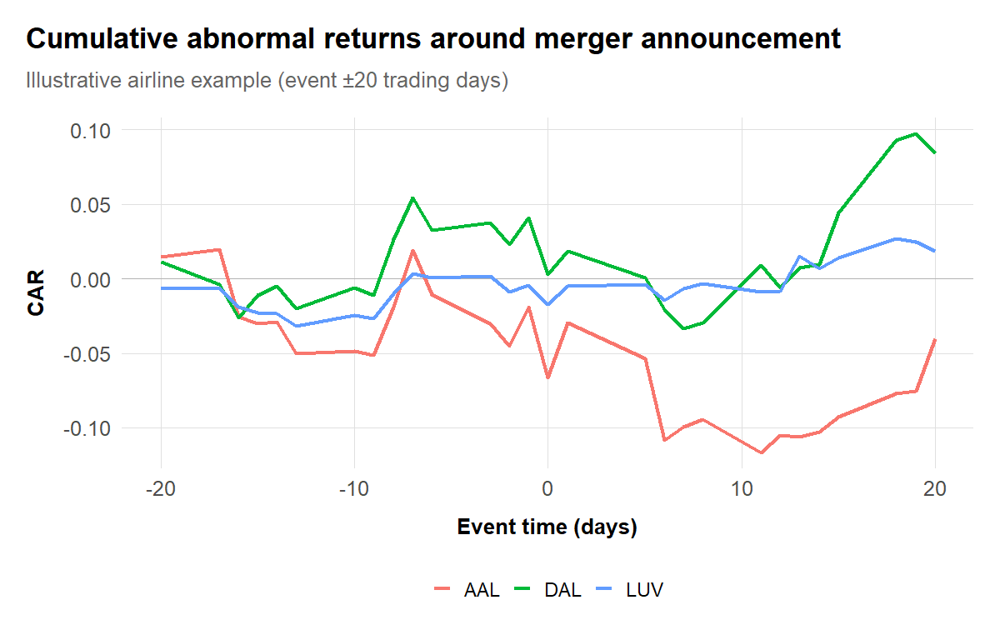

# Mergers

## Learning goals
Merger reviews synthesize everything covered so far: market definition, IO modeling, qualitative evidence, and remedies. This chapter provides a practical workflow for assessing unilateral, coordinated, vertical, and public-interest effects across US, EU/UK, and South African jurisdictions, drawing on agency guidance [@doj_ftc_hmg_2023; @ec_hmg_2004; @cma_merger_assessment_2021].

By the end you should be able to:

- Assess unilateral and coordinated effects with descriptive and structural tools (UPP/GUPPI, logit simulations, retrospectives).
- Evaluate vertical/mixed theories (elimination of double marginalization (EDM) vs. foreclosure) and quantify vUPP.
- Integrate efficiencies and public-interest claims with evidence.
- Propose remedies tied explicitly to diagnosed harms.

## Core topics
- Market structure pre/post; diversion from shares and switching data.
- UPP/GUPPI screens; thresholds and caveats.
- Merger simulation: differentiated products logit/nested logit; calibrating margins and ownership.
- Coordinated effects: maverick analysis, transparency, capacity and bidding dynamics.
- Retrospectives: diff-in-diff/event studies with rivals and controls.
- Horizontal, vertical, and mixed mergers; define “upstream” and “downstream” relative to the theory of harm and adapt analysis to industry specifics.
- Workflow: (1) transaction and market overview; (2) shares/diversion/HHI; (3) UPP/GUPPI and margins; (4) unilateral and coordinated effects (structural or reduced form); (5) vertical/mixed theories (EDM vs. foreclosure); (6) efficiencies evidence; (7) remedies and retrospectives.

### Transaction overview and market structure
- Summarize products, geographies, overlaps, and timing; map to candidate relevant markets.
- Compute shares/HHI and diversion using shares, switching, or survey-based measures. Flag mavericks and fringe.
- Upstream/downstream definitions depend on the theory of harm: be explicit about the vertical chain and platform sides.
- Ground definitions in agency guidance (US Merger Guidelines [@doj_ftc_hmg_2023; @doj_ftc_hmg_2010], EC/CMA guidance [@ec_hmg_2004; @cma_merger_assessment_2021]) and adjust for platform/digital contexts.

**Practical tips:** keep a data inventory (chapter 13 template) noting which datasets inform shares (transaction data, Nielsen panels, loyalty cards). Align product labels with the IO models you plan to run later so you avoid remapping midstream.

### Unilateral effects: UPP/GUPPI and sim
- Use UPP/GUPPI as a screen [@farrell_shapiro_2010_merger; @jaffe_weyl_2013]; report inputs (diversion, margins) transparently. Sensitivity to margin measurement and diversion estimates should be shown.
- For differentiated products, simulate with logit/nested-logit or BLP-lite [@nevo_2000; @berry_levinsohn_pakes_1995]; emphasize calibration choices (outside share, margin sources).
- Convey uncertainty: confidence intervals on diversion, ranges on margins, and alternative ownership assumptions [@weinberg_hosken_2013].
- For readers, tie back to case examples in your slides to show how margins and diversion were evidenced (transaction data, surveys, switching analyses).

#### Simple UPP/GUPPI calculation
```r
library(dplyr)
upp <- function(diversion, price, margin, efficiency = 0) {
  diversion * price * (1 - margin) - efficiency
}

inputs <- tibble::tribble(
  ~pair, ~diversion, ~price, ~margin, ~efficiency,
  "A->B", 0.35, 11.50, 0.45, 0.50,
  "B->A", 0.28, 10.00, 0.40, 0.30
) |>
  mutate(upp = upp(diversion, price, margin, efficiency))

inputs
```
Highlight the evidence sources for diversion (switching matrices, conjoint surveys, clickstream data) and margins (cost accounting, P&L, expert testimony). Note that negative efficiencies shift UPP upward, so document synergy assumptions thoroughly.

#### Logit simulation scaffold
```r
source("../program/R/helpers.R")
# products_df columns: product, firm, price, share, mc or margin, nest
# sim <- run_logit_sim(products_df, merging_firms = c("FirmA","FirmB"))
# sim$summary # contains post-merger price deltas, elasticities, diversion matrices
```
Before presenting results, show calibration diagnostics: how well the model reproduces pre-merger shares, whether price elasticities fall in plausible ranges, and how sensitive predictions are to alternative marginal-cost assumptions.

### Coordinated effects
- Look for increased symmetry, transparency, or capacity alignment post-merger; include bidding/auction context where relevant.
- Event studies around merger announcements can show rivals’ stock price reactions (coordination signal) but should be paired with real-world capacity/contract evidence.
- Document maverick roles and whether the transaction removes or disciplines them.

Useful evidence: internal documents describing “price umbrella” logic, third-party contracts showing increased transparency, and supply/demand data indicating higher capacity utilization or inventory visibility. Build a maverick profile (pricing aggressiveness, innovation track record) to show whether elimination meaningfully raises coordination risk.

### Vertical and mixed effects
- EDM vs. foreclosure: quantify both. vUPP and upward pricing pressure on rivals’ access should be shown alongside EDM magnitudes.
- Identify potential raising rivals’ costs channels (input denial, degradation, parity clauses) and model likely price effects.
- Conglomerate/mixed cases: bundling/tying risk, data advantage transfer, and cross-market leverage should be explicitly linked to facts.
- When defining “upstream” vs. “downstream,” anchor to transaction flows and incentives; platform settings may require mapping sides rather than tiers.

### Efficiencies and remedies
- Synergy claims: require verifiable, merger-specific efficiencies with timelines and implementation costs; stress test with sensitivity tables.
- Remedies: structural first; behavioral only if verifiable/monitorable. Link proposed remedies to modeled harms and operational feasibility.

Tie efficiencies to data. For example, if parties cite procurement savings, request SKU-level cost projections and simulate whether those savings offset UPP. For behavioral remedies, document monitoring costs and fallback options (trustees, data rooms) referenced in CMA/DG COMP practice.

### Retrospectives
- Where historical analogs exist, run diff-in-diff/event studies on prices/output/quality. Use rivals and unaffected markets as controls; test pre-trends [@ashenfelter_hosken_2010; @miller_weinberg_2017].
- For platform/vertical cases, examine participation/multi-homing effects and access terms over time.
- Cite retrospective literature to benchmark magnitudes and methods [@weinberg_hosken_2013].
- Use well-known retrospectives (e.g., supermarket/hospital/airline cases) to set expectations on effect sizes and uncertainty.

#### Stock-event diagnostic
```r
library(tidyquant)
library(dplyr)
library(ggplot2)

event_date <- as.Date("2013-02-14") # substitute deal date
tickers <- c("AAL", "DAL", "LUV", "SPY")

prices <- tq_get(
  tickers,
  from = event_date - lubridate::days(120),
  to   = event_date + lubridate::days(60)
) |>
  group_by(symbol) |>
  arrange(date) |>
  mutate(ret = log(adjusted) - log(lag(adjusted))) |>
  ungroup()

market <- prices |> filter(symbol == "SPY") |> transmute(date, mkt_ret = ret)
cars <- prices |> filter(symbol != "SPY") |>
  left_join(market, by = "date") |>
  mutate(abnormal = ret - mkt_ret, rel_day = as.integer(date - event_date)) |>
  filter(between(rel_day, -20, 20)) |>
  group_by(symbol) |>
  arrange(rel_day) |>
  mutate(car = cumsum(abnormal))

ggplot(cars, aes(rel_day, car, color = symbol)) +
  geom_hline(yintercept = 0, linewidth = 0.3, color = "gray70") +
  geom_line(linewidth = 0.9) +
  labs(title = "Cumulative abnormal returns around merger announcement",
       subtitle = "Illustrative airline example (event ±20 trading days)",
       x = "Event time (days)", y = "CAR", color = NULL) +
  theme_antitrust() +
  theme(legend.position = "bottom")
```



Use CAR patterns as suggestive evidence of coordination or efficiency expectations, but always pair with operational data (capacity, contracts).

### Southern African merger evidence
- **Walmart/Massmart (2011).** The Competition Commission and Tribunal analyzed SKU-level sales and procurement data showing Massmart’s 20–25% share in formal general merchandise with limited reach into township grocery segments. Diversion estimates from loyalty-card switching rates indicated minimal unilateral effect, so the case turned on public-interest harms. Conditions ultimately required a R240 million supplier development fund, a two-year moratorium on merger-specific retrenchments, and detailed annual reporting on local procurement shares—providing a template for tying data-backed public-interest claims to remedies.
- **Mediclinic/Matlosana (2014).** Using patient-level discharge data covering 24 specialties, the Commission computed local HHIs above 6,000 and estimated post-merger tariff increases of 8–12% for insured patients. The Tribunal accepted that rival hospitals were more than 150 km away and prohibited the deal, highlighting how granular utilization data can anchor both geographic market definition and competitive-effects narratives in middle-income regions.
- **Heineken/Distell/Capevin (2022).** In evaluating the creation of Newco, the Commission’s demand estimates—calibrated from Nielsen panel data—showed cider/RTD diversion ratios above 0.5 between Hunters, Savanna, and Strongbow, with Newco projected to command roughly 65% share. Conditional approval required a R10 billion investment commitment, maintenance of existing third-party distribution contracts, and shelf-space safeguards for smaller craft brands, illustrating how quantitative evidence on differentiated products fed into both competition and public-interest remedies.


**Method box**

- Simple merger sim template (see R helpers).
- Event study around merger announcement/close; rival effects.
- Vertical tools: vUPP, EDM, raising rivals’ costs sketches.



**Method box: UPP/GUPPI quick calc**

See the UPP/GUPPI example above. Expand the template with case-specific diversion estimates (from surveys, loyalty data, or conjoint work) and margin sources (accounting or expert models). Always show sensitivity ranges.



**Qualitative evidence**

- Integration plans, synergy decks, customer feedback on alternatives.
- Internal pricing and margin analyses; board materials on strategic rationale.
- Remedy feasibility from operations teams and third parties.



**Code box: merger sim skeleton**

```r
# robust path in case execution dir is chapter folder
source("../program/R/helpers.R")
# products_df: product, firm, price, share, mc (or margin), group (nest)
# sim <- run_logit_sim(products_df, merging_firms = c("FirmA","FirmB"))
# sim$summary
```



**Citations and comparative note**

- Anchor claims to current US Merger Guidelines (2023) [@doj_ftc_hmg_2023] and legacy 2010 guidance [@doj_ftc_hmg_2010]; include EC Horizontal Guidelines [@ec_hmg_2004] and CMA merger assessment guidelines for comparisons.
- Cite empirical merger retrospective studies when presenting methods or benchmarks (e.g., airlines, hospitals).
- For vertical mergers, cite vUPP/EDM references and any key enforcement actions (e.g., US v. AT&T/Time Warner, EC cases on input foreclosure).



**Case box: Illustrative mergers**

- Horizontal: airline mergers (UA/CO, DL/NW, AA/US) — retrospectives and coordinated effects; hospital mergers for local market power.
- Vertical: AT&T/Time Warner (US), Microsoft/Activision (platform/distribution) — input foreclosure/EDM debates.
- Mixed conglomerate/ad tech: Google/DoubleClick; media/telecom bundling examples.


## Visualizations

### Market shares and HHI dashboard
This dashboard provides a comprehensive view of market structure before and after the merger, combining share distributions, HHI calculations, and competitive thresholds.

```r
library(dplyr)
library(tidyr)
library(ggplot2)
library(patchwork)

# Simulated market data (replace with actual transaction/Nielsen data)
market_pre <- tibble::tribble(
  ~firm,      ~share,
  "Firm A",   0.28,
  "Firm B",   0.22,
  "Firm C",   0.18,
  "Firm D",   0.12,
  "Firm E",   0.08,
  "Firm F",   0.06,
  "Fringe",   0.06
)

# Post-merger: A acquires B
market_post <- market_pre |>
  mutate(
    firm = if_else(firm == "Firm B", "Firm A+B", firm),
    share = if_else(firm == "Firm A", share + 0.22, share)
  ) |>
  filter(firm != "Firm B") |>
  arrange(desc(share))

# Calculate HHI
calc_hhi <- function(shares) {
  sum((shares * 100)^2)
}

hhi_pre <- calc_hhi(market_pre$share)
hhi_post <- calc_hhi(market_post$share)
delta_hhi <- hhi_post - hhi_pre

# Prepare data for visualization
market_pre$period <- "Pre-merger"
market_post$period <- "Post-merger"
market_combined <- bind_rows(market_pre, market_post)
market_combined$period <- factor(market_combined$period,
                                  levels = c("Pre-merger", "Post-merger"))

# Plot 1: Share comparison
p1 <- ggplot(market_combined, aes(x = reorder(firm, share), y = share,
                                   fill = period)) +
  geom_col(position = position_dodge(width = 0.8), width = 0.7) +
  coord_flip() +
  scale_y_continuous(labels = scales::percent_format()) +
  scale_fill_manual(values = c("Pre-merger" = "#0072B2",
                                "Post-merger" = "#D55E00")) +
  labs(
    title = "Market Shares: Pre- vs. Post-Merger",
    x = NULL,
    y = "Market Share",
    fill = NULL
  ) +
  theme_antitrust() +
  theme(
    legend.position = "bottom",
    plot.title.position = "plot"
  )

# Plot 2: HHI change
hhi_data <- tibble::tribble(
  ~scenario, ~hhi,
  "Pre-merger", hhi_pre,
  "Post-merger", hhi_post
) |>
  mutate(
    scenario = factor(scenario, levels = c("Pre-merger", "Post-merger")),
    concern_level = case_when(
      hhi < 1500 ~ "Unconcentrated",
      hhi < 2500 ~ "Moderately concentrated",
      TRUE ~ "Highly concentrated"
    )
  )

p2 <- ggplot(hhi_data, aes(x = scenario, y = hhi, fill = scenario)) +
  geom_col(width = 0.6) +
  geom_hline(yintercept = 1500, linetype = "dashed", color = "gray40",
             linewidth = 0.8) +
  geom_hline(yintercept = 2500, linetype = "dashed", color = "gray40",
             linewidth = 0.8) +
  annotate("text", x = 2.5, y = 1500, label = "1,500 threshold",
           hjust = 0, vjust = -0.5, size = 3) +
  annotate("text", x = 2.5, y = 2500, label = "2,500 threshold",
           hjust = 0, vjust = -0.5, size = 3) +
  annotate("rect", xmin = -Inf, xmax = Inf, ymin = 1500, ymax = 2500,
           fill = "yellow", alpha = 0.05) +
  annotate("rect", xmin = -Inf, xmax = Inf, ymin = 2500, ymax = Inf,
           fill = "red", alpha = 0.05) +
  scale_fill_manual(values = c("Pre-merger" = "#0072B2",
                                "Post-merger" = "#D55E00")) +
  labs(
    title = "HHI Analysis",
    subtitle = paste0("Δ HHI = ", round(delta_hhi, 0)),
    x = NULL,
    y = "HHI",
    fill = NULL
  ) +
  theme_antitrust() +
  theme(
    legend.position = "none",
    plot.title.position = "plot"
  )

# Plot 3: Concentration curve
market_post_sorted <- market_post |>
  arrange(desc(share)) |>
  mutate(cumulative_share = cumsum(share))

p3 <- ggplot(market_post_sorted, aes(x = seq_along(firm), y = cumulative_share)) +
  geom_line(color = "#D55E00", linewidth = 1.2) +
  geom_point(color = "#D55E00", size = 3) +
  geom_hline(yintercept = 0.5, linetype = "dashed", color = "gray40") +
  annotate("text", x = 1, y = 0.5, label = "50% market share",
           hjust = 0, vjust = -0.5, size = 3) +
  scale_y_continuous(labels = scales::percent_format(), limits = c(0, 1)) +
  scale_x_continuous(breaks = seq_along(market_post_sorted$firm),
                     labels = market_post_sorted$firm) +
  labs(
    title = "Post-Merger Concentration Curve",
    subtitle = "Cumulative market share by firm rank",
    x = NULL,
    y = "Cumulative Share"
  ) +
  theme_antitrust() +
  theme(
    plot.title.position = "plot",
    axis.text.x = element_text(angle = 45, hjust = 1)
  )

# Combine plots
(p1 | p2) / p3 + plot_annotation(
  title = "Market Structure Dashboard",
  subtitle = paste0("Pre-merger HHI: ", round(hhi_pre, 0),
                   " | Post-merger HHI: ", round(hhi_post, 0),
                   " | Δ HHI: ", round(delta_hhi, 0)),
  caption = "US Merger Guidelines (2023): Moderately concentrated if HHI > 1,500;
  Highly concentrated if HHI > 2,500. Mergers with Δ HHI > 100-200 in concentrated
  markets may warrant scrutiny."
)

# Summary table
cat("\nMarket structure summary:\n")
cat(paste0("Pre-merger HHI: ", round(hhi_pre, 0), "\n"))
cat(paste0("Post-merger HHI: ", round(hhi_post, 0), "\n"))
cat(paste0("Change in HHI: ", round(delta_hhi, 0), "\n"))
cat(paste0("\nCombined entity share: ",
           scales::percent(market_post$share[market_post$firm == "Firm A+B"],
                          accuracy = 0.1), "\n"))
```

**Interpretation:**
- **HHI thresholds**: The 2023 US Merger Guidelines use 1,500 and 2,500 as thresholds. Markets above 2,500 are "highly concentrated."
- **Delta HHI**: Changes above 100-200 in concentrated markets may trigger enhanced scrutiny.
- **Combined entity**: The merged firm's share and rank indicate potential unilateral effects concerns.
- **Concentration curve**: Shows how quickly the top firms accumulate market share.

Replace simulated data with actual transaction volumes, Nielsen scanner data, or industry-specific sources (e.g., airline MIDT, hospital discharge data).

### Merger simulation waterfall
A waterfall chart decomposes the predicted post-merger price change into its component parts: diversion, margin, efficiencies, and second-order effects. This helps communicate which parameters drive the result.

```r
library(dplyr)
library(ggplot2)

# Simulation components (from a differentiated products model)
# Replace with actual simulation outputs
sim_components <- tibble::tribble(
  ~component,              ~value,     ~description,
  "Base price",            10.00,      "Pre-merger price",
  "First-order UPP",       +0.80,      "Diversion × Margin effect",
  "Internalization",       +0.35,      "Portfolio reoptimization",
  "Efficiency offset",     -0.25,      "Verified cost synergies",
  "Competitive response",  -0.15,      "Rival price reactions",
  "Post-merger price",     10.75,      "Predicted equilibrium"
) |>
  mutate(
    component = factor(component, levels = component),
    cumulative = cumsum(value),
    start = lag(cumulative, default = 0),
    end = cumulative,
    type = case_when(
      component %in% c("Base price", "Post-merger price") ~ "total",
      value > 0 ~ "increase",
      value < 0 ~ "decrease",
      TRUE ~ "neutral"
    )
  )

# Waterfall plot
ggplot(sim_components) +
  geom_rect(aes(xmin = as.numeric(component) - 0.4,
                xmax = as.numeric(component) + 0.4,
                ymin = start, ymax = end, fill = type),
            color = "black", linewidth = 0.5) +
  geom_text(aes(x = as.numeric(component),
                y = (start + end) / 2,
                label = scales::dollar(value, accuracy = 0.01)),
            size = 3.5, fontface = "bold") +
  geom_segment(data = filter(sim_components, !type %in% c("total")),
               aes(x = as.numeric(component) + 0.4,
                   xend = as.numeric(component) + 1 - 0.4,
                   y = end, yend = end),
               linetype = "dashed", color = "gray50") +
  scale_fill_manual(
    values = c(
      "total" = "#0072B2",
      "increase" = "#D55E00",
      "decrease" = "#009E73",
      "neutral" = "#999999"
    ),
    labels = c(
      "total" = "Price level",
      "increase" = "Price increase",
      "decrease" = "Price decrease",
      "neutral" = "Neutral"
    )
  ) +
  scale_x_continuous(
    breaks = seq_along(sim_components$component),
    labels = sim_components$component
  ) +
  scale_y_continuous(labels = scales::dollar_format()) +
  labs(
    title = "Merger Simulation Waterfall: Price Effect Decomposition",
    subtitle = "Breaking down predicted price change into component effects",
    x = NULL,
    y = "Price ($)",
    fill = "Effect type",
    caption = "Components from differentiated products logit simulation.
    Replace with actual model outputs."
  ) +
  theme_antitrust() +
  theme(
    axis.text.x = element_text(angle = 30, hjust = 1),
    legend.position = "bottom",
    plot.title.position = "plot"
  )

# Summary statistics
cat("\nSimulation summary:\n")
cat(paste0("Pre-merger price: ",
           scales::dollar(sim_components$value[1], accuracy = 0.01), "\n"))
cat(paste0("Post-merger price: ",
           scales::dollar(sim_components$end[nrow(sim_components)],
                         accuracy = 0.01), "\n"))
cat(paste0("Price increase: ",
           scales::dollar(sim_components$end[nrow(sim_components)] -
                         sim_components$value[1], accuracy = 0.01),
           " (",
           scales::percent((sim_components$end[nrow(sim_components)] /
                           sim_components$value[1]) - 1, accuracy = 0.1),
           ")\n"))
```

**How to use this waterfall:**
- **First-order UPP**: Direct pricing pressure from internalizing diversion.
- **Internalization**: Additional optimization from portfolio effects (multi-product firms).
- **Efficiency offset**: Cost savings that reduce pricing pressure (must be verifiable and merger-specific).
- **Competitive response**: Predicted reactions from non-merging firms (can amplify or dampen effects).

**Practical tips:**
- Document the source of each component (diversion from surveys, margins from cost data, efficiencies from integration plans).
- Show sensitivity: run alternative scenarios varying key parameters.
- Compare to retrospective evidence: if similar past mergers raised prices by X%, does your simulation predict comparable magnitudes?

Replace simulated values with outputs from your actual merger simulation model (logit, nested logit, BLP, or custom structural model).

## Looking ahead
Archive merger sims, UPP tables, and event-study outputs in `data/derived` with README files so later chapters (litigation practice, appendices) can reuse them. When you transition to the remedies chapter or empirical appendix, reference which datasets (Nielsen panels, loyalty data, procurement archives) need anonymization or refreshed pulls. Update the visualization tracker with any new dashboards (e.g., post-merger share waterfalls) to keep teaching decks synchronized with the book.
