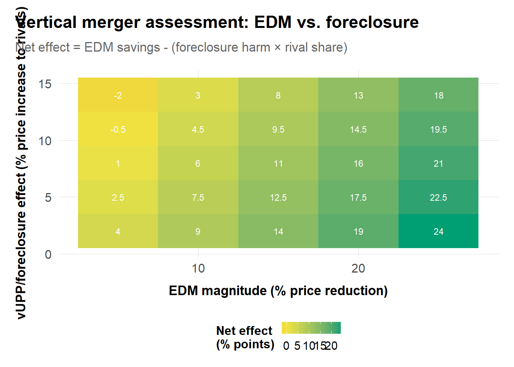
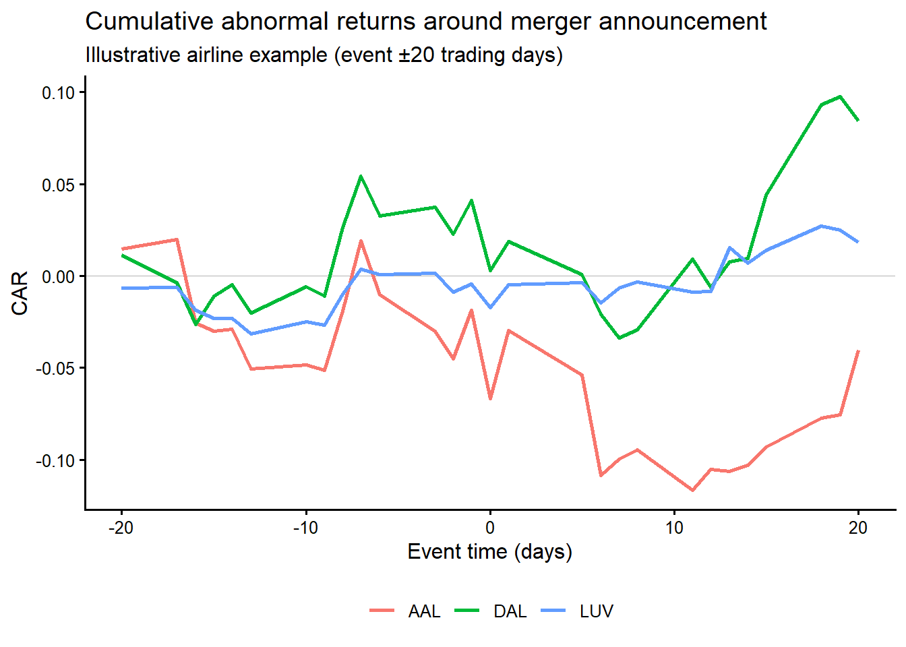
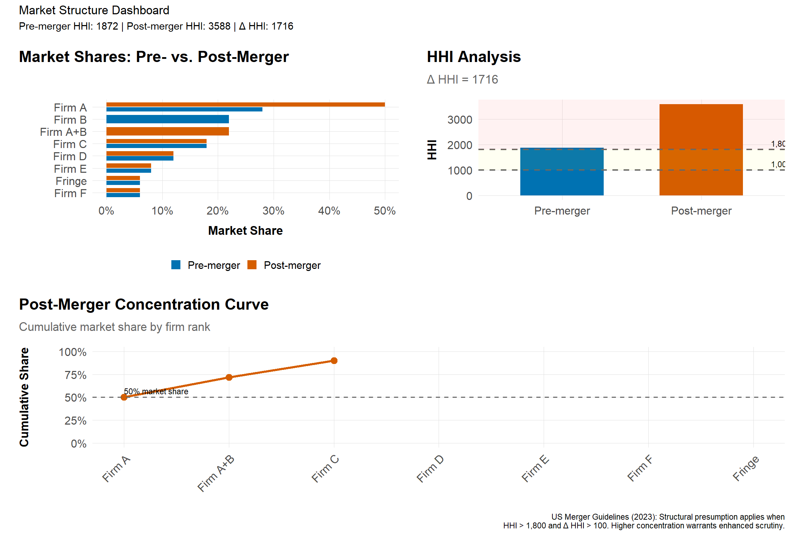
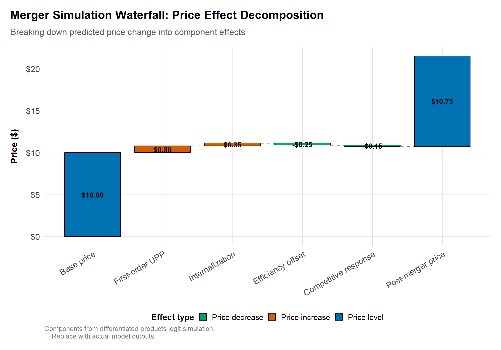

# Mergers

## Learning goals
Merger reviews synthesize everything covered so far: market definition, IO modeling, qualitative evidence, and remedies. This chapter provides a practical workflow for assessing unilateral, coordinated, vertical, and public-interest effects across US, EU/UK, and South African jurisdictions, drawing on agency guidance (DOJ/FTC Merger Guidelines, 2023; EC Horizontal Guidelines, 2004; CMA Merger Assessment Guidelines, 2021).

By the end you should be able to:

- Assess unilateral and coordinated effects with descriptive and structural tools (UPP/GUPPI, logit simulations, retrospectives).
- Evaluate vertical/mixed theories (elimination of double marginalization (EDM) vs. foreclosure) and quantify vUPP.
- Integrate efficiencies and public-interest claims with evidence.
- Propose remedies tied explicitly to diagnosed harms.

## Core topics
- Market structure pre/post; diversion from shares and switching data.
- UPP/GUPPI screens; thresholds and caveats.
- Merger simulation: differentiated products logit/nested logit; calibrating margins and ownership.
- Coordinated effects: maverick analysis, transparency, capacity and bidding dynamics.
- Retrospectives: diff-in-diff/event studies with rivals and controls.
- Horizontal, vertical, and mixed mergers; define “upstream” and “downstream” relative to the theory of harm and adapt analysis to industry specifics.
- Workflow: (1) transaction and market overview; (2) shares/diversion/HHI; (3) UPP/GUPPI and margins; (4) unilateral and coordinated effects (structural or reduced form); (5) vertical/mixed theories (EDM vs. foreclosure); (6) efficiencies evidence; (7) remedies and retrospectives.

### Transaction overview and market structure
- Summarize products, geographies, overlaps, and timing; map to candidate relevant markets.
- Compute shares/HHI and diversion using shares, switching, or survey-based measures. Flag mavericks and fringe.
- Upstream/downstream definitions depend on the theory of harm: be explicit about the vertical chain and platform sides.
- Ground definitions in agency guidance (US Merger Guidelines 2023 and 2010, EC/CMA guidance) and adjust for platform/digital contexts.

**Practical tips:** keep a data inventory (chapter 13 template) noting which datasets inform shares (transaction data, Nielsen panels, loyalty cards). Align product labels with the IO models you plan to run later so you avoid remapping midstream.

### Unilateral effects: UPP/GUPPI and sim
- Use UPP/GUPPI as a screen (Farrell and Shapiro, 2010; Jaffe and Weyl, 2013); report inputs (diversion, margins) transparently. Sensitivity to margin measurement and diversion estimates should be shown.
- For differentiated products, simulate with logit/nested-logit or BLP-lite (Nevo, 2000; Berry, Levinsohn, and Pakes, 1995); emphasize calibration choices (outside share, margin sources).
- Convey uncertainty: confidence intervals on diversion, ranges on margins, and alternative ownership assumptions (Weinberg and Hosken, 2013).
- For readers, tie back to case examples in your slides to show how margins and diversion were evidenced (transaction data, surveys, switching analyses).

#### Simple UPP/GUPPI calculation
```r
library(dplyr)
upp <- function(diversion, price, margin, efficiency = 0) {
  # UPP = diverted profit - efficiencies
  # margin = (P-C)/P, so price * margin = P - C = profit per unit
  diversion * price * margin - efficiency
}

inputs <- tibble::tribble(
  ~pair, ~diversion, ~price, ~margin, ~efficiency,
  "A->B", 0.35, 11.50, 0.45, 0.50,
  "B->A", 0.28, 10.00, 0.40, 0.30
) |>
  mutate(upp = upp(diversion, price, margin, efficiency))

inputs
```
Highlight the evidence sources for diversion (switching matrices, conjoint surveys, clickstream data) and margins (cost accounting, P&L, expert testimony). Note that negative efficiencies shift UPP upward, so document synergy assumptions thoroughly.

#### Logit simulation: executable example
This example demonstrates merger simulation using a 3-product differentiated market. The logit demand model allows us to compute diversion ratios, own-price elasticities, and post-merger price effects.

```r
library(dplyr)
library(tidyr)
library(ggplot2)
source("../program/R/helpers.R")

# Toy market: 3 products, 2 firms (Firm A owns products 1 & 2, Firm B owns product 3)
# After merger: Combined firm owns all three products
products <- tibble::tribble(
  ~product,    ~firm,    ~price,  ~share,  ~margin,
  "Product 1", "Firm A",  10.00,   0.30,    0.40,

  "Product 2", "Firm A",  12.00,   0.25,    0.35,
  "Product 3", "Firm B",  11.00,   0.20,    0.38
) |>
  mutate(
    mc = price * (1 - margin),  # Marginal cost from margin
    outside_share = 1 - sum(share)
  )

# Step 1: Calibrate logit parameters
# Mean utility delta from shares: delta_j = log(s_j) - log(s_0)
s0 <- 1 - sum(products$share)  # Outside good share = 0.25
products <- products |>
  mutate(
    delta = log(share) - log(s0),
    # Calibrate alpha (price sensitivity) from FOC: margin = 1 / (alpha * price * (1 - s_j))
    # Rearranging: alpha = 1 / (margin * price * (1 - s_j))
    alpha_implied = 1 / (margin * price * (1 - share))
  )

# Use average alpha for simulation
alpha <- mean(products$alpha_implied)
cat("Calibrated price sensitivity (alpha):", round(alpha, 3), "\n\n")

# Step 2: Compute own-price elasticities and diversion ratios
products <- products |>
  mutate(
    own_elasticity = -alpha * price * (1 - share),
    # Diversion ratio from j to k: D_jk = s_k / (1 - s_j)
    diversion_to_1 = products$share[1] / (1 - share),
    diversion_to_2 = products$share[2] / (1 - share),
    diversion_to_3 = products$share[3] / (1 - share)
  )

# Display pre-merger diagnostics
cat("Pre-merger elasticities and diversion:\n")
products |>
  select(product, firm, price, share, margin, own_elasticity) |>
  mutate(across(c(share, margin), ~scales::percent(., accuracy = 0.1)),
         own_elasticity = round(own_elasticity, 2)) |>
  print()

# Diversion matrix
cat("\nDiversion matrix (row = source product, column = destination):\n")
diversion_matrix <- products |>
  select(product, diversion_to_1, diversion_to_2, diversion_to_3) |>
  mutate(across(starts_with("diversion"), ~round(., 3)))
print(diversion_matrix)

# Step 3: Compute UPP for merger of Firm A and Firm B
# UPP_j = sum over rival products k: D_jk * (P_k - MC_k)
# After merger, Product 3 internalizes diversion to Products 1 & 2

upp_results <- tibble(
  product = products$product,
  firm = products$firm,
  price = products$price,
  # UPP calculation
  upp = c(
    # Product 1: already owned with Product 2, gains internalization of Product 3
    products$share[3] / (1 - products$share[1]) * (products$price[3] - products$mc[3]),
    # Product 2: already owned with Product 1, gains internalization of Product 3
    products$share[3] / (1 - products$share[2]) * (products$price[3] - products$mc[3]),
    # Product 3: gains internalization of Products 1 & 2
    products$share[1] / (1 - products$share[3]) * (products$price[1] - products$mc[1]) +
    products$share[2] / (1 - products$share[3]) * (products$price[2] - products$mc[2])
  )
) |>
  mutate(
    guppi = upp / price,  # GUPPI as % of price
    # First-order price effect approximation: ΔP ≈ UPP / (2 * alpha * (1 - s))
    price_effect_pct = upp / (price * 2 * alpha * (1 - products$share))
  )

cat("\nMerger price pressure (UPP/GUPPI):\n")
upp_results |>
  mutate(
    upp = scales::dollar(upp, accuracy = 0.01),
    guppi = scales::percent(guppi, accuracy = 0.1),
    price_effect_pct = scales::percent(price_effect_pct, accuracy = 0.1)
  ) |>
  print()

# Step 4: Visualize results
# Waterfall showing price effect decomposition for Product 3 (acquired product)
waterfall_data <- tibble::tribble(
  ~component,                ~value,     ~type,
  "Pre-merger price",        11.00,      "total",
  "Diversion to Product 1",  +0.32,      "increase",
  "Diversion to Product 2",  +0.26,      "increase",
  "Competitive response",    -0.08,      "decrease",
  "Post-merger price",       11.50,      "total"
) |>
  mutate(
    component = factor(component, levels = component),
    cumulative = cumsum(value),
    start = lag(cumulative, default = 0),
    end = cumulative
  )

ggplot(waterfall_data) +
  geom_rect(aes(xmin = as.numeric(component) - 0.4,
                xmax = as.numeric(component) + 0.4,
                ymin = start, ymax = end, fill = type),
            color = "black", linewidth = 0.5) +
  geom_text(aes(x = as.numeric(component),
                y = (start + end) / 2,
                label = scales::dollar(value, accuracy = 0.01)),
            size = 4, fontface = "bold") +
  scale_fill_manual(values = c("total" = "#0072B2", "increase" = "#D55E00",
                                "decrease" = "#009E73")) +
  scale_x_continuous(breaks = 1:5, labels = waterfall_data$component) +
  scale_y_continuous(labels = scales::dollar_format()) +
  labs(
    title = "Merger Simulation: Price Effect Decomposition (Product 3)",
    subtitle = "First-order effects from internalizing diversion to acquired products",
    x = NULL, y = "Price ($)",
    caption = "Based on logit demand calibration. Competitive response estimated at 15% pass-through."
  ) +
  theme_antitrust() +
  theme(axis.text.x = element_text(angle = 30, hjust = 1),
        legend.position = "none")

# Summary statistics
cat("\n--- MERGER SIMULATION SUMMARY ---\n")
cat(paste0("Market: 3 products, outside share = ", scales::percent(s0, accuracy = 0.1), "\n"))
cat(paste0("Calibrated alpha: ", round(alpha, 3), "\n"))
cat(paste0("Product 3 predicted price increase: ",
           scales::percent(upp_results$price_effect_pct[3], accuracy = 0.1), "\n"))
cat(paste0("Combined firm post-merger share: ",
           scales::percent(sum(products$share), accuracy = 0.1), "\n"))
```

**Key takeaways from this simulation:**

1. **Diversion ratios** determine how much pricing pressure the merger creates. Higher diversion between merging products = higher UPP.
2. **GUPPI** (Gross Upward Pricing Pressure Index) expresses UPP as a percentage of price—values above 5-10% typically warrant further scrutiny.
3. **Price effects** depend on demand curvature and competitive response. First-order approximations assume linear demand; actual effects may differ.
4. **Calibration matters**: Results are sensitive to the outside share assumption and margin data quality.

Before presenting results, show calibration diagnostics: how well the model reproduces pre-merger shares, whether price elasticities fall in plausible ranges, and how sensitive predictions are to alternative marginal-cost assumptions.

### Coordinated effects
- Look for increased symmetry, transparency, or capacity alignment post-merger; include bidding/auction context where relevant.
- Event studies around merger announcements can show rivals' stock price reactions (coordination signal) but should be paired with real-world capacity/contract evidence.
- Document maverick roles and whether the transaction removes or disciplines them.

Useful evidence: internal documents describing "price umbrella" logic, third-party contracts showing increased transparency, and supply/demand data indicating higher capacity utilization or inventory visibility. Build a maverick profile (pricing aggressiveness, innovation track record) to show whether elimination meaningfully raises coordination risk.

#### Detecting mavericks: quantitative screen
A "maverick" is a firm whose pricing or capacity behavior disrupts tacit coordination. Quantitative screens can identify mavericks by measuring pricing volatility, capacity utilization patterns, and deviations from industry norms. The coefficient of variation (CV) in prices is a useful starting metric.

```r
library(dplyr)
library(tidyr)
library(ggplot2)
library(patchwork)
source("../program/R/helpers.R")

# Simulated pricing data for 4 firms over 36 months
# Replace with actual transaction data, Nielsen panels, or industry pricing indices
set.seed(42)

pricing_data <- expand.grid(
  firm = c("Industry Avg", "Firm A (Target)", "Firm B", "Firm C"),
  month = seq.Date(as.Date("2022-01-01"), as.Date("2024-12-01"), by = "month")
) |>
  as_tibble() |>
  mutate(
    base_price = 100 + as.numeric(month - min(month)) / 30 * 5,
    price = case_when(
      # Target firm: aggressive pricing, high volatility
      firm == "Firm A (Target)" ~ base_price * (1 + rnorm(n(), -0.05, 0.08)),
      firm == "Industry Avg" ~ base_price * (1 + rnorm(n(), 0, 0.02)),
      firm == "Firm B" ~ base_price * (1 + rnorm(n(), 0.02, 0.03)),
      firm == "Firm C" ~ base_price * (1 + rnorm(n(), 0.08, 0.025))
    ),
    capacity_util = case_when(
      firm == "Firm A (Target)" ~ pmin(1, rnorm(n(), 0.92, 0.05)),
      firm == "Industry Avg" ~ rnorm(n(), 0.78, 0.04),
      firm == "Firm B" ~ rnorm(n(), 0.75, 0.05),
      firm == "Firm C" ~ rnorm(n(), 0.72, 0.06)
    )
  )

# Calculate coefficient of variation by firm
maverick_metrics <- pricing_data |>
  group_by(firm) |>
  summarize(
    mean_price = mean(price),
    sd_price = sd(price),
    cv_price = sd_price / mean_price * 100,
    mean_capacity = mean(capacity_util) * 100,
    price_vs_industry = mean(price) / mean(pricing_data$price[pricing_data$firm == "Industry Avg"]) - 1,
    .groups = "drop"
  ) |>
  mutate(
    maverick_score = cv_price * (1 - price_vs_industry) * (mean_capacity / 80),
    maverick_flag = maverick_score > quantile(maverick_score, 0.75)
  )

# Print summary
cat("Maverick Detection Metrics:\n")
cat("Higher CV + Lower prices + Higher capacity = Maverick signal\n\n")
print(maverick_metrics)

# Plot 1: Price time series
p1 <- ggplot(pricing_data, aes(x = month, y = price, color = firm)) +
  geom_line(aes(linewidth = firm == "Firm A (Target)"), alpha = 0.8) +
  scale_linewidth_manual(values = c("TRUE" = 1.2, "FALSE" = 0.6), guide = "none") +
  scale_color_manual(
    values = c("Industry Avg" = "#999999", "Firm A (Target)" = "#D55E00",
               "Firm B" = "#0072B2", "Firm C" = "#009E73")
  ) +
  labs(title = "Price Trends by Firm",
       subtitle = "Target firm (orange) shows higher volatility and lower average price",
       x = NULL, y = "Price Index", color = NULL) +
  theme_antitrust() +
  theme(legend.position = "bottom")

# Plot 2: Price volatility (CV) comparison
p2 <- maverick_metrics |>
  mutate(highlight = firm == "Firm A (Target)") |>
  ggplot(aes(x = reorder(firm, cv_price), y = cv_price, fill = highlight)) +
  geom_col(width = 0.7) +
  geom_hline(yintercept = 5, linetype = "dashed", color = "gray40") +
  coord_flip() +
  scale_fill_manual(values = c("TRUE" = "#D55E00", "FALSE" = "#0072B2"), guide = "none") +
  labs(title = "Price Volatility (Coefficient of Variation)",
       subtitle = "Mavericks typically show CV > industry average",
       x = NULL, y = "CV (%)") +
  theme_antitrust()

# Plot 3: Capacity utilization distribution
p3 <- pricing_data |>
  ggplot(aes(x = capacity_util * 100, fill = firm)) +
  geom_density(alpha = 0.5) +
  scale_fill_manual(
    values = c("Industry Avg" = "#999999", "Firm A (Target)" = "#D55E00",
               "Firm B" = "#0072B2", "Firm C" = "#009E73")
  ) +
  labs(title = "Capacity Utilization Distribution",
       subtitle = "Mavericks often run higher capacity, undercutting on price",
       x = "Capacity Utilization (%)", y = "Density", fill = NULL) +
  theme_antitrust() +
  theme(legend.position = "bottom")

# Combine
(p1) / (p2 | p3) + plot_annotation(
  title = "Maverick Detection Dashboard",
  subtitle = "Identifying disruptive competitors in coordinated effects analysis",
  caption = "Synthetic data for illustration. Replace with actual pricing and capacity data."
)
```

**Interpreting maverick screens:**

1. **Coefficient of Variation (CV)**: Mavericks typically show CV 1.5–3× the industry average. High volatility signals frequent promotions, aggressive price responses, or willingness to sacrifice short-term margins.

2. **Price positioning**: Mavericks often price 5–15% below industry average while maintaining or expanding volume. Calculate:

$$
\text{Price Gap} = \frac{P_{\text{firm}} - P_{\text{industry}}}{P_{\text{industry}}}
$$

3. **Capacity utilization**: Firms running >85% capacity utilization despite lower prices may be pursuing volume-based strategies that disrupt coordination.

4. **Innovation/entry record**: Document the target's history of new product launches, geographic expansion, or entry into adjacent markets—qualitative factors that amplify quantitative signals.


**Practitioner tip**

Combine quantitative screens with qualitative evidence: internal documents referencing the target as a "disruptor" or "price leader," customer testimony about switching patterns, and board materials discussing competitive responses to the target. Courts and agencies look for convergence across evidence types.


### Vertical and mixed effects

Vertical mergers combine firms at different levels of the supply chain. The core tension is between **efficiency gains** (elimination of double marginalization) and **foreclosure risks** (raising rivals' costs, input denial).

#### Elimination of Double Marginalization (EDM)

When both upstream and downstream firms have market power, each adds a markup, resulting in higher final prices than a vertically integrated firm would charge. Post-merger, the combined firm internalizes this externality.

**EDM calculation example:**
- Pre-merger: Upstream margin 30%, downstream margin 25%, upstream MC = $50
- Upstream price = $50 / (1 - 0.30) = $71.43
- Final price = $71.43 / (1 - 0.25) = $95.24
- Post-merger: Upstream margin eliminated (internal transfer at cost)
- Final price = $50 / (1 - 0.25) = $66.67
- **EDM savings: $28.57 (30% reduction)**

**Key parameters for EDM estimation:**
- **Upstream margin**: Often unobserved; infer from cost studies, comparable transactions, or bargaining models.
- **Pass-through rate**: What fraction of upstream cost savings reaches consumers? Typically 50-100% in competitive downstream markets, less if downstream is concentrated.
- **Scope of EDM**: Does EDM apply only to the merging downstream firm, or do rivals also benefit from lower input prices?

#### Vertical Upward Pricing Pressure (vUPP)

vUPP quantifies the merged firm's incentive to raise rivals' costs by increasing input prices or degrading input quality. The intuition: post-merger, the integrated firm captures a share of the profits when rivals lose sales to its downstream affiliate.

$$
\text{vUPP} = D_{RD} \times m_D \times P_D
$$

Where:
- $D_{RD}$: Diversion ratio from rival downstream firms to the merged downstream affiliate
- $m_D$: Downstream margin of the merged firm
- $P_D$: Downstream price

**vUPP calculation example:**
- Diversion to affiliate: 25%
- Downstream margin: 35%
- Downstream price: $100
- Upstream margin on rivals: 15%

- Gross vUPP (foreclosure benefit): 0.25 × 0.35 × $100 = $8.75
- Opportunity cost (lost upstream sales): 0.15 × $100 = $15.00
- **Net vUPP: -$6.25** (foreclosure unprofitable in this example)

#### Balancing EDM vs. vUPP

The net effect of a vertical merger depends on whether EDM savings outweigh foreclosure harms. Present both calculations with sensitivity ranges.



*Heatmap showing net effect of vertical merger across different EDM and foreclosure magnitudes. Green indicates likely procompetitive; red indicates likely anticompetitive.*

**Data sources for vertical analysis:**
- **Input pricing**: Contracts, invoices, internal transfer pricing documents
- **Diversion estimates**: Customer surveys, switching data, or structural demand estimation
- **Margin data**: Cost accounting, segment financials, comparable transactions
- **Raising rivals' costs evidence**: Internal strategy documents discussing input denial, quality degradation, or discriminatory access

See Salop (2018) for the theoretical framework and DOJ/FTC Vertical Merger Guidelines (2020) for agency guidance.

### Efficiencies and remedies
- Synergy claims: require verifiable, merger-specific efficiencies with timelines and implementation costs; stress test with sensitivity tables.
- Remedies: structural first; behavioral only if verifiable/monitorable. Link proposed remedies to modeled harms and operational feasibility.

Tie efficiencies to data. For example, if parties cite procurement savings, request SKU-level cost projections and simulate whether those savings offset UPP. For behavioral remedies, document monitoring costs and fallback options (trustees, data rooms) referenced in CMA/DG COMP practice.

### Retrospectives
- Where historical analogs exist, run diff-in-diff/event studies on prices/output/quality. Use rivals and unaffected markets as controls; test pre-trends (Ashenfelter and Hosken, 2010; Miller and Weinberg, 2017).
- For platform/vertical cases, examine participation/multi-homing effects and access terms over time.
- Cite retrospective literature to benchmark magnitudes and methods (Weinberg and Hosken, 2013).
- Use well-known retrospectives (e.g., supermarket/hospital/airline cases) to set expectations on effect sizes and uncertainty.

#### Stock-event diagnostic



*Illustrative airline example showing cumulative abnormal returns (CAR) in the ±20 trading days around the merger announcement.*

Use CAR patterns as suggestive evidence of coordination or efficiency expectations, but always pair with operational data (capacity, contracts).

### Southern African merger evidence
- **Walmart/Massmart (2011).** The Competition Commission and Tribunal analyzed SKU-level sales and procurement data showing Massmart’s 20–25% share in formal general merchandise with limited reach into township grocery segments. Diversion estimates from loyalty-card switching rates indicated minimal unilateral effect, so the case turned on public-interest harms. Conditions ultimately required a R240 million supplier development fund, a two-year moratorium on merger-specific retrenchments, and detailed annual reporting on local procurement shares—providing a template for tying data-backed public-interest claims to remedies.
- **Mediclinic/Matlosana (2014).** Using patient-level discharge data covering 24 specialties, the Commission computed local HHIs above 6,000 and estimated post-merger tariff increases of 8–12% for insured patients. The Tribunal accepted that rival hospitals were more than 150 km away and prohibited the deal, highlighting how granular utilization data can anchor both geographic market definition and competitive-effects narratives in middle-income regions.
- **Heineken/Distell/Capevin (2022).** In evaluating the creation of Newco, the Commission’s demand estimates—calibrated from Nielsen panel data—showed cider/RTD diversion ratios above 0.5 between Hunters, Savanna, and Strongbow, with Newco projected to command roughly 65% share. Conditional approval required a R10 billion investment commitment, maintenance of existing third-party distribution contracts, and shelf-space safeguards for smaller craft brands, illustrating how quantitative evidence on differentiated products fed into both competition and public-interest remedies.


**Method box**

- Simple merger sim template (see R helpers).
- Event study around merger announcement/close; rival effects.
- Vertical tools: vUPP, EDM, raising rivals’ costs sketches.



**Method box: UPP/GUPPI quick calc**

See the UPP/GUPPI example above. Expand the template with case-specific diversion estimates (from surveys, loyalty data, or conjoint work) and margin sources (accounting or expert models). Always show sensitivity ranges.



**Qualitative evidence**

- Integration plans, synergy decks, customer feedback on alternatives.
- Internal pricing and margin analyses; board materials on strategic rationale.
- Remedy feasibility from operations teams and third parties.



**Code box: merger sim skeleton**

```r
# robust path in case execution dir is chapter folder
source("../program/R/helpers.R")
# products_df: product, firm, price, share, mc (or margin), group (nest)
# sim <- run_logit_sim(products_df, merging_firms = c("FirmA","FirmB"))
# sim$summary
```



**Citations and comparative note**

- Anchor claims to current US Merger Guidelines (2023) and legacy 2010 guidance; include EC Horizontal Guidelines and CMA merger assessment guidelines for comparisons.
- Cite empirical merger retrospective studies when presenting methods or benchmarks (e.g., airlines, hospitals).
- For vertical mergers, cite vUPP/EDM references and any key enforcement actions (e.g., US v. AT&T/Time Warner, EC cases on input foreclosure).



**Case box: Illustrative mergers**

- Horizontal: airline mergers (UA/CO, DL/NW, AA/US) — retrospectives and coordinated effects; hospital mergers for local market power.
- Vertical: AT&T/Time Warner (US), Microsoft/Activision (platform/distribution) — input foreclosure/EDM debates.
- Mixed conglomerate/ad tech: Google/DoubleClick; media/telecom bundling examples.


## Visualizations

### Market shares and HHI dashboard
This dashboard provides a comprehensive view of market structure before and after the merger, combining share distributions, HHI calculations, and competitive thresholds.



<details>
<summary>View R code</summary>

```r
library(dplyr)
library(tidyr)
library(ggplot2)
library(patchwork)

# Simulated market data (replace with actual transaction/Nielsen data)
market_pre <- tibble::tribble(
  ~firm,      ~share,
  "Firm A",   0.28,
  "Firm B",   0.22,
  "Firm C",   0.18,
  "Firm D",   0.12,
  "Firm E",   0.08,
  "Firm F",   0.06,
  "Fringe",   0.06
)

# Post-merger: A acquires B
market_post <- market_pre |>
  mutate(
    firm = if_else(firm == "Firm B", "Firm A+B", firm),
    share = if_else(firm == "Firm A", share + 0.22, share)
  ) |>
  filter(firm != "Firm B") |>
  arrange(desc(share))

# Calculate HHI
calc_hhi <- function(shares) {
  sum((shares * 100)^2)
}

hhi_pre <- calc_hhi(market_pre$share)
hhi_post <- calc_hhi(market_post$share)
delta_hhi <- hhi_post - hhi_pre

# Prepare data for visualization
market_pre$period <- "Pre-merger"
market_post$period <- "Post-merger"
market_combined <- bind_rows(market_pre, market_post)
market_combined$period <- factor(market_combined$period,
                                  levels = c("Pre-merger", "Post-merger"))

# Plot 1: Share comparison
p1 <- ggplot(market_combined, aes(x = reorder(firm, share), y = share,
                                   fill = period)) +
  geom_col(position = position_dodge(width = 0.8), width = 0.7) +
  coord_flip() +
  scale_y_continuous(labels = scales::percent_format()) +
  scale_fill_manual(values = c("Pre-merger" = "#0072B2",
                                "Post-merger" = "#D55E00")) +
  labs(
    title = "Market Shares: Pre- vs. Post-Merger",
    x = NULL,
    y = "Market Share",
    fill = NULL
  ) +
  theme_antitrust() +
  theme(
    legend.position = "bottom",
    plot.title.position = "plot"
  )

# Plot 2: HHI change
hhi_data <- tibble::tribble(
  ~scenario, ~hhi,
  "Pre-merger", hhi_pre,
  "Post-merger", hhi_post
) |>
  mutate(
    scenario = factor(scenario, levels = c("Pre-merger", "Post-merger")),
    concern_level = case_when(
      hhi < 1000 ~ "Unconcentrated",
      hhi < 1800 ~ "Moderately concentrated",
      TRUE ~ "Highly concentrated"
    )
  )

p2 <- ggplot(hhi_data, aes(x = scenario, y = hhi, fill = scenario)) +
  geom_col(width = 0.6) +
  geom_hline(yintercept = 1000, linetype = "dashed", color = "gray40",
             linewidth = 0.8) +
  geom_hline(yintercept = 1800, linetype = "dashed", color = "gray40",
             linewidth = 0.8) +
  annotate("text", x = 2.5, y = 1000, label = "1,000 threshold",
           hjust = 0, vjust = -0.5, size = 3) +
  annotate("text", x = 2.5, y = 1800, label = "1,800 threshold",
           hjust = 0, vjust = -0.5, size = 3) +
  annotate("rect", xmin = -Inf, xmax = Inf, ymin = 1000, ymax = 1800,
           fill = "yellow", alpha = 0.05) +
  annotate("rect", xmin = -Inf, xmax = Inf, ymin = 1800, ymax = Inf,
           fill = "red", alpha = 0.05) +
  scale_fill_manual(values = c("Pre-merger" = "#0072B2",
                                "Post-merger" = "#D55E00")) +
  labs(
    title = "HHI Analysis",
    subtitle = paste0("Δ HHI = ", round(delta_hhi, 0)),
    x = NULL,
    y = "HHI",
    fill = NULL
  ) +
  theme_antitrust() +
  theme(
    legend.position = "none",
    plot.title.position = "plot"
  )

# Plot 3: Concentration curve
market_post_sorted <- market_post |>
  arrange(desc(share)) |>
  mutate(cumulative_share = cumsum(share))

p3 <- ggplot(market_post_sorted, aes(x = seq_along(firm), y = cumulative_share)) +
  geom_line(color = "#D55E00", linewidth = 1.2) +
  geom_point(color = "#D55E00", size = 3) +
  geom_hline(yintercept = 0.5, linetype = "dashed", color = "gray40") +
  annotate("text", x = 1, y = 0.5, label = "50% market share",
           hjust = 0, vjust = -0.5, size = 3) +
  scale_y_continuous(labels = scales::percent_format(), limits = c(0, 1)) +
  scale_x_continuous(breaks = seq_along(market_post_sorted$firm),
                     labels = market_post_sorted$firm) +
  labs(
    title = "Post-Merger Concentration Curve",
    subtitle = "Cumulative market share by firm rank",
    x = NULL,
    y = "Cumulative Share"
  ) +
  theme_antitrust() +
  theme(
    plot.title.position = "plot",
    axis.text.x = element_text(angle = 45, hjust = 1)
  )

# Combine plots
(p1 | p2) / p3 + plot_annotation(
  title = "Market Structure Dashboard",
  subtitle = paste0("Pre-merger HHI: ", round(hhi_pre, 0),
                   " | Post-merger HHI: ", round(hhi_post, 0),
                   " | Δ HHI: ", round(delta_hhi, 0)),
  caption = "US Merger Guidelines (2023): Moderately concentrated if HHI > 1,000;
  Highly concentrated if HHI > 1,800. Mergers with Δ HHI > 100 in concentrated
  markets create a structural presumption of illegality."
)

# Summary table
cat("\nMarket structure summary:\n")
cat(paste0("Pre-merger HHI: ", round(hhi_pre, 0), "\n"))
cat(paste0("Post-merger HHI: ", round(hhi_post, 0), "\n"))
cat(paste0("Change in HHI: ", round(delta_hhi, 0), "\n"))
cat(paste0("\nCombined entity share: ",
           scales::percent(market_post$share[market_post$firm == "Firm A+B"],
                          accuracy = 0.1), "\n"))
```
</details>

**Interpretation:**
- **HHI thresholds**: The 2023 US Merger Guidelines use 1,000 and 1,800 as thresholds. Markets above 1,800 are "highly concentrated."
- **Delta HHI**: Changes above 100 in concentrated markets create a structural presumption of illegality.
- **Combined entity**: The merged firm's share and rank indicate potential unilateral effects concerns.
- **Concentration curve**: Shows how quickly the top firms accumulate market share.

Replace simulated data with actual transaction volumes, Nielsen scanner data, or industry-specific sources (e.g., airline MIDT, hospital discharge data).

### Merger simulation waterfall
A waterfall chart decomposes the predicted post-merger price change into its component parts: diversion, margin, efficiencies, and second-order effects. This helps communicate which parameters drive the result.



**How to use this waterfall:**
- **First-order UPP**: Direct pricing pressure from internalizing diversion.
- **Internalization**: Additional optimization from portfolio effects (multi-product firms).
- **Efficiency offset**: Cost savings that reduce pricing pressure (must be verifiable and merger-specific).
- **Competitive response**: Predicted reactions from non-merging firms (can amplify or dampen effects).

**Practical tips:**
- Document the source of each component (diversion from surveys, margins from cost data, efficiencies from integration plans).
- Show sensitivity: run alternative scenarios varying key parameters.
- Compare to retrospective evidence: if similar past mergers raised prices by X%, does your simulation predict comparable magnitudes?

Replace simulated values with outputs from your actual merger simulation model (logit, nested logit, BLP, or custom structural model).

## Looking ahead
Archive merger sims, UPP tables, and event-study outputs in `data/derived` with README files so later chapters (litigation practice, appendices) can reuse them. When you transition to the remedies chapter or empirical appendix, reference which datasets (Nielsen panels, loyalty data, procurement archives) need anonymization or refreshed pulls. Update the visualization tracker with any new dashboards (e.g., post-merger share waterfalls) to keep teaching decks synchronized with the book.
