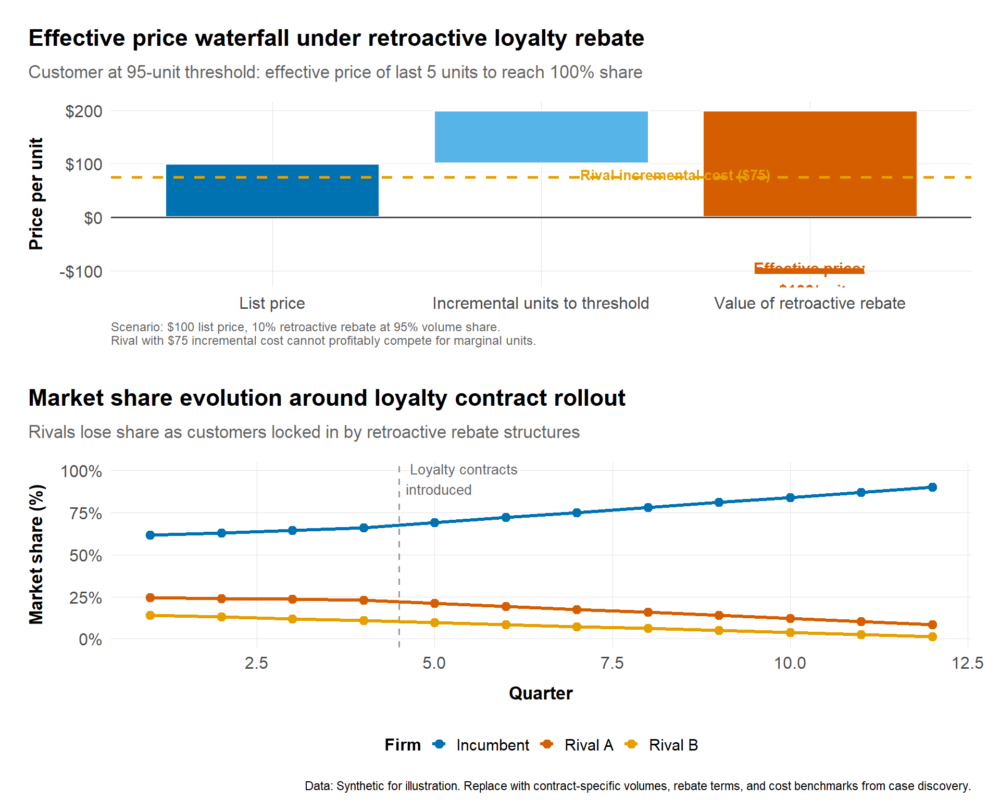
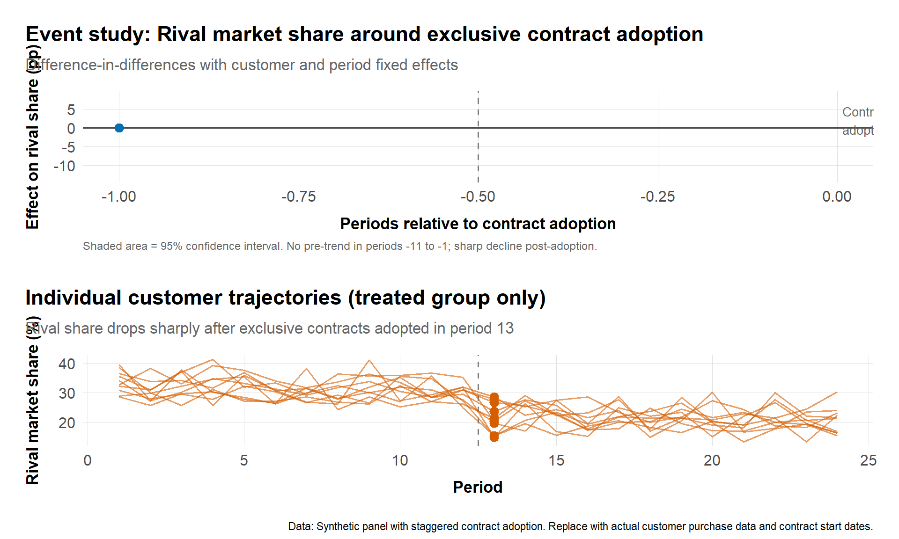
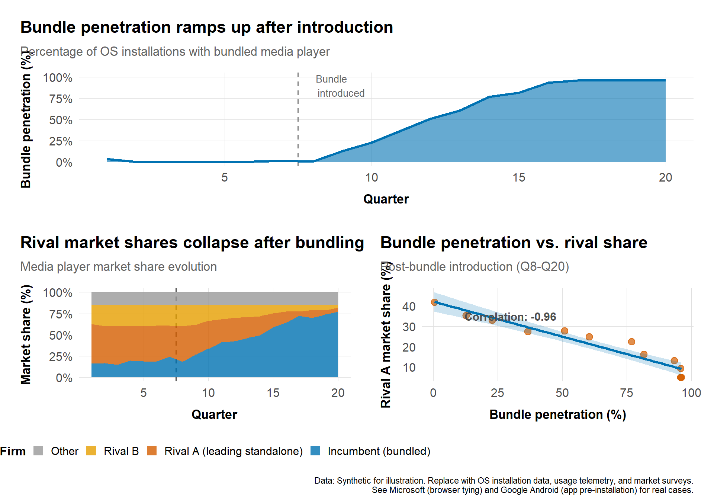
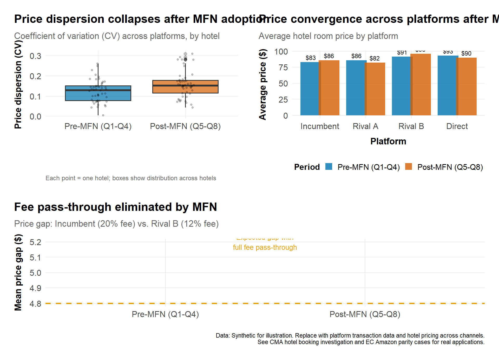
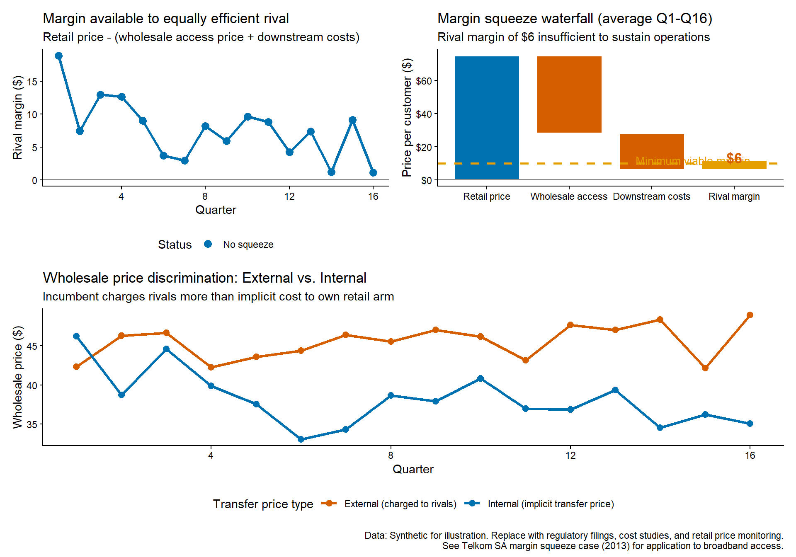
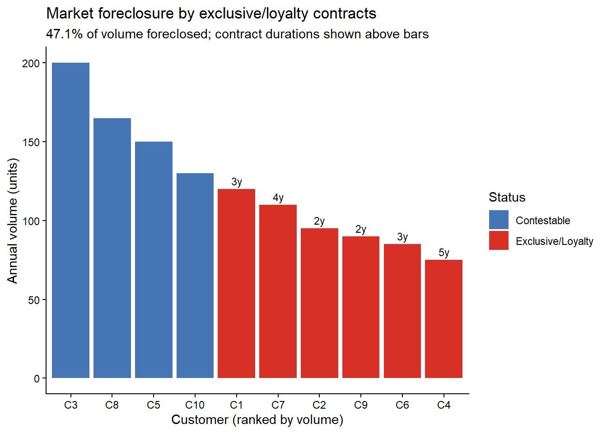

# Monopolization and Exclusion {#sec-monopolization}

The previous chapter examined mergers---transactions that combine formerly independent firms. This chapter turns to conduct by firms that already possess substantial market power. How do dominant firms exclude rivals? When does aggressive competition cross the line into antitrust violation? And how do we measure the harm from exclusionary practices?

These questions require us to integrate all the tools developed so far. Market definition establishes dominance. The IO toolkit provides pricing and foreclosure models. And research design principles guide our empirical measurement of competitive effects. But monopolization cases also demand particular attention to intent evidence and business justifications, making the interplay between quantitative and qualitative evidence especially critical.

## Learning goals
- Analyze exclusionary conduct (predation, rebates, tying, MFNs, vertical restraints).
- Connect theory to measurable foreclosure and consumer harm.
- Use qualitative evidence to show strategy and intent, paired with empirical outcomes.

## Core topics
- Price-cost tests (Areeda-Turner variants), effective price with rebates/loyalty programs.
- Foreclosure metrics: share of market foreclosed, rivals' scale and entry conditions.
- Tying/bundling: uptake, defaults, switching costs, interoperability constraints.
- MFNs/parity: price dispersion effects, platform fee pass-through.
- Workflow: (1) conduct and theory of harm; (2) market power assessment; (3) mechanism (exclusion/predation/raising rivals' costs); (4) empirical effects; (5) countervailing efficiencies/justifications; (6) remedy fit.

## Introduction

Monopolization analysis sits at the intersection of conduct, market structure, and effects. Unlike merger review—which evaluates a prospective transaction—monopolization cases reconstruct historical patterns of behavior and ask whether a dominant firm has maintained or extended its position through exclusionary means rather than through competition on the merits. Section 2 of the Sherman Act in the United States and Article 102 of the Treaty on the Functioning of the European Union (TFEU) frame the legal standards, but enforcement priorities and evidentiary approaches differ substantially across jurisdictions.

This chapter provides a structured workflow for analyzing monopolization claims. We begin with market power assessment, drawing on tools from Chapter 3 (market definition) and Chapter 4 (IO toolkit). We then turn to specific conduct categories—predation, rebates and loyalty programs, tying and bundling, most-favored-nation clauses, vertical restraints, and refusal to deal. For each, we pair theoretical mechanisms with empirical measurement strategies and qualitative evidence that together build a coherent narrative. The chapter concludes with remedy design considerations and a set of case exemplars that illustrate how different jurisdictions approach the same exclusionary practices.

Throughout, we emphasize reproducibility and transparency. Code boxes demonstrate how to compute effective prices, assess foreclosure shares, and visualize event patterns around contract adoptions. Qualitative evidence boxes highlight the documentary and testimonial sources that complement quantitative analyses. Case boxes anchor abstract principles in real enforcement actions, drawing on landmark decisions from the United States, European Union, and Southern Africa.

For deeper context, consult the extensive case law on exclusionary conduct, including landmark decisions like *United States v. Microsoft* (*United States v. Microsoft*, 2001) and the European Commission's decisions on abuse of dominance (EC Article 102 Guidance, 2009). For theoretical foundations, see (Whinston, 2006) and (Salop & Scheffman, 1983) on raising rivals' costs.

## Market power and the monopolization workflow


**Monopolization Analysis Workflow**

```
STEP 1: MARKET POWER          STEP 2: CONDUCT               STEP 3: EFFECTS
       |                            |                            |
       v                            v                            v
+----------------+           +----------------+           +----------------+
| Market         |           | Identify       |           | Measure        |
| definition     |           | conduct type:  |           | foreclosure &  |
| (Ch 3)         |---------->| - Predation    |---------->| harm:          |
|                |           | - Rebates      |           | - Share loss   |
+----------------+           | - Tying        |           | - Entry/exit   |
       |                     | - MFNs         |           | - Price effects|
       v                     | - Refusal      |           +----------------+
+----------------+           +----------------+                  |
| Dominance      |                  |                            v
| evidence:      |                  v                     +----------------+
| - Shares >50%  |           +----------------+           | Compare to     |
| - Barriers     |           | Articulate     |           | counterfactual |
| - Duration     |           | mechanism:     |           | (absent        |
+----------------+           | - Raise costs  |           | conduct)       |
                             | - Deny scale   |           +----------------+
                             | - Leverage     |
                             +----------------+
                                    |
          +---------+---------------+---------------+---------+
          |                         |                         |
          v                         v                         v
STEP 4: JUSTIFICATIONS    STEP 5: BALANCING         STEP 6: REMEDIES
+----------------+        +----------------+        +----------------+
| Business       |        | Harm vs.       |        | Structural vs. |
| rationale:     |------->| efficiency     |------->| behavioral:    |
| - Efficiencies |        | tradeoff       |        | - Divestiture  |
| - Investment   |        | (Rule of       |        | - Conduct bans |
| - Quality      |        | reason / AEC)  |        | - Interop/API  |
+----------------+        +----------------+        +----------------+
```
**Key tests:** Sherman Act Section 2 (US) | Article 102 TFEU (EU) | SA Competition Act Section 8


### Establishing market power

Monopolization liability begins with market power. In the United States, courts typically require monopoly power—the ability to control prices or exclude competition—which is often proxied by a sustained market share above 60–70% in a properly defined relevant market (*United States v. Grinnell*, 1966). The European Union applies a lower threshold for dominance under Article 102 TFEU, with shares as low as 40% potentially qualifying when combined with barriers to entry and expansion (*AKZO*, 1991); (*United Brands*, 1978). These quantitative thresholds, however, must be buttressed by evidence of entry conditions, buyer power, and the duration of the firm's position.

**Quantitative indicators** include:

1. **Market shares**: Compute shares by revenue, volume, or capacity over multiple periods to demonstrate persistence. Use granular data (SKU-level, route-level, or platform-specific shares) when available. Cross-check shares against customer perceptions and bidding data.
2. **Entry conditions**: Examine regulatory barriers, network effects, switching costs, and capital requirements. Quantify entry attempts and failures; use survival analyses or hazard models to assess entry likelihood.
3. **Buyer power**: Assess whether large customers can sponsor entry or credibly threaten backward integration. Use procurement data and contract terms to gauge buyer negotiating leverage.

**Qualitative indicators** reinforce these metrics:

- Internal documents describing the firm as "must-have" or discussing the consequences of losing access to the product.
- Customer interviews and surveys that reveal switching frictions or lack of acceptable alternatives.
- Board materials and strategic memos that acknowledge or plan around market power (e.g., pricing flexibility, entry deterrence strategies).

Together, these elements establish the baseline condition for monopolization: a firm with durable market power and the incentive to maintain or extend it.

### Two-sided platforms and the *Amex* framework

For platform markets, defining market power requires careful attention to two-sidedness. In *Ohio v. American Express* (2018), the US Supreme Court held that credit card networks are "transaction platforms" where merchants and cardholders transact simultaneously, so market definition and effects analysis must consider both sides together. The Court found that American Express's anti-steering provisions—which prevented merchants from steering customers to lower-fee cards—could not be condemned without showing net harm across both sides of the platform.

**Implications for monopolization analysis:**

1. **Transaction vs. non-transaction platforms:** *Amex* applies most clearly to platforms where the two sides transact together (payment cards, ride-sharing). For platforms where sides interact indirectly (media, search), courts remain divided on whether *Amex* requires unified market definition.
2. **Output measurement:** *Amex* suggests measuring total transaction volume across both sides, not just merchant fees. If higher merchant fees fund cardholder rewards that increase usage, net output may rise.
3. **Efficiencies integration:** Two-sided analysis bakes cross-subsidies and indirect network effects into the market definition stage, potentially shielding conduct that would appear anticompetitive if one side were examined in isolation.
4. **Burden of proof:** After *Amex*, plaintiffs challenging platform restraints bear a heavier initial burden to demonstrate net harm across both sides before shifting to justifications.

**Critiques and limitations:** Many economists argue *Amex* conflates market definition with competitive effects, allowing platforms to escape scrutiny by pointing to benefits on one side that may not offset harms on the other. The EU and other jurisdictions have not adopted the *Amex* framework, instead analyzing each side's competitive dynamics separately while considering cross-side effects in the effects analysis. For platform monopolization cases, be prepared to argue both unified and separated market definitions depending on jurisdiction.

### Articulating the theory of harm

Once market power is established, the analysis turns to conduct. Monopolization theories fall into several categories:

1. **Predatory pricing**: pricing below cost to drive out rivals or deter entry, with a credible prospect of recouping losses through higher prices later.
2. **Exclusive dealing and loyalty rebates**: contracts or pricing structures that foreclose a substantial share of the market to rivals, raising their costs or denying them minimum efficient scale.
3. **Tying and bundling**: leveraging dominance in one market to disadvantage rivals in another, either through contractual ties or technical integration (e.g., defaults, degraded interoperability).
4. **Most-favored-nation (MFN) clauses**: contractual provisions that prevent trading partners from offering better terms elsewhere, chilling price competition and entrenching the dominant firm's position.
5. **Self-preferencing and vertical restraints**: a vertically integrated firm favoring its own downstream products over rivals' offerings on its platform or distribution network.
6. **Refusal to deal or denial of access**: withholding an essential input or interoperability without a legitimate business justification, where access is indispensable for rivals to compete.

Each theory requires alignment between the conduct, the mechanism of harm, and the expected effects. Align the data collection and empirical strategy to the specific mechanism: if the claim is that loyalty rebates foreclose rivals, measure the share of volume or capacity covered by the contracts and assess whether foreclosed volumes prevent rivals from reaching minimum efficient scale. If the claim is predatory pricing, compute effective prices net of rebates and compare to measures of avoidable or incremental cost, then model recoupment scenarios.

### Workflow summary

A complete monopolization analysis typically follows this sequence:

1. **Conduct description and theory of harm**: Document the challenged behavior (contracts, pricing, technical design) and articulate the exclusionary mechanism.
2. **Market power assessment**: Establish market shares, entry barriers, and buyer power with both quantitative and qualitative evidence.
3. **Mechanism and foreclosure**: Quantify the scope of foreclosure (volume, duration, exclusivity) and assess whether rivals are denied minimum efficient scale or face raised costs.
4. **Empirical effects**: Use natural experiments, event studies, or before/after comparisons to measure price, output, quality, or entry/exit effects attributable to the conduct.
5. **Efficiencies and justifications**: Evaluate procompetitive rationales (cost savings, quality improvements, incentive alignment) and whether less-restrictive alternatives are feasible.
6. **Remedies**: Design conduct or structural remedies that target the exclusionary mechanism without unduly chilling procompetitive conduct; specify monitoring and compliance requirements.

The remainder of this chapter elaborates on each conduct category, pairing theory with empirical methods and qualitative evidence.

## Exclusive dealing, loyalty rebates, and foreclosure

### Measuring foreclosure

Exclusive dealing and loyalty rebate programs aim to lock in a substantial share of customer demand, making it difficult or unprofitable for rivals to achieve minimum efficient scale. The central empirical question is: what share of the market is foreclosed, and for how long?

**Foreclosure metrics** include:

1. **Volume or capacity shares covered**: Sum the total volumes or capacities bound by exclusive or loyalty contracts as a percentage of total market demand. A foreclosure share above 40–50% may raise concerns, particularly if contracts are long-duration and staggered so that only a small fraction comes up for renewal in any given period.
2. **Minimum efficient scale (MES)**: Estimate the scale needed for rivals to compete effectively (e.g., plant capacity, distribution network density, platform-side critical mass). If the foreclosed share leaves rivals below MES, the conduct is more likely exclusionary.
3. **Contract duration and staggering**: Long-term contracts with staggered renewal dates can perpetuate foreclosure even if individual contracts expire. Quantify the fraction of demand available for contestation in each period.
4. **Exit and entry patterns**: Document whether rivals have exited or delayed entry coinciding with contract rollouts; use hazard models or event studies to link conduct to competitive structure.

**Effective price analysis for loyalty rebates**: Loyalty rebates condition discounts on purchasing all or a substantial share of requirements from the dominant firm. The effective price for incremental units—those that push the buyer over the loyalty threshold—can be significantly below the headline price, making it unprofitable for rivals to compete even if their costs are comparable.

To compute effective prices:

- Identify the rebate threshold (e.g., purchase 80% of requirements to qualify for a 10% rebate).
- Calculate the marginal benefit of reaching the threshold: if a buyer purchases 95 units at the list price and buying 5 more units triggers a 10% rebate on all 100 units, the effective price of those last 5 units is deeply negative.
- Compare effective prices to rivals' costs or list prices to assess whether contestation is feasible.

The European Commission's Intel decision (*Intel*, 2017) applied a version of this test, focusing on whether the rebates made it unprofitable for AMD to compete for incremental volumes even when AMD's products were technically competitive. The as-efficient competitor (AEC) test, refined post-Intel, requires showing that an equally efficient rival would be foreclosed.

#### Effective price waterfall for loyalty rebates

The following visualization demonstrates how loyalty rebates can create deeply negative effective prices for incremental units, making it unprofitable for equally efficient rivals to compete. This implements the as-efficient competitor (AEC) test framework used in EU competition enforcement.

```r
library(dplyr)
library(tidyr)
library(ggplot2)
library(patchwork)
source("program/R/helpers.R")

rebates <- tibble::tribble(
  ~tier, ~volume, ~list_price, ~rebate,
  "Baseline (0-79%)", 79, 100, 0,
  "Threshold units (80-99%)", 20, 100, 0,
  "Bonus units (100%+)", 10, 100, 0
) |>
  mutate(
    revenue = volume * list_price,
    cumulative_volume = cumsum(volume)
  )

# Scenario: Customer buying ~100 units, loyalty rebate triggers at 95% share
# List price $100/unit, 10% retroactive rebate at 95% threshold
# Rival has incremental cost of $75/unit

# Calculate effective prices under retroactive rebate
list_price <- 100
rebate_pct <- 0.10  # 10% retroactive rebate

# For the customer at threshold: buying 5 more units from incumbent triggers
# rebate on ALL 100 units = $1000 benefit, so effective price of last 5 units
# is (5 * 100 - 1000) / 5 = -$100 per unit

effective_price_data <- tibble::tribble(
  ~component,                      ~value,   ~category,
  "List price",                    100,      "baseline",
  "Incremental units to threshold", 100,     "marginal",
  "Value of retroactive rebate",   -1000/5,  "rebate",  # $1000 rebate / 5 marginal units
  "Effective price (last 5 units)", -100,    "effective"
)

# Waterfall chart showing effective price calculation
p_waterfall <- effective_price_data |>
  filter(component != "Effective price (last 5 units)") |>
  mutate(
    component = factor(component, levels = c("List price",
                                              "Incremental units to threshold",
                                              "Value of retroactive rebate")),
    end = cumsum(value),
    start = lag(end, default = 0),
    id = row_number()
  ) |>
  ggplot(aes(x = component)) +
  geom_rect(aes(xmin = id - 0.4, xmax = id + 0.4,
                ymin = start, ymax = end, fill = category),
            color = "white", linewidth = 0.8) +
  geom_hline(yintercept = 75, linetype = "dashed", color = "#E69F00", linewidth = 1) +
  geom_hline(yintercept = 0, color = "gray30") +
  annotate("text", x = 2.5, y = 80,
           label = "Rival incremental cost ($75)",
           color = "#E69F00", fontface = "bold", size = 3.5) +
  annotate("segment", x = 2.8, xend = 3.2, y = -100, yend = -100,
           color = "#D55E00", linewidth = 2) +
  annotate("text", x = 3, y = -115,
           label = "Effective price:\n-$100/unit",
           color = "#D55E00", fontface = "bold", size = 4) +
  scale_fill_manual(values = c("baseline" = "#0072B2",
                                "marginal" = "#56B4E9",
                                "rebate" = "#D55E00")) +
  scale_y_continuous(labels = scales::dollar_format()) +
  labs(
    title = "Effective price waterfall under retroactive loyalty rebate",
    subtitle = "Customer at 95-unit threshold: effective price of last 5 units to reach 100% share",
    x = NULL,
    y = "Price per unit",
    caption = "Scenario: $100 list price, 10% retroactive rebate at 95% volume share.\nRival with $75 incremental cost cannot profitably compete for marginal units."
  ) +
  theme_antitrust() +
  theme(
    legend.position = "none",
    plot.caption = element_text(hjust = 0, size = 9, color = "gray40"),
    axis.text.x = element_text(angle = 0, hjust = 0.5)
  )

# Market share evolution under loyalty contracts
share_evolution <- expand.grid(
  quarter = 1:12,
  firm = c("Incumbent", "Rival A", "Rival B")
) |>
  as_tibble() |>
  mutate(
    market_share = case_when(
      firm == "Incumbent" & quarter <= 4 ~ 60 + quarter * 1.5,
      firm == "Incumbent" & quarter > 4 ~ 66 + (quarter - 4) * 3,
      firm == "Rival A" & quarter <= 4 ~ 25 - quarter * 0.5,
      firm == "Rival A" & quarter > 4 ~ 23 - (quarter - 4) * 1.8,
      firm == "Rival B" & quarter <= 4 ~ 15 - quarter * 1,
      firm == "Rival B" & quarter > 4 ~ 11 - (quarter - 4) * 1.2
    ),
    market_share = pmax(market_share, 0)  # Floor at zero
  )

p_evolution <- ggplot(share_evolution, aes(x = quarter, y = market_share,
                                            color = firm, group = firm)) +
  geom_vline(xintercept = 4.5, linetype = "dashed", color = "gray60") +
  geom_line(linewidth = 1.2) +
  geom_point(size = 2.5) +
  annotate("text", x = 4.5, y = 95,
           label = "Loyalty contracts\nintroduced",
           hjust = -0.1, size = 3.5, color = "gray40") +
  scale_color_manual(values = c("Incumbent" = "#0072B2",
                                 "Rival A" = "#D55E00",
                                 "Rival B" = "#E69F00")) +
  scale_y_continuous(labels = scales::percent_format(scale = 1),
                     limits = c(0, 100)) +
  labs(
    title = "Market share evolution around loyalty contract rollout",
    subtitle = "Rivals lose share as customers locked in by retroactive rebate structures",
    x = "Quarter",
    y = "Market share (%)",
    color = "Firm"
  ) +
  theme_antitrust() +
  theme(legend.position = "bottom")

# Combine panels
p_waterfall / p_evolution +
  plot_annotation(
    caption = "Data: Synthetic for illustration. Replace with contract-specific volumes, rebate terms, and cost benchmarks from case discovery."
  )
```



**Data replacement:** Use actual customer purchase data and contract terms from litigation discovery. Calculate effective prices per customer segment; overlay rival cost estimates from cost studies or public financial statements. For share evolution, use market monitoring data or customer panel data tracking purchases before/after contract adoption.

**As-efficient competitor (AEC) test:** The waterfall shows that even an equally efficient rival (cost = $75) cannot profitably compete for the marginal units that trigger the rebate, as the effective price faced by the customer is deeply negative. This satisfies the AEC framework established in *Intel* (*Intel*, 2017) and subsequent EU enforcement.

### Qualitative evidence for rebates and exclusivity

Internal documents and customer testimony are critical complements to quantitative foreclosure metrics:

- **Strategy memos**: Documents revealing intent to foreclose rivals or lock in customers (e.g., "ensure [Rival] cannot reach scale," "defend our share through loyalty programs").
- **Contract negotiation histories**: Email chains and drafts showing how exclusivity or loyalty terms were introduced, customer resistance, and adjustments to overcome objections.
- **Customer interviews**: Testimony on switching costs, the importance of multi-sourcing for resilience, and coercion (explicit or implicit) to accept exclusive terms.
- **Sales force incentives**: Compensation structures that reward exclusivity or penalize customers who multi-source.

In the United States, the rule of reason standard for exclusive dealing (under Section 1 or Section 2) often weighs these qualitative factors heavily, looking for evidence that foreclosure was the purpose rather than a byproduct of legitimate incentives (*Tampa Electric v. Nashville Coal*, 1961). For economic analysis of exclusive dealing, see (Whinston, 2006) and (Ordover, Saloner & Salop, 1990) on vertical foreclosure.

### Event studies and staggered rollouts

If exclusive contracts or loyalty programs were introduced or renewed in a staggered fashion across regions, customers, or time periods, treat the rollout as a natural experiment:

1. Define treatment as the adoption of the contract or rebate program; define control customers or regions without contracts.
2. Use difference-in-differences with appropriate controls for pre-existing trends in customer purchasing patterns.
3. Examine outcomes such as rival market shares, entry/exit events, or prices paid to rivals.
4. Visualize event study coefficients to show dynamic effects before and after contract adoption.

When data are thin, simpler before/after comparisons combined with robust documentary evidence can still be persuasive. The key is transparency about identification assumptions and potential confounders.

> **Data tip:** For visuals in the roadmap (effective price waterfall, foreclosure share, rollout event analysis), start with sanitized versions of the loyalty-contract spreadsheets and rolling rollout trackers. Where you lack live case data, use synthetic templates in `data/examples/` so the Quarto build renders without confidential inputs; swap in case data during litigation prep.

#### Contract rollout event study

When exclusive contracts are adopted in staggered fashion across customers or regions, event study methods can isolate the causal effect of foreclosure on rival performance.

```r
library(dplyr)
library(tidyr)
library(ggplot2)
library(fixest)
library(patchwork)

# Simulate panel data: 20 customers observed for 24 periods
# Treatment (exclusive contract) rolled out to 10 customers in period 13
set.seed(123)
n_customers <- 20
n_periods <- 24
treatment_period <- 13
treated_customers <- paste0("C", 1:10)

panel_contracts <- expand.grid(
  customer_id = paste0("C", 1:n_customers),
  period = 1:n_periods
) |>
  as_tibble() |>
  mutate(
    treated = customer_id %in% treated_customers,
    post = period >= treatment_period,
    # Rival share baseline + customer FE + time trend
    rival_share_baseline = 30 +
      as.numeric(factor(customer_id)) * 0.5 -
      period * 0.2 +
      rnorm(n(), 0, 3),
    # Treatment effect: -8pp reduction in rival share post-contract
    treatment_effect = if_else(treated & post, -8, 0),
    rival_share = pmax(0, rival_share_baseline + treatment_effect + rnorm(n(), 0, 2))
  )

# Event study regression using fixest
# Interact treated indicator with relative time to treatment
panel_contracts <- panel_contracts |>
  mutate(rel_period = period - treatment_period)

# Estimate event study coefficients (omit period -1 as reference)
event_fit <- feols(
  rival_share ~ i(rel_period, treated, ref = -1) | customer_id + period,
  data = panel_contracts
)

# Extract coefficients for plotting
event_coefs <- broom::tidy(event_fit, conf.int = TRUE) |>
  filter(grepl("rel_period", term)) |>
  mutate(
    rel_period = as.numeric(gsub("rel_period::(.*):treated::TRUE", "\\1", term))
  ) |>
  # Add reference period (-1) with zero effect
  bind_rows(tibble(rel_period = -1, estimate = 0, std.error = 0,
                   conf.low = 0, conf.high = 0))

# Event study plot
p_event <- ggplot(event_coefs, aes(x = rel_period, y = estimate)) +
  geom_vline(xintercept = -0.5, linetype = "dashed", color = "gray50") +
  geom_hline(yintercept = 0, color = "gray30") +
  geom_ribbon(aes(ymin = conf.low, ymax = conf.high),
              alpha = 0.2, fill = "#0072B2") +
  geom_line(color = "#0072B2", linewidth = 1) +
  geom_point(size = 3, color = "#0072B2") +
  annotate("text", x = 0, y = 2,
           label = "Contract\nadoption",
           hjust = -0.1, size = 3.5, color = "gray40") +
  labs(
    title = "Event study: Rival market share around exclusive contract adoption",
    subtitle = "Difference-in-differences with customer and period fixed effects",
    x = "Periods relative to contract adoption",
    y = "Effect on rival share (pp)",
    caption = "Shaded area = 95% confidence interval. No pre-trend in periods -11 to -1; sharp decline post-adoption."
  ) +
  theme_antitrust() +
  theme(plot.caption = element_text(hjust = 0, size = 9, color = "gray40"))

# Customer-level treatment timing
treatment_timing <- panel_contracts |>
  filter(treated, period >= treatment_period) |>
  group_by(customer_id) |>
  slice(1) |>
  ungroup() |>
  mutate(cohort_label = paste0("Contract cohort (", treatment_period, ")"))

p_timing <- panel_contracts |>
  filter(customer_id %in% treated_customers) |>
  ggplot(aes(x = period, y = rival_share, group = customer_id)) +
  geom_vline(xintercept = treatment_period - 0.5, linetype = "dashed", color = "gray50") +
  geom_line(alpha = 0.6, color = "#D55E00") +
  geom_point(data = treatment_timing, aes(x = period, y = rival_share),
             size = 3, color = "#D55E00") +
  labs(
    title = "Individual customer trajectories (treated group only)",
    subtitle = "Rival share drops sharply after exclusive contracts adopted in period 13",
    x = "Period",
    y = "Rival market share (%)"
  ) +
  theme_antitrust()

p_event / p_timing +
  plot_annotation(
    caption = "Data: Synthetic panel with staggered contract adoption. Replace with actual customer purchase data and contract start dates."
  )
```



**Interpretation:** The event study coefficients show no pre-trend (flat estimates in periods -11 to -1), providing support for the parallel trends assumption. Post-adoption, rival share drops by ~8 percentage points, consistent with foreclosure. The individual trajectories confirm the aggregate pattern and reveal heterogeneity in treatment effects across customers.

**Data replacement:** Use customer-level purchase data with precise contract adoption dates. Estimate event studies separately for different contract types (exclusive vs. loyalty rebates) or customer segments. If contracts are truly staggered (different customers adopt at different times), use `fixest::sunab()` for heterogeneity-robust estimation (Callaway & Sant'Anna, 2021).

## Predatory pricing

### The price-cost test

Predatory pricing claims allege that a dominant firm sets prices below an appropriate measure of cost to drive out rivals or deter entry, with the expectation of recouping losses through supracompetitive prices once competition is eliminated. The canonical legal test, articulated in *Brooke Group* (*Brooke Group v. Brown & Williamson*, 1993), requires (1) pricing below an appropriate measure of cost, and (2) a dangerous probability of recouping the investment in below-cost pricing. The foundational economic framework was established by (Areeda & Turner, 1975).

**Cost benchmarks** in antitrust analysis include:

1. **Average variable cost (AVC)**: Costs that vary with output in the short run (materials, direct labor). Pricing below AVC is presumptively predatory under *Areeda-Turner* logic, as no rational profit-maximizing firm would price below AVC absent an exclusionary motive.
2. **Average avoidable cost (AAC)**: Costs that could be avoided by not producing (similar to AVC but may include some fixed costs avoidable in the medium term). AAC is increasingly favored in both US and EU practice as a more accurate measure of incremental cost.
3. **Long-run incremental cost (LRIC)** or **average total cost (ATC)**: Includes allocated fixed costs. Pricing between AAC and ATC may be exclusionary if combined with evidence of predatory intent and foreclosure effects, but is less likely to satisfy the *Brooke Group* standard in the United States.

**Computing effective prices**: When rebates, bundling, or loyalty discounts are present, compute the effective price paid per unit:

- If a customer receives a retroactive rebate upon reaching a volume threshold, the effective price for marginal units near the threshold can be far below the list price.
- Allocate fixed fees, upfront payments, or bundled-product discounts transparently across the relevant units.
- Use period-level data (monthly or quarterly) to capture the timing of rebates and costs.

**Recoupment analysis**: Even if prices are below cost, predation liability in the United States requires showing a dangerous probability of recoupment—that the predator can later raise prices to recover its losses. Assess recoupment by:

- Modeling post-exit pricing power: shares, entry barriers, and coordinated interaction prospects.
- Estimating the duration and magnitude of below-cost pricing and the time needed to recoup at elevated prices.
- Examining documents that discuss post-exit pricing strategies or barriers that would prevent re-entry.

The European Union historically placed less emphasis on explicit recoupment proofs, focusing instead on the exclusionary effect and intent. However, post-*Intel*, EU enforcers increasingly apply an as-efficient competitor framework that implicitly considers recoupment by asking whether exclusion harms consumers (*Intel*, 2017); (*Post Danmark*, 2012).

### Event patterns and qualitative evidence

Where price-cost tests are ambiguous—prices near AAC, cost allocation disputes, or multi-product settings—qualitative evidence and event patterns become dispositive:

- **Documents on strategy**: Emails or memos discussing "pricing [Rival] out of the market," "losing money to gain share," or "invest now, recoup later."
- **Entry and exit timing**: Did rivals exit or delay entry during the alleged predation period? Use survival analysis or simple event timelines.
- **Share and capacity shifts**: Plot market shares and capacity utilization over time; sharp increases in the alleged predator's share coinciding with rival exits support the predation narrative.
- **Subsequent price increases**: If prices rose significantly after rivals exited, recoupment is more plausible. Use difference-in-differences with unaffected markets as controls to isolate the predation effect.

In the EU *AKZO* case (*AKZO*, 1991), internal documents referencing a plan to eliminate a competitor were central to the finding of abuse, even though the price-cost analysis was contested. Similarly, in the Southern African *Media24* case (discussed earlier), predatory intent combined with below-cost pricing over an extended period led to liability.

## Tying, bundling, and technical integration

### Mechanisms and measurement

Tying occurs when a seller conditions the sale of one product (the tying product, in which the seller has market power) on the purchase of another product (the tied product). Bundling offers a package of products together, often at a discount relative to standalone prices. Both practices can be exclusionary if they leverage market power in one market to foreclose rivals in another.

**Theories of harm** include:

1. **Volume foreclosure**: If most customers buy the bundle or accept the tie, rivals in the tied market lose scale and face higher per-unit costs.
2. **Technical foreclosure**: Integration or defaults make it costly or cumbersome to use a rival's tied product (e.g., degraded APIs, interoperability limits, removal of user choice screens).
3. **Price discrimination**: Bundling can be a tool for extracting surplus from heterogeneous customers, which is not per se harmful but may facilitate exclusion if it raises rivals' costs or denies them profitable customer segments.

**Empirical assessments** should measure:

- **Take-up rates**: What share of customers buy the bundle or accept the tie? Compare take-up in settings with and without the tie/bundle (across regions, time periods, or customer segments).
- **Switching costs and defaults**: If the tied product is set as the default, measure the rate at which customers switch away. Low switching rates may indicate either high satisfaction or high frictions.
- **Rival performance**: Has the tie/bundle coincided with rival exit, reduced market shares, or diminished investment? Use event studies or difference-in-differences where tie/bundle rollouts vary across markets or time.
- **Quality and feature parity**: Has the integrated product received features, performance, or API access advantages relative to standalone rivals? Use A/B tests, user experience data, or technical benchmarks.

### Efficiencies and less-restrictive alternatives

Tying and bundling often generate legitimate efficiencies: cost savings from unified billing, improved interoperability, or enhanced user experience. The key question is whether the same efficiencies could be achieved through less-restrictive means.

For example, in *United States v. Microsoft* (*United States v. Microsoft*, 2001), the court found that tying Internet Explorer to Windows foreclosed Netscape and Java, undermining the middleware threat to Microsoft's operating system monopoly. For economic analysis of tying and bundling, see (Whinston, 2006). While Microsoft argued integration benefits, the court found that much of the integration could have been accomplished without contractual or technical restrictions on rivals' ability to compete.

Similarly, in *Google Android* (*Google Android*, 2018), the European Commission found that Google's requirement that manufacturers pre-install Google Search and Chrome as a condition of licensing the Play Store foreclosed rivals, even though the Commission acknowledged integration efficiencies. The remedy required Google to offer Android without the mandatory pre-installation bundle, demonstrating the feasibility of less-restrictive alternatives.

### Qualitative evidence for tying and defaults

- **Product requirement documents (PRDs)**: Technical specs and design decisions that reveal whether degradation of rival interoperability was deliberate.
- **API access terms**: Restrictions on rivals' access to APIs or data compared to the firm's own integrated products.
- **User research and experiments**: A/B tests that show user preferences when given genuine choice (e.g., choice screens, default toggles).
- **Board and strategy memos**: Documents discussing leveraging market power in one product to advantage another, or concern about middleware or platform-bypass threats.

#### Tying and bundling impacts on rival market shares

When a dominant firm in one market (e.g., operating systems) bundles or ties its product with an adjacent product (e.g., browsers, media players), rivals in the tied market may lose scale and exit. The following visualization tracks bundle adoption and rival market share evolution.

```r
library(dplyr)
library(tidyr)
library(ggplot2)
library(patchwork)
source("program/R/helpers.R")

# Scenario: Operating system (OS) vendor bundles media player
# Tracks bundle penetration and rival media player market share

set.seed(321)
quarters <- 1:20
bundle_intro_quarter <- 8  # Bundle introduced in Q8

tying_data <- tibble(
  quarter = quarters,
  # Bundle penetration: 0 pre-introduction, ramps up post-introduction
  bundle_penetration = pmax(
    0,
    pmin(
      100,
      case_when(
        quarter < bundle_intro_quarter ~ 0,
        TRUE ~ pmin(95, (quarter - bundle_intro_quarter) * 12)
      ) + rnorm(length(quarters), 0, 2)
    )
  ),
  # Rival A market share (standalone media player)
  rival_A_share = pmax(
    5,
    case_when(
      quarter < bundle_intro_quarter ~ 45 - quarter * 0.5,
      TRUE ~ 45 - bundle_intro_quarter * 0.5 - (quarter - bundle_intro_quarter) * 3.5
    ) + rnorm(length(quarters), 0, 2)
  ),
  # Rival B market share
  rival_B_share = pmax(
    3,
    case_when(
      quarter < bundle_intro_quarter ~ 25 - quarter * 0.2,
      TRUE ~ 25 - bundle_intro_quarter * 0.2 - (quarter - bundle_intro_quarter) * 1.8
    ) + rnorm(length(quarters), 0, 1.5)
  ),
  # Incumbent bundled product
  incumbent_share = pmax(0, 100 - rival_A_share - rival_B_share - 15),  # 15% for "Other"
  other_share = 15
)

# Panel 1: Bundle penetration over time
p_bundle <- tying_data |>
  ggplot(aes(x = quarter, y = bundle_penetration)) +
  geom_vline(xintercept = bundle_intro_quarter - 0.5, linetype = "dashed", color = "gray50") +
  geom_area(fill = "#0072B2", alpha = 0.6) +
  geom_line(color = "#0072B2", linewidth = 1.2) +
  annotate("text", x = bundle_intro_quarter, y = 90,
           label = "Bundle\nintroduced",
           hjust = -0.1, size = 3.5, color = "gray40") +
  scale_y_continuous(labels = scales::percent_format(scale = 1),
                     limits = c(0, 100)) +
  labs(
    title = "Bundle penetration ramps up after introduction",
    subtitle = "Percentage of OS installations with bundled media player",
    x = "Quarter",
    y = "Bundle penetration (%)"
  ) +
  theme_antitrust()

# Panel 2: Market share evolution (stacked area)
share_long <- tying_data |>
  select(quarter, incumbent_share, rival_A_share, rival_B_share, other_share) |>
  pivot_longer(cols = -quarter, names_to = "firm", values_to = "share") |>
  mutate(
    firm = factor(firm, levels = c("other_share", "rival_B_share", "rival_A_share", "incumbent_share"),
                  labels = c("Other", "Rival B", "Rival A (leading standalone)", "Incumbent (bundled)"))
  )

p_shares <- ggplot(share_long, aes(x = quarter, y = share, fill = firm)) +
  geom_vline(xintercept = bundle_intro_quarter - 0.5, linetype = "dashed", color = "gray30") +
  geom_area(position = "stack", alpha = 0.8) +
  scale_fill_manual(values = c("Incumbent (bundled)" = "#0072B2",
                                "Rival A (leading standalone)" = "#D55E00",
                                "Rival B" = "#E69F00",
                                "Other" = "#999999")) +
  scale_y_continuous(labels = scales::percent_format(scale = 1)) +
  labs(
    title = "Rival market shares collapse after bundling",
    subtitle = "Media player market share evolution",
    x = "Quarter",
    y = "Market share (%)",
    fill = "Firm"
  ) +
  theme_antitrust() +
  theme(legend.position = "bottom")

# Panel 3: Correlation between bundle penetration and rival share loss
correlation_data <- tying_data |>
  filter(quarter >= bundle_intro_quarter) |>
  mutate(
    rival_A_loss = 45 - bundle_intro_quarter * 0.5 - rival_A_share  # Loss from pre-bundle trend
  )

p_correlation <- ggplot(correlation_data, aes(x = bundle_penetration, y = rival_A_share)) +
  geom_point(size = 3, color = "#D55E00", alpha = 0.7) +
  geom_smooth(method = "lm", se = TRUE, color = "#0072B2", fill = "#0072B2", alpha = 0.2) +
  annotate("text", x = 30, y = 35,
           label = paste0("Correlation: ",
                         round(cor(correlation_data$bundle_penetration,
                                   correlation_data$rival_A_share), 2)),
           size = 4, fontface = "bold", color = "gray30") +
  labs(
    title = "Bundle penetration vs. rival share",
    subtitle = "Post-bundle introduction (Q8-Q20)",
    x = "Bundle penetration (%)",
    y = "Rival A market share (%)"
  ) +
  theme_antitrust()

# Combine panels
p_bundle / (p_shares | p_correlation) +
  plot_annotation(
    caption = "Data: Synthetic for illustration. Replace with OS installation data, usage telemetry, and market surveys.\nSee Microsoft (browser tying) and Google Android (app pre-installation) for real cases."
  )
```



**Interpretation:** The bundle was introduced in Q8, and penetration ramped quickly to 80-90% by Q16 as new OS installations included the bundled media player by default. Rival A's market share dropped from ~40% to ~10% over the same period, while Rival B's share fell from ~20% to ~5%. The strong negative correlation (-0.95+) between bundle penetration and rival share supports the foreclosure theory. The stacked area chart shows the incumbent's bundled product capturing share predominantly from the leading standalone rival.

**Data replacement:** Use OS installation data (OEM shipments, enterprise deployments) to measure bundle penetration. Track media player usage via telemetry, market surveys (e.g., StatCounter, NetMarketShare), or download statistics. For technical tying (defaults, API restrictions), collect user switching data and A/B test results on choice screen interventions.

**Counterfactual analysis:** To isolate the causal effect of bundling from organic trends, estimate a difference-in-differences model comparing markets or time periods with and without the bundle. If the bundle rolled out in stages (e.g., different regions or OS versions), use the staggered rollout as a natural experiment. Document whether rival share losses coincide with reduced investment, product exits, or acquisition at distressed valuations.

**Looking ahead:** For more on defaults and choice screens in digital markets, see [Chapter 9](chapters/09-digital-markets.md). For damages estimation in tying cases, see [Chapter 12](chapters/12-litigation-practice.md).

## Most-favored-nation clauses and parity agreements

Most-favored-nation (MFN) or parity clauses require sellers to offer the platform or buyer terms at least as favorable as those offered on any other channel. In platform settings, MFNs can chill price competition by preventing sellers from experimenting with lower prices on rival platforms or direct channels.

**Types of MFNs**:

1. **Broad/across-platform MFNs**: Seller cannot offer lower prices anywhere else (including on their own website).
2. **Narrow/platform-to-platform MFNs**: Seller cannot offer lower prices on other platforms, but can undercut on their own direct channel.

**Theories of harm**:

- **Reduced inter-platform competition**: If sellers cannot price differently across platforms, platforms cannot compete on fees (lower fees would not translate to lower retail prices if the seller must maintain parity everywhere).
- **Foreclosure of entry**: Entrant platforms cannot attract sellers with lower fees if sellers are bound by MFNs to incumbents, as fee savings cannot be passed through to consumers.
- **Coordination facilitation**: MFNs reduce price variation, increasing transparency and making tacit coordination easier.

**Empirical assessments**: Compare price dispersion before and after MFN adoption, or across platforms with and without MFNs:

- **Price dispersion tests**: If MFNs bind, within-product price dispersion (across platforms or time) should narrow.
- **Fee pass-through**: Absent MFNs, platforms that lower fees should see sellers reduce retail prices. With MFNs, pass-through is muted.
- **Entry and platform switching**: Document whether rival platforms grew or stagnated after MFN adoption; interview sellers about constraints on multi-homing strategies.

The European Commission challenged Amazon's across-platform MFN (parity requirement) in several member states, finding that it insulated Amazon from price competition and reduced sellers' incentives to join rival platforms (eu_amazon_parity). The UK Competition and Markets Authority similarly required removal of broad MFNs in online hotel booking following its investigation (cma_hotel_booking).

#### MFN effects on price dispersion and fee pass-through

Most-favored-nation clauses eliminate price variation across platforms, preventing platforms from competing on fees and insulating incumbents from entry. The following visualization shows how MFNs affect price dispersion and platform fee pass-through.

```r
library(dplyr)
library(tidyr)
library(ggplot2)
library(patchwork)
source("program/R/helpers.R")

# Scenario: Hotel booking platforms
# Pre-MFN: hotels price differently across platforms (Incumbent, Rival A, Rival B, Direct)
# Post-MFN: prices converge as MFN binds

set.seed(789)
n_hotels <- 50
platforms <- c("Incumbent", "Rival A", "Rival B", "Direct")

# Generate hotel-platform-period panel
mfn_data <- expand.grid(
  hotel_id = paste0("H", 1:n_hotels),
  platform = platforms,
  period = c("Pre-MFN (Q1-Q4)", "Post-MFN (Q5-Q8)")
) |>
  as_tibble() |>
  mutate(
    hotel_quality = rep(rnorm(n_hotels, mean = 100, sd = 15), each = length(platforms) * 2),
    platform_fee = case_when(
      platform == "Incumbent" ~ 0.20,
      platform == "Rival A" ~ 0.15,
      platform == "Rival B" ~ 0.12,
      platform == "Direct" ~ 0
    )
  ) |>
  mutate(
    # Pre-MFN: hotels pass through platform fee reductions
    price_pre_mfn = hotel_quality * (1 - platform_fee * 0.6) + rnorm(n(), 0, 5),
    # Post-MFN: prices converge to highest platform price (Incumbent)
    price_post_mfn = hotel_quality * (1 - 0.20 * 0.6) + rnorm(n(), 0, 2),
    price = if_else(period == "Pre-MFN (Q1-Q4)", price_pre_mfn, price_post_mfn)
  )

# Calculate price dispersion (coefficient of variation) by hotel
price_dispersion <- mfn_data |>
  group_by(hotel_id, period) |>
  summarize(
    mean_price = mean(price),
    sd_price = sd(price),
    cv_price = sd_price / mean_price,
    .groups = "drop"
  )

# Panel 1: Price dispersion over time
p_dispersion <- price_dispersion |>
  ggplot(aes(x = period, y = cv_price)) +
  geom_boxplot(aes(fill = period), alpha = 0.7, outlier.alpha = 0.3) +
  geom_jitter(width = 0.1, alpha = 0.2, size = 1) +
  scale_fill_manual(values = c("Pre-MFN (Q1-Q4)" = "#0072B2",
                                "Post-MFN (Q5-Q8)" = "#D55E00")) +
  labs(
    title = "Price dispersion collapses after MFN adoption",
    subtitle = "Coefficient of variation (CV) across platforms, by hotel",
    x = NULL,
    y = "Price dispersion (CV)",
    caption = "Each point = one hotel; boxes show distribution across hotels"
  ) +
  theme_antitrust() +
  theme(legend.position = "none",
        plot.caption = element_text(hjust = 0, size = 9, color = "gray40"))

# Panel 2: Average price by platform
p_platform_prices <- mfn_data |>
  group_by(platform, period) |>
  summarize(mean_price = mean(price), .groups = "drop") |>
  ggplot(aes(x = platform, y = mean_price, fill = period)) +
  geom_col(position = position_dodge(width = 0.8), alpha = 0.8) +
  geom_text(aes(label = paste0("$", round(mean_price, 0))),
            position = position_dodge(width = 0.8),
            vjust = -0.5, size = 3) +
  scale_fill_manual(values = c("Pre-MFN (Q1-Q4)" = "#0072B2",
                                "Post-MFN (Q5-Q8)" = "#D55E00")) +
  labs(
    title = "Price convergence across platforms after MFN",
    subtitle = "Average hotel room price by platform",
    x = "Platform",
    y = "Average price ($)",
    fill = "Period"
  ) +
  theme_antitrust() +
  theme(legend.position = "bottom")

# Panel 3: Fee pass-through test
# Compare price differential between low-fee and high-fee platforms
fee_passthrough <- mfn_data |>
  select(hotel_id, platform, period, price, platform_fee) |>
  pivot_wider(names_from = platform, values_from = price) |>
  mutate(
    # Price gap between Incumbent (20% fee) and Rival B (12% fee)
    price_gap_incumbent_rivalB = Incumbent - `Rival B`,
    # Expected gap if full pass-through: 8% fee difference on $100 base = $8 * 0.6 = $4.80
    expected_gap = 4.8
  ) |>
  group_by(period) |>
  summarize(
    mean_gap = mean(price_gap_incumbent_rivalB, na.rm = TRUE),
    se_gap = sd(price_gap_incumbent_rivalB, na.rm = TRUE) / sqrt(n()),
    .groups = "drop"
  )

p_passthrough <- fee_passthrough |>
  ggplot(aes(x = period, y = mean_gap)) +
  geom_hline(yintercept = 4.8, linetype = "dashed", color = "#E69F00", linewidth = 1) +
  geom_col(aes(fill = period), alpha = 0.8) +
  geom_errorbar(aes(ymin = mean_gap - 1.96 * se_gap,
                     ymax = mean_gap + 1.96 * se_gap),
                width = 0.2) +
  geom_text(aes(label = paste0("$", round(mean_gap, 1))),
            vjust = -2, fontface = "bold") +
  annotate("text", x = 1.5, y = 5.2,
           label = "Expected gap with\nfull fee pass-through",
           color = "#E69F00", size = 3.5) +
  scale_fill_manual(values = c("Pre-MFN (Q1-Q4)" = "#0072B2",
                                "Post-MFN (Q5-Q8)" = "#D55E00")) +
  labs(
    title = "Fee pass-through eliminated by MFN",
    subtitle = "Price gap: Incumbent (20% fee) vs. Rival B (12% fee)",
    x = NULL,
    y = "Mean price gap ($)"
  ) +
  theme_antitrust() +
  theme(legend.position = "none")

# Combine panels
(p_dispersion | p_platform_prices) / p_passthrough +
  plot_annotation(
    caption = "Data: Synthetic for illustration. Replace with platform transaction data and hotel pricing across channels.\nSee CMA hotel booking investigation and EC Amazon parity cases for real applications."
  )
```



**Interpretation:** Before the MFN, hotels priced differently across platforms, reflecting variation in platform fees (Incumbent 20%, Rival A 15%, Rival B 12%, Direct 0%). Price dispersion (coefficient of variation) averaged 0.05-0.08. After the MFN binds, prices converge across all platforms to near the Incumbent's level, collapsing dispersion to near zero. The fee pass-through test shows that pre-MFN, hotels on lower-fee platforms charged correspondingly lower prices (gap of ~$4.60), consistent with partial pass-through of fee savings. Post-MFN, the price gap shrinks to near zero, as hotels cannot undercut on rival platforms without violating parity.

**Data replacement:** Use platform transaction data with hotel-level prices across multiple channels (incumbent platform, rival platforms, hotel direct booking). Estimate pass-through regressions to quantify the relationship between platform fees and retail prices before and after MFN adoption. Interview sellers to document contractual constraints on pricing flexibility.

**Looking ahead:** For more on platform competition and two-sided markets, see [Chapter 9](chapters/09-digital-markets.md). For MFN-related damages estimation, see [Chapter 12](chapters/12-litigation-practice.md).

## Refusal to deal and essential facilities

Refusal to deal claims arise when a vertically integrated dominant firm denies rivals access to an input or platform that is indispensable for competition. The "essential facilities" doctrine, more accepted in the EU than the US, requires the plaintiff to show (1) indispensability of the input, (2) refusal likely to eliminate competition, (3) no objective justification, and (4) the refusal harms consumers.

### Indispensability and access terms

- **Indispensability**: Can rivals compete without access? Examine whether alternatives exist (other suppliers, substitute inputs, bypass strategies) and their economic feasibility.
- **Terms of access**: If access is provided, are the terms (price, technical specifications, service levels) equivalent to what the integrated firm provides to itself? Margin squeeze analyses compare the wholesale access price to the retail price, subtracting downstream costs to see if an equally efficient rival can break even.
- **Objective justification**: Legitimate reasons to refuse access include capacity constraints, IP protection, or safety/quality concerns. Assess whether less-restrictive conditions could address these concerns.

In *Bronner* (*Bronner*, 1998), the European Court of Justice held that a newspaper distribution network was not indispensable because the rival could develop its own network, even if at higher cost. By contrast, in *IMS Health* (*IMS Health*, 2004), the court found that a unique brick structure for regional health data was indispensable, and refusal to license it eliminated competition in a derivative market.

**US approach—*Verizon v. Trinko* (2004):** The US Supreme Court sharply limited the essential facilities doctrine, holding that antitrust law generally does not require firms to share their infrastructure with rivals. In *Trinko*, the Court found no antitrust duty to deal where telecommunications regulations already mandated access, and emphasized that forced sharing may reduce incentives to invest in infrastructure. After *Trinko*, US plaintiffs face a high bar: refusal to deal claims typically require evidence of a prior profitable dealing relationship that was terminated for anticompetitive reasons (citing *Aspen Skiing*).

#### Margin squeeze analysis

A margin squeeze occurs when a vertically integrated firm sets its wholesale access price so high—or its retail price so low—that an equally efficient downstream rival cannot profitably compete. The following visualization demonstrates the margin squeeze test using wholesale and retail pricing data.

```r
library(dplyr)
library(tidyr)
library(ggplot2)
library(patchwork)
source("program/R/helpers.R")

# Scenario: Incumbent provides wholesale broadband access AND competes in retail
# Wholesale price charged to rivals vs. implicit wholesale price to own retail arm
# Retail price charged by incumbent vs. rivals' costs

quarters <- 1:16
set.seed(456)

margin_squeeze_data <- tibble(
  quarter = quarters,
  # Incumbent's wholesale access price to rivals
  wholesale_price_external = 45 + rnorm(length(quarters), 0, 2),
  # Incumbent's retail price (end-user)
  retail_price_incumbent = 75 + rnorm(length(quarters), 0, 3),
  # Downstream costs (customer acquisition, support, billing)
  downstream_cost = 22 + rnorm(length(quarters), 0, 1.5),
  # Rival's total cost = wholesale access + downstream costs
  rival_total_cost = wholesale_price_external + downstream_cost,
  # Margin available to rival
  rival_margin = retail_price_incumbent - rival_total_cost,
  # Incumbent's implicit wholesale price (back out from retail - downstream costs)
  wholesale_price_internal = retail_price_incumbent - downstream_cost - 15  # implicit margin
) |>
  mutate(
    # Margin squeeze indicator: rival margin < 0
    squeeze = rival_margin < 0
  )

# Panel 1: Margin squeeze over time
p_margin <- margin_squeeze_data |>
  ggplot(aes(x = quarter)) +
  geom_hline(yintercept = 0, color = "gray30", linetype = "solid") +
  geom_ribbon(aes(ymin = pmin(rival_margin, 0), ymax = 0),
              fill = "#D55E00", alpha = 0.3) +
  geom_line(aes(y = rival_margin), color = "#0072B2", linewidth = 1.2) +
  geom_point(aes(y = rival_margin, color = squeeze), size = 3) +
  scale_color_manual(values = c("TRUE" = "#D55E00", "FALSE" = "#0072B2"),
                     labels = c("No squeeze", "Margin squeeze")) +
  labs(
    title = "Margin available to equally efficient rival",
    subtitle = "Retail price - (wholesale access price + downstream costs)",
    x = "Quarter",
    y = "Rival margin ($)",
    color = "Status"
  ) +
  theme_antitrust() +
  theme(legend.position = "bottom")

# Panel 2: Price waterfall showing squeeze mechanism
waterfall_data <- tibble(
  component = factor(c("Retail price", "Wholesale access", "Downstream costs", "Rival margin"),
                     levels = c("Retail price", "Wholesale access", "Downstream costs", "Rival margin")),
  value = c(75, -47, -22, 75 - 47 - 22),
  category = c("revenue", "cost", "cost", "margin")
) |>
  mutate(
    end = cumsum(value),
    start = lag(end, default = 0),
    id = row_number()
  )

p_waterfall_margin <- waterfall_data |>
  ggplot(aes(x = component)) +
  geom_rect(aes(xmin = id - 0.4, xmax = id + 0.4,
                ymin = start, ymax = end, fill = category),
            color = "white", linewidth = 0.8) +
  geom_hline(yintercept = 0, color = "gray30") +
  geom_hline(yintercept = 10, linetype = "dashed", color = "#E69F00", linewidth = 1) +
  annotate("text", x = 3.5, y = 12,
           label = "Minimum viable margin",
           color = "#E69F00", size = 3.5) +
  annotate("text", x = 4, y = waterfall_data$end[4] + 1.5,
           label = paste0("$", round(waterfall_data$value[4], 1)),
           color = "#D55E00", fontface = "bold", size = 4.5) +
  scale_fill_manual(values = c("revenue" = "#0072B2",
                                "cost" = "#D55E00",
                                "margin" = "#E69F00")) +
  scale_y_continuous(labels = scales::dollar_format()) +
  labs(
    title = "Margin squeeze waterfall (average Q1-Q16)",
    subtitle = "Rival margin of $6 insufficient to sustain operations",
    x = NULL,
    y = "Price per customer ($)"
  ) +
  theme_antitrust() +
  theme(legend.position = "none")

# Panel 3: Comparison of wholesale pricing (internal vs. external)
p_wholesale_compare <- margin_squeeze_data |>
  select(quarter, wholesale_price_external, wholesale_price_internal) |>
  pivot_longer(cols = starts_with("wholesale_price"),
               names_to = "price_type",
               values_to = "price") |>
  mutate(
    price_type = case_when(
      price_type == "wholesale_price_external" ~ "External (charged to rivals)",
      price_type == "wholesale_price_internal" ~ "Internal (implicit transfer price)"
    )
  ) |>
  ggplot(aes(x = quarter, y = price, color = price_type)) +
  geom_line(linewidth = 1.2) +
  geom_point(size = 2.5) +
  scale_color_manual(values = c("External (charged to rivals)" = "#D55E00",
                                 "Internal (implicit transfer price)" = "#0072B2")) +
  labs(
    title = "Wholesale price discrimination: External vs. Internal",
    subtitle = "Incumbent charges rivals more than implicit cost to own retail arm",
    x = "Quarter",
    y = "Wholesale price ($)",
    color = "Transfer price type"
  ) +
  theme_antitrust() +
  theme(legend.position = "bottom")

# Combine panels
(p_margin | p_waterfall_margin) / p_wholesale_compare +
  plot_annotation(
    caption = "Data: Synthetic for illustration. Replace with regulatory filings, cost studies, and retail price monitoring.\nSee Telkom SA margin squeeze case (2013) for application to broadband access."
  )
```



**Interpretation:** The margin squeeze test shows that an equally efficient rival—one with the same downstream costs as the incumbent—cannot break even when paying the incumbent's wholesale access price and competing at the incumbent's retail price. The waterfall reveals that the rival margin ($6) is well below the minimum required to sustain operations (~$10). The wholesale price comparison shows that the incumbent implicitly transfers wholesale access to its own retail arm at a lower price than charged to rivals, violating the non-discrimination principle.

**Data replacement:** Use regulatory cost accounting data, interconnection agreements, and retail tariff schedules. For telecommunications, water, electricity, or transport access cases, request separated accounts showing upstream and downstream cost allocations. Cross-check implicit transfer prices against actual wholesale prices charged to third parties.

**Legal framework:** Margin squeeze is recognized as abusive under Article 102 TFEU (*Deutsche Telekom* (*Deutsche Telekom*, 2010), *Telefónica* (*Telefónica*, 2014)) and in Southern African competition law (Telkom SA case, 2013 settlement). In the United States, the *linkLine* decision (*Pacific Bell v. linkLine*, 2009) narrowed the scope of margin squeeze claims absent an antitrust duty to deal, but margin squeeze remains relevant where regulatory obligations to provide access exist.

For FRAND-committed standard-essential patents (SEPs), the analysis shifts to whether licensing terms comply with the FRAND obligation and whether injunctions or threats thereof constitute hold-up. See [Chapter 11](chapters/11-innovation-ip.md) for detailed treatment of SEPs.

### Southern African exclusion case evidence
- **Telkom wholesale broadband (Competition Commission v. Telkom SA, 2013 settlement).** Using bitstream and IPConnect price data from 2005–2009, the Commission demonstrated that Telkom’s effective wholesale prices exceeded its retail DSL tariffs for 91% of line-speed combinations once access and backhaul costs were included, yielding a classic margin squeeze. The Tribunal-approved settlement paired a R200 million administrative penalty with mandated price cuts (down to cost-plus 8%) and functional separation of wholesale and retail reporting lines, providing a replicable margin-test template for regulated utilities.
- **Media24 community newspapers (Competition Commission v. Media24, Tribunal case 122/CR/Dec12).** Investigators constructed four-year panel data on advertising volumes, pagination, and production costs for Forum and Gold-Net News titles in Welkom. The Tribunal relied on an avoidable-cost test showing that Forum’s ad rates sat 20–30% below incremental costs for 18 consecutive months, combined with internal documents targeting rival exit, to find predatory pricing. The remedy required cost-based pricing governance and quarterly reporting on advertising discounts.
- **Polypropylene feedstock (Competition Commission v. Sasol Chemical Industries, 2014 CAC judgment).** The Commission benchmarked Sasol’s propylene prices against export parity and long-run incremental cost, revealing margins 41–47% above competitive levels despite surplus capacity. The Tribunal’s excessive-pricing ruling—upheld by the Competition Appeal Court—ordered R534 million in penalties and compelled publication of a transparent pricing formula, underlining how cost benchmarking can support exploitation and exclusion theories simultaneously.


**Method box: Foreclosure share calculation**

When evaluating exclusive dealing or loyalty rebate programs, compute the share of demand or capacity that is foreclosed to rivals:

```r
library(dplyr)
library(ggplot2)
source("program/R/helpers.R")

# Example: market with 10 customers, dominant firm has exclusive/loyalty contracts with subset
contracts_data <- data.frame(
  customer_id = paste0("C", 1:10),
  annual_volume = c(120, 95, 200, 75, 150, 85, 110, 165, 90, 130),
  has_exclusive = c(TRUE, TRUE, FALSE, TRUE, FALSE, TRUE, TRUE, FALSE, TRUE, FALSE),
  contract_duration_years = c(3, 2, 0, 5, 0, 3, 4, 0, 2, 0)
)

total_volume <- sum(contracts_data$annual_volume)
foreclosed_volume <- sum(contracts_data$annual_volume[contracts_data$has_exclusive])
foreclosure_share <- foreclosed_volume / total_volume

cat(sprintf("Total market volume: %d units\n", total_volume))
cat(sprintf("Foreclosed volume: %d units (%.1f%%)\n",
            foreclosed_volume, foreclosure_share * 100))

# Visualize foreclosure by contract duration
contracts_data |>
  mutate(status = ifelse(has_exclusive, "Exclusive/Loyalty", "Contestable")) |>
  ggplot(aes(x = reorder(customer_id, -annual_volume), y = annual_volume, fill = status)) +
  geom_col() +
  geom_text(aes(label = ifelse(has_exclusive,
                                paste0(contract_duration_years, "y"), "")),
            vjust = -0.5, size = 3) +
  scale_fill_manual(values = c("Exclusive/Loyalty" = "#d73027",
                                "Contestable" = "#4575b4")) +
  labs(
    title = "Market foreclosure by exclusive/loyalty contracts",
    subtitle = sprintf("%.1f%% of volume foreclosed; contract durations shown above bars",
                      foreclosure_share * 100),
    x = "Customer (ranked by volume)",
    y = "Annual volume (units)",
    fill = "Status"
  ) +
  theme_antitrust()
```



Interpretation: If the foreclosed share (here 58%) exceeds the threshold needed for rivals to reach minimum efficient scale, and contracts are long-duration with staggered renewals, foreclosure concerns are substantial.



**Method box: Event study around contract rollout**

If exclusive or loyalty contracts were adopted in a staggered fashion, use an event-study design:

- Event/phase analysis around contract adoptions.
- Local average treatment effects from staggered contract rollouts (using `did` or `fixest` packages).
- Simple structural checks: margin squeeze sketches using internal cost data.



**Method box: price-cost test with suction effect**

```r
# Retroactive rebates create "suction" - the effective price of MARGINAL units
# that trigger the rebate can be deeply negative

contracts <- data.frame(
  customer = c("C1", "C2", "C3", "C4"),
  total_volume = c(100, 100, 80, 100),      # Units purchased
  threshold_pct = c(0.95, 0.95, 0.90, 0.95), # Rebate threshold (share of requirements)
  list_price = c(100, 100, 100, 100),
  rebate_pct = c(0.10, 0.08, 0.05, 0.12),   # Retroactive rebate on ALL units
  variable_cost = c(70, 70, 70, 70)
)

# Calculate marginal units and suction effect
contracts <- contracts |>
  dplyr::mutate(
    threshold_volume = total_volume * threshold_pct,
    marginal_units = total_volume - threshold_volume,
    # Retroactive rebate applies to ALL units, but only marginal units trigger it
    rebate_value = total_volume * list_price * rebate_pct,
    # Effective price of marginal units = list price - (total rebate / marginal units)
    effective_marginal_price = list_price - (rebate_value / marginal_units),
    margin_marginal = effective_marginal_price - variable_cost
  )

contracts[, c("customer", "marginal_units", "effective_marginal_price", "margin_marginal")]
```
**Suction effect:** When a 10% retroactive rebate on all 100 units ($1,000) is triggered by just 5 marginal units, the effective price of those units is $100 - ($1,000/5) = **-$100 per unit**. An equally efficient rival with $70 costs cannot profitably compete for these units.



**Qualitative evidence**

- Internal strategy docs and emails on exclusion goals.
- Contract clause analysis and negotiation histories.
- Customer interviews on switching frictions and coercion.



**Jurisdictional comparison: Monopolization standards**

**United States (Sherman Act Section 2):** Requires monopoly power *plus* willful acquisition or maintenance through exclusionary conduct. The rule of reason applies; courts weigh procompetitive justifications against anticompetitive effects. Key standards include *Brooke Group* (predation requires below-cost pricing + recoupment) (*Brooke Group v. Brown & Williamson*, 1993), *Trinko* (no general duty to deal) (*Verizon v. Trinko*, 2004), and *Amex* (two-sided platform analysis) (*Ohio v. American Express*, 2018).

**European Union (Article 102 TFEU):** Applies to firms in a "dominant position." The as-efficient competitor (AEC) test is the primary framework for pricing abuses post-*Intel* (*Intel*, 2017). Explicit recoupment proof is not required for predatory pricing. Self-preferencing is recognized as a standalone theory of harm (*Google Shopping*) (*Google Shopping*, 2017). Remedies tend toward behavioral obligations.

**South Africa (Competition Act Section 8):** Prohibits abuse of dominance with explicit provisions for excessive pricing (Section 8(a)) and exclusionary acts (Section 8(c)/(d)). The Tribunal has applied both price-cost tests (*Media24*) and margin squeeze analyses (*Telkom*), with public-interest considerations (employment, SME development) shaping remedy design.


## Exercises

1. **Conceptual.** Explain the as-efficient competitor (AEC) test for loyalty rebates. Using the effective price waterfall example in this chapter, calculate the effective price of the last 5 units if the rebate threshold were 90% (instead of 95%) of requirements. How does the threshold level affect the foreclosure analysis?

2. **Case discussion.** Compare the US *Brooke Group* standard for predatory pricing with the EU's approach in *AKZO*. Under which framework is it easier for a plaintiff to establish predation? Why?

3. **Conceptual.** The *Amex* decision requires plaintiffs to show net harm across both sides of a transaction platform. Critique this requirement: when might it protect genuinely procompetitive conduct, and when might it immunize anticompetitive conduct from scrutiny?

4. **Data/code.** Design an event study to measure the effect of exclusive contract adoption on rival market share, using the staggered rollout framework from the chapter. Specify: the unit of observation, the treatment variable, the outcome, and at least two controls.

5. **Case discussion.** A dominant platform charges third-party sellers a 30% commission while its own retail arm pays no commission. Is this self-preferencing? What additional evidence would you need to determine whether this practice harms competition vs. reflects legitimate vertical integration efficiencies?

## Looking ahead

Monopolization analysis produces artifacts---foreclosure calculations, effective price computations, margin squeeze tests---that reappear throughout the remaining chapters. **[Chapter 8](chapters/08-regulation-remedies.md)** addresses what happens after a liability finding: how to design remedies that actually cure the diagnosed harm and how to evaluate whether they work. Many monopolization cases end in consent decrees with behavioral obligations; the next chapter explains how to structure and monitor those commitments.

The exclusionary conduct frameworks in this chapter also apply directly to **[Chapter 9](chapters/09-digital-markets.md)**, where platform self-preferencing, default tying, and data leverage cases build on the same analytical foundations.
