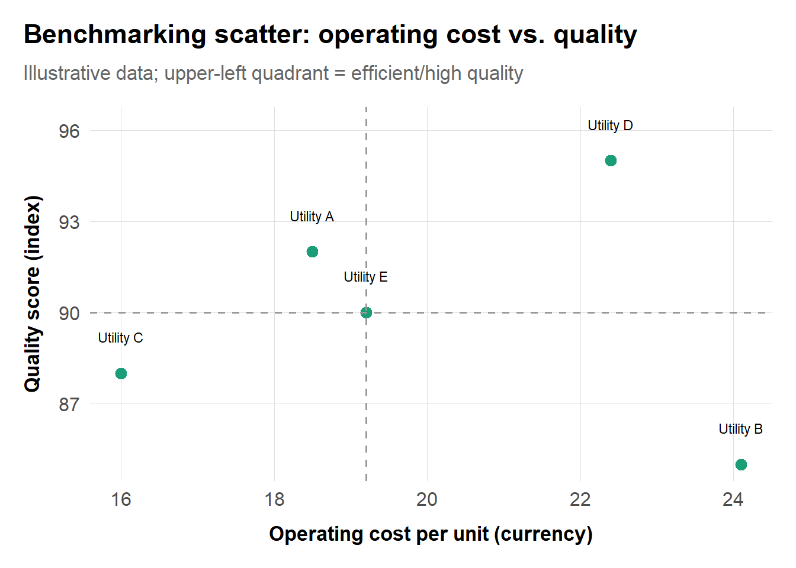
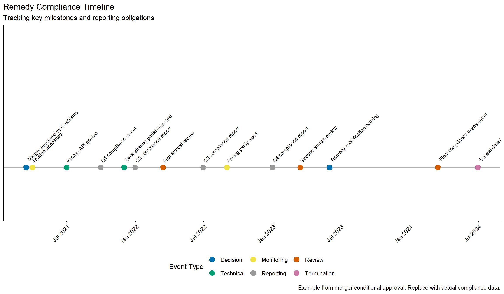
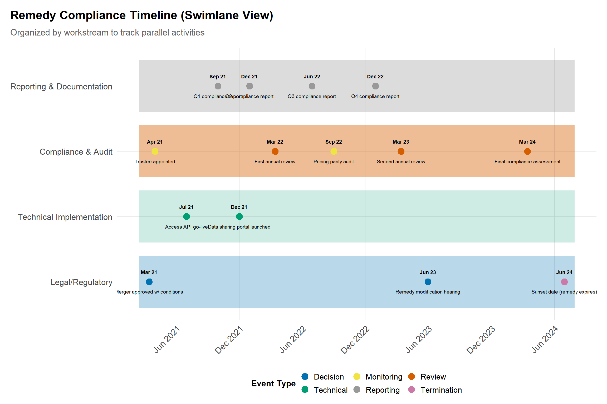

# Regulation and Remedies

## Learning goals
Antitrust analysis often ends with a liability finding, but policy work begins there. This chapter explains how to translate theories of harm into durable remedies and how to design regulatory frameworks when competition alone cannot discipline pricing or access. You will learn to:

- Compare rate-of-return, price-cap, and incentive regulation, and pick the tool that matches industry fundamentals (cost structure, demand volatility, data availability).
- Design structural and behavioral remedies that map directly to diagnosed harms, with clear monitoring and reporting plans.
- Evaluate remedy effectiveness using retrospective econometrics (diff-in-diff, event studies) and benchmarking models.
- Integrate qualitative evidence (compliance reports, trustee memos, stakeholder hearings) with quantitative indicators.

## Why regulation and remedies matter
Competition authorities increasingly pair enforcement with sector inquiries that feed straight into regulatory design (e.g., the South African Data Services and Private Healthcare inquiries). Meanwhile, merger and monopolization cases frequently conclude with behavioral obligations or divestitures that require economic monitoring. Understanding regulatory levers ensures your recommendations remain credible after the headline settlement.

## Workflow overview

A typical engagement looks like this:

1. **Diagnose** the source of market power or harm (natural monopoly, entry barriers, conduct).  
2. **Select regulatory instruments** (rate-of-return, price-cap, access pricing, incentive schemes).  
3. **Design remedies** matched to the theory of harm (divestitures, access mandates, data-sharing, reporting).  
4. **Specify monitoring**: KPIs, reporting cadence, trustee authority.  
5. **Evaluate outcomes** periodically using benchmarking or causal inference.

## Rate-of-return vs. price-cap regulation

### Rate-of-return (cost-plus) regime
- **Mechanics:** Regulator sets allowable revenue = (Regulated Asset Base × allowed return) + operating costs + depreciation. Common in energy and telecom infrastructure.  
- **Data needs:** Audited cost of capital, asset valuation, depreciation schedules, operating expense detail.  
- **Risks:** Gold-plating, weak cost discipline. Mitigate via prudency tests and benchmarking.

### Price-cap (RPI-X) regime
- **Mechanics:** Allowed price path indexed to inflation minus expected productivity (X-factor). Encourages cost reduction because firms keep savings between resets.  
- **Data needs:** Inflation series, productivity benchmarks, quality metrics.  
- **Risks:** Quality degradation, gaming of cost categories. Add service-quality penalties or deadbands.

#### Access pricing and ECPR sketches
Essential facilities (e.g., telecom loops, pipelines) often require access pricing. The Efficient Component Pricing Rule (ECPR) sets access price = incumbent downstream price − incumbent downstream cost + incremental cost of access. Critics note that ECPR can entrench monopoly margins; regulators frequently adopt cost-plus (LRIC) or benchmarked access tariffs instead. When designing access remedies, document:

- Incremental cost of providing access.  
- Margin squeeze tests (wholesale price vs. retail price minus downstream cost).  
- Capacity constraints and queue management.  
- Quality and operational KPIs (fault rates, installation times).

## Incentive regulation and benchmarking
Benchmarking and yardstick competition compare regulated entities to peers to set targets without micromanaging costs. Examples include Ofgem’s RIIO model and the planned South African Supply-Side Regulator for Health.

#### Visualization: benchmarking scatter



*Upper-left quadrant = efficient/high quality. Dashed lines indicate median values.*

Replace the illustrative data with regulator filings (e.g., NERSA, Ofgem, FERC Form 1), which are typically publicly available from regulatory agencies.

## Remedy design after antitrust findings

### Structural vs. behavioral
- **Structural:** Divestitures, ownership separation, asset swaps. Pros: self-enforcing; cons: disruption, valuation disputes.  
- **Behavioral:** Access commitments, MFN bans, parity obligations, algorithm transparency, zero-rating requirements. Pros: flexible; cons: monitoring burden.

When drafting behavioral remedies, specify:

1. **Scope and metrics** (e.g., access price formula, quality KPIs).  
2. **Reporting cadence** (quarterly dashboards, API feeds).  
3. **Trustee authority** (independent monitor credentials, escalation paths).  
4. **Sunset or reassessment triggers.**

### Monitoring and compliance
Create compliance scorecards that align with the remedy’s logic. For example, if the remedy ensures rival access to APIs, track uptime, latency, and parity between internal and external developers. Use qualitative sources—monitor reports, public hearings, stakeholder interviews—to contextualize metrics.

#### Retrospective diff-in-diff scaffold
```r
library(dplyr)
library(fixest)

# data columns: region, period, treated (1 if subject to remedy), outcome
# Example uses synthetic data
set.seed(123)
panel <- expand.grid(region = LETTERS[1:6], period = 2016:2022) |>
  mutate(
    treated = if_else(region %in% c("A","B","C"), 1, 0),
    post = if_else(period >= 2019, 1, 0),
    outcome = 100 + rnorm(n(), 0, 2) - 2 * (treated * post) + 0.5 * period
  )

did_model <- feols(outcome ~ treated:post | region + period, data = panel)
summary(did_model)
```
Swap the synthetic data with actual KPI panels (e.g., mobile data prices before/after the Data Services commitments, hospital tariffs after remedy adoption). Store sanitized versions in `data/derived/regulation/` with README files tracking provenance.

## Southern African market inquiries and remedy design
- **Private Healthcare Market Inquiry (2014–2019).** Case-mix adjusted benchmarking across eight hospital groups supported recommendations for a Supply-Side Regulator for Health and shared data hubs.  
- **Data Services Market Inquiry (2017–2019).** International price benchmarks and profitability models justified prepaid price cuts, open-access APN rules, and zero-rating obligations.  
- **Public Passenger Transport Inquiry (2017–2020).** Route maps, tender records, and e-hailing logs fed subsidy formulas, fare transparency rules, and data-sharing standards tailored to formal and informal operators.  
- **Sasol Gas and Telkom wholesale settlements.** Margin-squeeze tests combined with cost-plus access obligations illustrate how antitrust remedies can morph into quasi-regulatory regimes when enforcement alone cannot guarantee compliance.

## Callouts and qualitative evidence


**Method box**

- Benchmarking models and productivity comparisons.  
- Remedy simulations (cost/pass-through projections).  
- Retrospective diff-in-diff and event studies on post-remedy outcomes.



**Qualitative evidence**

- Implementation plans, trustee reports, stakeholder workshops.  
- Regulator-stakeholder hearings and public comment summaries.  
- Operational feasibility memos from engineering or procurement teams.



**Citations and comparative note**

- Sector-specific regulators: FCC/Ofcom (telecom), FERC/Ofgem (energy), NERSA/ICASA (South Africa).  
- Classic references: Kahn’s *Economics of Regulation*, Vogelsang’s work on price-cap regulation, OECD remedy guidelines.  
- Antitrust remedies: US DOJ/FTC remedy manuals, EC notice on remedies, CMA remedy guidance.


## Visualizations

### Remedy compliance timeline
A timeline visualization helps communicate key milestones, deadlines, and compliance events for complex remedy packages. This is particularly useful for trustee reports, agency presentations, and public communications.



*Color-coded timeline showing decision events (blue), technical milestones (green), monitoring events (yellow), reporting obligations (gray), review points (orange), and termination/sunset (purple).*

**How to use this timeline:**
- **Decision events** (blue): Key regulatory or tribunal decisions establishing or modifying remedies.
- **Technical milestones** (green): System launches, API deployments, portal go-lives.
- **Monitoring events** (yellow): Audits, investigations, compliance checks.
- **Reporting obligations** (gray): Regular quarterly or annual reports.
- **Review points** (orange): Scheduled assessments where remedies may be modified or extended.
- **Termination** (purple): Sunset date when behavioral remedies expire.

**Practical applications:**
- Include in trustee reports to show progress against mandated milestones.
- Present in annual compliance reviews to agency staff.
- Use in public communications to demonstrate transparency.
- Adapt for different remedy types: structural (divestitures), behavioral (access, pricing), or hybrid packages.

Replace with actual dates from:
- Consent decrees and settlement agreements (DOJ/FTC, DG COMP, CMA)
- Trustee reports and compliance dashboards
- Agency monitoring databases
- Tribunal orders (South African Competition Tribunal)

### Enhanced timeline with swimlanes
For complex remedies involving multiple workstreams (technical, legal, operational), use a swimlane variant:



*Timeline organized by workstream: Legal/Regulatory, Technical Implementation, Compliance & Audit, and Reporting & Documentation.*

**Swimlane benefits:**
- Separates legal, technical, and operational workstreams for clarity.
- Shows dependencies and sequencing across different teams.
- Useful for program management and stakeholder coordination.

## Data and visualization plan
- **Benchmarking scatter (Ch. 08 Visual 1):** Use regulator filings (Ofgem RIIO datasets, NERSA approved tariffs) or sanitized hospital benchmarking tables from public inquiries. If confidential, create synthetic replicas stored in `data/examples/benchmarking.csv`.
- **Remedy compliance timeline (Visual 2):** Build from trustee reports and milestone trackers from public sources.
- **Post-remedy diff-in-diff (Visual 3):** For telecom data, draw on public tariffs (ICASA reports) or TeleGeography archives; for energy, use Eskom/NERSA tariff series.

Document every dataset in `data/README.md` and note whether it can ship with the book (public) or must be replicated with synthetic values for open-source builds.

## Looking ahead
Store remedy models, compliance timelines, and benchmarking outputs in `data/derived/remedies/` with detailed READMEs. When transitioning to the litigation chapter, reference which remedy types (structural, behavioral, hybrid) appeared most frequently in your jurisdiction's case law. Update the visualization tracker if you add new dashboard components (e.g., interactive Shiny apps for remedy monitoring) so future readers can replicate or extend the templates.
