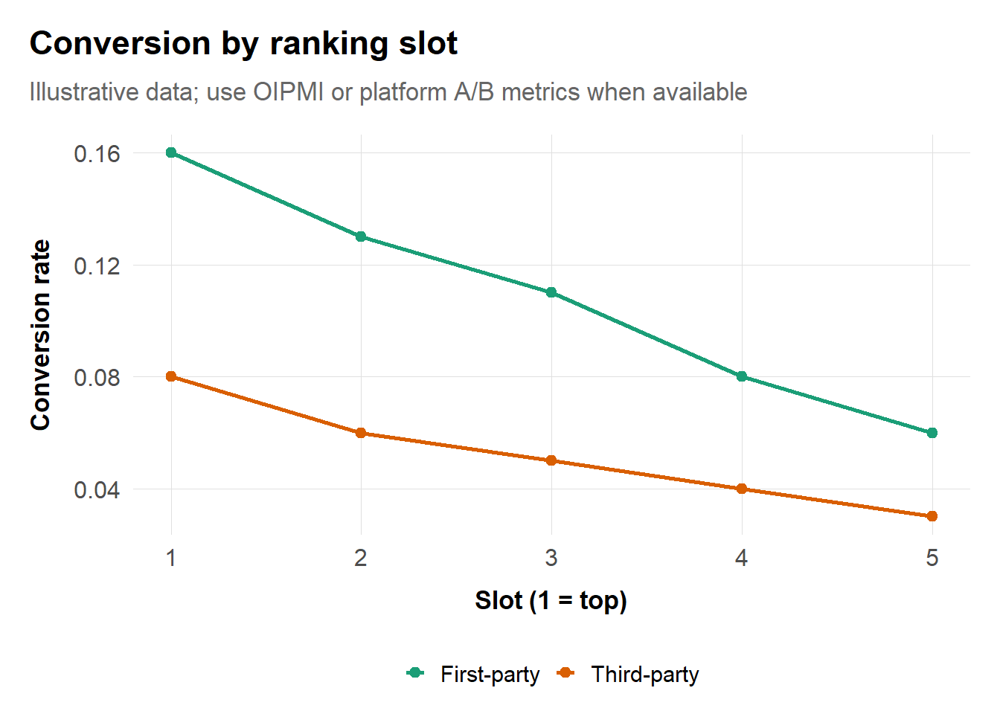
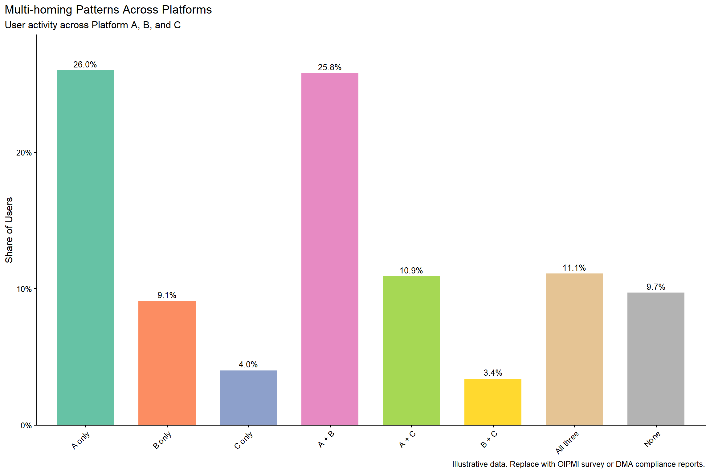
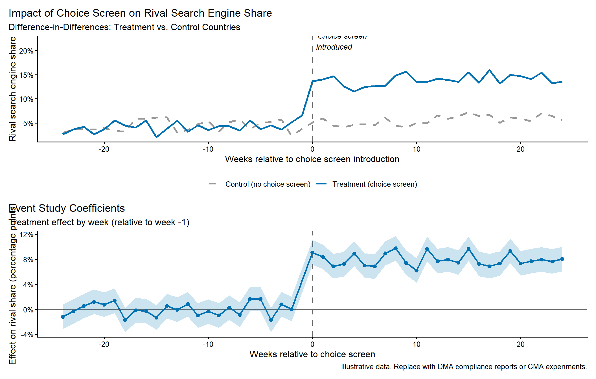
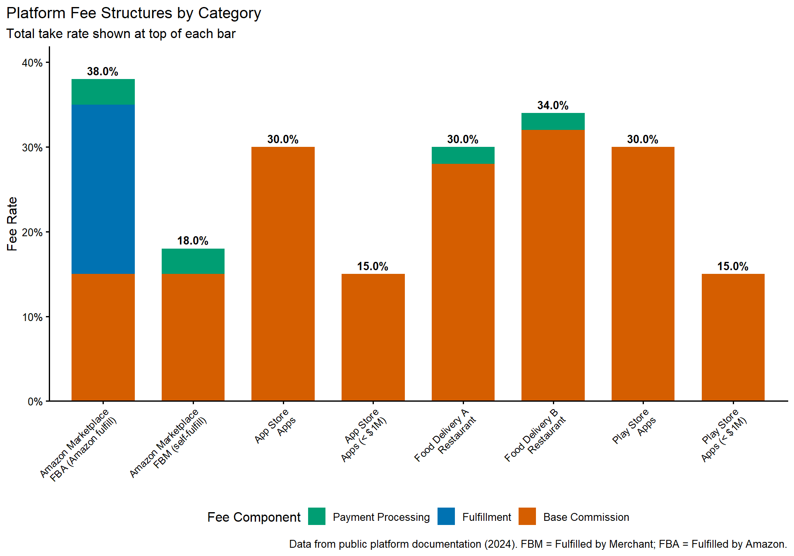
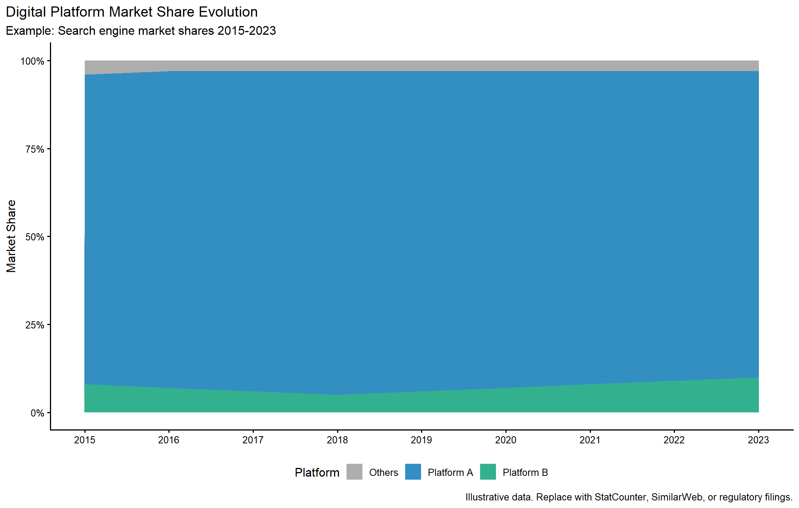

# Digital Markets and Platforms

## Learning goals
Digital markets combine traditional IO concepts with product design, governance, and behavioral nudges. Drawing on DMA/Digital Markets Unit briefings and recent enforcement actions, this chapter helps you:

- Analyze multi-sided participation, indirect network effects, and multi-homing incentives.
- Quantify self-preferencing, ranking changes, and default effects on user/merchant behavior.
- Evaluate data advantages, access restrictions, and algorithmic pricing risks.
- Integrate product requirement documents (PRDs), API policies, and telemetry with econometric evidence for global enforcement settings.

Expect to combine telemetry, clickstream data, partner contracts, and qualitative product documentation with econometric tests and simulation scaffolds.

## Core topics
- Platform demand and multi-homing: participation elasticities, steering, matching efficiency.
- Self-preferencing and ranking: click-through impacts, A/B test interpretation, fairness metrics.
- Data advantages and economies of scope; switching costs, lock-in, and interoperability.
- Algorithmic pricing and tacit collusion risk.
- Workflow for platform cases: market definition, theory of harm, mechanism measurement, effects, and remedies (choice screens, access mandates, data portability, separation).

## Platform workflow overview

1. **Define sides and metrics.** Identify user, merchant, advertiser, developer, courier, or publisher sides. Track MAU/DAU, GMV, multi-homing rates, engagement depth, and conversion metrics.
2. **Map fees and monetization.** Build ladders for commissions, subscriptions, ad loads, and data monetization; compute pass-through and elasticity. For two-sided market theory, see @rochet_tirole_2003 and @armstrong_2006.
3. **Theory of harm.** Common mechanisms include self-preferencing, default tying, MFN/parity clauses, data leveraging, interoperability restrictions, algorithmic ranking biases, and algorithmic collusion.
4. **Mechanism measurement.** Quantify ranking impacts, default effects, fee changes, and data advantages; document multi-homing constraints and API access terms.
5. **Effects & remedies.** Measure partner churn, user switching, price/fee changes, and innovation impacts. Propose remedies (choice screens, fair-ranking reports, API access rules, data portability, structural separation) tied to measured harms.

## Theory-to-metric mapping

The table below maps common platform theories of harm to measurable metrics and appropriate empirical tests. Use this as a checklist when scoping digital market investigations.

| Theory of Harm | Key Metric | Empirical Test | Data Sources |
|:---------------|:-----------|:---------------|:-------------|
| **Self-preferencing** | Downstream traffic share; CTR by listing type | Diff-in-Diff around algorithm changes; A/B test analysis | Platform telemetry, OIPMI audits, CMA studies |
| **Ranking manipulation** | Position-adjusted CTR; conversion by slot | Regression of outcomes on ranking position × first-party indicator | Clickstream logs, buy-box audits |
| **Default tying** | Rival market share pre/post choice screen | Event study around remedy implementation | DMA compliance reports, browser/search share data |
| **Foreclosure (input denial)** | API latency; error rates; access denial frequency | Regression of 3rd-party performance on access restrictions | API logs, developer complaints, uptime monitoring |
| **Foreclosure (raising rivals' costs)** | Fee differential; cost-to-serve by channel | Comparison of platform vs. direct channel costs | Fee schedules, merchant P&L data |
| **Data leverage** | Copycat product launch timing; feature matching | Survival analysis of 3rd-party products post-data access | Product launch dates, feature audits, internal documents |
| **MFN/parity clauses** | Price dispersion across platforms | Variance analysis; price comparison pre/post MFN removal | Price scraping, platform listings, DMA studies |
| **Algorithmic collusion** | Price correlation; response times; convergence patterns | Granger causality; structural break tests; simulation | Transaction-level pricing data, algorithm audits |
| **Switching costs/lock-in** | Multi-homing rates; churn by tenure | Duration models; switching cost estimation | Survey data, telemetry, DMA surveys |
| **Network effects exploitation** | Participation elasticity; tipping point dynamics | Two-sided demand estimation; natural experiments | Platform growth data, entry/exit events |

**How to use this table:**

1. **Scoping phase:** Identify which theories of harm are plausible given the market context and available complaints.
2. **Data requests:** Use the "Data Sources" column to structure information requests to platforms and third parties.
3. **Analysis design:** Match empirical tests to available data; prioritize tests with strongest identification.
4. **Triangulation:** Combine quantitative evidence with qualitative sources (internal documents, partner interviews, PRDs).


**Adapting to zero-price markets**

When users pay with attention rather than money, adapt metrics accordingly:

- Replace `fees_users` with **ad load** (ads per session, ad-to-content ratio)
- Use **time spent** or **engagement depth** as the "price" users pay
- Apply SSNDQ framework: would a hypothetical monopolist profitably degrade **quality** by 5-10%?
- Track quality metrics: load times, relevance scores, content diversity, privacy erosion


## Participation, multi-homing, and network effects

- **Participation curves:** Model each side's activity as a function of fees, quality, and participation on the other side. Use logit, linear, or Poisson models with cross-side terms (Evans and Schmalensee, 2007; Hagiu and Wright, 2015).
- **Multi-homing rates:** Estimate the share of users or merchants active on rival platforms. OIPMI surveys and EU DMA filings include methodologies you can reuse (Parker and Van Alstyne, 2005).  
- **Match quality:** Track conversion rates, completion times, or satisfaction metrics per platform side to show how conduct affects outcomes.  
- **Elasticities:** Two-sided elasticities inform fee caps and remedy design (e.g., how merchant participation responds to lower commissions or improved ranking fairness).

### Two-sided demand scaffold
```r
library(dplyr)
library(fixest)
source("../program/R/helpers.R")

# Synthetic example; replace with platform telemetry
panel <- expand.grid(platform = c("Alpha","Beta"), period = 2018:2023) |>
  mutate(
    fees_users = runif(n(), 0, 4),
    fees_merchants = runif(n(), 15, 30),
    quality = runif(n(), 0.5, 1),
    users = exp(5 - 0.25 * fees_users + 0.4 * quality + rnorm(n(), 0, 0.2)),
    merchants = exp(4 - 0.12 * fees_merchants + 0.3 * users / 1e5 + rnorm(n(), 0, 0.2))
  )

user_model <- feols(log(users) ~ fees_users + quality + log(merchants) | platform + period, data = panel)
merchant_model <- feols(log(merchants) ~ fees_merchants + log(users) | platform + period, data = panel)
summary(user_model)
summary(merchant_model)
```
Replace the synthetic `panel` with sanitized telemetry (monthly active users/merchants) or aggregated OIPMI data stored in `data/examples/digital-two-sided.csv`. Document the estimated cross-side elasticities in your memo.

### Zero-price demand model (attention markets)

When users pay with attention rather than money, standard fee-based demand models need adaptation. Replace monetary fees with **attention costs**: ad load, time spent, or quality degradation metrics. This aligns with the SSNDQ (Small but Significant Non-transitory Decrease in Quality) framework used by competition authorities.

```r
library(dplyr)
library(fixest)
source("../program/R/helpers.R")

# Zero-price platform: users "pay" with attention (ad exposure)
# Synthetic example; replace with platform telemetry
set.seed(789)
attention_panel <- expand.grid(
  platform = c("Alpha", "Beta"),
  period = 2018:2023
) |>
  mutate(
    # Attention costs (ads per session, data collection intensity)
    ad_load = runif(n(), 3, 12),        # Ads per session
    data_collection = runif(n(), 0, 1), # Privacy cost index (0-1)

    # Quality metrics
    load_time_ms = runif(n(), 500, 3000),   # Page load time
    relevance_score = runif(n(), 0.5, 0.95), # Content relevance

    # User engagement (dependent variable)
    # Users respond negatively to ads/data collection, positively to quality
    daily_active_users = exp(
      12 - 0.08 * ad_load - 0.5 * data_collection -
      0.0003 * load_time_ms + 2 * relevance_score +
      rnorm(n(), 0, 0.15)
    ),

    # Advertiser side responds to user base
    advertiser_spend = exp(
      8 + 0.6 * log(daily_active_users) + 0.1 * ad_load +
      rnorm(n(), 0, 0.1)
    )
  )

# User-side model: attention cost elasticity
user_model <- feols(
  log(daily_active_users) ~ ad_load + data_collection +
    load_time_ms + relevance_score | platform + period,
  data = attention_panel
)

# Advertiser-side model: cross-side effects
advertiser_model <- feols(
  log(advertiser_spend) ~ log(daily_active_users) + ad_load | platform + period,
  data = attention_panel
)

cat("=== ZERO-PRICE DEMAND MODEL ===\n\n")
cat("User-side (attention cost) elasticities:\n")
cat(paste0("  Ad load effect: ", round(coef(user_model)["ad_load"], 4),
           " (1 more ad/session → ",
           round(coef(user_model)["ad_load"] * 100, 1), "% DAU change)\n"))
cat(paste0("  Data collection effect: ", round(coef(user_model)["data_collection"], 4),
           " (privacy cost)\n"))
cat(paste0("  Load time effect: ", round(coef(user_model)["load_time_ms"], 6),
           " (per ms)\n"))
cat(paste0("  Relevance effect: ", round(coef(user_model)["relevance_score"], 4),
           " (quality boost)\n\n"))

cat("Advertiser-side elasticities:\n")
cat(paste0("  User base elasticity: ", round(coef(advertiser_model)["log(daily_active_users)"], 3),
           " (cross-side network effect)\n"))
cat(paste0("  Ad inventory value: ", round(coef(advertiser_model)["ad_load"], 4),
           " (more slots → more spend)\n"))

# SSNDQ analysis: what if quality degrades 5-10%?
cat("\n=== SSNDQ SIMULATION ===\n")
baseline_dau <- mean(attention_panel$daily_active_users)
# 10% quality degradation = 10% more ads + 10% worse relevance
degraded_dau <- baseline_dau * exp(
  coef(user_model)["ad_load"] * 0.8 +      # 10% more ads (e.g., 8 → 8.8)
  coef(user_model)["relevance_score"] * -0.08  # 10% worse relevance
)
dau_loss <- (baseline_dau - degraded_dau) / baseline_dau

cat(paste0("Baseline DAU: ", format(round(baseline_dau), big.mark = ","), "\n"))
cat(paste0("After 10% quality degradation: ", format(round(degraded_dau), big.mark = ","), "\n"))
cat(paste0("Predicted user loss: ", scales::percent(dau_loss, accuracy = 0.1), "\n"))
cat(paste0("Would monopolist profit? Depends on ad revenue vs. user loss tradeoff.\n"))
```

**Key adaptations for zero-price markets:**

| Traditional Market | Zero-Price Market | Measurement |
|:-------------------|:------------------|:------------|
| Price | Ad load (ads/session) | Platform telemetry |
| Price | Time cost (session duration) | Engagement metrics |
| Price | Privacy cost (data collection) | Privacy policy scoring |
| Quality | Relevance, load time, UX | A/B tests, user surveys |
| Quantity | DAU, MAU, sessions | Platform analytics |

**SSNDQ framework application:**

1. Define quality metrics relevant to users (speed, relevance, privacy, content diversity)
2. Estimate user sensitivity to each quality dimension
3. Simulate: would a hypothetical monopolist profitably degrade quality by 5-10%?
4. If users wouldn't switch despite degradation → market power concern

## Ranking, self-preferencing, and defaults

### Ranking impact visualization



*Click-through rates decline sharply with ranking position. First-party listings consistently outperform third-party listings at equivalent slots.*

Populate with actual ranking data (e.g., OIPMI buy-box audits, CMA Amazon Marketplace analysis). The CMA's market studies are publicly available at [gov.uk/cma](https://www.gov.uk/government/organisations/competition-and-markets-authority).

### Default-choice event study scaffold
```r
library(fixest)

# df requires: device_id, week, default_event (event date), share_rival
# event_model <- feols(share_rival ~ i(week, default_event, ref = -1) | device_id + week, data = df)
# etable(event_model)
```
Use telemetry from choice screens (EU Android choice screen, DMA compliance reports) or partner-provided logs. If live data are unavailable, build synthetic event panels mirroring DMA summary stats (store in `data/examples/digital-default.csv`).

## Methodologies


**Method box**

- Platform fee/price pass-through across sides.  
- Event studies on ranking/default changes; DMA/DMA-style interventions.  
- Two-sided logit or bargaining sketches to test fee caps and interoperability remedies.



**Qualitative evidence**

- Product requirement documents, experiment summaries, and governance memos.  
- Partner contracts (parity/MFN, exclusivity), API access terms, data-sharing policies.  
- User research/surveys capturing multi-homing, switching costs, and friction sources.



**Citations and comparative note**

- US cases (Epic v. Apple, DOJ Google Search and Ad Tech, FTC Amazon Marketplace), EU/DMA (Google Shopping/Android, DMA obligations), UK (CMA digital market studies), KFTC/JFTC app store cases, SAMR digital enforcement.  
- Empirical studies on defaults, ranking effects, and multi-homing (e.g., Luca et al., 2016, "Does Google Content Degrade Google Search?," Harvard Business School Working Paper; Edelman & Lai, 2016, "Design of Search Engine Services," *Journal of Economics & Management Strategy* 25(1): 187-218).  
- Flag differences in parity/MFN treatment and remedy preferences (EU fair-ranking obligations vs. US injunctive relief).


## Visualizations and data sourcing
- **Default impact chart:** Source DMA compliance reports (available at [ec.europa.eu/dma](https://ec.europa.eu/)), CMA choice-screen experiments, or sanitized telemetry. If unavailable, simulate from DMA summary stats.
- **Multi-homing Sankey:** Use OIPMI survey microdata or replicate with local surveys; store in `data/examples/digital-sankey.csv` until live data arrive.
- **Ranking change event analysis:** Combine OIPMI buy-box audits or platform-provided logs with the ranking scaffold above.
- **Fee ladder diagrams:** Pull commission schedules from OIPMI appendices or global public filings (App Store, Play Store, Amazon Marketplace).

Document each dataset in `data/README.md` with provenance, confidentiality notes, and instructions for swapping synthetic vs. production data. When we "fill with real data," replace the synthetic CSVs, re-render figures, and cache sanitized outputs for publication builds.

### Southern African digital enforcement snapshots
- **Online Intermediation Platforms Market Inquiry (OIPMI, 2020–2023).** The Competition Commission collected transaction-level data from e-commerce marketplaces, app stores, food delivery apps, and travel platforms. Findings highlighted Google Search’s >90% share of general search queries, food-delivery commissions clustering at 25–30%, and marketplace buy-box algorithms that favored first-party listings (e.g., Takealot Retail) over third-party sellers with identical fulfillment metrics. Final remedies require fair-ranking reports, caps on marketplace storage/fulfillment fees for SMEs, and anti-steering relief that lets restaurants promote direct-order channels inside aggregator apps.
- **Advertising and digital news media (Media and Digital Platforms Market Inquiry, 2023–ongoing).** Building on OIPMI data, the Commission is ingesting impression-level logs from Meta, Google, and local publishers to quantify revenue imbalances in display advertising. The interim statement reports that Google commands roughly 65% of display ad spend routed through programmatic channels, while local publishers face average take-rates below 30% after demand-side/platform fees—data points that frame prospective bargaining remedies for news publishers across Southern Africa.
- **GovChat/Meta interim relief (Competition Commission v. Meta Platforms, 2021).** The Commission used WhatsApp Business API telemetry to demonstrate GovChat’s role in reaching 8+ million South African users for public-service messaging, and it showed how Meta’s proposed off-boarding would foreclose a civic-use case despite negligible incremental infrastructure cost. Interim relief preserved access while the Tribunal weighed the exclusion case, offering a blueprint for combining platform-side telemetry with public-interest arguments in developing markets.


**Method box**

- Platform price/fee pass-through; elasticity across sides.
- Event studies on default changes or ranking tweaks.
- Simple two-sided logit/bargaining sketches; diversion across sides.



**Qualitative evidence**

- Product requirement docs and experiments; governance and content policies.
- Partner contracts (parity/MFN, exclusivity), API access terms.
- User research surveys on multi-homing and switching.



**Citations and comparative note**

- Cite platform cases and regulations: US (e.g., Epic v. Apple, DOJ Google Search/Ad Tech), EU (Google Shopping/Android, [DMA](https://ec.europa.eu/info/strategy/priorities-2019-2024/europe-fit-digital-age/digital-markets-act-ensuring-fair-and-open-digital-markets_en)), UK ([CMA market investigations](https://www.gov.uk/cma-cases)), and other jurisdictions (e.g., Korea KFTC app stores where relevant).
- Reference empirical studies on defaults and ranking effects, and any A/B or natural experiment evidence from platforms.
- Note differences in treatment of MFNs/parity and self-preferencing across jurisdictions.


## Enhanced Visualizations

### Multi-homing Sankey diagram
Multi-homing patterns reveal competitive constraints and switching costs. A Sankey diagram shows how users flow across platforms, helping visualize whether platforms compete head-to-head or serve distinct niches.



*Bar chart showing user activity across platforms. High single-homing suggests lock-in; high multi-homing indicates competitive pressure.*

**Interpretation:**
-   **High single-homing**: Suggests strong lock-in, switching costs, or network effects. Platforms may have market power.
-   **High multi-homing**: Indicates competitive pressure; users actively compare options. But check if multi-homing is symmetric or if one platform dominates usage.
-   **Asymmetric patterns**: If Platform A appears in most combinations, it may be a "must-have" platform with gatekeeping power.

**Data sources:**
-   OIPMI survey microdata (South Africa)
-   DMA compliance reports (EU)
-   CMA market studies (UK)
-   Platform-provided telemetry (subject to confidentiality)

### Choice screen / default effect visualization
Quantify how defaults affect market shares using difference-in-differences or event studies around choice screen implementations.



*Top: DiD time series showing treatment vs. control countries. Bottom: Event study coefficients with 95% confidence intervals.*

**How to use this analysis:**
- **Pre-trends**: Check parallel trends before intervention to validate DiD assumptions.
- **Treatment effect**: Quantify how much rival share increased after choice screen.
- **Heterogeneity**: Analyze by device type, user demographics, or country.
- **Persistence**: Track whether effects sustain over time or decay.

**DMA context:**
The EU Digital Markets Act requires designated gatekeepers to offer choice screens for browsers, search engines, and other services. This analysis framework can evaluate compliance and effectiveness.

### Platform fee structure visualization
Commission and fee structures are critical evidence in platform cases. Show how fees vary by seller tier, product category, or fulfillment method.



*Stacked bar chart showing base commission, fulfillment, and payment processing fees. Total take rate shown at top of each bar.*

**Key insights:**
- **App stores**: 30% standard (15% for small developers under $1M revenue).
- **E-commerce marketplaces**: 15-18% base + 15-25% fulfillment (if using platform logistics).
- **Food delivery**: 28-32% commission + 2-3% payment processing.
- **Bundling**: Platforms often bundle services (payment, fulfillment, advertising) making switching costly.

**Competitive assessment:**
- Compare fees across platforms to evaluate competitive pressure.
- Assess whether high fees reflect service value or market power.
- Evaluate whether fee structures create barriers to multi-homing.

### Market share evolution for digital platforms
Track platform market share over time to identify tipping points and competitive dynamics.



*Area chart showing platform market share evolution. Platform A maintains dominant position (87-92%) throughout 2015-2023.*

**Data sources:**
- **StatCounter**: Global browser, OS, search engine stats
- **SimilarWeb**: Website and app traffic data
- **Sensor Tower / App Annie**: Mobile app market intelligence
- **Regulatory filings**: EC, CMA, FTC, DMA compliance reports
- **OIPMI**: South African platform market shares

**Use cases:**
- Demonstrate sustained dominance or competitive entry
- Identify tipping points or competitive interventions
- Support market definition and dominance assessments

## Looking ahead
Store all digital platform analyses in `data/derived/digital/` with clear provenance notes. When DMA compliance data become available, replace synthetic Sankey flows and choice-screen impacts with actual telemetry. Document API access restrictions and data-sharing agreements in `data/README.md`. Cross-reference these visualizations with Chapter 12 (litigation practice) for expert report templates and Chapter 13 (empirical appendix) for diagnostic checklists.
