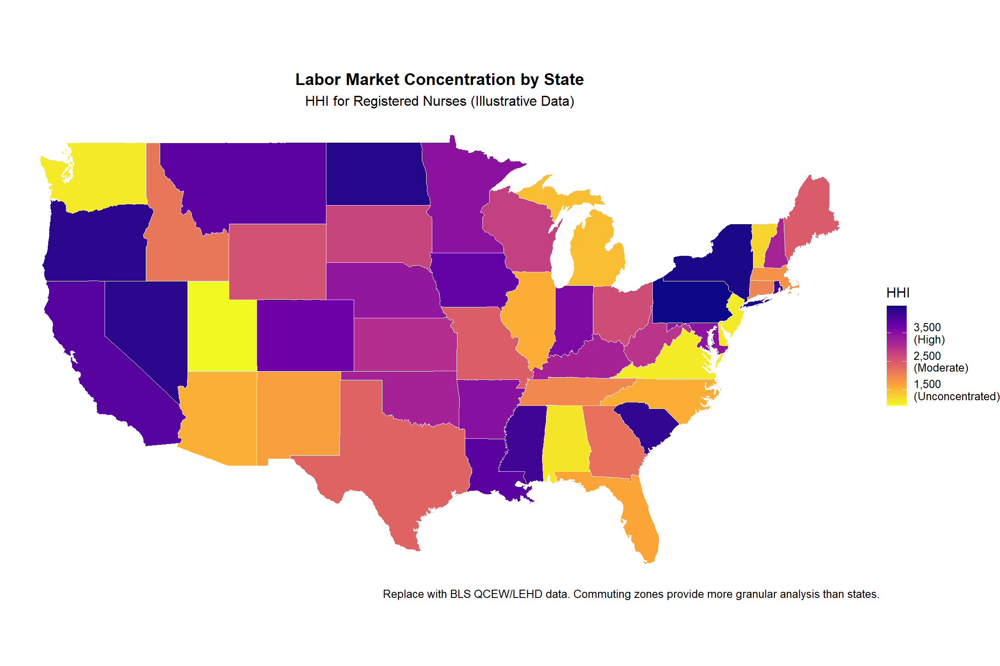
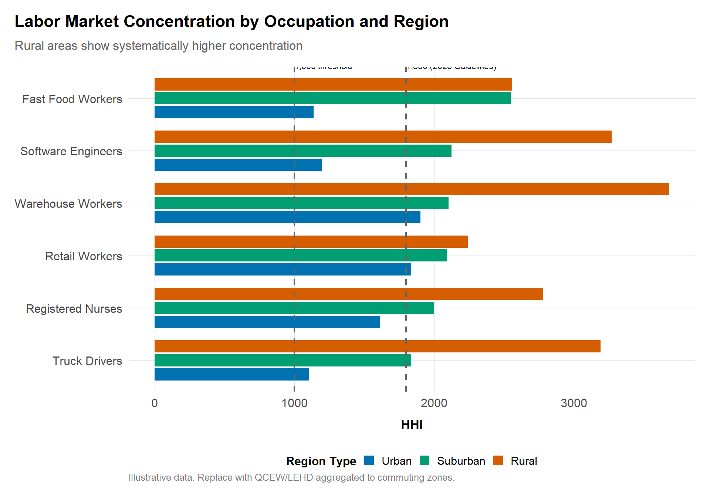
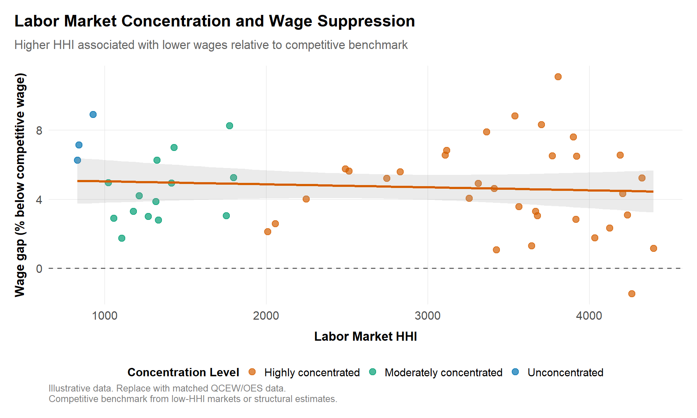

# Antitrust and Labor Markets

## Learning goals
Labor cases now sit alongside mergers and cartels in agency priorities. This chapter blends empirical tools from recent academic research on labor market power with practical guidance on using BLS and Census data. You will learn to:

- Measure labor market power (concentration, labor supply elasticity, pass-through).
- Evaluate no-poach, wage-fixing, and noncompete agreements using econometrics and qualitative evidence.
- Integrate matched employer-employee data, vacancy data, and worker narratives.
- Design remedies (noncompete bans, pay-transparency orders, notice requirements) and evaluate their effects.

## Core topics
- Labor concentration (HHI, Herfindahl-Hirschman Index for labor markets) and labor supply elasticity estimates.
- Event studies and diff-in-diff around policy shocks (noncompete bans, wage disclosure laws, franchise no-poach settlements).
- Wage-posting vs. realized wage analysis; vacancy scraping; platform data for gig markets.
- Mobility, retention, and heterogeneity by occupation, region, and worker demographics.
- Qualitative evidence from HR documents, franchise agreements, and worker testimony.


**Method box**

**Monopsony elasticities:** Estimate labor supply elasticity using quits, recruitment response, or equilibrium wage-setting models (e.g., inverse labor supply).  
**Policy diff-in-diff:** Evaluate wage or mobility effects after noncompete bans or franchise no-poach settlements.  
**Synthetic control:** Single-state reforms (e.g., Washington franchise no-poach settlement) can be assessed via synthetic control or staggered diff-in-diff.



**Qualitative evidence**

**HR policies & agreements:** Franchise agreements, noncompete clauses, wage-fixing communications.  
**Worker interviews/surveys:** Capture outside options, relocation constraints, switching costs, discrimination concerns.  
**Internal memos:** Evidence of wage suppression strategy, benchmarking against collusive agreements, or fear of poaching.



**Citations and comparative note**

Reference US DOJ/FTC criminal wage-fixing cases, state AG settlements, the FTC's proposed noncompete ban (see [ftc.gov](https://www.ftc.gov/)), and international enforcement (e.g., Portugal's wage-fixing fines, Japan's OTA cases). Cite key empirical papers from recent labor economics literature. Highlight differences where EU/UK enforcement is nascent but evolving (e.g., CMA's focus on noncompetes shorter than 3 months, EC guidelines on HR collusion).


## Measuring labor market power

### Concentration indices
Compute HHI or concentration ratios for labor markets defined by occupation × geography (e.g., SOC × commuting zone). Use BLS QCEW, Census LODES/LEHD Origin-Destination Employment Statistics, or Stats SA labour force microdata. For empirical evidence on labor market concentration, see @azar_marinescu_steinbaum_2020 and @benmelech_bergman_kim_2020.

```r
library(dplyr)
source("../program/R/helpers.R")

employment <- tibble::tribble(
  ~employer, ~occupation, ~region, ~employment,
  "FirmA", "RN", "Gauteng", 1200,
  "FirmB", "RN", "Gauteng", 800,
  "FirmC", "RN", "Gauteng", 500,
  "FirmD", "RN", "Gauteng", 300
)

hhi <- employment |>
  group_by(occupation, region) |>
  mutate(share = employment / sum(employment)) |>
  summarise(hhi = sum((share * 100)^2))
hhi
```
Replace synthetic data with QCEW/LEHD or Stats SA microdata aggregated to protect confidentiality. Document any weighting or commuting zone definitions in `data/README.md`.

### Labor supply elasticity
Estimate inverse labor supply using panel data on wages and employment:

```r
library(fixest)

# panel columns: firm, occupation, period, wage, employment, controls
# elasticity_model <- feols(log(wage) ~ log(employment) + controls | firm + occupation + period, data = panel)
# summary(elasticity_model)
```
Use matched employer-employee data (LEHD, SSA, UI wage records) or firm-level HR exports. Elasticities below 2–3 indicate meaningful monopsony power (Manning, 2003; Ashenfelter, Farber, and Ransom, 2010). For policy implications, see Naidu, Posner, and Weyl (2018).

## Noncompetes, no-poach, and wage fixing

### Policy shock diff-in-diff
```r
library(dplyr)
library(fixest)

panel <- expand.grid(state = c("WA","OR","ID","MT"), year = 2014:2022) |>
  mutate(
    treated = if_else(state == "WA" & year >= 2019, 1, 0),
    wage = 25 + 0.5 * (year - 2014) - 1.2 * treated + rnorm(n(), 0, 0.5),
    controls = runif(n())
  )

did_model <- feols(wage ~ treated | state + year, data = panel)
summary(did_model)
```
Substitute actual wage data (BLS Occupational Employment and Wage Statistics, CPS microdata, Stats SA QLFS) when available. Additional controls might include occupation mix, unemployment rates, or cost-of-living indices.

### Franchise no-poach analysis
- **Contract review:** Extract no-poach clauses, duration, and scope from franchise agreements (fast-food, fitness, healthcare).  
- **Transaction data:** Use payroll or scheduling data to track cross-franchise transfers before/after clause removal.  
- **Event study:** Evaluate hiring and wage patterns after the no-poach ban (Washington fast-food settlements, South African retail franchise commitments). For empirical evidence on franchise no-poach agreements, see @krueger_ashenfelter_2018. See also @doj_hr_guidance_2016 for enforcement guidance.

## Wage posting vs. realized wages

Combine vacancy data (Indeed, Burning Glass, Pnet) with payroll data to evaluate pass-through and wage compression:

- **Posting premium vs. realized wage:** Compare posted wages to actual accepted wages; measure dispersion and adjustments post-policy.  
- **Vacancy response:** Study vacancy duration and volume changes after noncompete bans or wage transparency laws.  
- **Platform/gig economy:** Leverage public APIs (Uber, Deliveroo) or FOIA responses for driver payout distributions.

## Mobility and retention analytics

- **Mobility matrices:** Use LEHD/LODES or internal HR data to compute transition probabilities between firms/regions.  
- **Retention KPIs:** Track tenure, quit rates, and rehire rates; evaluate changes post-remedy.  
- **Heterogeneity:** Segment results by occupation, gender, race, and visa status to show differential effects and public-interest considerations.

## Southern African enforcement snapshots
- **Healthcare wage-fixing (Competition Commission v. Netcare & Mediclinic investigations).** HR data and negotiation emails showed coordinated caps on agency nurse rates during pandemic surges; the Commission paired payroll analysis with worker interviews to craft remedial guidelines.
- **Pick n Pay/Shoprite labour practices inquiries.** Investigation combined rostering data, supplier development agreements, and union testimony to assess whether exclusive supply terms suppressed independent retailer wages.
- **Gig platforms (Competition Commission inquiry into e-hailing, 2023).** Telemetry from Bolt, Uber, and local entrants showed driver multi-homing constraints and commission escalators; regulators required transparency dashboards and alternative commission tiers for high-volume drivers.

## Visualizations

### Labor market concentration choropleth
A geographic visualization of labor market concentration helps identify regions and occupations with potential monopsony concerns. This example uses synthetic data but can be adapted for BLS QCEW, Census LEHD, or Stats SA QLFS data.



*HHI for Registered Nurses by state. Darker colors indicate higher concentration (greater monopsony concern).*

**Interpretation:**
- **HHI < 1,500**: Competitive labor markets; multiple employers compete for workers.
- **HHI 1,500-2,500**: Moderately concentrated; potential monopsony concerns.
- **HHI > 2,500**: Highly concentrated; significant monopsony power likely.

**How to construct this with real data:**

1. **BLS QCEW (US)**: Quarterly Census of Employment and Wages provides establishment counts and employment by industry and county. Calculate HHI for relevant occupation × commuting zone.

2. **Census LEHD (US)**: Longitudinal Employer-Household Dynamics provides origin-destination employment data. More granular than QCEW.

3. **Stats SA QLFS (South Africa)**: Quarterly Labour Force Survey can be aggregated by occupation × metro/district.

**Code template for BLS QCEW:**
```r
library(blsAPI)
library(dplyr)

# Fetch QCEW data (requires BLS API key)
# series_id format: ENUxxxxxxxxxxxx (area × industry × datatype)
# Calculate HHI from establishment-level employment shares

# Example workflow:
# 1. Get employment by establishment size class and county
# 2. For each occupation × commuting zone:
#    a. Sum employment by firm
#    b. Calculate market shares
#    c. HHI = sum((share × 100)^2)
# 3. Join to shapefile for choropleth
```

### Labor concentration dashboard by occupation
Compare HHI across multiple occupations to identify which labor markets face greatest concentration:



*Grouped bar chart showing HHI by occupation across urban, suburban, and rural regions. Dashed lines indicate concentration thresholds.*

**Key insights:**
- **Rural areas** typically show higher concentration due to fewer employers.
- **Low-skill occupations** (fast food, warehouse) often face more concentration than high-skill occupations with remote work options.
- **Healthcare occupations** show mixed patterns depending on Certificate of Need laws and hospital consolidation.

### Wage impact visualization
Combine concentration data with wage outcomes to show the relationship between HHI and wage suppression:



*Scatter plot showing negative relationship between HHI and wages. Higher concentration associated with larger wage gaps below competitive levels.*

**How to use these visualizations:**
- **Enforcement priorities**: Focus investigations on high-HHI markets.
- **Remedy design**: Target no-poach bans or wage disclosure rules at concentrated markets.
- **Policy evaluation**: Use choropleth before/after policy changes to assess geographic impacts.
- **Public interest**: Highlight disparate impacts on rural communities or specific demographics.

**Data sources for production:**
- **BLS QCEW**: [bls.gov/cew](https://www.bls.gov/cew/)
- **Census LEHD**: [lehd.ces.census.gov](https://lehd.ces.census.gov/)
- **BLS OES**: [bls.gov/oes](https://www.bls.gov/oes/) (for wage data)
- **Stats SA QLFS**: [statssa.gov.za](http://www.statssa.gov.za/)
- **Commuting zone definitions**: USDA ERS or Census Geography

## Visualizations and data sourcing
- **Labor HHI choropleths (Roadmap 10.1):** Source [BLS QCEW](https://www.bls.gov/cew/) (US), Stats SA, or EU Labour Force Survey; for publication, provide a template script plus sanitized shapefiles.  
- **Noncompete diff-in-diff plots (Roadmap 10.2):** Use state-level CPS microdata, WA Dept. of Labor wage records, or Stats SA sectoral wages; fallback to synthetic data until approvals land.  
- **Mobility transition matrices (Roadmap 10.3):** Build from [LEHD/LODES](https://lehd.ces.census.gov/) or anonymized HR exports; include aggregated gig-platform transitions.

Document each dataset in `data/README.md` and tag whether it is public, sanitized, or confidential. When ready to "fill with real data," replace the synthetic CSVs in `data/examples/` with actual extracts, rerun the figures, and cache redacted outputs for broader distribution.
