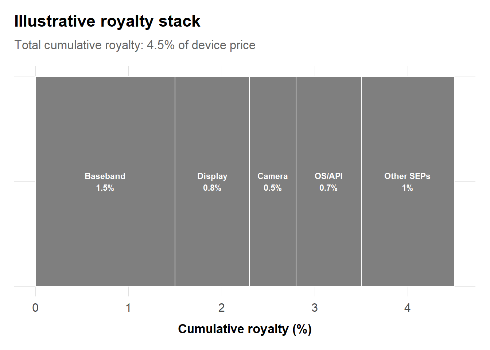
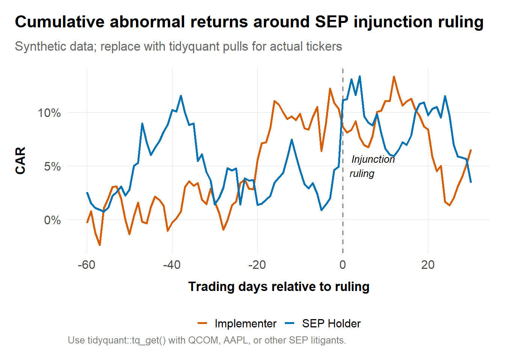
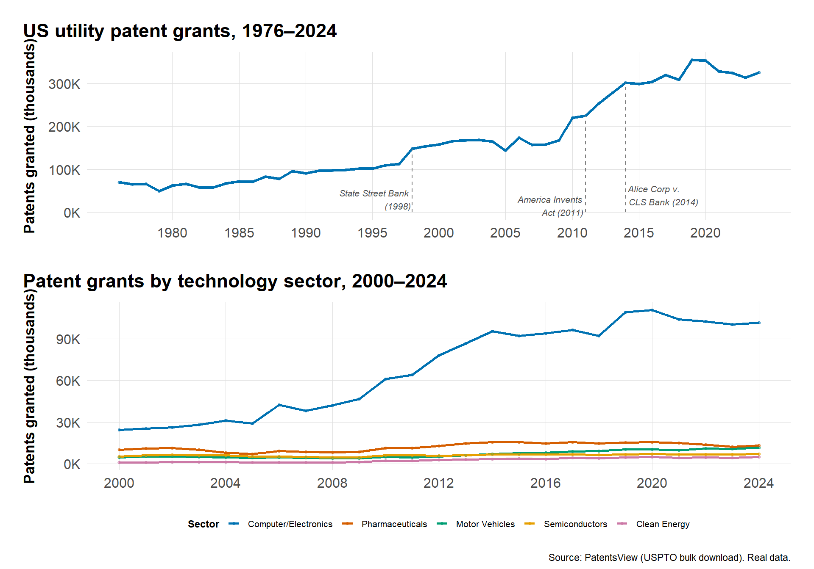
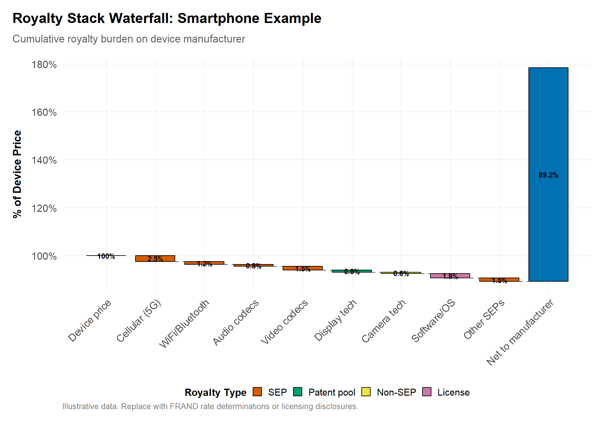
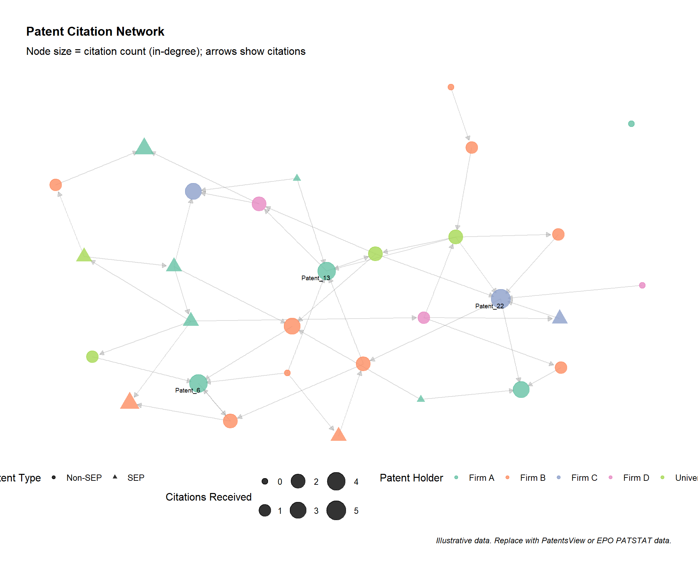
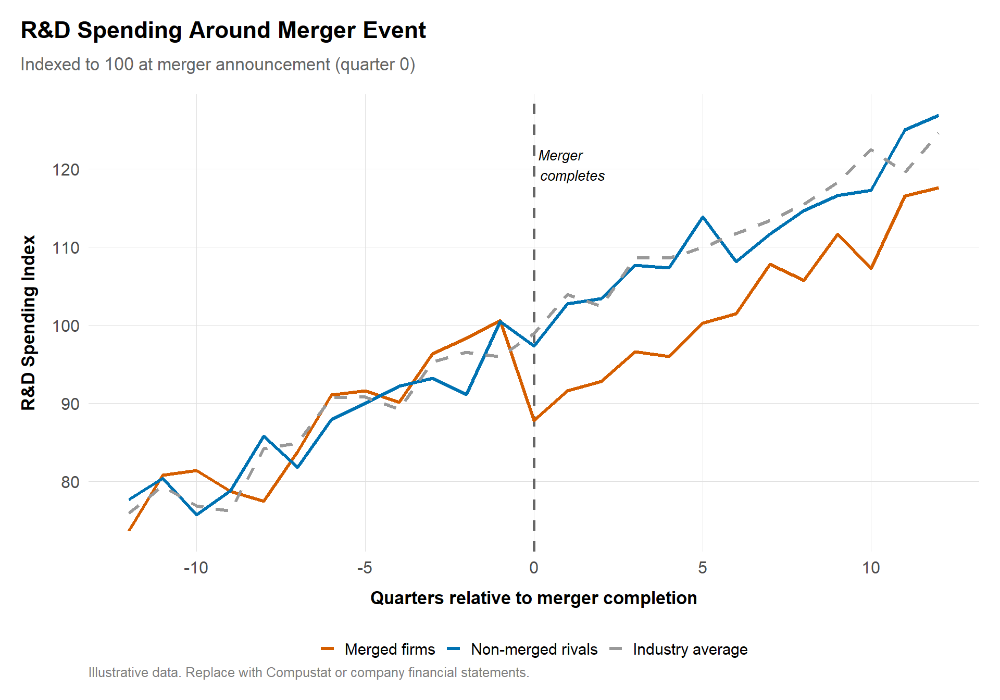
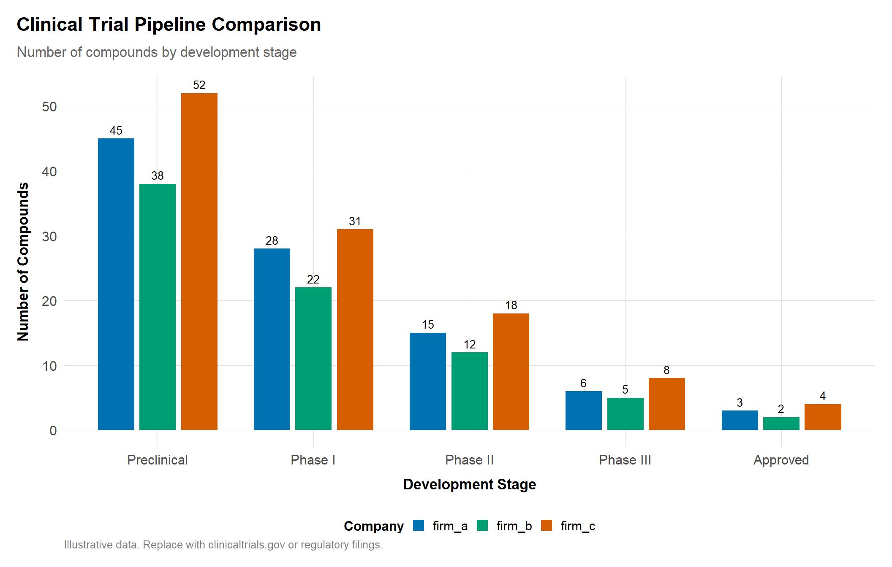

# Innovation, Intellectual Property, and Antitrust {#sec-innovation-ip}

Competition policy increasingly grapples with innovation. Mergers may eliminate nascent competitors before they mature. Patent settlements may delay generic entry. Standard-essential patents may enable hold-up of entire industries. These cases require economists to work with unfamiliar evidence---patent portfolios, clinical trial data, standards body submissions---and to think carefully about dynamic competition that unfolds over years rather than the static price effects emphasized in earlier chapters.

This chapter shows how to analyze innovation-related antitrust issues. We cover standard-essential patents and FRAND licensing, pay-for-delay pharmaceutical settlements, killer acquisitions, and the measurement of innovation effects more broadly. The tools include survival analysis for entry timing, event studies around patent announcements, and the integration of technical expert testimony with economic analysis.

## Learning goals
Innovation cases require translating R&D pipelines, patent portfolios, and technical standards into competition narratives. This chapter shows how to:

- Evaluate SEPs/FRAND licensing, patent pools, and interoperability disputes.
- Analyze pay-for-delay/reverse-payment settlements and innovation-reducing mergers.
- Combine patent data (counts, citations, claim breadth), R&D metrics, and technical evidence (roadmaps, standards submissions).
- Integrate qualitative expert testimony with econometric and event-study evidence.

## Core topics
- SEPs/FRAND licensing economics; hold-up vs. hold-out.
- Pay-for-delay: economic characterization, entry timing, consumer harm.
- Innovation measures: patent counts/citations, R&D spend, pipeline probability.
- Interoperability and standards; access to APIs and data.
- Remedy design: FRAND commitments, compulsory licensing, data/technology access, behavioral constraints on reverse payments.


**Method box**

- Event studies on patent pool or settlement announcements.
- Entry timing models for generics; hazard/survival sketches.
- R&D response to merger or remedy using panel FE.



**Qualitative evidence**

- Technical expert declarations, standards body submissions, patent essentiality reviews.
- Licensing negotiations, term sheets, audit rights.
- Product roadmaps and engineering constraints.



**Citations and comparative note**

- Cite FRAND/SEP cases and guidance (e.g., EU Huawei v. ZTE, US FTC/DOJ policy statements, UK FRAND rate cases).
- For pay-for-delay, reference US Supreme Court (Actavis) and EU pay-for-delay decisions.
- Include patent data sources (USPTO, EPO, JPO, CNIPA) and note differences in treatment of injunctions and remedies across jurisdictions.


## SEPs, FRAND, and standard setting

### Market power and hold-up vs. hold-out
Standard-essential patents (SEPs) can confer significant bargaining leverage once a standard is adopted. Distinguish:

- **Hold-up:** SEP holder extracts supra-FRAND royalties by threatening injunctions after firms are locked into the standard (Lemley & Shapiro, 2007).  
- **Hold-out:** Implementers delay or underpay royalties despite benefiting from the standard.

For economic analysis of patent holdup and royalty stacking, see (Shapiro, 2001) and (Farrell et al., 2007).

Evidence sources:

- Standards body submissions (ETSI, IEEE, 3GPP) and FRAND commitments.
- Essentiality assessments (self-declared vs. independent).
- Licensing histories, audit trails, and comparable agreements.

**Key SEP/FRAND cases:**

- **EU *Huawei v. ZTE* (2015):** Established framework for when SEP holders may seek injunctions—requiring good-faith negotiations, FRAND offers, and willingness to license before injunctive relief is appropriate.
- **UK *Unwired Planet* (2020):** Court determined global FRAND rates across patent portfolio; established precedent for courts setting rates when parties cannot agree.
- **FTC v. Qualcomm (2019-2020):** The FTC alleged Qualcomm used its SEP position and chip monopoly to extract supracompetitive royalties through "no license, no chips" policies. The district court found antitrust violations, but the Ninth Circuit reversed, holding that Qualcomm's practices—even if anticompetitive in licensing markets—did not harm competition in chip markets. The case highlights difficulties in applying antitrust to SEP licensing and the importance of identifying the correct market for harm analysis.
- **EC Qualcomm decisions (2018-2019):** The Commission fined Qualcomm for predatory pricing to exclude Icera and for exclusivity payments to Apple, demonstrating EU willingness to pursue SEP-adjacent conduct.


**Case box: FTC v. Qualcomm (2019--2020)**

The FTC alleged that Qualcomm used its monopoly in CDMA and premium LTE modem chips to extract supracompetitive royalties through a "no license, no chips" policy: it refused to supply chips unless manufacturers accepted its SEP licensing terms (*FTC v. Qualcomm*, 2020). Judge Koh's sweeping district court ruling found antitrust violations across licensing and chip markets, ordering Qualcomm to renegotiate agreements at FRAND rates. The Ninth Circuit reversed, holding that Qualcomm's licensing practices---even if they violated FRAND commitments---did not constitute anticompetitive conduct *in chip markets* because OEMs had no alternative chipset suppliers regardless of licensing terms. The decision effectively requires plaintiffs to show harm to competition (not just to competitors) in a properly defined market, raising the bar for SEP-based antitrust claims in the United States. The EU's parallel Qualcomm cases suggest a more receptive environment for such theories in European enforcement.


These cases illustrate jurisdictional divergence: EU authorities more readily pursue SEP-related antitrust claims, while US courts after *Qualcomm* require clearer links between licensing conduct and competitive harm.

### Royalty stack analysis
```r
library(dplyr)
library(ggplot2)
source("program/R/helpers.R")

stack <- tibble::tribble(
  ~component, ~royalty_percent,
  "Baseband", 1.5,
  "Display", 0.8,
  "Camera", 0.5,
  "OS/API", 0.7,
  "Other SEPs", 1.0
) |>
  mutate(
    component = factor(component, levels = rev(component)),
    end = cumsum(royalty_percent),
    start = lag(end, default = 0)
  )

# Stacked horizontal bar showing how royalties accumulate
ggplot(stack, aes(xmin = start, xmax = end, ymin = 0, ymax = 1, fill = component)) +
  geom_rect(color = "white", linewidth = 0.5) +
  geom_text(aes(x = (start + end) / 2, y = 0.5,
                label = paste0(component, "\n", royalty_percent, "%")),
            size = 3, color = "white", fontface = "bold") +
  scale_fill_manual(values = antitrust_colors) +
  labs(
    title = "Illustrative royalty stack",
    subtitle = paste0("Total cumulative royalty: ", sum(stack$royalty_percent),
                      "% of device price"),
    x = "Cumulative royalty (%)",
    y = NULL
  ) +
  theme_antitrust() +
  theme(axis.text.y = element_blank(),
        axis.ticks.y = element_blank(),
        legend.position = "none")
```



Replace the illustrative stack with licensing data (often produced during litigation) or sanitized aggregates from public FRAND rate determinations. Cite FRAND rate determinations (e.g., UK Unwired Planet, Optis) for benchmarking, which are available through court records.

### Event study for injunction announcements
```r
library(dplyr)
library(ggplot2)
source("program/R/helpers.R")

# Synthetic event study: SEP holder and implementer stock returns around injunction ruling
set.seed(321)
event_window <- -60:30
n_days <- length(event_window)

event_data <- tibble(
  day = rep(event_window, 2),
  firm = rep(c("SEP Holder", "Implementer"), each = n_days),
  # Normal daily returns plus event effect
  daily_return = c(
    rnorm(n_days, 0.0003, 0.015) + ifelse(event_window == 0, 0.04, 0),
    rnorm(n_days, 0.0003, 0.015) + ifelse(event_window == 0, -0.03, 0)
  )
) |>
  group_by(firm) |>
  mutate(car = cumsum(daily_return - 0.0003)) |>  # CAR relative to market

  ungroup()

ggplot(event_data, aes(x = day, y = car, color = firm)) +
  geom_vline(xintercept = 0, linetype = "dashed", color = "gray50") +
  geom_line(linewidth = 1) +
  annotate("text", x = 1, y = 0.05, label = "Injunction\nruling",
           hjust = -0.1, size = 3.5, fontface = "italic") +
  scale_color_manual(values = c("SEP Holder" = "#0072B2", "Implementer" = "#D55E00")) +
  scale_y_continuous(labels = scales::percent_format()) +
  labs(
    title = "Cumulative abnormal returns around SEP injunction ruling",
    subtitle = "Synthetic data; replace with tidyquant pulls for actual tickers",
    x = "Trading days relative to ruling", y = "CAR", color = NULL,
    caption = "Use tidyquant::tq_get() with QCOM, AAPL, or other SEP litigants."
  ) +
  theme_antitrust()
```



Replace synthetic returns with `tidyquant::tq_get()` using actual tickers and event dates from FRAND rulings (e.g., Optis v. Apple (Uk Optis Apple, 2023), Unwired Planet (Uk Unwired Planet, 2017)).

## Pay-for-delay and reverse payments

### Entry timing and hazard models

**Case box: FTC v. Actavis --- Pay-for-delay and the rule of reason (2013)**

The Supreme Court rejected the "scope of the patent" test that had shielded reverse payment settlements from antitrust scrutiny, holding instead that such agreements must be evaluated under the rule of reason (*FTC v. Actavis*, 2013). The Court reasoned that a large unexplained payment from a brand-name manufacturer to a generic challenger suggests the patent holder has doubts about patent validity---and that paying to delay entry is an exercise of market power, not a legitimate exploitation of patent rights. The decision established that the *size of the payment* relative to litigation costs and saved royalties is the key indicator of anticompetitive harm. Post-Actavis, pharmaceutical companies restructured settlements to avoid explicit cash transfers, using instead "authorized generics," supply agreements, and co-promotion deals that obscure the economic equivalent of reverse payments. Enforcers must now trace the value of these non-cash transfers to demonstrate that settlements effectively compensate generics for staying out of the market.


Reverse-payment settlements can delay generic entry and harm consumers (*FTC v. Actavis*, 2013). Analyze:

- **Payment size:** Compare settlement payment to expected litigation costs and projected profits (Edlin & Hemphill, 2012).  
- **Entry timing:** Use survival models or diff-in-diff to estimate delay relative to counterfactuals.  
- **Price effects:** Simulate price paths with and without generic entry (Scott Morton, 2000); (Hemphill & Sampat, 2012).

```r
library(survival)

# synthetic example
data <- tibble::tribble(
  ~drug, ~entry_year, ~settlement, ~status,
  "DrugA", 2020, 1, 1,
  "DrugB", 2018, 0, 1,
  "DrugC", 2022, 1, 0
)

# survival::survfit(Surv(entry_year, status) ~ settlement, data = data)
```
Replace with real pay-for-delay cases (Actavis-style) or EU decisions (Servier, Lundbeck). Use FDA Orange Book, EMA data, or South African SAMRC filings for entry timelines.

### Diff-in-diff for price effects
```r
library(fixest)
library(dplyr)
source("program/R/helpers.R")

# Synthetic panel: drug markets with and without reverse payment settlements
set.seed(555)
n_markets <- 30
n_years <- 10

panel <- expand.grid(market = 1:n_markets, year = 2014:2023) |>
  mutate(
    treated = market <= 12,  # 12 markets had reverse payment settlements
    generic_entry_year = ifelse(treated, 2020, 2018),  # Delayed entry
    post_entry = year >= generic_entry_year,
    # Price index: drops ~30% after generic entry
    price_index = 100 - ifelse(post_entry, 30, 0) + rnorm(n(), 0, 4)
  )

did <- feols(price_index ~ i(treated, post_entry) | market + year, data = panel)
cat("DiD: Effect of delayed generic entry on drug prices\n")
summary(did)
```
Data sources: IQVIA (if available), CMS reimbursement data, Stats SA medicine price data, or public price registries.

## Innovation effects of mergers or conduct

- **Patent/R&D panels:** Compile patent counts (PatentsView, EPO PATSTAT), citation-weighted measures, and R&D spending to evaluate innovation incentives pre/post merger or remedy.  
- **Pipeline probability models:** For pharmaceuticals, use clinical trial progression rates.  
- **Product roadmaps:** Qualitative review of technical plans to confirm or rebut innovation harm narratives.

The following charts use real PatentsView data---the USPTO's public bulk download---to show innovation trends relevant to antitrust analysis. Patent counts are an imperfect proxy for innovation, but they are the most widely available and standardized measure, and they feature in merger review (as indicators of innovation incentives) and in SEP/FRAND disputes (where patent portfolios determine licensing leverage).

```r
library(dplyr)
library(ggplot2)
library(patchwork)
source("program/R/helpers.R")

tryCatch({
  # --- Panel 1: Total US utility patents by year ---
  total_df <- read.csv("data/raw/patents_total_by_year.csv",
                       stringsAsFactors = FALSE) |>
    filter(year >= 1976, year <= 2024)

  p1 <- ggplot(total_df, aes(x = year, y = total_utility_patents / 1000)) +
    geom_line(color = "#0072B2", linewidth = 1.1) +
    geom_point(color = "#0072B2", size = 0.8, alpha = 0.5) +
    # Key antitrust-relevant annotations
    annotate("segment", x = 2011, xend = 2011,
             y = 0, yend = total_df$total_utility_patents[total_df$year == 2011] / 1000,
             linetype = "dashed", color = "gray50", linewidth = 0.4) +
    annotate("text", x = 2011, y = 15, label = "America Invents\nAct (2011)",
             size = 2.8, hjust = 1.05, fontface = "italic", color = "gray30") +
    annotate("segment", x = 2014, xend = 2014,
             y = 0, yend = total_df$total_utility_patents[total_df$year == 2014] / 1000,
             linetype = "dashed", color = "gray50", linewidth = 0.4) +
    annotate("text", x = 2014, y = 40, label = "Alice Corp v.\nCLS Bank (2014)",
             size = 2.8, hjust = -0.05, fontface = "italic", color = "gray30") +
    annotate("segment", x = 1998, xend = 1998,
             y = 0, yend = total_df$total_utility_patents[total_df$year == 1998] / 1000,
             linetype = "dashed", color = "gray50", linewidth = 0.4) +
    annotate("text", x = 1998, y = 30, label = "State Street Bank\n(1998)",
             size = 2.8, hjust = 1.05, fontface = "italic", color = "gray30") +
    scale_x_continuous(breaks = seq(1980, 2024, 5)) +
    scale_y_continuous(labels = function(x) paste0(x, "K")) +
    labs(
      title = "US utility patent grants, 1976\u20132024",
      x = NULL, y = "Patents granted (thousands)"
    ) +
    theme_antitrust()

  # --- Panel 2: Patent grants by technology sector (2000+) ---
  sector_df <- read.csv("data/raw/patents_by_sector_year.csv",
                        stringsAsFactors = FALSE) |>
    filter(year >= 2000, year <= 2024) |>
    filter(sector %in% c("Computer/Electronics", "Pharmaceuticals",
                          "Semiconductors", "Clean Energy",
                          "Motor Vehicles"))

  # Order sectors by total patent count for legend clarity
  sector_order <- sector_df |>
    group_by(sector) |>
    summarise(total = sum(patent_count), .groups = "drop") |>
    arrange(desc(total)) |>
    pull(sector)
  sector_df$sector <- factor(sector_df$sector, levels = sector_order)

  sector_palette <- c(
    "Computer/Electronics" = "#0072B2",
    "Pharmaceuticals"      = "#D55E00",
    "Motor Vehicles"       = "#009E73",
    "Semiconductors"       = "#E69F00",
    "Clean Energy"         = "#CC79A7"
  )

  p2 <- ggplot(sector_df, aes(x = year, y = patent_count / 1000,
                               color = sector)) +
    geom_line(linewidth = 1) +
    geom_point(size = 0.8, alpha = 0.5) +
    scale_color_manual(values = sector_palette) +
    scale_x_continuous(breaks = seq(2000, 2024, 4)) +
    scale_y_continuous(labels = function(x) paste0(x, "K")) +
    labs(
      title = "Patent grants by technology sector, 2000\u20132024",
      x = NULL, y = "Patents granted (thousands)",
      color = "Sector"
    ) +
    theme_antitrust() +
    theme(legend.position = "bottom",
          legend.title = element_text(size = 9),
          legend.text = element_text(size = 8)) +
    guides(color = guide_legend(nrow = 1))

  # --- Combine with patchwork ---
  p1 / p2 +
    plot_annotation(
      caption = "Source: PatentsView (USPTO bulk download). Real data."
    )
}, error = function(e) {
  message("Could not load PatentsView data: ", e$message)
  message("Ensure data/raw/patents_total_by_year.csv and ",
          "data/raw/patents_by_sector_year.csv exist.")
})
```



The acceleration in patent grants since 2000---driven particularly by computer/electronics, telecommunications, and biotech---coincides with the period of most active antitrust scrutiny of innovation markets. Rising patent density increases the risk of patent thickets and royalty stacking (see the royalty stack visualization above), while sector-level trends help identify where killer acquisition concerns are most acute.

### Panel FE for R&D effects
```r
library(fixest)
library(dplyr)

# Synthetic panel: firm-level R&D before/after a policy change
set.seed(777)
rd_panel <- expand.grid(firm = 1:20, year = 2015:2024) |>
  mutate(
    acquired = firm <= 8,  # 8 firms were acquired
    post = year >= 2020,
    # R&D spending: acquired firms cut R&D by ~15% post-acquisition
    log_rd = 4 + 0.05 * (year - 2015) + rnorm(n(), 0, 0.2) +
      ifelse(acquired & post, -0.15, 0)
  )

rd_model <- feols(log_rd ~ i(acquired, post) | firm + year, data = rd_panel)
cat("Panel FE: Effect of acquisition on R&D spending\n")
summary(rd_model)
```

### Killer acquisitions

"Killer acquisitions" occur when an incumbent acquires a nascent competitor specifically to discontinue its innovation pipeline, eliminating a competitive threat rather than realizing synergies (Cunningham, Ederer & Ma, 2021). These transactions often fall below merger notification thresholds, allowing them to proceed without antitrust review.

**Empirical identification:**

1. **Pipeline discontinuation rates:** Compare probability that acquired projects are discontinued vs. comparable projects at independent firms. Cunningham et al. (2021) find 5-7% of pharma acquisitions are "killer" in this sense.
2. **Overlap analysis:** Higher discontinuation rates for targets whose pipelines overlap with acquirer's marketed products suggest elimination of competition.
3. **Post-acquisition R&D:** Track whether acquirer shifts resources away from the target's development programs.

**Key metrics:**

| Indicator | Measurement | Data source |
|:----------|:------------|:------------|
| Pipeline overlap | % therapeutic areas in common | Clinical trials databases, patent filings |
| Discontinuation rate | % acquired projects discontinued | FDA/EMA filings, company announcements |
| Development timeline | Delay in milestone achievement | Clinical trial phase transitions |
| R&D reallocation | Post-acquisition spending shifts | SEC filings, segment disclosures |

**Remedies and policy responses:**

- **Expanded notification thresholds:** Several jurisdictions now require notification based on transaction value (not just target revenue), capturing high-value acquisitions of pre-revenue startups.
- **Continuation requirements:** Behavioral remedies may require the acquirer to continue development of acquired pipeline assets for a specified period.
- **Periodic reporting:** Monitor development milestones post-acquisition to detect strategic discontinuation.

For pharmaceutical and biotech markets, cross-reference FDA and EMA clinical trial databases with acquisition announcements. For technology markets, track product launches, API deprecations, and talent retention post-acquisition.

## Interoperability and data access

Interoperability---the ability of different systems to work together and exchange data---has become a central concern in digital market competition. When a dominant firm controls a platform, standard, or interface that others depend on to compete, restrictions on interoperability can function as exclusionary conduct. The antitrust question is whether the firm has a duty to provide access, and if so, on what terms.

The legal framework varies significantly across jurisdictions. In the EU, the essential facilities doctrine and the interoperability provisions of the Digital Markets Act create affirmative obligations for gatekeeper platforms to provide access to APIs, data, and interoperability features. The DMA's Article 6 specifically requires gatekeepers to allow business users to interoperate with their services, to provide effective data portability, and to refrain from self-preferencing in rankings and access conditions. In the US, the legal standard is more restrictive: *Verizon Communications Inc. v. Law Offices of Curtis V. Trinko, LLP* (2004) established that there is generally no duty to deal with competitors, and *Pacific Bell Telephone Co. v. linkLine Communications, Inc.* (2009) further limited the circumstances under which price-squeeze claims can succeed. South Africa occupies a middle ground: the Competition Act's abuse-of-dominance provisions (Section 8) include an explicit refusal-to-deal clause, and the Competition Tribunal has shown willingness to impose interoperability remedies in sectors like telecommunications and digital platforms.

The empirical analysis of interoperability disputes requires technical and economic evidence. On the technical side, practitioners should examine API documentation, rate limiting policies, response time differentials between internal and external developers, and feature parity across access tiers. Engineering product requirements documents (PRDs), internal technical reviews, and version control logs can reveal whether interoperability restrictions were motivated by legitimate technical concerns or by competitive strategy. On the economic side, the analysis focuses on the competitive impact of restricted access: how many rivals are affected, what is the cost of developing alternative infrastructure, and would mandatory interoperability undermine innovation incentives?

Data portability---the ability of users to transfer their data from one platform to another---is a related concern that sits at the intersection of competition policy, privacy regulation, and consumer protection. The EU's General Data Protection Regulation (GDPR) includes a data portability right (Article 20), and the DMA builds on this framework to require gatekeepers to provide continuous, real-time access to data generated by business users. In the US, data portability remains largely a voluntary commitment, though the FTC has explored it as a remedy in merger consent decrees. The empirical challenge is measuring the competitive significance of data barriers: when does data lock-in constitute a meaningful entry barrier, and when is it simply a reflection of network effects that benefit consumers?

- **API logs:** Compare response times, rate limits, and feature parity between internal and external developers.  
- **Data portability metrics:** Evaluate export completeness, frequency, and latency.  
- **Technical documentation:** PRDs and engineering tickets often show intent to foreclose or degrade rivals.
- **Cost of duplication analysis:** Estimate the investment required for a rival to replicate the platform's data infrastructure or API functionality.
- **User switching cost surveys:** Measure how data portability barriers affect actual switching behavior.

## Southern African innovation/IP examples

South Africa's Competition Commission has addressed innovation and IP issues in several notable matters, though the jurisprudence is less developed than in the US and EU. The **Telkom vs. Internet Solutions** broadband case examined access to APIs and OSS/BSS systems under FRAND-like commitments, combining margin squeeze tests with technical audits to assess whether Telkom's wholesale pricing allowed retail competitors to profitably serve end users. The **Vodacom Zero-Rating commitments** arising from the data services inquiry required interoperability obligations for educational content, showing how innovation incentives can align with the public-interest remedies that are a distinctive feature of South Africa's competition framework. The Commission's **investigations into ARV (antiretroviral) patent settlements** combined SAMRC price data, patent landscape analysis, and clinical trial timelines to assess whether settlement agreements between originator and generic manufacturers delayed market entry and harmed public health outcomes.

## Enhanced Visualizations

### Enhanced royalty stack waterfall
A more detailed royalty stack showing how cumulative royalties build up across different technology components. This helps demonstrate potential royalty stack concerns in FRAND disputes.

```r
library(dplyr)
library(ggplot2)

# Royalty components for a smartphone
# Replace with actual FRAND rate determinations or licensing data
royalty_components <- tibble::tribble(
  ~component,          ~holder_type,    ~royalty_pct,
  "Device price",      "Base",          100.00,
  "Cellular (5G)",     "SEP",           -2.50,
  "WiFi/Bluetooth",    "SEP",           -1.20,
  "Audio codecs",      "SEP",           -0.80,
  "Video codecs",      "SEP",           -1.50,
  "Display tech",      "Patent pool",   -0.90,
  "Camera tech",       "Non-SEP",       -0.60,
  "Software/OS",       "License",       -1.80,
  "Other SEPs",        "SEP",           -1.50,
  "Net to manufacturer", "Result",      89.20
) |>
  mutate(
    component = factor(component, levels = component),
    cumulative = cumsum(royalty_pct),
    start = lag(cumulative, default = 100),
    end = cumulative,
    type = case_when(
      component %in% c("Device price", "Net to manufacturer") ~ "total",
      royalty_pct < 0 ~ "royalty",
      TRUE ~ "neutral"
    )
  )

# Waterfall plot
ggplot(royalty_components) +
  geom_rect(aes(xmin = as.numeric(component) - 0.4,
                xmax = as.numeric(component) + 0.4,
                ymin = start, ymax = end, fill = holder_type),
            color = "black", linewidth = 0.5) +
  geom_text(aes(x = as.numeric(component),
                y = (start + end) / 2,
                label = ifelse(type == "royalty",
                              paste0(abs(royalty_pct), "%"),
                              paste0(royalty_pct, "%"))),
            size = 3, fontface = "bold") +
  geom_segment(data = filter(royalty_components, !type %in% c("total")),
               aes(x = as.numeric(component) + 0.4,
                   xend = as.numeric(component) + 1 - 0.4,
                   y = end, yend = end),
               linetype = "dashed", color = "gray50") +
  scale_fill_manual(
    values = c(
      "Base" = "#0072B2",
      "SEP" = "#D55E00",
      "Patent pool" = "#009E73",
      "Non-SEP" = "#F0E442",
      "License" = "#CC79A7",
      "Result" = "#0072B2"
    ),
    breaks = c("SEP", "Patent pool", "Non-SEP", "License")
  ) +
  scale_x_continuous(
    breaks = seq_along(royalty_components$component),
    labels = royalty_components$component
  ) +
  scale_y_continuous(labels = scales::dollar_format(suffix = "%", prefix = "")) +
  labs(
    title = "Royalty Stack Waterfall: Smartphone Example",
    subtitle = "Cumulative royalty burden on device manufacturer",
    x = NULL,
    y = "% of Device Price",
    fill = "Royalty Type",
    caption = "Illustrative data. Replace with FRAND rate determinations or licensing disclosures."
  ) +
  theme_antitrust() +
  theme(
    axis.text.x = element_text(angle = 45, hjust = 1),
    legend.position = "bottom",
    plot.title.position = "plot"
  )

# Summary statistics
total_royalties <- 100 - royalty_components$royalty_pct[
  royalty_components$component == "Net to manufacturer"]

cat("\nRoyalty stack summary:\n")
cat(paste0("Total royalty burden: ", round(total_royalties, 1), "%\n"))
cat(paste0("SEP royalties: ",
          round(sum(abs(royalty_components$royalty_pct[
            royalty_components$holder_type == "SEP"])), 1), "%\n"))
cat(paste0("Net to manufacturer: ",
          round(royalty_components$royalty_pct[
            royalty_components$component == "Net to manufacturer"], 1), "%\n"))
```



**Key concerns:**
- **Royalty stacking**: Multiple SEP holders each claiming a "reasonable" royalty can collectively make manufacturing unprofitable.
- **Double marginalization**: Each layer adds its markup, raising final prices.
- **Hold-up**: Once committed to a standard, manufacturers face switching costs that weaken bargaining position.

**Benchmarking:**
Compare against FRAND rate determinations:
- UK Unwired Planet v. Huawei (2017)
- UK Optis v. Apple (2023)
- US Ericsson v. Samsung arbitration

### Generic entry survival curve
Analyze the timing of generic pharmaceutical entry, with and without reverse payment settlements. Survival analysis shows whether settlements delay entry.

```r
library(dplyr)
library(ggplot2)
library(survival)

# Simulated generic entry data
# Replace with FDA Orange Book data or European/South African equivalents
set.seed(456)
n_drugs <- 60

entry_data <- tibble(
  drug_id = 1:n_drugs,
  settlement = sample(c("No settlement", "Reverse payment settlement"),
                     n_drugs, replace = TRUE, prob = c(0.6, 0.4)),
  months_to_entry = case_when(
    settlement == "No settlement" ~ rexp(n_drugs, rate = 1/36),
    TRUE ~ rexp(n_drugs, rate = 1/56)  # Delayed entry with settlement
  ),
  entered = sample(c(1, 0), n_drugs, replace = TRUE, prob = c(0.85, 0.15))
) |>
  mutate(months_to_entry = pmin(months_to_entry, 120))  # Cap at 10 years

# Kaplan-Meier survival curve
surv_object <- Surv(time = entry_data$months_to_entry,
                   event = entry_data$entered)
surv_fit <- survfit(surv_object ~ settlement, data = entry_data)

# Plot survival curve (requires survminer for ggsurvplot)
if (!requireNamespace("survminer", quietly = TRUE)) {
  message("Install the 'survminer' package to render the Kaplan-Meier plot.")
} else {
  survminer::ggsurvplot(
    surv_fit,
    data = entry_data,
    palette = c("#0072B2", "#D55E00"),
    conf.int = TRUE,
    risk.table = TRUE,
    risk.table.height = 0.25,
    xlab = "Months from patent grant",
    ylab = "Probability no generic entry",
    title = "Generic Entry Timing: Impact of Reverse Payment Settlements",
    subtitle = "Kaplan-Meier survival curves by settlement status",
    legend.title = "Settlement Type",
    legend.labs = c("No settlement", "Reverse payment settlement"),
    ggtheme = theme_antitrust(),
    font.main = c(14, "bold"),
    font.subtitle = c(11, "plain"),
    font.caption = c(9, "plain"),
    caption = "Illustrative data. Replace with FDA Orange Book or EMA data."
  )
}

# Log-rank test
surv_diff <- survdiff(surv_object ~ settlement, data = entry_data)
cat("\nLog-rank test for difference in survival curves:\n")
cat(paste0("Chi-squared = ", round(surv_diff$chisq, 2), "\n"))
cat(paste0("p-value = ", format.pval(1 - pchisq(surv_diff$chisq,
                                               df = length(surv_diff$n) - 1),
                                     digits = 3), "\n"))

# Median survival times
cat("\nMedian time to generic entry:\n")
print(summary(surv_fit)$table[, c("median", "0.95LCL", "0.95UCL")])
```

**Interpretation:**
- **Separation of curves**: If settlement drugs show consistently lower entry hazard, this suggests anticompetitive delay.
- **Median delay**: Calculate months of delay attributable to settlements.
- **Consumer harm**: Combine with price differentials (branded vs. generic) to estimate consumer losses.

**Data sources:**
- **FDA Orange Book**: [fda.gov/drugs/drug-approvals-and-databases/orange-book-data-files](https://www.fda.gov/drugs/drug-approvals-and-databases/orange-book-data-files)
- **EMA**: European Medicines Agency public assessment reports
- **SAHPRA**: South African Health Products Regulatory Authority
- **FTC settlements**: Public records of reverse payment cases

### Patent citation network
Visualize how key patents cite each other to show technological relationships and potential blocking positions.

```r
library(dplyr)
library(igraph)
library(ggraph)

# Simulated patent citation network
# Replace with PatentsView or EPO PATSTAT data
set.seed(567)
n_patents <- 30

# Create citation edges
citations <- tibble(
  from_patent = sample(paste0("Patent_", 1:n_patents), 50, replace = TRUE),
  to_patent = sample(paste0("Patent_", 1:n_patents), 50, replace = TRUE)
) |>
  filter(from_patent != to_patent) |>
  distinct()

# Create patent metadata
patents <- tibble(
  patent_id = paste0("Patent_", 1:n_patents),
  holder = sample(c("Firm A", "Firm B", "Firm C", "Firm D", "University"),
                 n_patents, replace = TRUE, prob = c(0.3, 0.25, 0.2, 0.15, 0.1)),
  essential = sample(c("SEP", "Non-SEP"), n_patents, replace = TRUE,
                    prob = c(0.3, 0.7))
)

# Create network
g <- graph_from_data_frame(citations, directed = TRUE, vertices = patents)

# Calculate centrality measures
V(g)$in_degree <- degree(g, mode = "in")
V(g)$out_degree <- degree(g, mode = "out")
V(g)$betweenness <- betweenness(g)

# Plot network
ggraph(g, layout = "fr") +
  geom_edge_link(arrow = arrow(length = unit(2, 'mm'), type = "closed"),
                 end_cap = circle(3, 'mm'),
                 alpha = 0.3, color = "gray50") +
  geom_node_point(aes(size = in_degree, color = holder,
                     shape = essential), alpha = 0.8) +
  geom_node_text(
    aes(label = ifelse(in_degree > 3, name, "")),
    repel = TRUE,
    size = 2.5,
    family = "Arial"
  ) +
  scale_size_continuous(range = c(3, 10)) +
  scale_color_brewer(palette = "Set2") +
  scale_shape_manual(values = c("SEP" = 17, "Non-SEP" = 19)) +
  labs(
    title = "Patent Citation Network",
    subtitle = "Node size = citation count (in-degree); arrows show citations",
    color = "Patent Holder",
    shape = "Patent Type",
    size = "Citations Received",
    caption = "Illustrative data. Replace with PatentsView or EPO PATSTAT data."
  ) +
  theme_graph(base_size = 12) +
  theme(
    text = element_text(family = "Arial"),
    legend.position = "bottom",
    plot.title = element_text(size = 14, face = "bold")
  )

# Summary statistics
cat("\nPatent network summary:\n")
cat(paste0("Total patents: ", n_patents, "\n"))
cat(paste0("Total citations: ", nrow(citations), "\n"))
cat(paste0("SEP patents: ", sum(V(g)$essential == "SEP"), "\n"))
cat("\nTop 5 most-cited patents:\n")
patents |>
  left_join(tibble(patent_id = V(g)$name, in_degree = V(g)$in_degree),
           by = "patent_id") |>
  arrange(desc(in_degree)) |>
  select(patent_id, holder, essential, in_degree) |>
  head(5) |>
  print()
```



**Key insights:**
- **Central patents**: High betweenness centrality indicates "bottleneck" patents that many others depend on.
- **Patent thickets**: Dense clusters suggest overlapping IP that may impede innovation.
- **Holder concentration**: If one firm controls many central patents, it may have market power.

### R&D spending event study around merger
Evaluate whether mergers affect innovation incentives by tracking R&D spending before and after the transaction.

```r
library(dplyr)
library(ggplot2)
library(fixest)

# Simulated panel data: R&D spending around merger
# Replace with Compustat, Orbis, or financial statement data
set.seed(678)
quarters <- -12:12
firms <- c("Merged firms", "Non-merged rivals", "Industry average")

rd_panel <- expand.grid(
  quarter = quarters,
  firm_group = firms
) |>
  mutate(
    # Pre-merger: all firms follow similar trends
    # Post-merger: merged firms reduce R&D relative to others
    rd_index = case_when(
      firm_group == "Merged firms" & quarter < 0 ~ 100 + 2 * quarter + rnorm(n(), 0, 3),
      firm_group == "Merged firms" & quarter >= 0 ~ 100 + 2 * quarter - 8 + rnorm(n(), 0, 3),
      firm_group == "Non-merged rivals" ~ 100 + 2 * quarter + rnorm(n(), 0, 3),
      TRUE ~ 100 + 2 * quarter + rnorm(n(), 0, 2)
    )
  )

# Time series plot
ggplot(rd_panel, aes(x = quarter, y = rd_index,
                    color = firm_group, linetype = firm_group)) +
  geom_vline(xintercept = 0, linetype = "dashed", color = "gray40",
             linewidth = 1) +
  stat_summary(fun = mean, geom = "line", linewidth = 1.2) +
  annotate("text", x = 0, y = max(rd_panel$rd_index) * 0.95,
          label = "Merger\ncompletes", hjust = -0.1, size = 3.5,
          fontface = "italic") +
  scale_color_manual(values = c("Merged firms" = "#D55E00",
                                 "Non-merged rivals" = "#0072B2",
                                 "Industry average" = "#999999")) +
  scale_linetype_manual(values = c("Merged firms" = "solid",
                                   "Non-merged rivals" = "solid",
                                   "Industry average" = "dashed")) +
  labs(
    title = "R&D Spending Around Merger Event",
    subtitle = "Indexed to 100 at merger announcement (quarter 0)",
    x = "Quarters relative to merger completion",
    y = "R&D Spending Index",
    color = NULL,
    linetype = NULL,
    caption = "Illustrative data. Replace with Compustat or company financial statements."
  ) +
  theme_antitrust() +
  theme(
    legend.position = "bottom",
    plot.title.position = "plot"
  )

# Diff-in-diff estimate
rd_panel_did <- rd_panel |>
  mutate(
    post = ifelse(quarter >= 0, 1, 0),
    treated = ifelse(firm_group == "Merged firms", 1, 0)
  )

did_model <- feols(rd_index ~ treated:post | firm_group + quarter,
                  data = rd_panel_did)

cat("\nDifference-in-differences estimate:\n")
summary(did_model)
```



**Interpretation:**
- **Pre-trends**: Parallel trends before merger support DiD identification.
- **Treatment effect**: Negative coefficient suggests merger reduced R&D.
- **Innovation harm**: Combine with patent output, clinical trials, or product launches to assess real-world impact.

**Alternative specifications:**
- Event study with leads/lags
- Synthetic control for single-firm mergers
- Stacked DiD for multiple mergers

### Clinical trial pipeline visualization (pharmaceuticals)
Track clinical trial progress for pharmaceutical innovation assessments.

```r
library(dplyr)
library(ggplot2)
library(tidyr)

# Simulated clinical trial pipeline
# Replace with clinicaltrials.gov data or EMA/SAHPRA records
pipeline <- tibble::tribble(
  ~phase,       ~firm_a, ~firm_b, ~firm_c,
  "Preclinical", 45,      38,      52,
  "Phase I",     28,      22,      31,
  "Phase II",    15,      12,      18,
  "Phase III",   6,       5,       8,
  "Approved",    3,       2,       4
) |>
  mutate(phase = factor(phase, levels = phase)) |>
  pivot_longer(cols = -phase, names_to = "firm", values_to = "count")

# Funnel chart
ggplot(pipeline, aes(x = phase, y = count, fill = firm, group = firm)) +
  geom_col(position = position_dodge(width = 0.8), width = 0.7) +
  geom_text(aes(label = count), position = position_dodge(width = 0.8),
           vjust = -0.5, size = 3.5) +
  scale_fill_manual(values = c("firm_a" = "#0072B2",
                                "firm_b" = "#009E73",
                                "firm_c" = "#D55E00")) +
  labs(
    title = "Clinical Trial Pipeline Comparison",
    subtitle = "Number of compounds by development stage",
    x = "Development Stage",
    y = "Number of Compounds",
    fill = "Company",
    caption = "Illustrative data. Replace with clinicaltrials.gov or regulatory filings."
  ) +
  theme_antitrust() +
  theme(
    legend.position = "bottom",
    plot.title.position = "plot"
  )

# Success rates
pipeline_wide <- pipeline |>
  pivot_wider(names_from = phase, values_from = count)

cat("\nPipeline success rates (illustrative):\n")
cat("Phase I to Phase II: ~50-60%\n")
cat("Phase II to Phase III: ~30-40%\n")
cat("Phase III to Approval: ~60-70%\n")
cat("\nUse these rates to model expected future approvals and consumer harm from delays.\n")
```



**Applications:**
- **Merger review**: Compare pipeline depth before/after transaction.
- **Pay-for-delay**: Estimate lost innovation from delayed generic competition.
- **Market foreclosure**: Show whether conduct reduces rivals' pipeline.

**Data sources:**
- **ClinicalTrials.gov**: US clinical trial registry
- **EU Clinical Trials Register**: European trials
- **WHO ICTRP**: International registry
- **Company pipelines**: Annual reports and R&D presentations

## Exercises

1. **Conceptual.** Explain the tension between patent rights (which grant temporary monopolies to incentivize innovation) and antitrust enforcement (which seeks to prevent monopoly abuse). When should a patent holder's refusal to license trigger antitrust scrutiny?

2. **Data/code.** Using the royalty stack visualization in this chapter, calculate the total royalty burden if each SEP holder demands a "reasonable" 2% royalty and there are 8 essential patent holders. At what point does royalty stacking make manufacturing unprofitable (assuming a 15% target margin)?

3. **Case discussion.** Compare the outcomes in *FTC v. Qualcomm* (US, reversed on appeal) and the *EC Qualcomm* decisions (fines upheld). What does the divergence tell us about jurisdictional differences in applying antitrust to SEP licensing?

4. **Conceptual.** Define "killer acquisitions" and explain the empirical identification strategy from Cunningham, Ederer, and Ma (2021). What data would you need to test whether a specific pharmaceutical acquisition was a killer acquisition?

5. **Data/code.** The clinical trial pipeline visualization compares three firms. Suppose Firm A acquires Firm B. Using the pipeline data, calculate: (a) the combined pipeline, (b) the overlap in development stages, and (c) which stages are most vulnerable to post-acquisition discontinuation based on the killer acquisitions framework.

### Data exercise (checkable)

a. **Royalty stacking.** Ten different firms each hold a standard-essential patent and each demands a 5% running royalty on the product price. What is the cumulative royalty burden?
b. **Pay-for-delay.** A brand drug sells for $100 and the generic would sell for $20. Annual volume is 1,000,000 units, and a reverse-payment settlement delays generic entry by 2 years. Assuming the generic would have captured the market at the generic price, estimate the consumer harm from the delay.


**Worked answer**

a. 10 x 5% = **50%** cumulative royalty -- the royalty-stacking problem that FRAND commitments are meant to contain.
b. Harm ~= price difference x volume x delay = ($100 - $20) x 1,000,000 x 2 = **$160,000,000**, an upper bound that assumes full, immediate substitution at the generic price.


## Looking ahead

Innovation and IP issues are increasingly central to merger review and monopolization enforcement. The survival models, event studies, and patent network tools in this chapter carry forward into **[Chapter 12](chapters/12-litigation-practice.md)**, which covers how to present technical expert testimony alongside economic evidence. The killer acquisitions framework connects to **[Chapter 6](chapters/06-mergers.md)** for transactions involving nascent competitors, and the SEP/FRAND analysis informs remedy design in **[Chapter 8](chapters/08-regulation-remedies.md)**. When real data become available (PatentsView bulk downloads, FDA Orange Book, SAHPRA filings), replace the synthetic examples with actual patent networks, entry timelines, and R&D panels.
