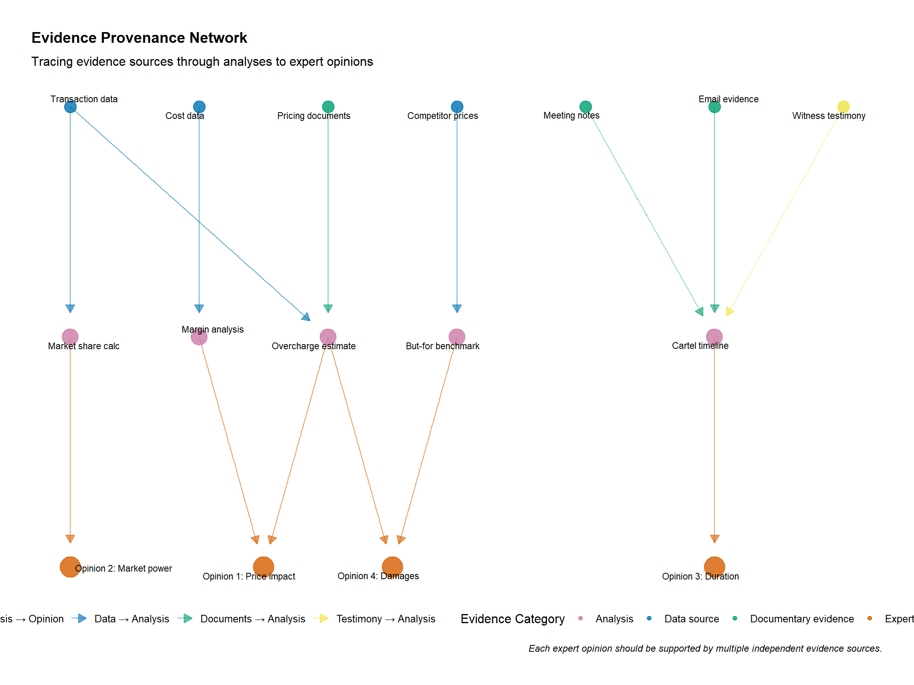
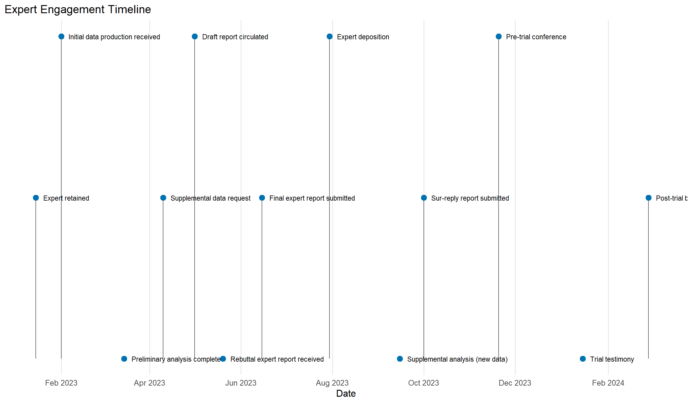

# Litigation Practice: Evidence and Expert Work

## Learning goals
This chapter translates all prior analytics into courtroom-ready workflows. Drawing on agency guidance (US DOJ/FTC, EC best practices) and established expert practice standards, we focus on:

- Structuring investigations so every exhibit and code run is reproducible.
- Designing class certification analyses (common impact, damages) that withstand Daubert/Kumho challenges.
- Integrating empirical, qualitative, and documentary evidence in expert reports, depositions, and testimony.
- Communicating uncertainty, sensitivity, and alternative specifications to judges and juries.

## Core topics
- Class certification: common impact frameworks, sampling, and predominance arguments.
- Evidence management: document IDs, data provenance, reproducible code bundles.
- Daubert readiness: validation, sensitivity analyses, alternative specifications.
- Presentation: graphics for court, explanatory appendices, deposition prep.
- Coordination with legal teams, witnesses, and regulators; public-interest considerations in South Africa and other jurisdictions.


**Method box**

- Common impact tests with clustered SEs and randomization inference.
- Damages models: before/after, yardstick, difference-in-differences, hedonic variants.
- Scenario/sensitivity tables for assumptions (e.g., pass-through bounds).



**Qualitative evidence**

- Fact witness integration: mapping testimonies to model assumptions.
- Survey admissibility checkpoints (universe, sampling, questionnaire design, pretests).
- Expert judgment: when to narrow claims due to data limits.



**Citations and comparative note**

- Cite case law on admissibility (Daubert/Kumho in US; local standards elsewhere) and notable opinions accepting/rejecting methods (e.g., class cert common impact challenges).
- Include agency guidance where relevant (e.g., FTC/DOJ guidance on data handling, EC best practices for expert submissions).
- When drawing on foreign cases (EU/UK/Canada/Australia/Japan/China), flag differences in evidentiary standards and expert roles.


## Evidence pipeline and reproducibility

### Evidence map

Create an evidence map linking:

1. **Data sources:** Production IDs, custodians, time periods, transformations.  
2. **Documentary evidence:** Bates numbers, key quotes, translation status.  
3. **Witness testimony:** Depositions, declarations, trial testimony, and their linkage to quantitative claims.  
4. **Model outputs:** Code, inputs, parameters, and versions stored in reproducible folders.

A typical structure (`/data/raw`, `/data/derived`, `/scripts`, `/reports`) mirrors earlier chapters; maintain `README` files and `renv`/`requirements` snapshots.

### Reproducible bundle checklist

- Git repository (even if private) with hashed datasets and code.  
- Quarto notebooks or Rmarkdown scripts that render exhibits.  
- `packrat`/`renv` lockfiles or Conda environments.  
- Document IDs within code comments for traceability.

## Class certification and common impact

### Sampling and aggregation decisions

- Align sampling frames with class definitions (time, geography, product).  
- Document random sampling pr OCED images? (no)  
- For opt-out classes, track individual damages calculations.

### Common impact tests

```r
library(fixest)

# panel columns: class_member, period, treatment, outcome, controls
# Example diff-in-diff for common impact
# ci_model <- feols(outcome ~ treatment | class_member + period, data = panel)
# summary(ci_model)
```
Add clustered SEs (e.g., `cluster = ~class_member`) or randomization inference for small N. Consult academic literature on class certification econometrics for methodological guidance.

### Randomization inference scaffold
```r
library(fixest)
library(magrittr)

# After estimating ci_model, permute treatment labels to compute empirical p-values
# ri_p <- permute_plm(ci_model, treat = "treatment", cluster = "class_member", reps = 1000)
```

## Damages modeling

- **Before/after:** Baseline for cartel or monopolization; control for costs/demand.  
- **Yardstick:** Compare to unaffected markets or products.  
- **Diff-in-diff:** For mergers, supply shocks, or wage suppression cases.  
- **Hedonic/regression models:** When product characteristics matter (tech, pharma).

### Scenario/sensitivity tables
```r
library(dplyr)

scenarios <- expand.grid(pass_through = c(0.5, 0.7, 0.9), overcharge = c(0.1, 0.2, 0.3)) |>
  mutate(damages = pass_through * overcharge * 1000)
scenarios
```
Use tornado charts or tables to present ranges; highlight the “central” assumption and explain why alternatives are plausible.

## Daubert/Kumho readiness

1. **Validation:** Compare model outputs to raw data; show that code replicates known benchmarks (Federal Judicial Center, 2011).
2. **Sensitivity:** Document how results change with different controls, clustering levels, or sample definitions (Rubinfeld, 2010).
3. **Alternative specifications:** Provide at least one alternative consistent with the theory of harm; explain why it does or does not materially change outcomes (Baker and Rubinfeld, 1999).
4. **Error checking:** Peer review within the expert team; code audits; reproducibility scripts (Dickey and Rubinfeld, 2014).

## Presentation and storytelling

- **Exhibits:** Keep figures clean; highlight key numbers; avoid jargon. Use `ggplot2` themes consistent with earlier chapters.  
- **Timelines:** Combine quantitative and qualitative milestones (evidence triad).  
- **Deposition prep:** Build Q&A outlines linking each opinion to evidence.  
- **Trial graphics:** Build layered presentations (overview, methodology, results, robustness).

## Southern African litigation practice notes

- **Bread cartel damages (Tribunal hearings 2007–2010):** Combined CPI microdata, mill cost studies, and consumer testimony; damages model anchored to structural break analysis.  
- **Sasol polypropylene appeal:** Extensive documentation of export parity benchmarks, incremental cost models, and technical expert testimony on production processes.  
- **Vodacom/MTN data services commitments:** Monitoring trustees reported quarterly KPIs; Commission used diff-in-diff to show compliance with price-reduction commitments.

## Enhanced Visualizations for Expert Reports

### Common impact distribution
Demonstrate that the alleged conduct had a common effect across class members, a key requirement for class certification.


*Left: Distribution of individual treatment effects showing common positive impact. Right: Box plots confirm effect is positive across all geographic subgroups.*

**Expert report presentation:**
- Present central estimate prominently
- Show sensitivity ranges transparently
- Explain basis for each parameter assumption
- Link to documentary evidence (pricing data, expert testimony, econometric estimates)

### Evidence provenance network
Map how different evidence sources support specific expert opinions and damages calculations.



*Network diagram showing how data sources, documentary evidence, and testimony flow through analyses to support expert opinions.*

**Daubert/Kumho preparation:**
- Each opinion traceable to specific evidence
- Multiple independent sources support key findings
- Clear methodology from raw data to conclusion
- Document all transformations and assumptions

### Expert timeline and deliverables
Track expert work product and key milestones for case management.



*Timeline showing expert engagement milestones from retention through trial testimony. Color-coded by category (data, analysis, report, court).*

### Individual vs. aggregate damages
Show how individual class member damages aggregate to total class damages, important for both class certification and damages calculation.


*Top left: Distribution of individual damages. Top right: Lorenz curve showing cumulative damages concentration. Bottom: Class members by damages category.*

**Class certification considerations:**
- Show damages are calculable on class-wide basis
- Document methodology for individual damages calculations
- Address potential administrative feasibility concerns
- Prepare for de minimis exclusion arguments

## Visualizations and data plan
- **Common impact distribution plot:** Use class-member residuals or individual damages estimates; store sanitized dataset in `data/examples/common-impact.csv`.
- **Scenario/sensitivity tornado charts:** Build from `litigation-sensitivity` scaffold.
- **Evidence provenance diagram:** Use `DiagrammeR` or `ggplot2` to map data sources to opinions; data from evidence map spreadsheet.

## Checklist for "fill with real data"

- Link every figure/code chunk to a dataset entry in `data/README.md`.
- Maintain sanitized or synthetic datasets for public builds; swap in confidential data before expert report filing.
- Capture hashed outputs (`.rds`, `.parquet`) so exhibits can be regenerated quickly.
- Coordinate with litigation support to ensure document IDs and privilege status are preserved.

## Looking ahead
Archive all litigation outputs in `data/derived/litigation/` with clear version control and privilege markings. Cross-reference expert opinions with substantive chapters (cartels Ch. 05, mergers Ch. 06, etc.) for methodological support. Document all code reviews and sensitivity analyses in appendices to expert reports. Coordinate with legal team on discovery timelines and protective orders for confidential data.
