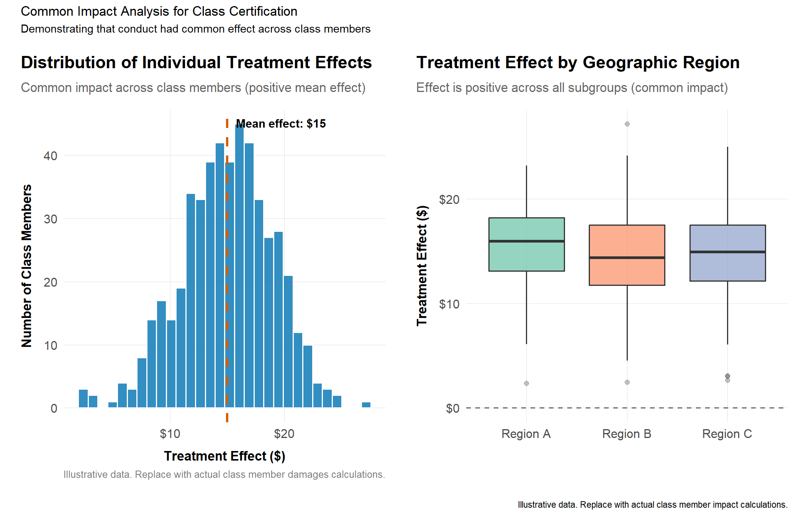
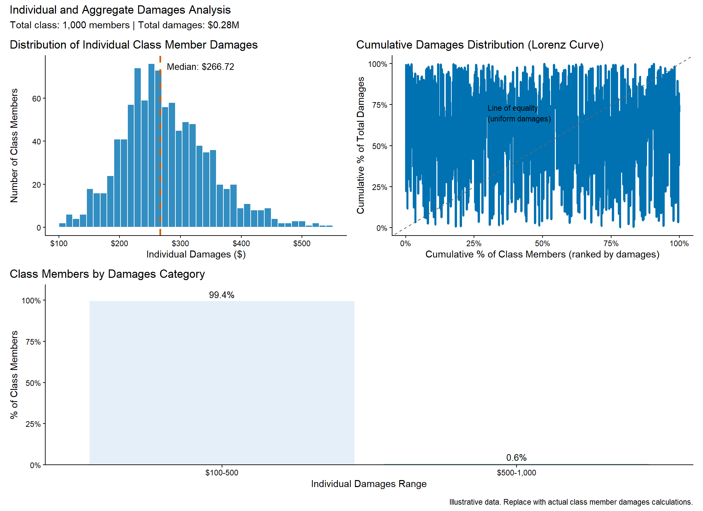

# Litigation Practice: Evidence and Expert Work {#sec-litigation-practice}

The methods chapters taught you how to analyze competition questions. This chapter teaches you how to present that analysis in litigation. The audience changes from academic reviewers or agency staff to judges, juries, and opposing counsel armed with their own experts. The standards shift from "interesting and well-identified" to "reliable and relevant under Daubert" (in US courts) or comparable evidentiary frameworks elsewhere. As (Baker & Rubinfeld, 1999) emphasize, the bridge between academic econometrics and courtroom evidence requires careful attention to both statistical rigor and legal admissibility.

Effective expert work requires more than technical competence. You must structure your analysis for reproducibility, anticipate challenges to your methodology, communicate uncertainty honestly, and tell a coherent story that connects evidence to legal standards (Dickey & Rubinfeld, 2014). The quantitative techniques introduced throughout this book---from demand estimation ([Chapter 4](chapters/04-io-toolkit.md)) to merger simulation ([Chapter 6](chapters/06-mergers.md)) to cartel screening ([Chapter 5](chapters/05-cartels.md))---all take on new dimensions when subjected to adversarial testing. This chapter covers the workflow from initial data handling through expert report preparation, deposition, and trial testimony, drawing on the methodological foundations in (Davis & Garcés, 2010) and the evidentiary standards codified in the *Reference Manual on Scientific Evidence* (FJC Reference Manual, 2011).

## Learning goals
This chapter translates all prior analytics into courtroom-ready workflows. Drawing on agency guidance (US DOJ/FTC, EC best practices) and established expert practice standards (FJC Reference Manual, 2011); (Rubinfeld, 2010), we focus on:

- Structuring investigations so every exhibit and code run is reproducible.
- Designing class certification analyses (common impact, damages) that withstand Daubert/Kumho challenges.
- Integrating empirical, qualitative, and documentary evidence in expert reports, depositions, and testimony.
- Communicating uncertainty, sensitivity, and alternative specifications to judges and juries.

The econometric methods that underpin expert testimony in antitrust cases---difference-in-differences, instrumental variables, regression discontinuity---are the same tools covered in standard causal inference texts (Angrist & Pischke, 2009); (Cunningham, 2021). What distinguishes litigation work is the adversarial context: every modeling choice will be scrutinized and every data limitation exploited. The expert must be prepared to defend the preferred specification and to explain why reasonable alternatives do not undermine the central conclusions.

## Core topics


**Expert Work Workflow**

```
ENGAGEMENT               ANALYSIS                 REPORTS & TESTIMONY
     |                       |                           |
     v                       v                           v
+------------+         +------------+             +------------+
| Scoping &  |         | Common     |             | Draft      |
| data       |-------->| impact &   |------------>| expert     |
| inventory  |         | damages    |             | report     |
+------------+         +------------+             +------------+
     |                       |                           |
     v                       v                           v
+------------+         +------------+             +------------+
| Evidence   |         | Sensitivity|             | Deposition |
| mapping:   |         | & Daubert  |             | prep &     |
| - Docs     |         | readiness: |             | testimony  |
| - Data     |         | - Validation             | - Q&A outline
| - Testimony|         | - Alternatives           | - Exhibits |
+------------+         +------------+             +------------+
     |                       |
     v                       v
+------------+         +------------+
| Reproducible         | Scenario   |
| code bundle:         | tables &   |
| - Git/renv           | tornado    |
| - README             | charts     |
| - Doc IDs            +------------+
+------------+
```
**Deliverables:** Expert report | Rebuttal report | Deposition testimony | Trial testimony | Exhibit package


- Class certification: common impact frameworks, sampling, and predominance arguments.
- Evidence management: document IDs, data provenance, reproducible code bundles.
- Daubert readiness: validation, sensitivity analyses, alternative specifications.
- Presentation: graphics for court, explanatory appendices, deposition prep.
- Coordination with legal teams, witnesses, and regulators; public-interest considerations in South Africa and other jurisdictions.


**Method box**

- Common impact tests with clustered SEs and randomization inference.
- Damages models: before/after, yardstick, difference-in-differences, hedonic variants.
- Scenario/sensitivity tables for assumptions (e.g., pass-through bounds).



**Qualitative evidence**

- Fact witness integration: mapping testimonies to model assumptions.
- Survey admissibility checkpoints (universe, sampling, questionnaire design, pretests).
- Expert judgment: when to narrow claims due to data limits.



**Citations and comparative note**

- Cite case law on admissibility (Daubert/Kumho in US; local standards elsewhere) and notable opinions accepting/rejecting methods (e.g., class cert common impact challenges).
- Include agency guidance where relevant (e.g., FTC/DOJ guidance on data handling, EC best practices for expert submissions).
- When drawing on foreign cases (EU/UK/Canada/Australia/Japan/China), flag differences in evidentiary standards and expert roles.


## Evidence pipeline and reproducibility

### Evidence map

A well-organized evidence map is the backbone of any litigation engagement. It ensures that every opinion in the expert report can be traced back to specific data, documents, and testimony---a requirement that courts have increasingly emphasized in evaluating expert reliability (Dickey & Rubinfeld, 2014). Create an evidence map linking:

1. **Data sources:** Production IDs, custodians, time periods, transformations.
2. **Documentary evidence:** Bates numbers, key quotes, translation status.
3. **Witness testimony:** Depositions, declarations, trial testimony, and their linkage to quantitative claims.
4. **Model outputs:** Code, inputs, parameters, and versions stored in reproducible folders.

A typical structure (`/data/raw`, `/data/derived`, `/scripts`, `/reports`) mirrors earlier chapters; maintain `README` files and `renv`/`requirements` snapshots. This organizational discipline is often a prerequisite for surviving a Daubert challenge, because courts evaluate whether the expert's methodology can be (and has been) tested and replicated (FJC Reference Manual, 2011).

### Reproducible bundle checklist

- Git repository (even if private) with hashed datasets and code.  
- Quarto notebooks or Rmarkdown scripts that render exhibits.  
- `packrat`/`renv` lockfiles or Conda environments.  
- Document IDs within code comments for traceability.

## Class certification and common impact

In US antitrust litigation, class certification under Federal Rule of Civil Procedure 23(b)(3) requires plaintiffs to demonstrate that "questions of law or fact common to class members predominate over any questions affecting only individual members." Economic evidence plays a central role in this determination. The expert must show that the alleged conduct had a **common impact** on class members---that is, the anticompetitive effect can be demonstrated through evidence common to the class rather than requiring individualized proof for each member (Baker & Rubinfeld, 1999).

The predominance requirement was sharpened by two landmark Supreme Court decisions. In *Wal-Mart Stores, Inc. v. Dukes*, 564 U.S. 338 (2011), the Court emphasized that commonality requires plaintiffs to identify a common contention whose resolution will "drive the resolution of the litigation"---a mere claim that class members suffered a violation is insufficient. In *Comcast Corp. v. Behrend*, 569 U.S. 27 (2013), the Court held that at the class certification stage, a damages model must be consistent with the theory of liability and capable of measuring damages on a class-wide basis. This means the economic expert must demonstrate not only that impact is common but that damages can be calculated using a common methodology, even if the dollar amounts differ across class members.

In practice, common impact analysis typically involves showing that prices in the affected market moved together during the violation period and that the overcharge (or other harm) was transmitted to all or nearly all class members. Regression-based approaches, including the difference-in-differences framework, are the standard tool, often supplemented by randomization inference or permutation tests when sample sizes are small (Davis & Garcés, 2010). The defendant's expert will typically argue that individual variation in impact is too great for class-wide treatment, pointing to differences in negotiation power, contract terms, or product mix. The plaintiff's expert must rebut these arguments by showing that individual variation does not defeat commonality---the question is whether impact can be shown through common proof, not whether every class member was harmed by exactly the same amount.

### Sampling and aggregation decisions

- Align sampling frames with class definitions (time, geography, product).
- For opt-out classes, track individual damages calculations.

### Common impact tests

```r
library(fixest)
library(dplyr)

# Simulate panel data for common impact analysis
# 200 class members observed over 20 periods; treatment begins at period 11
set.seed(42)
n_members <- 200
n_periods <- 20
treatment_start <- 11

panel <- expand.grid(
  class_member = 1:n_members,
  period = 1:n_periods
) |>
  mutate(
    # Treatment indicator: post-period for all class members
    post = as.integer(period >= treatment_start),
    # Treated group (80% of class affected; 20% comparison group)
    treated = as.integer(class_member <= 160),
    # Interaction: DiD treatment variable
    treatment = post * treated,
    # Simulate outcome: member FE + period FE + treatment effect + noise.
    # expand.grid varies class_member fastest, so the member effects repeat
    # the full member vector once per period (times =) and each period
    # effect repeats across all members (each =).
    member_fe = rep(rnorm(n_members, mean = 100, sd = 10), times = n_periods),
    period_fe = rep(seq(0, 2, length.out = n_periods), each = n_members),
    outcome = member_fe + period_fe + 8.5 * treatment + rnorm(n_members * n_periods, sd = 5)
  )

# Estimate DiD model with two-way fixed effects and clustered SEs
ci_model <- feols(outcome ~ treatment | class_member + period,
                  data = panel, cluster = ~class_member)
summary(ci_model)
```

The estimated treatment effect represents the common overcharge (or other harm) experienced by class members during the violation period. The coefficient on `treatment` is the DiD estimate of common impact, with standard errors clustered at the class-member level to account for serial correlation within individuals (Angrist & Pischke, 2009). A statistically significant and positive coefficient supports the plaintiff's argument that the conduct had a common effect amenable to class-wide proof.

### Randomization inference scaffold
```r
library(fixest)
library(dplyr)

# Permutation test: reassign treatment status at the class-member level
# (preserving the 160/40 split), re-estimate the DiD model, and compare the
# actual coefficient to the distribution of permuted coefficients.
set.seed(101)
n_reps <- 200

perm_coefs <- replicate(n_reps, {
  treated_perm <- sample(1:n_members, 160)
  perm_panel <- panel |>
    mutate(treatment_perm = post * as.integer(class_member %in% treated_perm))
  coef(feols(outcome ~ treatment_perm | class_member + period,
             data = perm_panel))[["treatment_perm"]]
})

ri_p <- mean(abs(perm_coefs) >= abs(coef(ci_model)[["treatment"]]))
cat("Randomization-inference p-value:", ri_p, "\n")
```

The empirical p-value is the share of permuted placebo coefficients at least as large (in absolute value) as the actual estimate. With a true effect of 8.5 and placebo effects centered at zero, none of the permutations should reach it, so the p-value is effectively zero. In small samples or with few clusters, this design-based p-value is more defensible under cross-examination than asymptotic clustered standard errors.

## Damages modeling

Antitrust damages quantify the difference between what actually happened and what would have happened absent the anticompetitive conduct---the "but-for world" (Baker & Rubinfeld, 1999). Constructing a credible but-for scenario is the central challenge, and courts have developed a rich body of law evaluating competing damages models. The three foundational approaches are before/after, yardstick, and difference-in-differences, each exploiting different sources of variation to identify the counterfactual.

The **before/after method** compares outcomes during the violation period to outcomes outside that period (typically before the conduct began or after it ceased). For example, in a price-fixing case, one might compare the average price during the cartel period to the average price during a competitive benchmark period, controlling for cost shifts, demand changes, and other confounders using regression analysis (Rubinfeld, 2010). The key assumption is that, after conditioning on observable factors, any remaining price difference is attributable to the violation. This method works well when the violation has clear start and end dates and when the analyst can identify a clean comparison period unaffected by anticipatory behavior or lingering effects.

The **yardstick method** takes a different approach: rather than comparing across time, it compares the affected market to a comparable unaffected market during the same period. In cartel cases, this might mean comparing prices in cartelized regions to prices in regions where the cartel did not operate. In monopolization cases, it might involve comparing the defendant's market to a structurally similar market with more competition. The challenge is finding a true comparator---a market similar enough in cost structure, demand conditions, and competitive dynamics that observed price differences can be attributed to the conduct rather than to unobserved market differences (Davis & Garcés, 2010).

**Difference-in-differences** combines both dimensions, comparing changes over time between affected and unaffected groups (Angrist & Pischke, 2009); (Cunningham, 2021). This approach controls for both time-invariant differences between groups and common time trends affecting all groups. As discussed in [Chapter 5](chapters/05-cartels.md) and [Chapter 6](chapters/06-mergers.md), the parallel trends assumption does the work: absent the violation, the treatment and control groups would have followed similar trajectories. When this assumption holds, DiD provides a credible estimate of the causal effect of the conduct on prices, quantities, or other outcomes. Retrospective merger studies like (Ashenfelter & Hosken, 2010) exemplify this approach in practice.

Beyond the core estimation, practitioners must address several additional issues. Courts evaluate whether a damages model is consistent with the theory of liability---a principle reinforced by the Supreme Court in *Comcast Corp. v. Behrend*, 569 U.S. 27 (2013), which held that a damages model must measure damages attributable to the specific theory of harm. **Prejudgment interest** compensates plaintiffs for the time value of money between the injury and the award, and its calculation (simple vs. compound, choice of rate) can substantially affect total damages. **Present value adjustments** are necessary when damages span multiple years, requiring the analyst to select an appropriate discount rate and justify the discounting methodology to the court.

- **Hedonic/regression models:** When product characteristics matter (as in technology or pharmaceutical markets), hedonic regression can isolate the price effect of the anticompetitive conduct by controlling for quality differences across products and time periods.

### Scenario/sensitivity tables
```r
library(dplyr)

scenarios <- expand.grid(pass_through = c(0.5, 0.7, 0.9), overcharge = c(0.1, 0.2, 0.3)) |>
  mutate(damages = pass_through * overcharge * 1000)
scenarios
```
Use tornado charts or tables to present ranges; highlight the “central” assumption and explain why alternatives are plausible.

## Daubert/Kumho readiness

1. **Validation:** Compare model outputs to raw data; show that code replicates known benchmarks (FJC Reference Manual, 2011).  
2. **Sensitivity:** Document how results change with different controls, clustering levels, or sample definitions (Rubinfeld, 2010).  
3. **Alternative specifications:** Provide at least one alternative consistent with the theory of harm; explain why it does or does not materially change outcomes (Baker & Rubinfeld, 1999).  
4. **Error checking:** Peer review within the expert team; code audits; reproducibility scripts (Dickey & Rubinfeld, 2014).

## Presentation and storytelling

Effective expert testimony is as much about communication as it is about analysis. The most technically sound model is worthless if the trier of fact cannot understand it. Structuring expert reports and trial presentations for clarity requires deliberate choices about organization, visual design, and narrative arc (Dickey & Rubinfeld, 2014).

**Expert reports** should follow a clear progression: begin with a summary of opinions, then describe the data and methodology, present the results, and conclude with sensitivity analyses and rebuttals. Each opinion should be stated concisely and linked to specific evidence---courts increasingly expect reports to be organized so that every factual claim can be traced to its source. Avoid unnecessary technical jargon; where econometric terminology is unavoidable, provide plain-language explanations. The *Reference Manual on Scientific Evidence* recommends that experts explain not only what their model shows but why the chosen methodology is appropriate and what alternatives were considered (FJC Reference Manual, 2011).

**Visual aids and demonstrative exhibits** carry weight at trial. Well-designed graphics can convey in seconds what pages of regression output cannot. Timelines that overlay key events (cartel meetings, price increases, market entry) with quantitative data (price series, market shares) connect the economic evidence to the factual narrative. Use consistent color schemes, label axes clearly, and highlight the key numbers the trier of fact should remember. In bench trials, judges appreciate precision and methodological transparency: include confidence intervals, specification details, and references to underlying data. In jury trials, keep it simple. Focus on the bottom line, use analogies, and build the story from simple concepts to the final conclusion.

**Deposition and cross-examination preparation** matters just as much. Opposing counsel will probe the boundaries of the expert's analysis: what data was excluded and why, what happens when assumptions change, whether the expert considered alternative explanations. Build Q&A outlines that link each opinion to its evidentiary foundation, and rehearse responses to challenges on sensitivity, data limitations, and methodological choices. Common cross-examination strategies include asking the expert to concede that individual specifications differ from the preferred model, then arguing that the results are "fragile." The best defense is a thorough sensitivity analysis presented proactively in the report itself (Rubinfeld, 2010); (Baker & Rubinfeld, 1999).

### Concurrent expert evidence ("hot tubbing")

Not every forum hears the experts in sequence. Under concurrent expert evidence---witness conferencing, informally "hot tubbing"---the opposing economists are sworn together, answer the same question in turn, and may put questions to each other directly, with the tribunal rather than counsel directing the exchange. The practice is standard in Australian courts, is used in the UK Competition Appeal Tribunal, and has been used before the South African Competition Tribunal.

The format changes what testifying well means. Counsel no longer mediates the exchange, so an evasive answer draws an immediate response from the economist sitting next to you rather than a follow-up question three weeks later in a rebuttal report. Disagreements narrow in real time: the tribunal can ask both experts whether they accept the same diversion ratio, the same benchmark period, the same clustering level, and record exactly where the models part company. Posturing that survives direct examination tends not to survive a peer asking, in front of the decision-maker, why the preferred specification drops the two years that move the estimate.

One preparation implication follows. Before the hearing, the experts are typically directed to confer and produce a joint statement listing points of agreement and disagreement, with short reasons for each. Treat that document as seriously as the report itself: it fixes the agenda for the concurrent session, and it requires you to understand the opposing model well enough to run it. An economist who can state precisely which assumption drives the gap between the two damages figures---and what evidence would resolve it---is far more useful to the tribunal, in this format, than one who can only defend their own number.


**Case box: Expert testimony in DOJ v. Google (Search)**

The *United States v. Google LLC* search distribution trial (2023--2024) turned on economic expert testimony (*United States v. Google (Search)*, 2023). The DOJ argued that Google maintained its search monopoly through exclusive default agreements with Apple, Android device manufacturers, and browser developers, paying over $26 billion annually to foreclose rival search engines from critical distribution channels. The government's economic expert presented regression analyses showing that default status increased search engine usage share, and that these agreements raised barriers to entry by denying rivals the query volume needed to improve search quality. Google's expert countered that users could easily switch search engines with a few clicks, arguing that revealed preference---not default status---explained Google's dominance. The court's 2024 ruling found that Google held monopoly power and that the exclusive agreements constituted unlawful maintenance of that monopoly. The case illustrates how competing experts can examine the same market data and reach opposite conclusions about whether consumer behavior reflects genuine preference or the stickiness of default settings. The distinction shapes the remedy.


## Southern African litigation practice notes

South Africa's Competition Tribunal operates as a specialized court with procedures that differ significantly from both US federal courts and EU administrative proceedings. The Tribunal's rules of procedure are more flexible than conventional court rules, and it has broad discretion over the admission of evidence and expert testimony. Unlike the US *Daubert* standard, which requires judges to act as gatekeepers for scientific evidence, the Tribunal takes a more permissive approach: expert evidence is generally admitted and its weight is assessed as part of the overall merits determination. This means that South African practitioners face a lower threshold for admissibility but must work harder to persuade the Tribunal on the substance of competing expert opinions.

The Tribunal's approach to damages and remedies also differs from US and EU practice. In cartel matters, the Tribunal has accepted a range of damages methodologies, including before/after comparisons, yardstick comparisons with unaffected markets, and regression-based overcharge estimates. The Commission's bread cartel prosecutions rested on documentary evidence and pricing analysis alongside leniency testimony (Sa Bread Cartel, 2007). The Sasol polypropylene appeal featured extensive documentation of export parity benchmarks, incremental cost models, and technical expert testimony on production processes, illustrating how complex economic evidence is presented in abuse-of-dominance cases. Following the Data Services Market Inquiry, Vodacom and MTN agreed data-price reductions with the Commission; evaluating commitments of that kind is a natural application of the before/after and difference-in-differences tools in this chapter.

A distinctive feature of South African competition litigation is the role of public interest considerations in remedy proceedings. The Tribunal routinely considers employment effects, small business participation, and the impact on historically disadvantaged persons when designing remedies, factors that have no analogue in US or EU antitrust proceedings. Expert reports in South African matters must therefore address competitive effects and the quantified public interest impact of proposed remedies, requiring economists to engage with employment data, procurement patterns, and ownership structures alongside conventional competition metrics.

## Enhanced Visualizations for Expert Reports

### Common impact distribution
Demonstrate that the alleged conduct had a common effect across class members, a key requirement for class certification.



**Expert report presentation:**
- Present central estimate prominently
- Show sensitivity ranges transparently
- Explain basis for each parameter assumption
- Link to documentary evidence (pricing data, expert testimony, econometric estimates)

### Evidence provenance network
Map how different evidence sources support specific expert opinions and damages calculations.

```r
library(dplyr)
library(igraph)
library(ggraph)

# Evidence map: sources -> analysis -> opinions
# Replace with actual case evidence map
evidence_edges <- tibble::tribble(
  ~from,                    ~to,                     ~type,
  # Data sources to analyses
  "Transaction data",       "Overcharge estimate",   "data_to_analysis",
  "Transaction data",       "Market share calc",     "data_to_analysis",
  "Cost data",              "Margin analysis",       "data_to_analysis",
  "Pricing documents",      "Overcharge estimate",   "doc_to_analysis",
  "Meeting notes",          "Cartel timeline",       "doc_to_analysis",
  "Email evidence",         "Cartel timeline",       "doc_to_analysis",
  "Witness testimony",      "Cartel timeline",       "testimony_to_analysis",
  "Competitor prices",      "But-for benchmark",     "data_to_analysis",

  # Analyses to opinions
  "Overcharge estimate",    "Opinion 1: Price impact", "analysis_to_opinion",
  "Market share calc",      "Opinion 2: Market power", "analysis_to_opinion",
  "Margin analysis",        "Opinion 1: Price impact", "analysis_to_opinion",
  "Cartel timeline",        "Opinion 3: Duration",     "analysis_to_opinion",
  "But-for benchmark",      "Opinion 4: Damages",      "analysis_to_opinion",
  "Overcharge estimate",    "Opinion 4: Damages",      "analysis_to_opinion"
)

# Create node attributes
nodes <- tibble(
  name = unique(c(evidence_edges$from, evidence_edges$to))
) |>
  mutate(
    category = case_when(
      grepl("data|prices", name) ~ "Data source",
      grepl("documents|notes|Email", name) ~ "Documentary evidence",
      grepl("testimony", name) ~ "Witness testimony",
      grepl("Opinion", name) ~ "Expert opinion",
      TRUE ~ "Analysis"
    )
  )

# Create network
g <- graph_from_data_frame(evidence_edges, directed = TRUE, vertices = nodes)

# Plot
ggraph(g, layout = "sugiyama") +
  geom_edge_link(aes(color = type),
                arrow = arrow(length = unit(3, 'mm'), type = "closed"),
                end_cap = circle(8, 'mm'),
                alpha = 0.6) +
  geom_node_point(aes(color = category, size = category),
                 alpha = 0.8) +
  geom_node_text(aes(label = name), repel = TRUE, size = 3) +
  scale_edge_color_manual(
    values = c(
      "data_to_analysis" = "#0072B2",
      "doc_to_analysis" = "#009E73",
      "testimony_to_analysis" = "#F0E442",
      "analysis_to_opinion" = "#D55E00"
    ),
    labels = c(
      "data_to_analysis" = "Data → Analysis",
      "doc_to_analysis" = "Documents → Analysis",
      "testimony_to_analysis" = "Testimony → Analysis",
      "analysis_to_opinion" = "Analysis → Opinion"
    )
  ) +
  scale_color_manual(
    values = c(
      "Data source" = "#0072B2",
      "Documentary evidence" = "#009E73",
      "Witness testimony" = "#F0E442",
      "Analysis" = "#CC79A7",
      "Expert opinion" = "#D55E00"
    )
  ) +
  scale_size_manual(
    values = c(
      "Data source" = 5,
      "Documentary evidence" = 5,
      "Witness testimony" = 5,
      "Analysis" = 7,
      "Expert opinion" = 9
    )
  ) +
  labs(
    title = "Evidence Provenance Network",
    subtitle = "Tracing evidence sources through analyses to expert opinions",
    edge_color = "Connection Type",
    color = "Evidence Category",
    caption = "Each expert opinion should be supported by multiple independent evidence sources."
  ) +
  theme_graph(base_size = 12) +
  theme(
    legend.position = "bottom",
    plot.title = element_text(size = 14, face = "bold")
  ) +
  guides(size = "none")

# Summary statistics
cat("\nEvidence network summary:\n")
cat(paste0("Total evidence sources: ",
          sum(nodes$category %in% c("Data source", "Documentary evidence",
                                    "Witness testimony")), "\n"))
cat(paste0("Intermediate analyses: ",
          sum(nodes$category == "Analysis"), "\n"))
cat(paste0("Expert opinions: ",
          sum(nodes$category == "Expert opinion"), "\n"))
```


**Daubert/Kumho preparation:**
- Each opinion traceable to specific evidence
- Multiple independent sources support key findings
- Clear methodology from raw data to conclusion
- Document all transformations and assumptions

### Expert timeline and deliverables
Track expert work product and key milestones for case management.

```r
source("program/R/helpers.R")
library(dplyr)

# Expert engagement timeline
# Replace with actual case dates
expert_timeline <- tibble::tribble(
  ~date,         ~event,                                ~category,
  "2023-01-15",  "Expert retained",                     "Engagement",
  "2023-02-01",  "Initial data production received",    "Data",
  "2023-03-15",  "Preliminary analysis complete",       "Analysis",
  "2023-04-10",  "Supplemental data request",           "Data",
  "2023-05-01",  "Draft report circulated",             "Report",
  "2023-05-20",  "Rebuttal expert report received",     "Opposing expert",
  "2023-06-15",  "Final expert report submitted",       "Report",
  "2023-07-30",  "Expert deposition",                   "Deposition",
  "2023-09-15",  "Supplemental analysis (new data)",    "Analysis",
  "2023-10-01",  "Sur-reply report submitted",          "Report",
  "2023-11-20",  "Pre-trial conference",                "Court",
  "2024-01-15",  "Trial testimony",                     "Trial",
  "2024-02-28",  "Post-trial briefing",                 "Court"
) |>
  mutate(date = as.Date(date))

# Create timeline
plot_timeline(
  events = expert_timeline,
  title = "Expert Engagement Timeline",
  date_breaks = "2 months"
)

# Add summary table
cat("\nKey deliverables:\n")
expert_timeline |>
  filter(category %in% c("Report", "Deposition", "Trial")) |>
  select(date, event, category) |>
  print(n = Inf)
```


### Individual vs. aggregate damages
Show how individual class member damages aggregate to total class damages, important for both class certification and damages calculation.

```r
library(dplyr)
library(ggplot2)
library(patchwork)

# Simulated individual damages for class members
# Replace with actual damages calculations
set.seed(890)
n_class <- 1000

individual_damages <- tibble(
  member_id = 1:n_class,
  purchases = rpois(n_class, lambda = 50),  # Number of affected purchases
  avg_overcharge = rnorm(n_class, mean = 5.50, sd = 1.20),  # Per-unit overcharge
  damages = purchases * avg_overcharge
) |>
  arrange(damages) |>
  mutate(
    # Cumulative shares for the Lorenz curve: members sorted from smallest
    # to largest damages, so the curve bows below the 45-degree line
    cum_share_members = row_number() / n(),
    cum_share_damages = cumsum(damages) / sum(damages),
    percentile = percent_rank(damages),
    damages_category = case_when(
      damages < 100 ~ "< $100",
      damages < 500 ~ "$100-500",
      damages < 1000 ~ "$500-1,000",
      TRUE ~ "> $1,000"
    ),
    damages_category = factor(damages_category,
                             levels = c("< $100", "$100-500",
                                       "$500-1,000", "> $1,000"))
  )

# Plot 1: Distribution of individual damages
p1 <- ggplot(individual_damages, aes(x = damages)) +
  geom_histogram(bins = 40, fill = "#0072B2", alpha = 0.8, color = "white") +
  geom_vline(xintercept = median(individual_damages$damages),
            linetype = "dashed", color = "#D55E00", linewidth = 1) +
  annotate("text",
          x = median(individual_damages$damages),
          y = Inf,
          label = paste0("Median: $",
                        round(median(individual_damages$damages), 2)),
          hjust = -0.1, vjust = 2, size = 3.5) +
  scale_x_continuous(labels = scales::dollar_format()) +
  labs(
    title = "Distribution of Individual Class Member Damages",
    x = "Individual Damages ($)",
    y = "Number of Class Members"
  ) +
  theme_antitrust() +
  theme(plot.title.position = "plot")

# Plot 2: Lorenz curve (cumulative damages)
p2 <- ggplot(individual_damages,
            aes(x = cum_share_members, y = cum_share_damages)) +
  geom_line(color = "#0072B2", linewidth = 1.2) +
  geom_abline(slope = 1, intercept = 0, linetype = "dashed",
             color = "gray40") +
  annotate("text", x = 0.15, y = 0.55,
          label = "Line of equality\n(uniform damages)",
          hjust = 0, size = 3) +
  scale_x_continuous(labels = scales::percent_format()) +
  scale_y_continuous(labels = scales::percent_format()) +
  labs(
    title = "Cumulative Damages Distribution (Lorenz Curve)",
    x = "Cumulative % of Class Members (smallest damages first)",
    y = "Cumulative % of Total Damages"
  ) +
  theme_antitrust() +
  theme(plot.title.position = "plot")

# Plot 3: Damages by category
damages_summary <- individual_damages |>
  group_by(damages_category) |>
  summarise(
    count = n(),
    total_damages = sum(damages),
    .groups = "drop"
  ) |>
  mutate(
    pct_members = count / sum(count),
    pct_damages = total_damages / sum(total_damages)
  )

p3 <- ggplot(damages_summary, aes(x = damages_category,
                                  y = pct_members, fill = damages_category)) +
  geom_col(alpha = 0.8) +
  geom_text(aes(label = scales::percent(pct_members, accuracy = 0.1)),
           vjust = -0.5, size = 3.5) +
  scale_y_continuous(labels = scales::percent_format(),
                    expand = expansion(mult = c(0, 0.1))) +
  scale_fill_brewer(palette = "Blues") +
  labs(
    title = "Class Members by Damages Category",
    x = "Individual Damages Range",
    y = "% of Class Members"
  ) +
  theme_antitrust() +
  theme(
    legend.position = "none",
    plot.title.position = "plot"
  )

# Combine plots
(p1 | p2) / p3 + plot_annotation(
  title = "Individual and Aggregate Damages Analysis",
  subtitle = paste0("Total class: ", scales::comma(n_class),
                   " members | Total damages: $",
                   round(sum(individual_damages$damages) / 1e6, 2), "M"),
  caption = "Illustrative data. Replace with actual class member damages calculations."
)

# Summary statistics
cat("\nDamages distribution summary:\n")
cat(paste0("Total class members: ", scales::comma(n_class), "\n"))
cat(paste0("Total damages: $",
          round(sum(individual_damages$damages) / 1e6, 2), "M\n"))
cat(paste0("Mean individual damages: $",
          round(mean(individual_damages$damages), 2), "\n"))
cat(paste0("Median individual damages: $",
          round(median(individual_damages$damages), 2), "\n"))
cat(paste0("Top 10% of class accounts for ",
          scales::percent(sum(individual_damages$damages[
            individual_damages$percentile >= 0.9]) /
            sum(individual_damages$damages), accuracy = 0.1),
          " of total damages\n"))
```



**Class certification considerations:**
- Show damages are calculable on class-wide basis
- Document methodology for individual damages calculations
- Address potential administrative feasibility concerns
- Prepare for de minimis exclusion arguments

## Exercises

1. **Conceptual.** Explain the Daubert standard for expert testimony admissibility. What are the four factors a court considers, and how would you ensure an econometric damages model satisfies each?

2. **Data/code.** Using the scenario/sensitivity scaffold in this chapter, expand the table to include 4 pass-through rates (0.3, 0.5, 0.7, 0.9) and 4 overcharge estimates (5%, 10%, 15%, 20%). Create a tornado chart showing which parameter has the larger impact on total damages. What does this tell you about where to focus your data collection?

3. **Case discussion.** You are retained as a testifying expert in a cartel damages case. The plaintiff's model estimates \$50M in overcharges using a before/after approach, while the defendant's expert argues the estimate is \$10M using a yardstick approach with a different control market. How would you evaluate and critique each model? What common-impact test would you run?

4. **Conceptual.** Explain why reproducibility is both a scientific best practice and a litigation necessity. What specific steps would you take to ensure your analysis can be replicated by opposing counsel's expert?

5. **Case discussion.** Compare evidentiary standards for expert testimony across the US (Daubert), EU (EC best practices), and South Africa (Competition Tribunal rules). How do these differences affect the way you structure an expert report for each jurisdiction?

### Data exercise (checkable)

a. **Common impact.** A class-wide overcharge regression yields a coefficient of 2.5 (percentage points) with a standard error of 0.5. Compute the t-statistic and state whether the overcharge is significant at the 1% level.
b. **Damages.** Affected commerce is $200 million and the estimated overcharge rate is 15%. Compute single damages and the trebled US exposure.


**Worked answer**

a. t = 2.5 / 0.5 = **5.0**, above the ~2.58 critical value for a two-sided 1% test, so the overcharge is significant at the 1% level -- evidence of common impact across the class.
b. Single damages = 0.15 x $200M = **$30M**; trebled = 3 x $30M = **$90M**.


## Looking ahead
The litigation tools in this chapter---reproducible code bundles, Daubert-ready sensitivity analyses, and evidence provenance mapping---apply across every substantive area covered in this book. Whether you are presenting cartel damages ([Chapter 5](chapters/05-cartels.md)), merger simulations ([Chapter 6](chapters/06-mergers.md)), or labor market harm ([Chapter 10](chapters/10-labor-markets.md)), the workflow is the same: link every opinion to specific evidence, document the assumptions, and stress-test your results before cross-examination does it for you. The [Empirical Appendix](chapters/13-empirical-appendix.md) collects reusable diagnostic checklists and code templates that complement the expert report frameworks introduced here.
