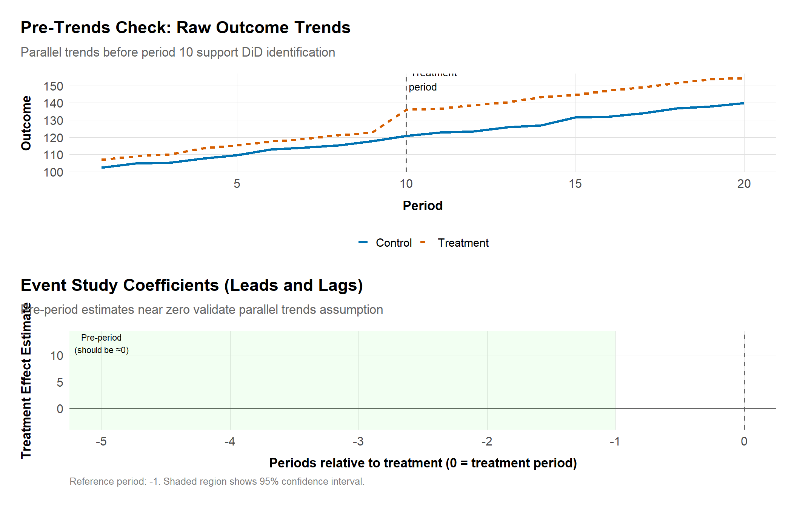

# Empirical Appendix and Templates {.unnumbered}

## Purpose
This appendix is the shared workspace for reusable diagnostics, qualitative protocols, and data inventories referenced throughout the book. Treat it as the "operations manual" for the course: every code chunk or template lives here so you can drop it into chapter-specific notebooks, expert reports, or litigation memos without rewriting boilerplate.

## How to use this appendix
1. **Start here during scoping.** Clone the chronology, data inventory, and interview templates before diving into a matter so legal, economic, and qualitative teams stay synchronized.
2. **Customize but keep provenance.** When you adapt a template, note the source so future readers can trace assumptions.
3. **Feed updates back in.** If a later chapter develops a better diagnostic, link it here to avoid divergence.

## Key resources for quick reference

| Chapter focus | Key resources |
| --- | --- |
| Orientation & institutions | Agency websites: [DOJ Antitrust](https://www.justice.gov/atr), [FTC](https://www.ftc.gov/), [EC Competition](https://ec.europa.eu/competition/), [CMA](https://www.gov.uk/cma) |
| Research design & methods | [Causal Inference: The Mixtape](https://mixtape.scunning.com/), Angrist & Pischke papers |
| Cartels & collusion | [OECD Cartel Guidance](https://www.oecd.org/daf/competition/cartels/) |
| Mergers | US/EU/UK Merger Guidelines (see references) |
| Digital markets | [EU DMA](https://ec.europa.eu/dma), CMA Digital Markets Unit |
| Labor markets | [BLS data](https://www.bls.gov/), [Census LEHD](https://lehd.ces.census.gov/) |

Use this table alongside external references such as [@ashenfelter_hosken_2010] and agency guidelines.

## Case chronology template
When building mixed-method narratives, start with a matrix that ties events to evidence and hypotheses. Duplicate the scaffold below into your project notebook:

| Date | Event / document | Evidence type | Hypothesis link | Follow-ups |
| --- | --- | --- | --- | --- |
| 2018-04-12 | Board memo re: “price discipline” | Document (custodian: CFO) | Supports coordinated effects theory | Interview CFO; pull bid data |
| 2019-02-01 | Customer interview (retailer) | Qualitative | Tests diversion/USP claims | Quantify share of wallet |
| 2021-09-30 | Price spike (SKU 124) | Quantitative (transaction DB) | Flags potential capacity withholding | Overlay maintenance logs |

**Tips:** capture custodian names, bates ranges, or dataset pointers, then push the table into a `gt` or `quarto` table for reports.

## Data inventory worksheet
Pair the chronology with a tabular schema inventory so you know what can feed the quantitative chapters. Customize the tibble below inside your R session.

```r
library(tibble)
library(dplyr)
source("../program/R/helpers.R")

data_inventory <- tribble(
  ~system, ~owner, ~grain, ~fields, ~coverage, ~notes,
  "CRM / Salesforce", "US Sales Ops", "Customer-month", "price, quantity, discounts, churn", "2016-01 to 2024-06", "Great for diversion estimates; use OECD cartel screening guidance",
  "Claims data", "SA Health Plan", "Claim-line", "procedure, tariff, provider, patient segment", "2014-01 to 2023-12", "Use for South African retrospectives",
  "Bid tracker", "EU Procurement", "Bid-event", "participants, bids, award, lot size", "2018-01 to present", "Supports cartel screens"
) |>
  arrange(system)

data_inventory
```

Document locating instructions (sharepoint links, API keys) and legal restrictions. Store sanitized metadata in `data/README.md` so others can reproduce.

## Survey and interview kit
Follow established qualitative research standards to keep qualitative work rigorous:
- **Screeners:** Define decision-maker roles, procurement thresholds, and geographic balance; record quotas in a simple CSV.
- **Question bank:** Map each question to a legal element (market definition, competitive effects, efficiencies). Rotate order to reduce priming.
- **Documentation:** Save audio or transcripts, then code responses using the lexicon below. Always log interviewer, location, and consent status.

## Document coding lexicon
Standardize qualitative tagging so it can be merged with quantitative variables:
- **Conduct codes:** `capacity_discipline`, `most_favored`, `exclusive`, `discount_pass_through`.
- **Market context:** `entry_barrier_data`, `supply_chain_shock`, `public_interest_sa`.
- **Procedural:** `remedy_negotiation`, `leniency_proffer`, `public_hearing`.

Maintain the lexicon as a YAML or CSV in `data/derived`.

## Flagship data assets (by jurisdiction)

### United States
- **HSR and merger retrospectives:** Derive pre/post comparisons referencing [FTC](https://www.ftc.gov/) and [DOJ](https://www.justice.gov/atr) reports.
- **Healthcare claims (CMS, FAIR Health):** Price and quantity data for hospital mergers and labor monopsony cases.
- **Public procurement / ABM data:** Use [USAspending.gov](https://www.usaspending.gov/), OCC data, or [BLS](https://www.bls.gov/) Occupational Employment and Wage Statistics for wage-fixing analyses.

### European Union & United Kingdom
- **Case team data rooms:** DG COMP uploads (pricing, cost, user logs).
- **Eurostat + Ofcom datasets:** Demand-side metrics for telecom, digital platforms, or broadcasting.
- **CMA survey repositories:** Useful for designing conjoint or diversion studies.

### South Africa & SADC focus
- **Competition Commission data requests:** Transactional extracts from retailers, healthcare groups, or digital platforms; cross-check with public data from Stats SA.
- **National Treasury tender portal:** Procurement and supplier concentration data for cartel screens.
- **Sector inquiries:** Grocery retail, digital platforms, and transport datasets—log file formats and confidentiality riders here so later chapters can reference them.

### Cross-jurisdiction validation
- Build a blended index (e.g., inflation-adjusted revenue) to harmonize multi-region cases.
- Track currency conversions and PPP adjustments in the inventory template.

## Reusable diagnostics

### Diff-in-diff and event studies
- Run parallel-trend visuals, dynamic leads/lags, and placebo periods (`did::att_gt`, `fixest::sunab`). Reference @cunningham_2021 for intuition and cite @ashenfelter_hosken_2010 for merger retrospectives. For staggered treatment timing, see @callaway_santanna_2021.
- For South African matters with staggered regulatory actions, consider matrix-completion methods from recent econometrics literature [@athey_imbens_2017].

### Matching and weighting
- Propensity score, entropy balancing, and synthetic controls should include balance plots (standardized differences, variance ratios) [@abadie_diamond_hainmueller_2010].
- Store reusable plotting code in `R/helpers.R` (`plot_balance()`). For general guidance on matching methods, see @angrist_pischke_2009.

### Panel FE and inference choices
- Two-way FE with staggered treatment: document estimator choice and weights; cite the relevant methodological literature.
- For few clusters (ports, mines), use wild bootstrap or randomization inference.

### Qualitative + quantitative integration
- Align interview findings with econometric outputs using issue trees. For example, code “capacity discipline” documents and test against utilization regressions.
- Use the chronology template to surface inconsistencies quickly.

## Code scaffolds

### Data dictionary generator
```r
library(readr)
library(purrr)

generate_dictionary <- function(path) {
  sample <- readr::read_csv(path, n_max = 1000, show_col_types = FALSE)
  purrr::map_dfr(names(sample), \(nm) {
    tibble::tibble(
      variable = nm,
      type = class(sample[[nm]])[1],
      sample_values = paste(head(unique(sample[[nm]]), 3), collapse = "; "),
      notes = ""
    )
  })
}

# Example usage (uncomment when data available):
# dict <- generate_dictionary("data/raw/claims_sample.csv")
# dict
```

### Survey weighting stub
```r
library(survey)

design <- svydesign(
  ids = ~1,
  strata = ~region,
  weights = ~weight,
  data = survey_responses
)

svymean(~switch_intent, design)
```

### Chronology visualization


*Timeline showing key events by category (Document, Interview, Data). Use this template to visualize case chronologies.*

## Diagnostic Gallery

This section provides reusable diagnostic visualizations that apply across chapters. Use these templates to validate identification assumptions, assess robustness, and communicate uncertainty in expert reports.

### Pre-trends and parallel trends checks
Essential for difference-in-differences designs (mergers, labor, remedies).



*Top: Raw outcome trends showing parallel trends before treatment. Bottom: Event study coefficients with pre-period estimates near zero validating identification.*

**Interpretation:**
- **Pre-trends near zero**: Validates parallel trends assumption
- **Post-treatment divergence**: Confirms treatment effect
- **Confidence intervals**: Should include zero in pre-period
- **Use this**: Mergers (Ch. 06), remedies (Ch. 08), labor (Ch. 10)

### Balance plots for matching/weighting
Show covariate balance before and after matching or weighting.


*Love plot showing standardized mean differences before and after matching. SMD < 0.1 indicates acceptable balance.*

**Interpretation:**
- **SMD < 0.1**: Acceptable balance (Austin, 2009)
- **Matching improves balance**: Lines should move toward zero
- **Use this**: Merger retrospectives, labor market studies, remedy evaluations

### Regression specification curve
Show robustness across multiple reasonable specifications.


*Estimates remain positive and significant across specifications (no controls, varying controls, different fixed effects).*

**Interpretation:**
- **Stable across specs**: Effect robust to model choices
- **All CIs exclude zero**: Consistent significance
- **Use this**: Expert reports, Daubert challenges, sensitivity analysis

### Residual diagnostics
Check model assumptions and identify influential observations.


*Four-panel diagnostic: residuals vs. fitted (linearity), Q-Q plot (normality), scale-location (homoscedasticity), and histogram (distribution).*

**What to look for:**
- **Residuals vs. Fitted**: No pattern (confirms linearity)
- **Q-Q Plot**: Points follow line (confirms normality)
- **Scale-Location**: Horizontal line (confirms homoscedasticity)
- **Histogram**: Bell-shaped, centered at zero

### Power analysis visualization
Show statistical power across different sample sizes and effect sizes.


*Power curves for small, medium, and large effect sizes. Points indicate minimum sample size for 80% power.*

**Use this for:**
- Study design and sample size planning
- Explaining null results (underpowered?)
- Justifying sample selection in expert reports

## Additional references
- **FTC resources:** See [ftc.gov](https://www.ftc.gov/) for expert guidance and econometric standards.
- **Causal Inference: The Mixtape** ([mixtape.scunning.com](https://mixtape.scunning.com/)) for causal estimators and diagnostics.
- **OECD cartel guidance:** See [oecd.org/competition](https://www.oecd.org/daf/competition/) for screening methodologies.

Return to this appendix whenever a chapter references "see appendix template" so the workflow stays consistent across teams and jurisdictions.

